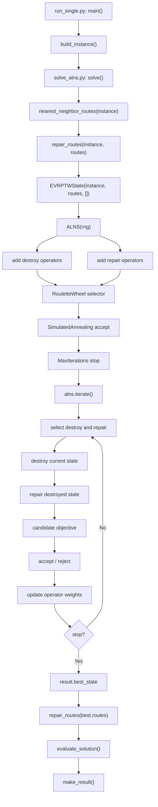
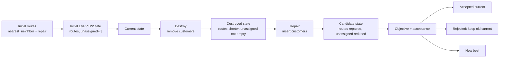
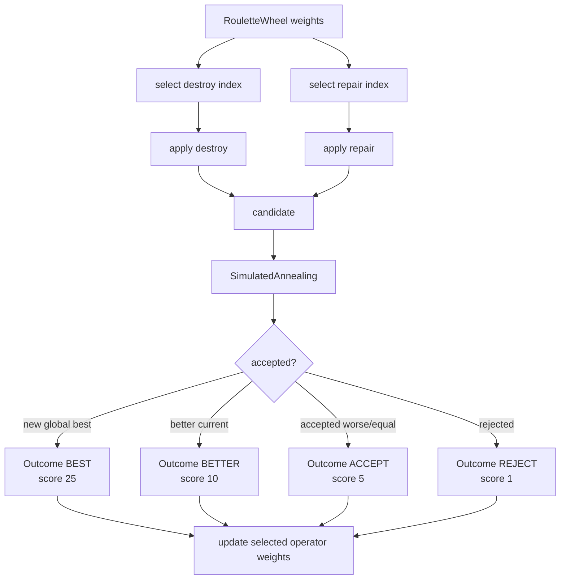

# ALNS Code Walkthrough

本文档只分析当前项目中的 ALNS 方法。分析依据包括：

- 当前项目文件：`EVRPTW_Schneider2014/solvers/solve_alns.py`
- 当前项目公共模块：`route_repair.py`、`evaluator.py`、`result_schema.py`、`solvers/common.py`
- 当前虚拟环境依赖源码：`alns 7.0.0`

本文档不修改任何代码。

---

# 0. Current Conclusion

当前项目中的 ALNS 是一个基于 `alns` Python 包的启发式求解器。

核心结构是：

```text
nearest-neighbor initial routes
-> repair_routes()
-> EVRPTWState(instance, routes, unassigned)
-> ALNS destroy + repair iterations
-> best_state
-> repair_routes(best.routes)
-> evaluate_solution()
-> make_result()
```

当前 ALNS 的实际能力：

- 有独立 state：`EVRPTWState`
- 有 3 个 destroy 算子：
  - `_random_removal`
  - `_worst_distance_removal`
  - `_route_segment_removal`
- 有 2 个 repair 算子：
  - `_greedy_repair`
  - `_regret_repair`
- 使用 `RouletteWheel` 做算子选择；
- 使用 `SimulatedAnnealing` 做接受准则；
- 使用 `MaxIterations` 做停止条件；
- 通过 `repair_routes()` 处理电量、充电站、容量、时间窗修复；
- 通过 `evaluate_solution()` 做最终统一检查。

当前 ALNS 不是完整数学意义上的 E-VRPTW 精确建模。它是：

```text
E-VRPTW-aware heuristic baseline
```

因为复杂约束主要进入了：

```text
state.objective()
-> repair_routes()
-> priority_objective()
-> evaluate_solution()
```

而不是每个 destroy/repair 算子都显式精细建模。

---

# 1. True Call Order

单独运行 ALNS：

```powershell
python -m EVRPTW_Schneider2014.run_single --instance R101 --customers 10 --method alns
```

真实调用顺序：

```text
run_single.py:main()
-> config.py:load_config()
-> config.py:apply_overrides()
-> instance_builder.py:build_instance()
-> instance_builder.py:save_instance()
-> run_single.py:SOLVERS["alns"]
-> solvers/solve_alns.py:solve()
   -> numpy.random.default_rng(seed)
   -> common.py:nearest_neighbor_routes(instance)
   -> route_repair.py:repair_routes(instance, nearest_neighbor_routes)
   -> EVRPTWState(instance, initial_routes, [])
   -> ALNS(rng)
   -> add_destroy_operator(_random_removal)
   -> add_destroy_operator(_worst_distance_removal)
   -> add_destroy_operator(_route_segment_removal)
   -> add_repair_operator(_greedy_repair)
   -> add_repair_operator(_regret_repair)
   -> RouletteWheel([25, 10, 5, 1], 0.8, 3, 2)
   -> SimulatedAnnealing(10000.0, 1.0, 0.995)
   -> MaxIterations(effective_iterations)
   -> alns.iterate(...)
      -> select destroy/repair
      -> destroy current state
      -> repair destroyed state
      -> evaluate candidate
      -> accept/reject candidate
      -> update operator weights
      -> stop after max iterations
   -> result.best_state
   -> route_repair.py:repair_routes(instance, best.routes)
   -> evaluator.py:evaluate_solution(instance, routes)
   -> result_schema.py:make_result()
-> run_single.py:print_result()
-> visualization.py:plot_solution()  # only with --show-plot or --save-plot
```

批量运行时：

```text
run_experiments.py:main()
-> build_instance()
-> save_instance()
-> SOLVERS["alns"](instance)
-> _summary_row()
-> results/raw_results.jsonl
-> results/summary.csv
-> plot_solution()  # only with --plot
```

---

## `EVRPTW_Schneider2014/run_single.py`: `main()`

### 1. 谁调用它

用户终端调用：

```powershell
python -m EVRPTW_Schneider2014.run_single --instance R101 --customers 10 --method alns
```

### 2. 输入

命令行参数。

| 参数 | 类型 | 示例 |
| -- | -- | -- |
| `--config` | `str` | `configs/debug_small.yaml` |
| `--instance` | `str` | `R101` |
| `--customers` | `int` | `10` |
| `--stations` | `int` | `21` |
| `--method` | `str` | `alns` |
| `--seed` | `int` | `1987` |
| `--instance-file` | `str` | `generated_instances/R101_10_seed1987.json` |
| `--save-plot` | `str` | `figures/R101_alns.png` |
| `--show-plot` | `bool` | `True` |

### 3. 输出

无返回值。它会：

- 生成或读取 instance；
- 调用 ALNS solver；
- 打印 result；
- 可选画图。

### 4. 核心逻辑

关键代码：

```python
config = apply_overrides(load_config(args.config), args)
...
result = SOLVERS[args.method](instance)
print_result(result)
```

执行顺序：

1. 解析命令行。
2. 读取并覆盖配置。
3. 构造或读取 instance。
4. 通过 `SOLVERS["alns"]` 调用 `solve_alns.solve(instance)`。
5. 打印结果。
6. 可选调用 `plot_solution()`。

### 5. 对应的 ALNS 概念

不是 ALNS 算法概念，是项目单次运行入口。

### 6. 对应的问题约束

不直接处理约束。

### 7. 三客户示例

```text
R101 + 3 customers
-> build_instance()
-> solve_alns.solve(instance)
-> result
```

### 8. 风险点

- `--seed` 只覆盖配置 seed；当前 `run_single.py` 不把它传给 `solve_alns.solve()` 的 `seed` 参数。
- 输出路线是 ALNS best state 再 repair 后的路线。

---

## `EVRPTW_Schneider2014/solvers/solve_alns.py`: `EVRPTWState`

### 1. 谁调用它

由 `solve_alns.py:solve()` 创建：

```python
initial = EVRPTWState(instance, initial_routes, [])
```

也由各 destroy/repair 算子通过 `state.copy()` 使用。

### 2. 输入

dataclass 字段：

```python
instance: dict
routes: list[list[int]]
unassigned: list[int]
```

示例：

```python
EVRPTWState(
    instance=instance,
    routes=[[18, 52], [90]],
    unassigned=[]
)
```

### 3. 输出

这是状态对象，不是普通函数。它提供两个方法：

```python
copy() -> EVRPTWState
objective() -> float
```

### 4. 核心逻辑

定义：

```python
@dataclass
class EVRPTWState:
    instance: dict
    routes: list[list[int]]
    unassigned: list[int]
```

含义：

- `instance`：问题数据；
- `routes`：当前已分配客户路线，路线中可能含充电站；
- `unassigned`：destroy 后暂时移除、repair 需要重新插入的客户。

### 5. 对应的 ALNS 概念

这是 ALNS 的 solution state。

ALNS 每次迭代都在 state 上做：

```text
current state
-> destroy
-> destroyed state
-> repair
-> candidate state
```

### 6. 对应的问题约束

`EVRPTWState` 本身不检查约束。约束通过：

- `objective()`
- `repair_routes()`
- `evaluate_solution()`

间接进入。

### 7. 三客户示例

初始状态：

```python
routes = [[1, 2, 3]]
unassigned = []
```

destroy 后：

```python
routes = [[1, 3]]
unassigned = [2]
```

repair 后：

```python
routes = [[1, 1000, 2], [3]]
unassigned = []
```

### 8. 风险点

- state 不保存到达时间、电量轨迹、等待时间、充电记录。
- 这些信息每次通过 evaluator 或 repair 重新计算。
- 如果转换或 repair 出错，state 自身不能发现。

---

## `EVRPTW_Schneider2014/solvers/solve_alns.py`: `EVRPTWState.copy()`

### 1. 谁调用它

由所有 destroy/repair 相关函数调用：

```python
destroyed = state.copy()
candidate = state.copy()
```

### 2. 输入

隐式输入：

```python
self: EVRPTWState
```

### 3. 输出

新状态对象：

```python
EVRPTWState
```

### 4. 核心逻辑

代码：

```python
return EVRPTWState(self.instance, copy.deepcopy(self.routes), list(self.unassigned))
```

逻辑：

1. `instance` 不深拷贝，共享同一个问题数据。
2. `routes` 深拷贝，避免修改原状态路线。
3. `unassigned` 复制为新 list。

### 5. 对应的 ALNS 概念

state copying。  
Destroy operator 必须返回新 state，不能破坏 current state。

### 6. 对应的问题约束

不处理约束。

### 7. 三客户示例

原状态：

```python
routes = [[1, 2, 3]]
unassigned = []
```

复制后修改：

```python
copy.routes = [[1, 3]]
copy.unassigned = [2]
```

原状态仍保持：

```python
[[1, 2, 3]]
```

### 8. 风险点

- `instance` 是共享对象。如果未来在算子里修改 instance，会影响全部状态。
- 当前代码没有修改 instance，所以可以接受。

---

## `EVRPTW_Schneider2014/solvers/solve_alns.py`: `EVRPTWState.objective()`

### 1. 谁调用它

由：

- `alns` 库内部 `ALNS.iterate()`
- `SimulatedAnnealing`
- `RouletteWheel.update()` 间接依赖 outcome
- `_greedy_repair()`
- `_regret_repair()`

调用。

### 2. 输入

隐式输入：

```python
self: EVRPTWState
```

### 3. 输出

目标函数值：

```python
float
```

示例：

```python
3000450.0
```

### 4. 核心逻辑

代码：

```python
repaired = repair_routes(self.instance, self.routes)
return priority_objective(self.instance, repaired) + 1_000_000_000.0 * len(self.unassigned)
```

执行顺序：

1. 先调用 `repair_routes()` 修复当前 routes。
2. 再调用 `priority_objective()` 计算可行性优先目标。
3. 对每个未分配客户加 `1e9` 惩罚。

`priority_objective()` 的权重为：

```python
1_000_000_000.0 * violation
+ 1_000_000.0 * vehicle_count
+ 100.0 * distance
+ waiting_and_charging_cost
```

### 5. 对应的 ALNS 概念

目标函数 / objective function。

它决定：

- candidate 是否更好；
- Simulated Annealing 接受概率；
- RouletteWheel outcome；
- repair 插入位置选择。

### 6. 对应的问题约束

通过 `priority_objective()` 间接考虑：

- 客户覆盖；
- 容量；
- 时间窗；
- 电量；
- 车辆数；
- 距离；
- 等待和充电成本。

### 7. 三客户示例

状态：

```python
routes = [[1, 2]]
unassigned = [3]
```

目标：

```text
repair_routes([[1,2]])
-> priority_objective(...)
+ 1e9 * 1
```

因为客户 3 未分配，所以目标会非常大。

### 8. 风险点

- 每次 objective 都调用 `repair_routes()`，计算成本较高。
- objective 中 repair 可能改变路线后再评价，但 state.routes 本身不一定同步变成 repaired。
- 这是加权目标，不是真正词典序对象；靠大权重模拟优先级。

---

## `EVRPTW_Schneider2014/solvers/solve_alns.py`: `solve()`

### 1. 谁调用它

由：

- `run_single.py:main()`
- `run_experiments.py:main()`

通过 `SOLVERS["alns"]` 调用。

### 2. 输入

```python
instance: dict
iterations: int = 60
seed: int = 64
```

示例：

```python
solve(instance, iterations=60, seed=64)
```

### 3. 输出

统一结果字典：

```python
{
    "instance": "R101_10_seed1987",
    "method": "alns",
    "routes": [[52, 1003, 18], [61]],
    "vehicle_count": 2,
    "distance": 430.62,
    "runtime_seconds": 6.47,
    "feasible": True,
    "violations": {...},
    "notes": "ALNS with feasibility-first destroy/repair and charging insertion."
}
```

### 4. 核心逻辑

代码主线：

```python
started = perf_counter()
rng = np.random.default_rng(seed)
initial_routes = repair_routes(instance, nearest_neighbor_routes(instance))
initial = EVRPTWState(instance, initial_routes, [])
```

1. 创建随机数生成器。
2. 用最近邻生成初始路线。
3. 调用 `repair_routes()` 修复初始路线。
4. 封装成 `EVRPTWState`。

注册 ALNS：

```python
alns = ALNS(rng)
alns.add_destroy_operator(_random_removal)
alns.add_destroy_operator(_worst_distance_removal)
alns.add_destroy_operator(_route_segment_removal)
alns.add_repair_operator(_greedy_repair)
alns.add_repair_operator(_regret_repair)
```

选择、接受、停止：

```python
selector = RouletteWheel([25, 10, 5, 1], 0.8, 3, 2)
accept = SimulatedAnnealing(10_000.0, 1.0, 0.995)
effective_iterations = min(iterations, max(2, 120 // customer_count))
result = alns.iterate(initial, selector, accept, MaxIterations(effective_iterations))
```

最终输出：

```python
best = result.best_state
routes = repair_routes(instance, best.routes)
evaluation = evaluate_solution(instance, routes)
return make_result(...).to_dict()
```

### 5. 对应的 ALNS 概念

| 概念 | 当前实现 |
| -- | -- |
| Initial solution | `nearest_neighbor_routes()` + `repair_routes()` |
| State | `EVRPTWState` |
| Destroy operators | 3 个 removal 算子 |
| Repair operators | greedy / regret |
| Operator selection | `RouletteWheel` |
| Acceptance criterion | `SimulatedAnnealing` |
| Stopping criterion | `MaxIterations` |
| Best solution | `result.best_state` |

### 6. 对应的问题约束

| 约束 | 当前处理方式 |
| -- | -- |
| 客户覆盖 | destroy/repair + objective unassigned penalty + evaluator |
| 容量 | repair/evaluator |
| 时间窗 | repair/evaluator |
| 电量 | repair/evaluator |
| 充电站 | repair 插入 |
| 车辆数 | objective 强惩罚 + repair merge |
| 距离 | objective 和 evaluator |

### 7. 三客户示例

```text
initial nearest neighbor: [[1,2,3]]
repair initial: [[1,1000,2], [3]]
state = EVRPTWState(instance, [[1,1000,2],[3]], [])
```

一次迭代：

```text
destroy: remove customer 2
state = [[1], [3]], unassigned=[2]
repair: insert 2 into best feasible position
candidate = [[1,1000,2], [3]], unassigned=[]
accept/reject candidate
```

### 8. 风险点

- `effective_iterations` 可能远小于传入 `iterations`。例如 50 customers 时：`120 // 50 = 2`，实际最多 2 次。
- 当前没有独立局部搜索阶段。
- 当前没有单独 route merge destroy/repair 算子；路线合并隐藏在 `repair_routes()`。
- 复杂约束主要通过 objective + repair 间接进入，不是每个算子精细处理。

---

## `EVRPTW_Schneider2014/solvers/solve_alns.py`: `_random_removal()`

### 1. 谁调用它

由 `alns` 库在 `ALNS.iterate()` 中选择并调用。

项目注册：

```python
alns.add_destroy_operator(_random_removal)
```

### 2. 输入

```python
state: EVRPTWState
rng: numpy.random.Generator
```

### 3. 输出

destroyed state：

```python
EVRPTWState
```

### 4. 核心逻辑

代码：

```python
destroyed = state.copy()
customers = _customers_in_routes(destroyed)
count = max(1, int(0.2 * len(customers)))
remove = set(rng.choice(customers, size=min(count, len(customers)), replace=False).tolist())
_remove_customers(destroyed, remove)
return destroyed
```

逻辑：

1. 复制当前状态。
2. 收集当前路线中的客户。
3. 移除约 20% 客户，至少 1 个。
4. 调用 `_remove_customers()` 从路线中删除客户并放入 `unassigned`。

### 5. 对应的 ALNS 概念

Destroy operator：随机破坏。

### 6. 对应的问题约束

不直接考虑容量、时间窗、电量、充电。

它只负责制造待修复空间。

### 7. 三客户示例

输入：

```python
routes = [[1, 2, 3]]
unassigned = []
```

随机移除 `2`：

```python
routes = [[1, 3]]
unassigned = [2]
```

### 8. 风险点

- 完全随机，可能移除无关客户。
- 邻域较小，20% removal 对小实例通常只移除 1 个客户。
- 不针对电量或时间窗瓶颈。

---

## `EVRPTW_Schneider2014/solvers/solve_alns.py`: `_worst_distance_removal()`

### 1. 谁调用它

由 `ALNS.iterate()` 选择调用。

注册：

```python
alns.add_destroy_operator(_worst_distance_removal)
```

### 2. 输入

```python
state: EVRPTWState
rng: numpy.random.Generator
```

### 3. 输出

destroyed state。

### 4. 核心逻辑

代码：

```python
base = route_distance(state.instance, route)
for customer in customer_route:
    reduced = [node for node in route if node != customer]
    saving = base - route_distance(state.instance, reduced)
    scored.append((saving, customer))
scored.sort(reverse=True)
remove = {customer for _, customer in scored[: max(1, len(scored) // 5)]}
_remove_customers(destroyed, remove)
```

逻辑：

1. 对每条路线计算当前路线距离。
2. 对每个客户，假设移除它。
3. 计算移除后距离节省。
4. 优先移除节省最大的客户。
5. 移除前 20% 左右客户。

### 5. 对应的 ALNS 概念

Destroy operator：worst removal。

### 6. 对应的问题约束

直接考虑距离，不直接考虑：

- 容量；
- 时间窗；
- 电量；
- 充电站；
- 等待。

### 7. 三客户示例

路线：

```python
[1, 2, 3]
```

如果移除 2 后距离节省最大：

```python
routes = [[1, 3]]
unassigned = [2]
```

### 8. 风险点

- `route_distance()` 对路线中充电站也会计算距离；但 `_customer_route()` 只选择客户参与移除。
- 移除目标只看距离节省，不看时间窗或电量关键程度。
- 如果一个客户距离远但必须单独服务，移除再插回可能没有收益。

---

## `EVRPTW_Schneider2014/solvers/solve_alns.py`: `_route_segment_removal()`

### 1. 谁调用它

由 `ALNS.iterate()` 选择调用。

注册：

```python
alns.add_destroy_operator(_route_segment_removal)
```

### 2. 输入

```python
state: EVRPTWState
rng: numpy.random.Generator
```

### 3. 输出

destroyed state。

### 4. 核心逻辑

代码：

```python
non_empty = [idx for idx, route in enumerate(destroyed.routes) if _customer_route(state.instance, route)]
route_idx = int(rng.choice(non_empty))
customers = _customer_route(state.instance, destroyed.routes[route_idx])
start = int(rng.integers(0, len(customers)))
length = max(1, int(0.3 * len(customers)))
remove = set(customers[start : start + length])
_remove_customers(destroyed, remove)
```

逻辑：

1. 找到有客户的路线。
2. 随机选一条路线。
3. 在该路线客户序列中随机选起点。
4. 移除约 30% 的连续片段，至少 1 个客户。
5. 放入 `unassigned`。

### 5. 对应的 ALNS 概念

Destroy operator：segment removal。

### 6. 对应的问题约束

不直接考虑具体约束。它通过移除连续片段制造路线结构重组空间。

### 7. 三客户示例

输入：

```python
routes = [[1, 2, 3]]
```

随机片段为 `[2]`：

```python
routes = [[1, 3]]
unassigned = [2]
```

### 8. 风险点

- 小路线中通常只移除 1 个客户。
- 片段移除没有专门针对低利用率路线或电量瓶颈。
- 不能直接合并路线，只能间接通过 repair。

---

## `EVRPTW_Schneider2014/solvers/solve_alns.py`: `_greedy_repair()`

### 1. 谁调用它

由 `ALNS.iterate()` 在 destroy 后选择调用。

注册：

```python
alns.add_repair_operator(_greedy_repair)
```

### 2. 输入

```python
state: EVRPTWState
rng: numpy.random.Generator
```

### 3. 输出

repaired state。

### 4. 核心逻辑

代码主线：

```python
while repaired.unassigned:
    best = None
    for customer in repaired.unassigned:
        for route_idx in range(len(repaired.routes) + 1):
            positions = ...
            for pos in positions:
                candidate = _insert_customer(repaired, customer, route_idx, pos)
                objective = candidate.objective()
                if best is None or objective < best[0]:
                    best = (objective, candidate)
    repaired = best[1]
```

逻辑：

1. 只要还有未分配客户，就继续插入。
2. 遍历每个未分配客户。
3. 遍历每条已有路线和新路线。
4. 遍历所有插入位置。
5. 调用 `_insert_customer()` 生成候选。
6. 调用 `candidate.objective()` 评价候选。
7. 选择 objective 最小的候选。
8. 更新 repaired state。

### 5. 对应的 ALNS 概念

Repair operator：greedy insertion。

### 6. 对应的问题约束

约束不是在 greedy repair 内部手写判断，而是通过：

```text
_insert_customer()
-> repair_routes()
-> candidate.objective()
-> priority_objective()
-> evaluate_solution()
```

间接处理。

### 7. 三客户示例

destroy 后：

```python
routes = [[1, 3]]
unassigned = [2]
```

候选：

```python
[2,1,3]
[1,2,3]
[1,3,2]
new route [2]
```

选择 objective 最低者。

### 8. 风险点

- 每个候选都调用 objective，objective 又会 repair，计算量大。
- 如果新增路线 objective 更低，可能提前新开车辆。
- repair 行为和公共 `repair_routes()` 高度绑定，算子自身缺乏更精细的时间窗、电量逻辑。

---

## `EVRPTW_Schneider2014/solvers/solve_alns.py`: `_regret_repair()`

### 1. 谁调用它

由 `ALNS.iterate()` 在 destroy 后选择调用。

注册：

```python
alns.add_repair_operator(_regret_repair)
```

### 2. 输入

```python
state: EVRPTWState
rng: numpy.random.Generator
```

### 3. 输出

repaired state。

### 4. 核心逻辑

代码主线：

```python
for customer in repaired.unassigned:
    candidates = []
    for route_idx in range(len(repaired.routes) + 1):
        for pos in positions:
            candidate = _insert_customer(repaired, customer, route_idx, pos)
            candidates.append((candidate.objective(), candidate))
    candidates.sort(key=lambda item: item[0])
    regret = candidates[1][0] - candidates[0][0] if len(candidates) > 1 else candidates[0][0]
    if best_choice is None or regret > best_choice[0]:
        best_choice = (regret, candidates[0][1])
repaired = best_choice[1]
```

逻辑：

1. 对每个未分配客户枚举插入候选。
2. 按 objective 排序。
3. 计算最优与第二优插入成本差。
4. 优先插入 regret 最大的客户。
5. 采用该客户的最佳插入方案。

### 5. 对应的 ALNS 概念

Repair operator：regret insertion。

### 6. 对应的问题约束

和 greedy 一样，主要通过 objective 间接处理：

- 容量；
- 时间窗；
- 电量；
- 充电站；
- 车辆数。

### 7. 三客户示例

未分配客户：

```python
unassigned = [2, 3]
```

客户 2：

```text
best cost = 100
second best = 110
regret = 10
```

客户 3：

```text
best cost = 120
second best = 300
regret = 180
```

先插入客户 3，因为如果现在不插，后面代价可能很高。

### 8. 风险点

- 当前是 regret-2，不是 regret-3。
- 如果候选 objective 都经过强 repair，regret 差异可能被大权重掩盖。
- 仍可能新开车辆。

---

## `EVRPTW_Schneider2014/solvers/solve_alns.py`: `_insert_customer()`

### 1. 谁调用它

由：

- `_greedy_repair()`
- `_regret_repair()`

调用。

### 2. 输入

```python
state: EVRPTWState
customer: int
route_idx: int
pos: int
```

示例：

```python
_insert_customer(state, customer=2, route_idx=0, pos=1)
```

### 3. 输出

候选 state：

```python
EVRPTWState
```

### 4. 核心逻辑

代码：

```python
candidate = state.copy()
if route_idx == len(candidate.routes):
    candidate.routes.append([customer])
else:
    customers = _customer_route(candidate.instance, candidate.routes[route_idx])
    customers.insert(pos, customer)
    candidate.routes[route_idx] = customers
candidate.unassigned.remove(customer)
candidate.routes = repair_routes(candidate.instance, candidate.routes)
return candidate
```

逻辑：

1. 复制 state。
2. 如果 `route_idx` 等于路线数量，表示新开车辆。
3. 否则把 customer 插入指定路线位置。
4. 从 `unassigned` 删除 customer。
5. 调用 `repair_routes()` 修复整组路线。
6. 返回候选 state。

### 5. 对应的 ALNS 概念

Insertion move。

### 6. 对应的问题约束

通过 `repair_routes()` 间接处理：

- 客户唯一；
- 容量；
- 时间窗；
- 电量；
- 充电站；
- 路线合并。

### 7. 三客户示例

输入：

```python
routes = [[1, 3]]
unassigned = [2]
route_idx = 0
pos = 1
```

插入：

```python
customers = [1, 2, 3]
```

repair 后：

```python
routes = [[1, 1000, 2], [3]]
unassigned = []
```

### 8. 风险点

- 插入后会调用 `repair_routes()`，这可能重排路线组和插入充电站。
- 传入 route 中原有充电站会先被 `_customer_route()` 去掉，再由 repair 重新插入。
- 新开车辆不是最后失败时才发生；repair 会把“新路线插入”也作为候选参与 objective 比较。

---

## `EVRPTW_Schneider2014/solvers/solve_alns.py`: `_remove_customers()`

### 1. 谁调用它

由三个 destroy 算子调用：

- `_random_removal()`
- `_worst_distance_removal()`
- `_route_segment_removal()`

### 2. 输入

```python
state: EVRPTWState
remove: set[int]
```

### 3. 输出

无返回值，原地修改传入 state。

### 4. 核心逻辑

代码：

```python
new_routes = []
for route in state.routes:
    kept = [node for node in route if node not in remove]
    if kept:
        new_routes.append(kept)
state.routes = new_routes
for customer in remove:
    if customer not in state.unassigned:
        state.unassigned.append(customer)
```

逻辑：

1. 从每条路线删除待移除客户。
2. 空路线不保留。
3. 把移除客户加入 `unassigned`。

### 5. 对应的 ALNS 概念

Destroy action helper。

### 6. 对应的问题约束

只维护客户分配状态，不检查容量/时间窗/电量。

### 7. 三客户示例

```python
routes = [[1, 2], [3]]
remove = {2}
```

输出状态：

```python
routes = [[1], [3]]
unassigned = [2]
```

### 8. 风险点

- 如果 route 中包含充电站，移除客户后充电站可能仍保留在 kept route 中。
- 后续 repair 会过滤客户并重新生成充电站，因此最终不一定保留这些站点。

---

## `EVRPTW_Schneider2014/solvers/solve_alns.py`: `_customers_in_routes()`

### 1. 谁调用它

由 `_random_removal()` 调用。

### 2. 输入

```python
state: EVRPTWState
```

### 3. 输出

客户 id 列表：

```python
list[int]
```

### 4. 核心逻辑

1. 从 instance 中提取客户 id 集合。
2. 遍历 routes。
3. 只收集属于客户 id 的节点。

### 5. 对应的 ALNS 概念

Destroy helper。

### 6. 对应的问题约束

不处理约束，只过滤客户节点。

### 7. 三客户示例

```python
route = [1, 1000, 2, 3]
customer_ids = {1,2,3}
```

输出：

```python
[1, 2, 3]
```

### 8. 风险点

- 充电站不会被 destroy 算子直接移除。
- 充电站位置主要由 repair 重新决定。

---

## `EVRPTW_Schneider2014/solvers/solve_alns.py`: `_customer_route()`

### 1. 谁调用它

由：

- `_worst_distance_removal()`
- `_route_segment_removal()`
- `_greedy_repair()`
- `_regret_repair()`
- `_insert_customer()`

调用。

### 2. 输入

```python
instance: dict
route: list[int]
```

### 3. 输出

只包含客户 id 的路线：

```python
list[int]
```

### 4. 核心逻辑

代码：

```python
customer_ids = {customer["id"] for customer in instance["customers"]}
return [node for node in route if node in customer_ids]
```

### 5. 对应的 ALNS 概念

Route normalization helper。

### 6. 对应的问题约束

不处理约束，只剥离充电站和 depot。

### 7. 三客户示例

```python
route = [1, 1000, 2, 1001, 3]
```

输出：

```python
[1, 2, 3]
```

### 8. 风险点

- 会丢弃充电站信息。
- 因此 ALNS 的 destroy/repair 主要在客户序列层面工作，充电站由 repair 重算。

---

# 2. Destroy/Repair Operator Tables

## 2.1 Destroy operators

| 算子 | 输入 | 修改内容 | 目标 | 约束处理 | 可能副作用 |
| -- | -- | -- | -- | -- | -- |
| `_random_removal` | `EVRPTWState`, `rng` | 随机移除约 20% 客户，放入 `unassigned` | 制造随机邻域 | 不直接处理容量、时间窗、电量 | 邻域可能太弱；不针对瓶颈 |
| `_worst_distance_removal` | `EVRPTWState`, `rng` | 移除距离节省最大的客户 | 降低距离成本 | 只看路线距离，不看时间窗/电量 | 可能移除远客户但插回仍困难 |
| `_route_segment_removal` | `EVRPTWState`, `rng` | 移除一条路线中的连续客户片段 | 重构局部路线顺序 | 不直接处理约束 | 小实例通常只移除 1 个客户 |

## 2.2 Repair operators

| 算子 | 输入 | 修改内容 | 目标 | 约束处理 | 可能副作用 |
| -- | -- | -- | -- | -- | -- |
| `_greedy_repair` | destroyed `EVRPTWState`, `rng` | 每次选择 objective 最低的插入 | 快速降低目标 | 通过 `_insert_customer()->repair_routes()->objective()` 间接处理 | 可能贪心早熟；计算量大 |
| `_regret_repair` | destroyed `EVRPTWState`, `rng` | 优先插入 regret 最大客户 | 避免困难客户留到最后 | 同样间接处理 | regret 差异可能被大惩罚权重掩盖 |

---

# 3. ALNS Library Mechanisms

本节依据当前虚拟环境：

```text
D:\学习\FURP\VRP_project\.venv\Lib\site-packages\alns\
```

确认。

当前版本：

```text
alns 7.0.0
```

## 3.1 `alns.ALNS.ALNS.iterate()`

实际文件：

```text
D:\学习\FURP\VRP_project\.venv\Lib\site-packages\alns\ALNS.py
```

核心逻辑：

```python
curr = best = initial_solution
...
while not stop(self._rng, best, curr):
    d_idx, r_idx = op_select(self._rng, best, curr)
    destroyed = d_operator(curr, self._rng, **kwargs)
    cand = r_operator(destroyed, self._rng, **kwargs)
    best, curr, outcome = self._eval_cand(accept, best, curr, cand, **kwargs)
    op_select.update(cand, d_idx, r_idx, outcome)
```

说明：

1. 当前状态 `curr` 被 destroy。
2. destroy 后状态被 repair。
3. 生成 candidate。
4. candidate 通过接受准则比较。
5. 更新当前解、最好解和算子权重。

## 3.2 `RouletteWheel`

实际文件：

```text
D:\学习\FURP\VRP_project\.venv\Lib\site-packages\alns\select\RouletteWheel.py
```

项目创建：

```python
selector = RouletteWheel([25, 10, 5, 1], 0.8, 3, 2)
```

含义：

- 3 个 destroy 算子；
- 2 个 repair 算子；
- 分数 `[25, 10, 5, 1]` 分别对应：
  - new global best；
  - better than current；
  - accepted；
  - rejected；
- decay = `0.8`。

依赖源码确认权重会更新：

```python
self._d_weights[d_idx] *= self._decay
self._d_weights[d_idx] += (1 - self._decay) * self._scores[outcome]
```

所以答案是：

```text
operator weight 确实由 alns 库自适应更新。
但当前项目代码没有导出或打印这些权重变化。
```

## 3.3 `SimulatedAnnealing`

实际文件：

```text
D:\学习\FURP\VRP_project\.venv\Lib\site-packages\alns\accept\SimulatedAnnealing.py
```

项目创建：

```python
accept = SimulatedAnnealing(10_000.0, 1.0, 0.995)
```

源码确认接受概率：

```python
probability = np.exp(
    (current.objective() - candidate.objective()) / self._temperature
)
return probability >= rng.random()
```

含义：

- 如果 candidate 更好，概率通常大于 1，会接受；
- 如果 candidate 更差，也可能被接受；
- 温度每次按 `0.995` 衰减，最低到 `1.0`。

## 3.4 `MaxIterations`

实际文件：

```text
D:\学习\FURP\VRP_project\.venv\Lib\site-packages\alns\stop\MaxIterations.py
```

项目创建：

```python
MaxIterations(effective_iterations)
```

源码：

```python
self._current_iteration += 1
return self._current_iteration > self.max_iterations
```

说明：停止条件按迭代次数，不按运行时间。

---

# 4. Key Questions

## 4.1 ALNS state 的真实数据结构

真实结构是：

```python
@dataclass
class EVRPTWState:
    instance: dict
    routes: list[list[int]]
    unassigned: list[int]
```

不包含：

- 到达时间；
- 离开时间；
- 剩余电量轨迹；
- 等待时间；
- 充电记录；
- 每站充电量；
- 每条路线的缓存目标值。

这些全部在 objective/evaluator/repair 中实时重算。

## 4.2 当前有哪些 destroy operators

当前只有 3 个：

```python
_random_removal
_worst_distance_removal
_route_segment_removal
```

没有看到：

- related removal；
- time-window critical removal；
- energy-critical removal；
- full route removal；
- cluster removal。

## 4.3 当前有哪些 repair operators

当前只有 2 个：

```python
_greedy_repair
_regret_repair
```

没有看到独立的：

- regret-3；
- time-window-aware insertion；
- energy-aware insertion；
- vehicle-reduction insertion；
- charging-station cleanup。

但公共 `repair_routes()` 内部确实会做：

- energy repair；
- feasible insertion；
- route merge。

## 4.4 每个算子具体修改 solution 的什么部分

| 算子 | 修改内容 |
| -- | -- |
| `_random_removal` | 从 `routes` 删除随机客户，加入 `unassigned` |
| `_worst_distance_removal` | 从 `routes` 删除距离边际成本高的客户，加入 `unassigned` |
| `_route_segment_removal` | 从某条路线删除连续客户片段，加入 `unassigned` |
| `_greedy_repair` | 把 `unassigned` 客户按最低 objective 插回 `routes` |
| `_regret_repair` | 把 `unassigned` 客户按 regret 最大优先插回 `routes` |
| `_insert_customer` | 插入单个客户，并调用 `repair_routes()` 修复路线 |

## 4.5 当前算子是否考虑容量、时间窗、电量和充电

结论：

```text
destroy 算子基本不直接考虑。
repair 算子通过 objective 和 repair_routes 间接考虑。
```

具体：

| 算子 | 容量 | 时间窗 | 电量 | 充电 |
| -- | -- | -- | -- | -- |
| `_random_removal` | 否 | 否 | 否 | 否 |
| `_worst_distance_removal` | 否 | 否 | 否 | 否 |
| `_route_segment_removal` | 否 | 否 | 否 | 否 |
| `_greedy_repair` | 间接 | 间接 | 间接 | 间接 |
| `_regret_repair` | 间接 | 间接 | 间接 | 间接 |
| `repair_routes` | 是 | 是 | 是 | 是 |
| `evaluate_solution` | 是 | 是 | 是 | 是 |

## 4.6 什么时候会新开车辆

新开车辆有两个位置。

第一处：`_insert_customer()` 中当 `route_idx == len(candidate.routes)`：

```python
if route_idx == len(candidate.routes):
    candidate.routes.append([customer])
```

这说明 repair 枚举候选时会把“新开车辆”作为一个候选。

第二处：`route_repair.py:_pack_customers()` 中如果客户无法插入已有路线：

```python
if best is None:
    single = _repair_energy(instance, [customer_id])
    packed.append(single if single is not None else [customer_id])
```

这说明公共 repair 也会在必要时新开车辆。

## 4.7 是否能够合并路线

可以，但不是 ALNS 独立算子。

合并发生在：

```python
route_repair.py:_merge_routes()
```

调用链：

```text
_insert_customer()
-> repair_routes()
-> _merge_routes()
```

以及最终：

```text
routes = repair_routes(instance, best.routes)
```

所以当前能合并路线，但合并逻辑隐藏在公共 repair，不是 ALNS destroy/repair 独立控制的 operator。

## 4.8 是否允许暂时不可行解

允许。

原因：

1. destroy 后 `unassigned` 不为空时，state 明显不是完整可行解；
2. `EVRPTWState.objective()` 对 `unassigned` 加大惩罚，而不是直接禁止；
3. `SimulatedAnnealing` 可能接受 objective 更差的 candidate。

但强惩罚会让不可行解很难成为最终 best。

## 4.9 acceptance criterion 为什么允许或拒绝较差解

项目使用：

```python
accept = SimulatedAnnealing(10_000.0, 1.0, 0.995)
```

依赖源码确认：

```python
probability = exp((current.objective() - candidate.objective()) / temperature)
```

如果 candidate 更差：

```text
candidate.objective > current.objective
```

则：

```text
current - candidate < 0
probability between 0 and 1
```

仍有一定概率接受。目的是跳出局部最优。

## 4.10 operator weight 是否真的自适应更新

是，依赖库源码确认 `RouletteWheel.update()` 会更新权重。

但当前项目没有记录权重，因此实验输出里看不到：

- 哪个 destroy 权重增加；
- 哪个 repair 权重增加；
- 哪个算子被淘汰。

---

# 5. Where to Add New Constraints

新增复杂约束时，通常应该放在多个层次，而不是只改一个位置。

| 新约束 | state | objective | destroy | repair | feasibility checker | evaluator |
| -- | -- | -- | -- | -- | -- | -- |
| 电池 | 可选，缓存剩余电量轨迹 | 必须 | energy-critical removal | energy-aware insertion | 必须 | 必须 |
| 充电站 | 可选，保存充电访问 | 必须 | charging detour removal | station insertion/cleanup | 必须 | 必须 |
| 非线性充电 | 需要保存充电前后电量更好 | 必须 | 移除高充电成本片段 | nonlinear charging insertion | 必须 | 必须 |
| 无人机服务方式 | 必须，记录 truck/drone assignment | 必须 | 移除无人机任务 | 重新分配 truck/drone | 必须 | 必须 |
| 卡车-无人机同步 | 必须，记录 launch/recover/task | 必须 | 移除同步冲突任务 | 同步感知插入 | 必须 | 必须 |

## 5.1 电池

当前电池只在 `repair_routes()` 和 `evaluate_solution()` 中模拟。  
如果要增强 ALNS，应加入：

- `Energy-Critical Removal`：优先移除导致低电量或充电绕行的客户；
- `Energy-Aware Repair`：插入客户时同时比较充电站位置；
- state 可缓存路线电量轨迹，减少重复计算。

## 5.2 充电站

当前充电站由 `_repair_energy()` 自动插入。  
如果要增强，应加入：

- charging station cleanup；
- charging station relocation；
- station-aware route merge；
- charging count / charging time 指标。

## 5.3 非线性充电

当前是：

```python
time += recharge_amount / recharge_rate
```

非线性充电应进入：

- repair：决定充多少、去哪充；
- evaluator：统一重算充电时间；
- objective：把 nonlinear charging time 纳入成本。

## 5.4 无人机服务方式

当前 routes 只能表达卡车路线：

```python
list[list[int]]
```

无人机需要新增：

```python
drone_tasks = [
    {"launch": 1, "customer": 5, "recover": 3}
]
```

这意味着 state/result/evaluator 都要扩展。

## 5.5 卡车-无人机同步

需要同时模拟：

- truck arrival time；
- drone departure time；
- drone service time；
- drone return time；
- waiting/synchronization time。

只靠当前 `routes` 不够。

---

# 6. ALNS 调用流程图



---

# 7. State 生命周期图



---

# 8. Acceptance 和 Selection 机制图



---

# 9. 所有约束位置表

| 约束 | 当前代码位置 | 是否直接在 ALNS 算子中处理 | 说明 |
| -- | -- | -- | -- |
| 客户覆盖 | `EVRPTWState.objective()` / `evaluate_solution()` | 部分 | unassigned 惩罚 + evaluator |
| 容量 | `route_repair.py:_is_route_feasible()` / `evaluate_solution()` | 否 | repair 间接处理 |
| 时间窗 | `route_repair.py:_is_route_feasible()` / `evaluate_solution()` | 否 | repair 间接处理 |
| 电量 | `route_repair.py:_repair_energy()` / `evaluate_solution()` | 否 | repair 插入充电站 |
| 充电站 | `route_repair.py:_best_reachable_station()` | 否 | 算子不直接操控站点 |
| 充电时间 | `route_repair.py:_repair_energy()` / `evaluator.py` | 否 | 线性满充 |
| 车辆数 | `priority_objective()` / `_merge_routes()` | 间接 | 大惩罚 + 公共 merge |
| 距离 | `priority_objective()` / `route_distance()` | 部分 | worst removal 直接看距离 |
| 等待时间 | `_waiting_and_charging_cost()` | 否 | objective 最低优先级 |

---

# 10. 最优先阅读的 10 个函数

| 顺序 | 文件 | 函数 | 原因 |
| -- | -- | -- | -- |
| 1 | `EVRPTW_Schneider2014/solvers/solve_alns.py` | `solve()` | ALNS 主入口 |
| 2 | `EVRPTW_Schneider2014/solvers/solve_alns.py` | `EVRPTWState.objective()` | 理解 ALNS 优化什么 |
| 3 | `EVRPTW_Schneider2014/solvers/solve_alns.py` | `_random_removal()` | 基础 destroy |
| 4 | `EVRPTW_Schneider2014/solvers/solve_alns.py` | `_worst_distance_removal()` | 距离导向 destroy |
| 5 | `EVRPTW_Schneider2014/solvers/solve_alns.py` | `_route_segment_removal()` | 路线片段 destroy |
| 6 | `EVRPTW_Schneider2014/solvers/solve_alns.py` | `_greedy_repair()` | 基础 repair |
| 7 | `EVRPTW_Schneider2014/solvers/solve_alns.py` | `_regret_repair()` | regret repair |
| 8 | `EVRPTW_Schneider2014/solvers/solve_alns.py` | `_insert_customer()` | repair 的核心插入动作 |
| 9 | `EVRPTW_Schneider2014/route_repair.py` | `repair_routes()` | 电量、充电、路线合并入口 |
| 10 | `EVRPTW_Schneider2014/evaluator.py` | `evaluate_solution()` | 最终 feasible 来源 |

---

# 11. Final Summary

当前 ALNS 的真实逻辑是：

```text
用最近邻 + repair 得到初始可行倾向路线；
通过 destroy 移除部分客户；
通过 repair 重新插入客户；
用 repair + priority objective 评价候选；
用模拟退火允许少量较差解；
用 RouletteWheel 根据表现更新算子权重；
最后用统一 evaluator 检查结果。
```

当前 ALNS 的主要优势：

- 比纯 GA 更容易围绕一个已有解做局部重构；
- destroy/repair 框架适合后续加入电量、充电和无人机同步；
- `RouletteWheel` 确实提供自适应算子选择机制；
- `SimulatedAnnealing` 能接受部分较差解，具备跳出局部最优能力。

当前 ALNS 的主要不足：

- destroy 算子数量少，且大多不懂 E-VRPTW 约束；
- repair 算子依赖公共 `repair_routes()`，自身逻辑不够精细；
- 没有独立 route removal、cluster removal、energy-critical removal；
- 没有独立 local search；
- `effective_iterations` 对大实例很小，可能搜索不足；
- state 不保存时间、电量、充电轨迹，重复计算多，也限制了精细算子设计。

因此，当前 ALNS 可以作为 E-VRPTW 启发式框架基础，但如果要研究 EVRPTW-NL 或无人机卡车协同问题，需要重点增强：

1. state 表达能力；
2. energy-aware destroy；
3. time-window-aware repair；
4. charging station cleanup；
5. route merge / relocate / 2-opt*；
6. nonlinear charging evaluator；
7. truck-drone synchronization evaluator。

