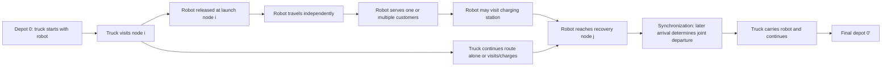

# ETRD-NL 论文精读报告：机器人-电动卡车协同、非线性充电、数学建模与代码映射

> 论文文件：`D:\学习\FURP\articles\ETRD-NL.pdf`  
> 当前相关代码目录：`D:\学习\FURP\VRP_project\ETRD_NL`，`D:\学习\FURP\VRP_project\EVRPTW_Schneider2014`  
> 报告重点：机器人-卡车协同配送、非线性充电、四种充电策略、论文模型与当前代码差距、迁移到无人机-卡车 EVRPTW-NL 的建模路线。  
> 重要说明：PDF 文本抽取中部分数学符号出现乱码，因此本报告对“能由论文文本确认的事实”与“需要人工核对的公式细节”分开标注。涉及精确公式符号时，建议再人工对照论文第 5-8 页的数学模型截图。

---

## 1. Paper Identification

| 项目 | 内容 |
|---|---|
| 论文完整标题 | Electric truck-based robot delivery problem with nonlinear charging |
| 作者 | Shaohua Yu, Tengkuo Zhu, Jakob Puchinger |
| 年份 | 2026 |
| 期刊 | Transportation Research Part E: Logistics and Transportation Review, 213, 104958 |
| 问题全称 | Electric Truck-based Robot Delivery Problem with Nonlinear Charging |
| 论文简称 | ETRD-NL |
| 研究对象 | 1 辆电动卡车及其车载机器人协同完成客户配送，同时考虑卡车和机器人独立电池、充电站访问、非线性充电 |
| 数据来源 | 基于 Yu et al. (2024) 的地理坐标和实验参数生成实例；论文第 5.1 节说明 tiny/small/medium/large 四类规模 |
| 求解方法 | MILP 精确模型；Sequence First, Charging Second (STC)；Simultaneous Sequencing and Charging (SAC)；ALNS；Savings-STC 基线；frvcpy/启发式充电补全 |
| 主要贡献 | 提出 ETRD-NL 模型；用分段线性近似表达非线性充电；提出时间有效不等式；设计 STC 与 SAC 两类启发式；比较 LFC/LPC/NFC/NPC 四种充电策略 |

**论文事实。** 论文研究的是“电动卡车 + 车载机器人”的协同配送问题。卡车可以单独服务客户，也可以携带机器人行驶；机器人可从卡车处释放，独立服务若干客户，再在后续节点与卡车汇合。卡车和机器人都有独立电池，都可能访问充电站，并且充电函数是非线性的。论文目标不是传统 VRPTW 中的车辆数或距离，而是最小化完成全部服务的总完成时间，即卡车最终回到终点仓库的时间，见第 3.2 节目标函数 Eq. (2)。

**问题创新。** 将电动卡车、车载机器人协同、独立电池、充电站访问和非线性充电放到同一个路由-调度-充电模型中。

**充电模型创新。** 论文强调真实电池充电不是线性的，采用分段线性近似描述充电时间和 SOC 的关系，并比较线性/非线性、满充/部分充电四类策略。

**算法创新。** 论文提出 STC 和 SAC 两类范式。STC 先确定卡车-机器人访问顺序，再插入充电站和计算充电时间；SAC 则把排序和充电放在同一个 ALNS 邻域中联合优化。

**实验贡献。** 论文构造 tiny、small、medium、large 四类实例，比较 MILP、ALNS、STC/SAC、充电策略和系统参数敏感性。第 5.4 节指出电池容量和充电站数量对目标值影响最大，非线性部分充电 NPC 通常表现最好。

---

## 2. Physical Delivery System

### 2.1 系统结构

论文第 3.1 节明确说明：ETRD-NL 包含一辆电动卡车和一台车载机器人。二者都可以访问客户节点。卡车可以携带机器人一起移动，也可以在某个节点释放机器人，让机器人沿二级开放路线独立服务客户，再在后续节点与卡车重新汇合。

| 问题 | 论文事实 | 当前 ETRD_NL 实现 |
|---|---|---|
| 卡车是否为电动卡车 | 是，truck 有独立电池 | `instance["truck"]["battery_capacity"]` |
| 每辆卡车携带多少机器人 | 论文文本使用 singular onboard robot，模型按一辆卡车一台机器人理解 | 当前代码默认一台机器人 |
| 机器人是否始终由卡车运输 | 机器人在非独立任务时由卡车携带 | 当前代码仅在任务段外隐含机器人随车 |
| 机器人何时离开卡车 | 在卡车访问的释放节点 launch 离开 | `robot_tasks[].launch` |
| 机器人在哪里回收 | 在卡车后续访问的 recover 节点汇合 | `robot_tasks[].recover` |
| 卡车在机器人执行任务期间能否继续行驶 | 能。二者在 parallel segment 中独立移动，最后同步 | 当前 evaluator 用 `max(truck_arrival, robot_time)` 同步 |
| 机器人能否连续服务多个客户 | 论文明确允许机器人一次 dispatch 连续服务多个客户 | 当前 `robot_tasks[].customers` 支持列表 |
| 机器人能否独立返回仓库 | 论文没有把“机器人独立返回仓库”作为一般规则；机器人依赖卡车运输、释放和回收 | 当前代码机器人任务必须回到 recover |
| 卡车和机器人是否都能服务客户 | 是 | 当前代码 truck_route 中客户由卡车服务，robot_tasks 中客户由机器人服务 |
| 是否考虑发射和回收时间 | 论文模型中同步和时间传播体现释放/回收结构；是否有单独固定发射/回收时间需人工核对参数表 | 当前代码未显式建 launch/recover 固定时间 |

### 2.2 系统工作流程图



依据：论文第 3.1 节说明机器人从卡车释放、可以服务多个客户、卡车和机器人可在客户或充电站汇合；第 4.2.2 节 Algorithm 2 描述 segment 内分别计算 truck end state 和 robot end state，再比较二者时间差；附录 C 的 T-10 示例展示机器人从节点 4 分离，经充电站和客户后与卡车在节点 9 汇合。

---

## 3. Problem Assumptions

| 假设 | 论文原文含义 | 论文位置 | 当前 ETRD_NL 实现 | 是否一致 |
|---|---|---|---|---|
| 仓库 | 单一出发仓库和终点仓库，终点可记作 0' | 第 3.2 节节点集合和 Eq. (2) | `depot_id = 0`，路线首尾均为 0 | 部分一致：代码未区分 0 和 0' |
| 卡车数量 | 论文模型围绕一辆电动卡车及其车载机器人 | 第 3.1 节 | 单条 truck_route | 一致 |
| 机器人数量 | 文本为 onboard robot，按单机器人理解 | 第 3.1 节 | 单类 robot_tasks | 一致 |
| 客户服务 | 每个客户必须由卡车或机器人服务一次 | 第 3.2 节约束 (3)-(10) | evaluator 检查 missing/duplicated | 部分一致 |
| 拆分配送 | 论文未明确允许拆分客户需求；客户作为节点被服务 | 第 3.1-3.2 节 | 不允许拆分 | 一致或论文未明确说明 |
| 时间窗 | 论文明确不包含 time window constraints | 第 3.1 节 | ETRD_NL 未检查时间窗 | 一致 |
| 早到等待 | 无时间窗意义上的早到；但有卡车-机器人同步等待 | 第 3.1、4.2.2 节 | `waiting_time += abs(...)` | 部分一致 |
| 晚到 | 无客户 due time 约束 | 第 3.1 节 | 无 due time | 一致 |
| 服务时间 | 论文说客户服务时间未显式建模，可并入弧时间 | 第 3.1 节 | 节点保存 `service_time`，evaluator 显式加服务时间 | 实现方式不同 |
| 卡车容量 | 论文参数表含需求/容量类符号，但 OCR 不完整；需要人工核对是否是常规货物容量还是辅助计数 | 第 3.2 节表 1 | 当前 ETRD_NL 基本未建载重容量 | 部分实现/需核实 |
| 机器人容量 | 论文涉及 robot delivery，容量参数需人工核对 | 第 3.2 节表 1 | 当前 ETRD_NL 未建机器人载重 | 未实现 |
| 卡车电池 | 卡车有独立电池容量 | 第 3.1、3.2 节能量约束 | `truck.battery_capacity` | 部分一致 |
| 机器人电池 | 机器人有独立电池容量 | 第 3.1、3.2 节能量约束 | `robot.battery_capacity`，但每个任务重置满电 | 实现方式不同 |
| 充电站 | 卡车和机器人都可访问充电站 | 第 3.1 节 | `station_ids`，`move_with_charging()` 可插站 | 部分一致 |
| 充电站重复访问 | 同一充电站可由同一类型车辆至多访问一次，用于 MILP/ALNS 对比 | 第 5.3.1、5.3.2 节 | 当前代码未禁止重复访问同一站 | 未实现 |
| 部分充电 | 论文允许部分充电，且 full 是 partial 的特殊情况 | 第 3.1、4.2.1 节 | `charge_mode="partial/full"` | 部分一致 |
| 非线性充电 | 论文采用分段线性近似非线性函数 | 第 3.2、Fig. 7 | `charging.py` 用自定义分段速率 | 部分一致 |
| 卡车充电期间机器人是否可执行任务 | 论文 Algorithm 2 用 gap 时间处理机器人充电，说明同步等待与充电可交互 | 第 4.2.2 节 | 当前 evaluator 对并行段分别模拟，但没有策略性利用卡车充电 gap | 部分实现 |
| 发射/回收点必须由卡车访问 | 是 | 第 3.1 节 | launch/recover 必须是 truck_route 相邻节点，解码器如此构造 | 部分一致但过于受限 |
| 发射点和回收点可相同 | 论文未明确说明 | 需要人工核实 | 当前任务键为 `(launch,recover)`，可否相同取决于路线结构，通常不相同 | 无法确认 |
| 道路网络差异 | 论文区分 truck arcs 和 robot arcs，并提到机器人与无人机不同 | 第 3.2、文献综述 | 当前用 Manhattan 距离，机器人只是速度较慢 | 部分一致 |
| 载重对能耗影响 | 论文未明确从抽取文本确认 | 需要人工核实 | 当前能耗 = 距离 * 固定率 | 代码实现假设 |

---

## 4. Sets and Network Structure

| 符号 | 集合类型 | 含义 | 当前代码对应字段 |
|---|---|---|---|
| `0` | depot | 出发仓库 | `instance["depot_id"] = 0` |
| `0'` | depot copy | 终点仓库 | 当前代码仍用 0 表示返回 |
| `V_c` | customers | 客户节点集合 | `instance["customer_ids"]` |
| `V_s` | charging stations | 充电站集合 | `instance["station_ids"]` |
| `V_0` | depot set | 出发/返回仓库集合 | 当前无单独字段 |
| `V` | all nodes | 仓库、客户、充电站全集 | `instance["nodes"]` |
| `A` | directed arcs | 可行有向弧集合 | 当前用完整矩阵隐含所有节点间可行弧 |
| `K` 或 vehicle | vehicle | 卡车，论文实际为单卡车 | `truck` |
| robot | robot | 车载机器人 | `robot` |
| charging segments | segment set | 非线性充电分段 | `ChargingPolicy.nonlinear_segments` |
| robot sortie/mission | mission | 机器人从 launch 到 recover 的二级路线 | `solution["robot_tasks"]` |

关键判断：

1. **卡车和机器人不完全等价。** 论文有 truck arcs、robot arcs，以及 truck carrying robot 的状态。当前代码只有不同时间/能量矩阵，没有显式保存“机器人是否随车携带”的弧变量。
2. **机器人不一定只能服务一个客户。** 论文第 4.1.2 节明确说与 FSTSP 不同，机器人可以一次 dispatch 连续访问多个客户。当前 `robot_tasks[].customers` 支持多个客户，这是与论文较接近的地方。
3. **充电站可作为汇合节点。** 论文第 3.1 节和附录 C 示例说明卡车和机器人可在充电站汇合。当前代码允许 recover 为任意 truck_route 节点，但 GA 解码器通常只用客户/仓库作为 truck route 节点，充电站多由 evaluator 自动插入，不自然成为机器人 recover 决策。
4. **论文图是有向网络。** 弧集合按 `(i,j)` 定义。当前代码用 Manhattan 距离矩阵，默认对称，属于简化。
5. **当前 routes 不足以表达完整论文解。** 论文完整解至少需要 truck arcs、robot arcs、carrying arcs、charging amount、charging time、arrival/departure energy、arrival/departure time；当前只保存 truck_route 和 robot_tasks。

---

## 5. Parameters

| 论文符号 | 含义 | 单位 | 数据来源 | 当前代码字段 | 当前取值/生成方式 | 是否一致 |
|---|---|---|---|---|---|---|
| `t^T_ij` | 卡车弧 `(i,j)` 行驶时间 | time | 由距离和速度/参数得到 | `truck_time_matrix` | `distance / truck_speed` | 部分一致 |
| `t^R_ij` | 机器人弧 `(i,j)` 行驶时间 | time | 由距离和速度/参数得到 | `robot_time_matrix` | `distance / robot_speed` | 部分一致 |
| `c^T_ij` | 卡车弧能耗 | energy | 论文参数 | `truck_energy_matrix` | `distance * truck_consumption` | 部分一致 |
| `c^R_ij` | 机器人弧能耗 | energy | 论文参数 | `robot_energy_matrix` | `distance * robot_consumption` | 部分一致 |
| `Q^T` | 卡车电池容量 | energy | Fig. 6/实例参数 | `truck.battery_capacity` | 默认 160 | 当前代码自定义 |
| `Q^R` | 机器人电池容量 | energy | Fig. 6/实例参数 | `robot.battery_capacity` | 默认 55 | 当前代码自定义 |
| `q_i` | 客户需求/计数参数 | demand | 模型参数；OCR 显示可能设为 1 | 未保存 | 未使用 | 未实现/需核实 |
| `C` | 容量类参数 | demand | 模型参数；OCR 显示可能为 1 | 未保存 | 未使用 | 未实现/需核实 |
| `M` | Big-M 常数 | - | MILP 建模参数 | 无 | 无 MILP | 未实现 |
| `k_l, b_l` | 分段线性充电函数斜率/截距 | time/energy | Fig. 7 或参数表 | `nonlinear_segments` 仅保存上界和速率 | 自定义 `(0.4,2.0),(0.8,1.15),(1.0,0.55)` | 不一致 |
| `L` | 充电分段集合 | - | Fig. 7 | `nonlinear_segments` 长度 | 3 段 | 部分一致 |
| charging station positions | 充电站坐标 | km/grid | 论文实例生成 | `station_ids`, `nodes` | 根据客户 bbox 规则生成 | 不一致 |
| Manhattan distance | 曼哈顿距离 | distance | 第 5.1 节 | `manhattan()` | 使用曼哈顿距离 | 一致 |
| customer coordinates | 客户坐标 | km/grid | Yu et al. (2024) 生成 | Solomon JSON | 复用 Solomon R/C/RC | 不一致 |

**代码事实。** `ETRD_NL/instance_builder.py` 中默认 `truck_speed=1.0`、`robot_speed=0.65`、`truck_battery=160.0`、`robot_battery=55.0`、能耗率均为 1。论文第 5.1 节使用 Fig. 6 的真实车辆参数，并为 tiny/small 实例刻意降低电池容量，使充电成为必要行为。因此当前代码的参数不是论文 benchmark 参数，而是为了教学复现构造的简化参数。

---

## 6. Decision Variables

| 变量 | 数学含义 | 类型 | 当前代码对应 | 是否显式存储 |
|---|---|---|---|---|
| `x_ij` | 卡车是否从节点 i 到 j 行驶 | binary | `truck_route` 中相邻节点隐含 | 否，仅隐含 |
| `y_ij` | 机器人是否从 i 到 j 独立行驶 | binary | `robot_tasks[].customers` 隐含 robot path | 否，仅隐含 |
| `z_ij` | 卡车携带机器人经过弧 `(i,j)` | binary | 未显式保存 | 否 |
| customer truck service | 客户是否由卡车服务 | binary | truck_route 中客户且不在 robot_served | 否，临时计算 |
| customer robot service | 客户是否由机器人服务 | binary | `robot_tasks[].customers` | 是，简化保存 |
| launch node | 机器人释放节点 | integer/binary | `robot_tasks[].launch` | 是 |
| recovery node | 机器人回收节点 | integer/binary | `robot_tasks[].recover` | 是 |
| `w^T_i` | 卡车到达/可离开节点 i 的时间状态 | continuous | `arrivals` 只记录部分 truck arrival/sync time | 部分临时计算 |
| `w^R_i` | 机器人到达节点 i 的时间状态 | continuous | robot_time 局部变量 | 否 |
| `e^T_i` | 卡车到达节点 i 的电量 | continuous | `truck_energy` 局部变量 | 否 |
| `E^T_i` | 卡车离开节点 i 的电量 | continuous | `truck_energy` 更新后局部变量 | 否 |
| `e^R_i` | 机器人到达节点 i 的电量 | continuous | `robot_energy` 局部变量 | 否 |
| `E^R_i` | 机器人离开节点 i 的电量 | continuous | `robot_energy` 更新后局部变量 | 否 |
| charging amount | 充电量 | continuous | `events[].from_energy/to_energy` | 仅 evaluator 事件中保存 |
| charging time | 充电时间 | continuous | `events[].duration` | 仅 evaluator 事件中保存 |
| segment selector | 所处充电分段 | binary | 无 | 否 |
| MTZ order `u_i` | 消除子回路的访问顺序变量 | continuous/integer | 无 | 否 |

**结论。** 当前代码的 `routes + robot_tasks` 只能表示“访问顺序和简化机器人任务”，不足以完整表达论文解。完整 ETRD-NL 解至少应保存：

- `truck_route`：卡车访问节点序列，含客户和充电站；
- `robot_tasks`：每个任务的 `launch_node`、`robot_route`、`recovery_node`；
- `carried_arcs`：哪些卡车弧上机器人随车；
- `charging_plan`：每次充电的节点、车辆类型、到达 SOC、目标 SOC、充电量、充电时间、策略；
- `timing_states`：卡车和机器人每个节点的到达、服务、等待、离开时间；
- `battery_states`：卡车和机器人每段前后的电量；
- `sync_records`：每个汇合节点谁等待、等待多久。

---

## 7. Objective Function

论文第 3.2 节 Eq. (2)：

```text
min w^T_{0'}
```

**论文事实。** 目标是最小化卡车到达终点仓库 `0'` 的时间，也就是完成所有客户服务、机器人已回收、卡车返回仓库后的 makespan。论文不是以车辆数优先，也不是以总距离优先。由于模型只有一辆卡车和一台机器人，车辆数不是优化项。

| 目标项 | 论文公式 | 自然语言含义 | 当前代码实现 | 是否一致 |
|---|---|---|---|---|
| 完成时间 | `min w^T_{0'}` | 最小化最终返回仓库的时间 | `objective = completion_time + penalty` | 部分一致 |
| 卡车距离 | 未作为主目标项 | 影响时间和能耗 | 当前不直接最小化距离 | 一致 |
| 机器人距离 | 未作为主目标项 | 影响时间和能耗 | 当前不直接最小化距离 | 一致 |
| 充电时间 | 通过时间传播影响 `w^T_{0'}` | 充电越久完成时间越大 | `move_with_charging()` 加到 time | 部分一致 |
| 同步等待 | 通过 max 同步影响完成时间 | 早到方等待 | `waiting_time += abs(...)`，time 取 max | 部分一致 |
| 不可行罚项 | MILP 中为硬约束，无罚项 | 不可行解不应被接受 | `PENALTY=10000` 加到 objective | 当前代码自行增加 |

**论文真正优化的目标。** 最小化卡车最终返回终点仓库的时间 `w^T_{0'}`。

**当前 ETRD_NL 代码真正优化的目标。** `completion_time + penalty`。GA 使用 `1 / objective`，OR-Tools 先求客户 TSP 路线，再枚举机器人任务并用 evaluator 选择最小 objective。

**差异影响。** 当前代码把不可行性用罚项处理，属于启发式搜索常用做法；论文 MILP 将客户服务、连通性、同步、电量、充电全部作为硬约束。若罚项不足或修复策略过强，算法可能选出结构与论文最优逻辑不同的解。

---

## 8. Constraint-by-Constraint Analysis

由于 PDF 文本抽取中公式符号存在乱码，本节按论文第 3.2 节的约束组解释。精确公式请人工核对论文第 5-8 页。

### Constraint (3)-(10)：路线、访问和服务约束

#### 1. Original Formula

论文第 3.2 节约束 (3)-(10)。抽取文本显示这些约束定义：

- 卡车从 depot 出发并返回终点 depot；
- 客户必须被服务；
- 卡车、机器人、卡车携带机器人三类弧变量之间互斥或协调；
- 机器人任务必须依附于卡车释放/回收结构；
- 充电站访问受到次数限制。

精确符号需人工核对。

#### 2. Natural-language Meaning

这些约束解决“谁去哪里”和“客户由谁服务”的问题。每个客户不能丢失，不能重复服务。机器人不能凭空出现，必须在卡车访问的节点被释放，并在卡车访问的节点被回收。

#### 3. Small Example

若卡车路线为 `0 -> 1 -> 3 -> 0`，机器人任务为 `(1, 2, 3)`，则客户 1、3 由卡车服务，客户 2 由机器人服务。若客户 2 同时出现在卡车路线和机器人任务中，则违反唯一服务约束。

#### 4. State Propagation

影响客户访问、机器人任务、卡车路线、同步节点、车辆数量。

#### 5. Current Code Location

| 文件 | 函数 | 处理方式 |
|---|---|---|
| `ETRD_NL/evaluator.py` | `evaluate_solution()` | 检查 missing、extra、duplicated；检查 truck_route 首尾为 depot |
| `ETRD_NL/ga_model.py` | `decode_individual()` | 将客户排列按 `robot_stride` 分配给卡车或机器人 |
| `ETRD_NL/ortools_model.py` | `_collaborative_candidates()` | 枚举少量机器人任务候选 |

#### 6. Consistency Assessment

部分一致。当前代码能检查客户覆盖，但没有完整 MILP 弧变量，也没有论文中的广义机器人任务结构。

#### 7. Risks

搜索阶段并不知道完整同步与充电结构；机器人任务过于依赖解码器规则，可能漏掉论文中大量可行结构。

### Constraint (11)-(16)：时间传播与卡车-机器人同步约束

#### 1. Original Formula

论文第 3.2 节约束 (11)-(16)。抽取文本显示其作用是约束 truck 和 robot 沿弧移动时的到达时间，并在共同节点执行同步。

#### 2. Natural-language Meaning

如果卡车从 i 到 j，则 j 的卡车时间至少等于 i 的时间加上行驶/服务/充电时间。如果机器人独立从 i 到 j，也要类似更新机器人时间。若 i 或 j 是卡车和机器人共同出现的释放/回收节点，则二者必须在同一时刻完成同步，早到的一方等待。

#### 3. Small Example

卡车从 1 到 3 用 10 分钟，机器人从 1 经客户 2 到 3 用 14 分钟，则在节点 3 卡车等 4 分钟，二者同步后才能继续。

#### 4. State Propagation

影响卡车时间、机器人时间、等待、同步、完成时间。

#### 5. Current Code Location

| 文件 | 函数 | 关键逻辑 |
|---|---|---|
| `ETRD_NL/evaluator.py` | `evaluate_solution()` | `sync_time = max(truck_arrival, robot_time)` |
| `ETRD_NL/evaluator.py` | `move_with_charging()` | 每段 travel 和 charge 都增加 time |

#### 6. Consistency Assessment

部分一致。当前代码能做简单同步，但只支持机器人从一个 truck leg 的左端出发、右端回收。论文允许更一般的 TSPR route 结构。

#### 7. Risks

当前代码没有显式保存 robot arrival/departure time；后续优化算法无法直接利用等待结构，只能靠 evaluator 事后评价。

### Constraint (17)-(32)：电量传播、充电和非线性充电约束

#### 1. Original Formula

论文第 3.2 节约束 (17)-(32)。这些约束包括：

- 卡车沿弧移动后电量减少；
- 机器人沿弧移动后电量减少；
- 到达充电站后可充电；
- 离开电量不能超过电池容量；
- 充电时间由分段线性函数决定；
- 通过分段选择变量确定到达/离开 SOC 所处区间。

#### 2. Natural-language Meaning

每走一段路都消耗电量。如果下一段路电量不够，就必须在合适的充电站补能。因为充电不是线性的，低 SOC 可能充得快，高 SOC 可能充得慢，所以“充多少”和“在哪里充”会影响完成时间。

#### 3. Small Example

卡车容量 100，从节点 1 到 3 需 70 电量，当前只有 40，则不能直接走。若节点 1 或途中有充电站，可充到至少 70；若是 full charging，则充到 100；若是 partial charging，则可只充到 70。

#### 4. State Propagation

影响电量、充电站访问、充电时间、同步等待、目标函数。

#### 5. Current Code Location

| 文件 | 函数 | 处理方式 |
|---|---|---|
| `ETRD_NL/charging.py` | `charge_time()` | 线性或自定义分段非线性充电时间 |
| `ETRD_NL/charging.py` | `effective_target()` | 满充或部分充电目标 SOC |
| `ETRD_NL/evaluator.py` | `move_with_charging()` | 如果电量不足，贪心插入一个可达充电站 |
| `ETRD_NL/evaluator.py` | `_best_station_for_leg()` | 选择 detour time 最小的充电站 |

#### 6. Consistency Assessment

部分一致。当前代码有电量和充电模拟，但非线性函数参数不是论文 Fig. 7，充电站插入是贪心后处理，不是论文 MILP 或 SAC 中的联合决策。

#### 7. Risks

当前代码可能把充电站作为 evaluator 自动事件，而不是解的一部分。这样 GA/OR-Tools 搜索时并不知道充电站选择对目标的影响。

### Constraint (33)-(35)：MTZ 子回路消除约束

#### 1. Original Formula

论文第 3.2 节约束 (33)-(35)，使用 MTZ 类顺序变量消除子回路。

#### 2. Natural-language Meaning

防止出现一小圈客户彼此相连但不与仓库连通的路线。

#### 3. Small Example

若客户 1、2、3 形成 `1 -> 2 -> 3 -> 1`，但卡车没有从 depot 到达该圈，则是非法子回路。

#### 4. Current Code Location

当前 ETRD_NL 没有 MILP 建模，也没有显式 MTZ 变量。GA 和 OR-Tools 通过排列/TSP 路线天然避免多数子回路。

#### 5. Consistency Assessment

实现方式不同。

### Constraint (36)-(37)：时间有效不等式 TVIs

#### 1. Original Formula

论文第 3.2 节约束 (36)-(37)，第 5.3.1 节表 4 证明其能显著强化 MILP。

#### 2. Natural-language Meaning

给卡车和机器人到达终点的时间设置更强的下界，减少 MILP 搜索空间。卡车最终到达 depot 的时间不能小于完成其路线所需的最少时间；机器人也类似。

#### 3. Current Code Location

当前 ETRD_NL 没有 MILP，因此未实现 TVIs。

#### 4. Consistency Assessment

未实现。

---

## 9. Robot Mission Logic

### 9.1 论文中的机器人任务

论文事实：

1. 机器人由卡车携带。
2. 机器人从卡车访问的节点释放。
3. 机器人可以连续服务多个客户。
4. 机器人在后续节点与卡车回收汇合。
5. 卡车在机器人执行任务期间可以继续行驶。
6. 汇合时二者需要同步，早到方等待。
7. 机器人和卡车均可访问充电站。
8. 机器人路线是二级开放路线，不是普通独立车辆路线。

### 9.2 当前代码中的机器人任务

当前 `ETRD_NL` 解格式：

```python
{
    "truck_route": [0, 4, 1, 7, 5, 6, 0],
    "robot_tasks": [
        {"launch": 4, "recover": 1, "customers": [3]},
        {"launch": 7, "recover": 5, "customers": [8]}
    ]
}
```

### 9.3 任务时间线

```text
Truck arrives at launch
-> robot departs
-> truck travels from launch to recovery
-> robot travels through robot customers
-> robot serves customers
-> robot reaches recovery
-> truck reaches recovery
-> synchronization by max(truck_arrival, robot_arrival)
-> next joint departure
```

| 时间线步骤 | 论文依据 | 当前代码对应 |
|---|---|---|
| 卡车到达 launch | 第 3.1 节释放节点必须由卡车访问 | `left` in truck leg |
| 机器人离开 | 第 3.1 节 robot released | `robot_path = [left] + customers + [right]` |
| 卡车继续 | 第 3.1 节 first-level route | `truck_move = move_with_charging(...)` |
| 机器人服务客户 | 第 4.1.2 节允许多客户 robot route | `if r_right in task_customers: robot_time += service_time` |
| 汇合 | 第 3.1 节 synchronization | `sync_time = max(...)` |
| 等待 | 第 4.2.2 节 gap/time comparison | `waiting_time += abs(...)` |

### 9.4 关键差距

当前代码把机器人任务限制在“相邻 truck_route 节点之间”。论文的 TSPR route 和 ALNS joint node insertion/removal 更灵活，能改变 joint customer node 和 parallel segment 的结构。当前 GA 只能通过 `robot_stride` 粗略分配机器人客户，无法主动搜索最优 launch/recover 组合。

---

## 10. Nonlinear Charging Model

### 10.1 为什么非线性

论文第 4.2.1 节和 Fig. 7 说明：真实电池通常低 SOC 充电较快，高 SOC 充电逐渐变慢，因此边际充电时间随 SOC 增加而上升。论文 Appendix B 将累计充电时间函数写作 `F(e)`，并假设 `F(0)=0`、严格递增、凸，即边际充电时间不下降。

### 10.2 论文中的建模方式

论文第 3.2 节 Eq. (1) 使用分段线性函数近似非线性充电曲线：

```text
c_l = k_l * t_l + b_l
```

其中 `l` 表示充电区间，`k_l`、`b_l` 为分段函数参数。由于 PDF 抽取符号不完整，卡车和机器人的上下标版本需人工核对。

### 10.3 SOC、到达电量和离开电量

| 状态 | 含义 | 当前代码 |
|---|---|---|
| arrival SOC / energy | 到达节点时剩余电量 | `energy` 局部变量，未完整保存 |
| departure SOC / energy | 充电或服务后离开节点电量 | `target_energy` 或扣减后的 `energy` |
| charging amount | `departure - arrival` | `events[].to_energy - events[].from_energy` |
| charging time | 非线性函数差值 | `charge_time()` |

### 10.4 当前代码实现

`ETRD_NL/charging.py`：

```python
ChargingPolicy(
    function_type="nonlinear",
    charge_mode="partial",
    linear_rate=1.35,
    nonlinear_segments=((0.40, 2.00), (0.80, 1.15), (1.00, 0.55)),
)
```

代码中的非线性逻辑是“按 SOC 区间设置充电速率”，低区间速率高，高区间速率低。这与论文“高 SOC 边际充电时间更长”的方向一致，但参数不是论文 Fig. 7 的原始参数。

| SOC 区间 | 充电速率/时间函数 | 论文参数 | 当前代码实现 | 是否一致 |
|---|---|---|---|---|
| 低 SOC | 边际充电时间较低/充电较快 | Fig. 7，需人工读取具体数值 | 0-40% rate=2.00 | 方向一致，数值不一致 |
| 中 SOC | 中等速度 | Fig. 7 | 40%-80% rate=1.15 | 方向一致，数值不一致 |
| 高 SOC | 边际充电时间较高/充电较慢 | Fig. 7 | 80%-100% rate=0.55 | 方向一致，数值不一致 |

### 10.5 Charge-Enough Principle

论文第 4.2.1 节 Proposition 4.1 证明：在固定充电站序列、累计充电时间函数严格递增且凸时，最小化总充电时间的策略是在每个充电站只充到“刚好能到下一个充电站或终点仓库”。这就是部分充电优于过量充电的理论基础。

当前代码的 `effective_target()` 在 partial 模式下使用 `requested_target`，接近 charge-enough 思想；但 `requested_target` 由当前 leg 的可达性贪心决定，不是沿完整固定充电站序列优化得到。

---

## 11. Four Charging Strategies

论文第 5.4 节和 Appendix C 明确比较四种策略：LFC、LPC、NFC、NPC。

### LFC

| 项目 | 内容 |
|---|---|
| Full Name | Linear Full Charging |
| Charging Law | 线性充电 |
| Charging Target | 满充 |
| Target SOC Calculation | 每次访问充电站充到电池容量 |
| Charging Time Formula | 充电量 / 线性充电速率 |
| Effect on Route Time | 每次充电可能较长 |
| Effect on Feasibility | 简单稳定，但可能过度充电 |
| Effect on Objective | 通常不如部分充电灵活 |
| Current Code Implementation | `make_policy("linear", "full")` |
| Risks | 线性模型可能低估真实非线性高 SOC 充电时间 |

### LPC

| 项目 | 内容 |
|---|---|
| Full Name | Linear Partial Charging |
| Charging Law | 线性充电 |
| Charging Target | 部分充电 |
| Target SOC Calculation | 充到当前规划所需目标电量 |
| Charging Time Formula | 充电量 / 线性充电速率 |
| Effect on Route Time | 减少不必要满充时间 |
| Effect on Feasibility | 若真实充电非线性，线性估计仍可能误判 |
| Effect on Objective | 论文表 6 中通常优于 LFC |
| Current Code Implementation | `make_policy("linear", "partial")` |
| Risks | 不是论文真实非线性函数 |

### NFC

| 项目 | 内容 |
|---|---|
| Full Name | Nonlinear Full Charging |
| Charging Law | 非线性充电 |
| Charging Target | 满充 |
| Target SOC Calculation | 每次充到最大容量 |
| Charging Time Formula | 分段非线性充电时间 |
| Effect on Route Time | 高 SOC 区间慢，满充代价较高 |
| Effect on Feasibility | 更贴近真实电池，但时间成本高 |
| Effect on Objective | 论文表 6 中 NFC 通常较差且敏感 |
| Current Code Implementation | `make_policy("nonlinear", "full")` |
| Risks | 当前分段参数不是论文原始曲线 |

### NPC

| 项目 | 内容 |
|---|---|
| Full Name | Nonlinear Partial Charging |
| Charging Law | 非线性充电 |
| Charging Target | 部分充电 |
| Target SOC Calculation | 只充到后续可行所需电量 |
| Charging Time Formula | 分段非线性函数差值 |
| Effect on Route Time | 避免高 SOC 慢充区，通常更优 |
| Effect on Feasibility | 最贴近论文现实假设 |
| Effect on Objective | 论文表 6 baseline 中 NPC 目标值最低 |
| Current Code Implementation | `make_policy("nonlinear", "partial")` |
| Risks | 当前“所需电量”由局部贪心决定，不是全局最优 |

| 策略 | 线性/非线性 | 满充/部分 | 目标 SOC | 充电时间 | 优点 | 缺点 |
|---|---|---|---|---|---|---|
| LFC | 线性 | 满充 | 容量上限 | 线性 | 简单 | 可能不真实且过度充电 |
| LPC | 线性 | 部分 | 所需电量 | 线性 | 灵活 | 仍可能误判真实充电 |
| NFC | 非线性 | 满充 | 容量上限 | 分段非线性 | 真实 | 高 SOC 慢充导致时间长 |
| NPC | 非线性 | 部分 | 所需电量 | 分段非线性 | 真实且灵活 | 建模和求解最复杂 |

---

## 12. Complete Route and Mission Simulation

以下为演示参数，不伪称来自论文。

```text
Depot 0
Customer 1 served by truck
Launch node 1
Customer 2 served by robot
Recovery node 3
Charging station S
Customer 4 served by truck
Depot 0

Truck route: 0 -> 1 -> 3 -> S -> 4 -> 0
Robot task: (1, 2, 3)
```

演示参数：

- 卡车容量 `Q^T = 100`，机器人容量 `Q^R = 40`；
- 卡车速度 1，机器人速度 0.5；
- 能耗率均为 1；
- 服务时间均为 2；
- 距离：`0-1=10`，`1-3=15`，`1-2=8`，`2-3=8`，`3-S=20`，`S-4=20`，`4-0=30`。

### 12.1 时间和同步

| 步骤 | 卡车时间 | 机器人时间 | 说明 |
|---|---:|---:|---|
| 0 -> 1 | 10 | - | 卡车到客户 1 |
| 客户 1 服务 | 12 | - | 卡车服务客户 1 |
| 机器人从 1 出发 | 12 | 12 | launch |
| 卡车 1 -> 3 | 27 | - | 卡车到 recover |
| 机器人 1 -> 2 | - | 28 | 机器人速度慢，8/0.5=16 |
| 机器人服务 2 | - | 30 | 服务时间 2 |
| 机器人 2 -> 3 | - | 46 | 到 recover |
| 同步 | 46 | 46 | 卡车等 19 |
| 3 -> S | 66 | - | 卡车到充电站 |

### 12.2 电量和充电

| 步骤 | 卡车电量 | 机器人电量 |
|---|---:|---:|
| 出发 | 100 | 40 |
| 卡车到 1 | 90 | 40 |
| 卡车到 3 | 75 | - |
| 机器人到 2 | - | 32 |
| 机器人到 3 | - | 24 |
| 卡车到 S | 55 | - |

如果从 S 到 4 再回 0 需要 `20 + 30 = 50` 电量，卡车当前 55 可不充。如果把后续距离改成 70，则需要充电。

四种策略下：

- LFC：到 S 后充到 100；
- LPC：只充到至少 70；
- NFC：按非线性函数充到 100；
- NPC：按非线性函数只充到 70。

### 12.3 与当前 evaluator 的对应

| 手算环节 | 当前代码 |
|---|---|
| 卡车 travel | `move_with_charging(instance, left, right, ..., "truck")` |
| 机器人 travel | `move_with_charging(instance, r_left, r_right, ..., "robot")` |
| 服务时间 | `_service_time()` 后加到 time |
| 同步 | `sync_time = max(truck_arrival, robot_time)` |
| 等待 | `waiting_time += abs(truck_arrival - robot_time)` |
| 充电 | `charge_time()` + `effective_target()` |
| 目标 | `completion_time + penalty` |

---

## 13. Benchmark and Experimental Design

| 数据项 | 论文做法 | 当前项目做法 | 是否一致 | 差异影响 |
|---|---|---|---|---|
| 客户坐标 | 基于 Yu et al. (2024)，随机分布于网格角点 | Solomon JSON 坐标 | 不一致 | 不能与论文表格数值直接对比 |
| 距离 | Manhattan distance | `manhattan()` | 一致 | 距离度量一致 |
| tiny 实例 | 7 customers, 3 stations, 20 scenarios | 可指定客户数/站点数 | 部分一致 | 可模拟规模但不是原数据 |
| small 实例 | 15 customers, 7 stations | 可指定 | 部分一致 | 可做近似 |
| medium 实例 | 30 customers, 15 stations | 可指定 | 部分一致 | 可扩展 |
| large 实例 | 60 customers, 30 stations | 可指定 | 部分一致 | 可扩展 |
| 电池容量 | Fig. 6 + 小规模有意缩小容量 | 默认 160/55 | 不一致 | 充电需求强度不同 |
| 充电曲线 | Fig. 7 | 自定义三段速率 | 不一致 | LFC/LPC/NFC/NPC 对比仅趋势参考 |
| 重复运行 | 10 random seeds | 当前脚本未严格 10 次 | 不一致 | 统计可靠性不足 |
| ALNS 迭代 | 200,000 iterations | 当前 ETRD_NL 无 ALNS | 不一致 | 尚未复现论文算法 |
| 结果指标 | objective、runtime、gap、wins、p-value、敏感性 | completion_time/objective/feasible | 部分一致 | 缺少论文统计维度 |

**结论。** 当前 ETRD_NL 项目属于“基于 Solomon 数据改造的教学性简化复现”，不能表述为“完全复现论文 benchmark”。

---

## 14. Paper Algorithm

| 算法环节 | 论文方法 | 当前 ETRD_NL GA | 当前 OR-Tools 方法 | 差异 |
|---|---|---|---|---|
| 初始路线 | TSP route from simple GA | 随机客户排列 | OR-Tools TSP route | 都是简化路线起点 |
| TSP 转 TSPR | Algorithm 1 SplitWithOverlap / TransformSegment / MergeRecursive | `robot_stride` 按位置分配机器人客户 | 枚举 1-2 个机器人客户 | 当前缺少论文转换机制 |
| Destroy | Regular/Joint customer removal；SAC 增加 charging node removal | 无 ALNS destroy | 无 | 未实现 |
| Repair | Regular/Joint insertion，regret insertion，charging insertion | GA 交叉变异后直接 evaluator | 枚举候选后 evaluator | 未实现 |
| 充电决策 | STC 中 charging second；SAC 中同时优化 | evaluator 自动贪心插站 | evaluator 自动贪心插站 | 当前充电不是搜索决策 |
| 非线性充电 | PWL 函数 + charge-enough principle | 自定义分段充电 | 自定义分段充电 | 部分实现 |
| 可行性 | MILP 硬约束或 ALNS feasibility check/repair | penalty | penalty | 当前更弱 |
| 停止条件 | ALNS 200,000 iterations；MILP 7200s | 固定 generations | OR-Tools time limit | 不一致 |

**当前项目是否真的复现论文算法？** 不是。当前 ETRD_NL 复现了论文问题的一部分逻辑：卡车路线、机器人任务、同步、电量、四种充电策略的简化 evaluator；但没有复现论文 MILP，也没有复现论文 ALNS-STC/SAC 的核心 operator。

**准确表述。** 当前结果应表述为：“基于 ETRD-NL 论文思想的简化原型，用于验证卡车-机器人协同和充电策略评价流程”，不能称为严格复现论文最优结果。

---

## 15. Paper-to-Code Mapping

| 论文概念 | 论文符号/编号 | 当前文件 | 当前函数 | 实现状态 | 建议 |
|---|---|---|---|---|---|
| 单卡车单机器人系统 | 第 3.1 节 | `ETRD_NL/instance_builder.py` | `build_instance()` | 部分实现 | 增加显式 carried 状态 |
| 客户集合 | `V_c` | `data_loader.py` | `extract_customers()` | 部分实现 | 保留论文实例或按论文网格生成 |
| 充电站集合 | `V_s` | `instance_builder.py` | `_make_station_coordinates()` | 当前代码自行增加 | 按论文 tiny/small/medium/large 规则生成 |
| 曼哈顿距离 | 第 5.1 节 | `instance_builder.py` | `manhattan()` | 已实现 | 保留 |
| 卡车时间矩阵 | `t^T_ij` | `instance_builder.py` | `build_instance()` | 部分实现 | 校准速度参数 |
| 机器人时间矩阵 | `t^R_ij` | `instance_builder.py` | `build_instance()` | 部分实现 | 校准速度参数 |
| 卡车能耗 | `c^T_ij` | `instance_builder.py` | `build_instance()` | 部分实现 | 校准论文参数 |
| 机器人能耗 | `c^R_ij` | `instance_builder.py` | `build_instance()` | 部分实现 | 修复 robot 每任务满电假设 |
| 非线性充电 | Eq. (1), Fig. 7 | `charging.py` | `charge_time()` | 部分实现 | 替换为论文 PWL 参数 |
| 部分/满充 | LFC/LPC/NFC/NPC | `charging.py` | `effective_target()` | 部分实现 | 将 target SOC 作为显式决策 |
| 客户覆盖 | 约束 (3)-(10) | `evaluator.py` | `evaluate_solution()` | 仅 evaluator 检查 | 放入 decoder/repair |
| 同步 | 时间约束 (11)-(16) | `evaluator.py` | `evaluate_solution()` | 部分实现 | 保存 sync records |
| 电量传播 | 约束 (17)-(32) | `evaluator.py` | `move_with_charging()` | post-processing 处理 | 改为搜索可见 |
| 充电站重复访问限制 | 第 5.3 节 | 无 | 无 | 完全缺失 | 增加 visited station per vehicle |
| Algorithm 1 | GenerateTruck-RobotRoute | `ga_model.py` | `decode_individual()` | 当前错误简化 | 按 split/transform/merge 设计 decoder |
| STC charging second | Section 4.2 | `evaluator.py` | `move_with_charging()` | 简化实现 | 增加 Algorithm 2/3 |
| SAC ALNS | Section 4.3 | 无 | 无 | 完全缺失 | 新建 ETRD_NL ALNS |
| 图像绘制 | Appendix C 类似路线图 | `visualization.py` | `plot_solution()` | 部分实现 | 增加 robot/charging labels |

---

## 16. Gap Analysis

### Critical Gaps

| 差异 | 论文要求 | 当前代码做法 | 影响 | 推荐修改 | 优先级 |
|---|---|---|---|---|---|
| 机器人电量连续性 | 机器人有独立电池状态并可充电 | 每个 robot task 从满电开始 | 严重高估可行性 | 在 solution 中保存 robot battery state | 高 |
| 充电不是搜索决策 | 论文 MILP/SAC 联合优化充电站和充电量 | evaluator 贪心插站 | 搜索算法无法学习充电结构 | 将 charging_plan 放入解结构 | 高 |
| 缺少论文 ALNS operators | 论文核心算法是 ALNS-STC/SAC | 当前 ETRD_NL 无 ALNS | 不能复现论文算法 | 实现 TSPR state + destroy/repair | 高 |
| 非线性曲线参数不一致 | Fig. 7 PWL 参数 | 自定义三段速率 | 四策略结果不能与论文比较 | 提取并录入 Fig. 7 参数 | 高 |
| 数据集不一致 | 论文网格实例 T/S/M/L | Solomon 改造 | 不能对比论文表 2-6 | 新增 paper_like generator | 高 |

### Important Simplifications

| 差异 | 影响 |
|---|---|
| 不区分 depot 0 和 0' | 对单路线可接受，但与 MILP 符号不完全一致 |
| 服务时间显式加入而非并入弧时间 | 不影响基本逻辑，但与论文建模表达不同 |
| launch/recover 限制为相邻 truck leg | 大幅缩小机器人任务空间 |
| OR-Tools 只做 TSP + 枚举 | 不是论文求解器 |
| 没有 repeated station visit 限制 | 会影响 MILP/ALNS 可比性 |

### Acceptable Engineering Choices

| 做法 | 说明 |
|---|---|
| 使用 Manhattan distance | 与论文第 5.1 节一致 |
| 用统一 evaluator 比较 GA/OR-Tools | 工程上合理，便于教学验证 |
| 保存 events | 虽非论文变量，但有助于诊断充电和同步 |

---

## 17. Transfer to Truck-Drone EVRPTW-NL

| 机器人论文机制 | 能否直接用于无人机 | 需要修改什么 | 原因 |
|---|---|---|---|
| launch-customer-recovery 任务 | 可经过修改继承 | drone sortie 可为 `(launch, customer(s), recovery)` | 无人机也有发射/回收 |
| 卡车-辅助设备同步 | 可直接继承 | 保留 `max(truck_arrival, drone_arrival)` | 同步本质一致 |
| 独立电池 | 可直接继承 | robot battery 改为 drone battery | 无人机也有续航 |
| 非线性充电 | 可经过参数修改继承 | 无人机可能换电或充电曲线不同 | 电池类型不同 |
| 道路网络 | 必须重新建模 | truck 用 road/Manhattan，drone 用 Euclidean/air path | 无人机不沿道路行驶 |
| 速度 | 参数修改 | drone_speed 通常高于 truck | 运动特性不同 |
| 载重 | 必须明确建模 | drone payload capacity | 无人机载重限制更强 |
| 机器人可连续服务多个客户 | 需要谨慎继承 | drone 通常受续航和载重限制，可能一架次一个客户 | 不能直接套用机器人假设 |
| 充电站访问 | 必须重新建模 | drone 未必能在地面充电站自主充电 | 设施可达性不同 |
| 天气/禁飞 | 当前阶段可忽略，后续必须建模 | 增加 forbidden arcs/区域 | 无人机特有 |
| 卡车移动期间回收 | 论文回收节点需卡车访问并同步 | 无人机通常也需要固定回收点 | 动态回收更复杂 |

**结论。** 机器人-卡车模型可以为无人机-卡车问题提供“协同路线 + 辅助设备任务 + 同步 + 电量”的框架，但不能简单把 robot 改名为 drone。至少要重建无人机距离矩阵、能耗函数、续航、载重、起飞/降落时间和可服务客户集合。

---

## 18. Recommendations for Future GA, ALNS and Hybrid

### GA

未来 GA 不应只用客户排列。建议染色体至少包含：

```text
customer_order
service_mode: truck / robot / drone
launch_choice
recovery_choice
charging_policy
charging_station_sequence
target_soc_levels
```

需要修改：

- **individual representation**：从一维客户排列扩展为多层编码；
- **decoder**：按论文 TSPR 结构生成 truck route、robot route、charging plan；
- **fitness**：使用 route simulator 直接计算 completion time、同步等待、充电时间；
- **crossover**：保持客户唯一性，同时继承服务方式和任务结构；
- **mutation**：增加服务方式切换、launch/recover 调整、充电站插入/删除、target SOC 调整；
- **repair**：从强制 full repair 改为最小修复，避免搜索信息被覆盖。

### ALNS

未来 ALNS 应成为 ETRD-NL 的主力方法。建议 state 保存：

```python
{
    "truck_route": [...],
    "robot_tasks": [
        {"launch": i, "route": [...], "recover": j}
    ],
    "charging_plan": [...],
    "timing_states": {...},
    "battery_states": {...}
}
```

需要扩展的算子：

- regular customer removal/insertion；
- joint customer removal/insertion；
- regular charging station removal/insertion；
- joint charging station removal/insertion；
- regret insertion；
- station cleanup；
- route/mission local search；
- energy-aware repair；
- synchronization-aware insertion。

### Hybrid

合理分工：

- GA 负责全局客户顺序、服务方式、粗略 truck/robot 分配；
- ALNS 负责局部任务结构、发射/回收节点、同步优化、充电站插入和 SOC 决策；
- evaluator 只负责验证和比较，不应承担所有修复工作。

如果 GA 和 ALNS 都依赖同一个强 full repair，它们会变得高度重复，Hybrid 的研究价值会下降。

---

## 19. Recommended Modeling and Implementation Order

| 阶段 | 目标 | 新增变量/约束 | 涉及模块 | 验证方式 | 完成标准 | 风险 |
|---|---|---|---|---|---|---|
| Stage 1 Truck-only EVRPTW | 稳定电动卡车路线 | battery state, station visits | `EVRPTW_Schneider2014` evaluator/repair | 小实例全可行 | 电量和时间传播正确 | 与 ETRD_NL 断层 |
| Stage 2 Truck-only EVRPTW-NL | 加非线性充电 | target SOC, PWL charging | `charging.py`, evaluator | LFC/LPC/NFC/NPC 对比 | NPC 不高估充电 | 曲线参数难提取 |
| Stage 3 Truck-Robot VRPTW | 加协同但不加电 | robot_tasks, sync | `ETRD_NL/evaluator.py` | 手算任务一致 | 同步等待正确 | 任务空间过大 |
| Stage 4 Truck-Robot EVRPTW | 加双电池 | truck/robot battery states | evaluator, repair | 不重置机器人电量 | 电量连续 | 可行率下降 |
| Stage 5 Truck-Robot EVRPTW-NL | 加非线性双车充电 | charging_plan | charging, ALNS | 四策略对比 | 结果可解释 | 求解难度高 |
| Stage 6 Robot 替换为 Drone | 改运动和能耗 | drone distance/energy | instance_builder | drone route 手算 | 与 robot 区分清楚 | 不可直接复用参数 |
| Stage 7 Truck-Drone EVRPTW-NL | 完整新问题 | drone sortie/sync/charge | GA/ALNS/Hybrid | 小规模可行 | 多方法统一输出 | 建模复杂 |
| Stage 8 重设 GA/ALNS/Hybrid | 面向新模型优化 | problem-aware operators | solvers | 多 seed 实验 | 比较有统计意义 | 时间预算 |

---

## 20. Final Learning Summary

### 20.1 一页问题概览

ETRD-NL 是一个单卡车单机器人协同配送问题。卡车是电动卡车，机器人由卡车携带并在部分节点释放。机器人可以独立访问一个或多个客户，然后在后续节点与卡车汇合。卡车和机器人都有独立电池，都可以访问充电站。充电函数不是线性的，而是用分段线性函数近似真实电池充电曲线。目标是最小化完成所有客户服务并返回仓库的总完成时间。论文重点不是时间窗，而是机器人协同、同步、电量和非线性充电。

### 20.2 完整解数据结构

```python
solution = {
    "truck_route": [0, ..., 0],
    "robot_tasks": [
        {
            "launch": i,
            "route": [i, customer_a, customer_b, station_s, j],
            "recover": j,
        }
    ],
    "charging_plan": [
        {
            "vehicle": "truck_or_robot",
            "node": s,
            "arrival_energy": ...,
            "target_energy": ...,
            "charged_energy": ...,
            "charging_time": ...,
            "policy": "LFC/LPC/NFC/NPC",
        }
    ],
    "timing_states": {...},
    "battery_states": {...},
    "sync_records": [...]
}
```

### 20.3 当前项目最大的 10 个差异

1. 当前 ETRD_NL 没有实现论文 MILP。
2. 当前 ETRD_NL 没有实现论文 ALNS-STC/SAC。
3. 充电站插入是 evaluator 贪心后处理，不是搜索决策。
4. 机器人每个任务从满电开始，违背连续电池状态。
5. 非线性充电曲线参数不是论文 Fig. 7。
6. 数据不是论文 T/S/M/L benchmark，而是 Solomon 改造。
7. launch/recover 搜索空间过窄。
8. 没有 repeated station visit 限制。
9. 没有显式保存 timing/battery/changing variables。
10. OR-Tools/GA 当前只能算教学简化模型。

### 20.4 迁移到无人机时最大的 10 个变化

1. 机器人道路距离改为空中距离。
2. 机器人速度改为无人机速度。
3. 机器人能耗改为无人机飞行能耗。
4. 增加起飞/降落时间。
5. 增加无人机载重限制。
6. 重新定义无人机可服务客户集合。
7. 充电站是否可供无人机使用需重建。
8. 可能需要换电而非充电。
9. 禁飞区和天气约束不能长期忽略。
10. 多无人机任务重叠需要额外资源约束。

### 20.5 必须真正理解的 10 条公式/约束组

1. Eq. (1)：分段线性非线性充电函数。
2. Eq. (2)：最小化 `w^T_{0'}`。
3. Constraints (3)-(10)：客户服务和路线连通。
4. Constraints (11)-(16)：时间传播和同步。
5. Constraints (17)-(32)：电量传播和充电。
6. Constraints (33)-(35)：MTZ 子回路消除。
7. Constraints (36)-(37)：时间有效不等式。
8. Proposition 4.1：charge-enough principle。
9. Algorithm 2：GreedyInsertRobotCS。
10. Algorithm 3：GreedyInsertTruckCS。

### 20.6 必须优先阅读的 10 个代码函数

| 优先级 | 文件 | 函数 | 原因 |
|---|---|---|---|
| 1 | `ETRD_NL/evaluator.py` | `evaluate_solution()` | 当前简化模型的核心 |
| 2 | `ETRD_NL/evaluator.py` | `move_with_charging()` | 电量和充电逻辑 |
| 3 | `ETRD_NL/charging.py` | `charge_time()` | 四种充电策略基础 |
| 4 | `ETRD_NL/charging.py` | `effective_target()` | 满充/部分充电区别 |
| 5 | `ETRD_NL/ga_model.py` | `decode_individual()` | GA 如何生成机器人任务 |
| 6 | `ETRD_NL/ga_model.py` | `run_ga_reproduction()` | 当前 GA 搜索流程 |
| 7 | `ETRD_NL/ortools_model.py` | `solve_ortools_reproduction()` | 当前 OR-Tools 简化流程 |
| 8 | `ETRD_NL/ortools_model.py` | `_collaborative_candidates()` | 机器人任务枚举 |
| 9 | `ETRD_NL/instance_builder.py` | `build_instance()` | 参数和矩阵来源 |
| 10 | `ETRD_NL/run_experiments.py` | `_run_one_setting()` | 四策略批量实验入口 |

### 20.7 修改代码前必须能独立回答的 20 个问题

1. 论文为什么没有时间窗？
2. 论文目标为什么是完成时间而不是距离？
3. truck route 和 robot route 如何共同组成一个解？
4. launch node 和 recover node 必须满足什么条件？
5. 机器人一次任务能服务几个客户？
6. 卡车先到 recover 时如何等待？
7. 机器人先到 recover 时如何等待？
8. 卡车充电是否影响机器人同步？
9. 机器人充电是否影响卡车等待？
10. SOC 和 energy 在代码中是否同一个量？
11. full charging 和 partial charging 的目标 SOC 如何不同？
12. nonlinear charging 为什么可能比 linear charging 更真实？
13. 为什么 NPC 往往优于 NFC？
14. 为什么线性模型可能产生现实中不可行的解？
15. 当前代码为什么不能直接对比论文表 6？
16. 当前 GA 为什么不是论文 ALNS？
17. 当前 OR-Tools 为什么不是论文 MILP？
18. 如果机器人改成无人机，哪些参数必须重设？
19. 如果要做 Hybrid，GA 和 ALNS 应如何分工？
20. evaluator、repair、search 分别应该负责什么？

---

## 实际读取的论文章节

- Abstract；
- Introduction；
- Literature review 中 truck-robot 与 truck-drone 差异相关段落；
- Section 3.1 Problem statement；
- Section 3.2 Mathematical formulation；
- Section 4 Methodology；
- Section 4.1 Sequence First, Charging Second；
- Section 4.2 Charging Second；
- Section 4.3 Simultaneous Sequencing and Charging；
- Section 5 Computational experiments；
- Section 5.1 Instances generation；
- Section 5.2 STC/SAC comparison；
- Section 5.3 MILP/ALNS comparison；
- Section 5.4 Sensitivity analysis；
- Conclusion；
- Appendix A ALNS framework；
- Appendix B Charge-enough principle proof；
- Appendix C LFC/LPC/NFC/NPC example。

## 实际读取的代码文件

- `D:\学习\FURP\VRP_project\ETRD_NL\charging.py`
- `D:\学习\FURP\VRP_project\ETRD_NL\data_loader.py`
- `D:\学习\FURP\VRP_project\ETRD_NL\instance_builder.py`
- `D:\学习\FURP\VRP_project\ETRD_NL\evaluator.py`
- `D:\学习\FURP\VRP_project\ETRD_NL\ga_model.py`
- `D:\学习\FURP\VRP_project\ETRD_NL\ortools_model.py`
- `D:\学习\FURP\VRP_project\ETRD_NL\run_ga.py`
- `D:\学习\FURP\VRP_project\ETRD_NL\run_ortools.py`
- `D:\学习\FURP\VRP_project\ETRD_NL\run_experiments.py`
- `D:\学习\FURP\VRP_project\ETRD_NL\visualization.py`
- `D:\学习\FURP\VRP_project\EVRPTW_Schneider2014\evaluator.py`
- `D:\学习\FURP\VRP_project\EVRPTW_Schneider2014\route_repair.py`
- `D:\学习\FURP\VRP_project\EVRPTW_Schneider2014\solvers\solve_ga.py`
- `D:\学习\FURP\VRP_project\EVRPTW_Schneider2014\solvers\solve_alns.py`
- `D:\学习\FURP\VRP_project\EVRPTW_Schneider2014\algorithms\hybrid_ga_alns\hybrid_solver.py`
- `D:\学习\FURP\VRP_project\EVRPTW_Schneider2014\algorithms\hybrid_ga_alns\solution_adapter.py`

## 无法确认的内容

1. 论文表 1 中部分参数符号因 PDF OCR 乱码，需要人工核对。
2. Eq. (17)-(32) 中每个充电辅助变量的精确上下标含义需要人工核对。
3. Fig. 6 车辆参数和 Fig. 7 非线性充电曲线的精确数值需要人工从图片读取。
4. 论文是否显式设置 launch/recovery 固定操作时间，需要人工核对参数表。
5. 论文中的机器人容量参数是否等同于传统载重容量，需要人工核对。

## 需要人工核对的公式和图表

- 第 3.2 节 Table 1：sets、parameters、variables；
- Eq. (1)：分段线性充电函数完整符号；
- Eq. (3)-(10)：访问和弧变量约束；
- Eq. (11)-(16)：时间同步约束；
- Eq. (17)-(32)：电量和充电约束；
- Fig. 6：车辆参数；
- Fig. 7：非线性充电函数参数；
- Table 6：四种充电策略敏感性结果；
- Fig. C.1：T-10 四策略路线和充电决策。

## 最重要的五个模型发现

1. 论文 ETRD-NL 不包含客户时间窗，核心难点是机器人协同、同步和非线性充电。
2. 论文目标是最小化完成时间，不是车辆数或距离。
3. 机器人可以一次 dispatch 连续服务多个客户，这是与普通 truck-drone 单客户 sortie 模型的重要区别。
4. 论文的充电决策是解的一部分；当前代码多由 evaluator 贪心插入，因此搜索算法并未真正“理解”充电。
5. 迁移到无人机-卡车 EVRPTW-NL 时，协同和同步框架可继承，但运动网络、能耗、载重、起降和充电/换电机制必须重新建模。
