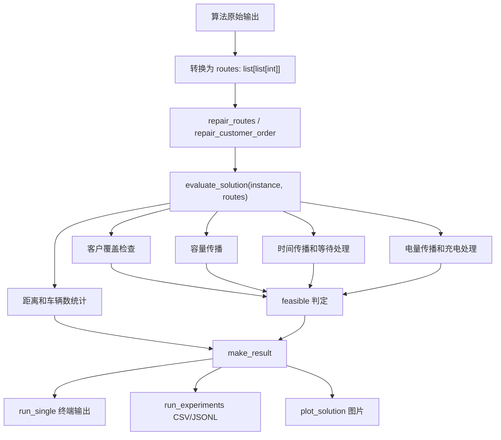
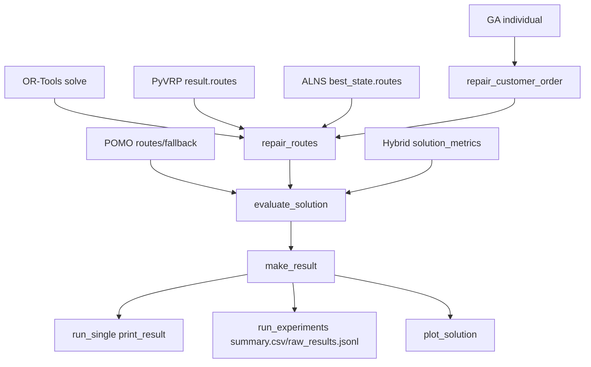
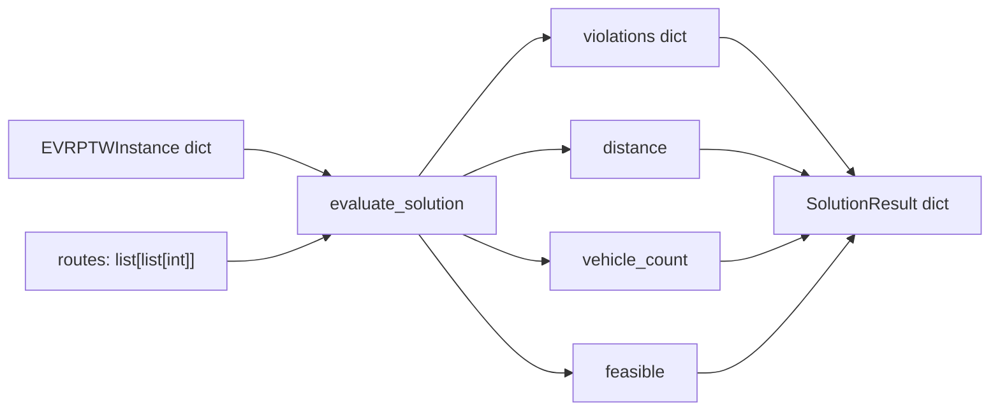

# evaluator_code_walkthrough.md

本文档只分析当前项目中的真实代码，不引入通用 VRP 知识来替代代码事实。目标是解释：不同算法输出的路线如何被统一评价，`feasible=True/False` 如何产生，总成本和各项指标之间是什么关系，以及结果如何导出到 CSV、JSONL 和图片。

本次重点读取的文件包括：

- `EVRPTW_Schneider2014/evaluator.py`
- `EVRPTW_Schneider2014/route_repair.py`
- `EVRPTW_Schneider2014/result_schema.py`
- `EVRPTW_Schneider2014/run_single.py`
- `EVRPTW_Schneider2014/run_experiments.py`
- `EVRPTW_Schneider2014/visualization.py`
- `EVRPTW_Schneider2014/solvers/solve_ortools.py`
- `EVRPTW_Schneider2014/solvers/solve_ga.py`
- `EVRPTW_Schneider2014/solvers/solve_pyvrp.py`
- `EVRPTW_Schneider2014/solvers/solve_alns.py`
- `EVRPTW_Schneider2014/solvers/solve_pomo.py`
- `EVRPTW_Schneider2014/solvers/common.py`
- `EVRPTW_Schneider2014/algorithms/hybrid_ga_alns/solution_adapter.py`
- `EVRPTW_Schneider2014/algorithms/hybrid_ga_alns/hybrid_solver.py`
- `EVRPTW_Schneider2014/algorithms/hybrid_ga_alns/run_experiment.py`
- `EVRPTW_Schneider2014/algorithms/hybrid_ga_alns/diagnostics.py`

---

# 1. Evaluator Entry Point

统一 evaluator 的核心入口是：

| 项目 | 内容 |
| -- | -- |
| 文件路径 | `EVRPTW_Schneider2014/evaluator.py` |
| 函数名 | `evaluate_solution(instance, routes)` |
| 输入实例 | `instance: dict`，包含 `depot/customers/stations/nodes/vehicle_capacity/battery_capacity/consumption_rate/recharge_rate` |
| 输入路线 | `routes: list[list[int]]`，例如 `[[21, 9, 36], [47, 27]]` |
| 返回结果 | `dict`，包含 `distance, vehicle_count, feasible, violations` |

核心返回结构示例：

```python
{
    "distance": 155.8546,
    "vehicle_count": 1,
    "feasible": False,
    "violations": {
        "capacity": 0.0,
        "time_window": 451.7311,
        "battery": 63.9526,
        "customer_coverage": 0.0,
    },
}
```

直接或间接调用它的主要模块：

| 调用位置 | 调用目的 |
| -- | -- |
| `solvers/solve_ortools.py:solve()` | OR-Tools 生成并 repair 后，统一复检 |
| `solvers/solve_ga.py:solve()` | GA 最优个体解码并 repair 后，统一复检 |
| `solvers/solve_pyvrp.py:solve()` | PyVRP 输出路线转换并 repair 后，统一复检 |
| `solvers/solve_alns.py:solve()` | ALNS 最优 state repair 后，统一复检 |
| `solvers/solve_pomo.py:solve()` | POMO 或 fallback 路线直接统一复检 |
| `route_repair.py:priority_objective()` | 计算 feasibility-first 目标函数 |
| `route_repair.py:_is_route_feasible()` | repair 内部判断单条路线是否容量、时间窗、电量可行 |
| `algorithms/hybrid_ga_alns/solution_adapter.py:solution_metrics()` | GA+ALNS 扩展指标的权威可行性来源 |
| `algorithms/hybrid_ga_alns/diagnostics.py` | 诊断种群、候选解和算子结果 |

结论：当前 evaluator 基本独立于 OR-Tools、GA、PyVRP、ALNS。各算法可以用不同方式产生路线，但最终都可以被转换为 `routes: list[list[int]]` 并交给 `evaluate_solution()` 检查。

---

# 2. Complete Evaluation Flow

真实流程如下：



重要事实：

1. `routes` 内部通常不写仓库 `0`，例如 `[21, 9, 36]`。evaluator 会自动按 `0 -> 21 -> 9 -> 36 -> 0` 计算。
2. 如果路线中出现充电站 id，evaluator 会把它当作充电节点。
3. 如果路线中出现未知节点 id，evaluator 会直接抛出 `KeyError`。
4. `feasible` 只由四个 violation 决定：`capacity/time_window/battery/customer_coverage`。
5. 当前基础 `summary.csv` 不输出 `total_cost/waiting_time/charging_time`；这些主要在 GA+ALNS 扩展实验中输出。

---

## `EVRPTW_Schneider2014/evaluator.py:evaluate_solution`

### 1. 谁调用它

主要被所有 solver 的最终结果生成阶段调用，也被 `route_repair.py` 和 GA+ALNS 的 `solution_metrics()` 调用。

### 2. 输入

```python
instance: dict
routes: list[list[int]]
```

示例：

```python
routes = [[21, 9, 36], [47, 27]]
```

含义是：

```text
Vehicle 1: 0 -> 21 -> 9 -> 36 -> 0
Vehicle 2: 0 -> 47 -> 27 -> 0
```

### 3. 输出

```python
{
    "distance": float,
    "vehicle_count": int,
    "feasible": bool,
    "violations": {
        "capacity": float,
        "time_window": float,
        "battery": float,
        "customer_coverage": float,
    },
}
```

### 4. 执行逻辑

核心代码片段：

```python
for route in routes:
    load = 0.0
    time = 0.0
    battery = float(instance["battery_capacity"])
    current_id = depot_id
    for node_id in route + [depot_id]:
        leg = _distance(current, nxt)
        distance += leg
        energy = leg * float(instance["consumption_rate"])
        if energy > battery:
            battery_violation += energy - battery
        battery -= energy
        time += leg
```

执行顺序：

1. 建立 `node_map/customer_ids/station_ids/depot_id`。
2. 对每条路线单独初始化载重、时间、电量。
3. 从仓库出发，依次访问 `route` 中节点，最后自动返回仓库。
4. 每走一段，累计距离。
5. 每走一段，按 `energy = distance * consumption_rate` 消耗电量。
6. 如果本段所需电量超过当前剩余电量，增加 `battery_violation`。
7. 如果访问客户：
   - 记录已服务客户；
   - 累加载重；
   - 早到则等待到 `ready_time`；
   - 晚到则增加 `time_window_violation`；
   - 增加服务时间。
8. 如果访问充电站或仓库：
   - 计算充到满电的电量；
   - 增加线性充电时间；
   - 电池恢复到满电。
9. 每条路线结束后检查车辆容量。
10. 全部路线结束后检查遗漏客户和重复客户。
11. 如果四类 violation 都小于等于 `1e-6`，则 `feasible=True`。

### 5. 对应的数学含义

| 数学/约束含义 | 代码实现 |
| -- | -- |
| 总距离 | 每段欧氏距离累加 |
| 电量消耗 | `energy = leg * consumption_rate` |
| 电量非负 | 若 `energy > battery`，记录 `battery_violation` |
| 线性充电 | `recharge_amount / recharge_rate` |
| 时间传播 | `time += leg`，客户处再加等待和服务时间 |
| 早到等待 | `if time < ready_time: time = ready_time` |
| 晚到违反 | `if time > due_time: violation += time - due_time` |
| 容量约束 | 路线总 demand 超过 vehicle_capacity 时记录违反 |
| 客户唯一服务 | 统计 missing 和 duplicate |
| 车辆数 | 非空路线条数 |

### 6. 三客户手算示例

假设：

```text
depot 0: (0, 0)
customer 1: (3, 0), demand=2, ready=0, due=100, service=5
customer 2: (6, 0), demand=2, ready=20, due=100, service=5
customer 3: (9, 0), demand=2, ready=0, due=100, service=5
station 1000: (4, 0)
vehicle_capacity = 10
battery_capacity = 10
consumption_rate = 1
recharge_rate = 2
routes = [[1, 2, 3]]
```

手算：

```text
0 -> 1: 距离 3，电量 10 -> 7，时间 3，服务后时间 8
1 -> 2: 距离 3，电量 7 -> 4，时间 11，早到 customer 2，等待到 20，服务后时间 25
2 -> 3: 距离 3，电量 4 -> 1，时间 28，服务后时间 33
3 -> 0: 距离 9，需要电量 9，但只剩 1，battery_violation += 8
```

输出中：

```text
distance = 18
capacity_violation = 0
time_window_violation = 0
battery_violation = 8
customer_coverage = 0
feasible = False
```

如果路线改为：

```python
routes = [[1, 1000, 2, 3]]
```

则在 `1000` 充电站处会补满电，battery violation 可能变为 0，但会增加充电时间，可能影响后续时间窗。

### 7. 风险点

| 风险 | 原因 |
| -- | -- |
| 路线起终点没有显式检查 | evaluator 默认每条 route 都从仓库出发并返回仓库 |
| route 中如果手动包含 `0` | 会被当作中途回仓并充电，可能改变时间和电量 |
| 只输出 violation，不输出到达时间轨迹 | 难以定位具体哪个客户导致时间窗违反 |
| 等待时间没有在基础 evaluator 返回 | 基础 CSV 看不到等待时间 |
| 最终返回仓库后的充电时间被加入 time | 但没有再检查 depot due time，可能影响解释一致性 |
| 充电站没有容量/排队约束 | 访问充电站只表示立即线性充满 |

---

## `EVRPTW_Schneider2014/evaluator.py:route_distance`

### 1. 谁调用它

主要被 `solvers/solve_alns.py:_worst_distance_removal()` 调用，用于估计移除客户后的距离节省。

### 2. 输入

```python
instance: dict
route: list[int]
```

示例：

```python
route_distance(instance, [21, 9, 36])
```

### 3. 输出

```python
float
```

表示 `0 -> 21 -> 9 -> 36 -> 0` 的欧氏距离总和。

### 4. 执行逻辑

```python
current = depot_id
for nxt in route + [depot_id]:
    total += _distance(node_map[current], node_map[nxt])
    current = nxt
```

它只计算距离，不计算容量、时间窗、电量和充电。

### 5. 对应的数学含义

欧氏路径长度：

```text
sum distance(i, j)
```

### 6. 三客户手算示例

若 `0=(0,0), 1=(3,0), 2=(6,0), 3=(9,0)`：

```python
route_distance(instance, [1, 2, 3])
```

结果：

```text
0->1 = 3
1->2 = 3
2->3 = 3
3->0 = 9
total = 18
```

### 7. 风险点

它不能代表完整 E-VRPTW 成本，因为它忽略等待、服务、充电、电量违反、时间窗违反和车辆数。

---

## `EVRPTW_Schneider2014/evaluator.py:_distance`

### 1. 谁调用它

被 `evaluate_solution()` 和 `route_distance()` 调用。

### 2. 输入

```python
left: dict
right: dict
```

每个节点至少包含：

```python
{"x": 10.0, "y": 20.0}
```

### 3. 输出

```python
float
```

### 4. 执行逻辑

```python
return math.hypot(float(left["x"]) - float(right["x"]), float(left["y"]) - float(right["y"]))
```

### 5. 对应的数学含义

二维欧氏距离：

```text
d(i,j) = sqrt((x_i - x_j)^2 + (y_i - y_j)^2)
```

### 6. 三客户手算示例

`(0,0)` 到 `(3,4)`：

```text
sqrt(3^2 + 4^2) = 5
```

### 7. 风险点

如果论文实验要求整数距离、截断距离或 Solomon 原始距离规则，这里当前代码使用的是浮点欧氏距离，可能与论文表格结果不完全一致。

---

## `EVRPTW_Schneider2014/route_repair.py:repair_routes`

### 1. 谁调用它

| 调用者 | 作用 |
| -- | -- |
| `solve_ortools.py:solve()` | 修复 OR-Tools 原始客户路线 |
| `solve_pyvrp.py:solve()` | 修复 PyVRP 原始客户路线 |
| `solve_alns.py:solve()` | 修复 ALNS 最终路线 |
| `solve_alns.py:EVRPTWState.objective()` | ALNS 每次算目标前修复 |
| `solution_adapter.py:routes_to_alns_state()` | Hybrid 转换 state 前修复 |
| `solution_adapter.py:alns_state_to_routes()` | Hybrid 从 ALNS state 回 routes 时修复 |

### 2. 输入

```python
instance: dict
routes: list[list[int]]
```

示例：

```python
routes = [[21, 9, 36, 21], [47, 1000, 27]]
```

### 3. 输出

```python
list[list[int]]
```

输出路线可能包含客户 id 和充电站 id，例如：

```python
[[21, 9, 1003, 36], [47, 27]]
```

### 4. 执行逻辑

核心代码：

```python
customer_ids = {customer["id"] for customer in instance["customers"]}
seen = set()
ordered_customers = []
for route in routes:
    for node in route:
        if node in customer_ids and node not in seen:
            ordered_customers.append(node)
            seen.add(node)
return _merge_routes(instance, _pack_customers(instance, ordered_customers))
```

执行顺序：

1. 只保留客户节点，忽略原路线中的仓库和充电站。
2. 删除重复客户，只保留第一次出现。
3. 得到一个总客户访问顺序 `ordered_customers`。
4. 调用 `_pack_customers()`，尝试把客户插入已有车辆路线。
5. 调用 `_merge_routes()`，尝试合并路线减少车辆数。

### 5. 对应的数学含义

它不是原始求解器的一部分，而是统一后处理修复器。它试图保证：

- 客户不重复；
- 客户不遗漏；
- 容量可行；
- 时间窗可行；
- 电量可行；
- 必要时插入充电站；
- 在可行前提下尽量合并路线。

### 6. 三客户手算示例

输入：

```python
routes = [[1, 2, 1], [1000, 3]]
```

假设客户集合是 `{1,2,3}`。

第一步只保留客户并去重：

```python
ordered_customers = [1, 2, 3]
```

之后 `_pack_customers()` 可能输出：

```python
[[1, 1000, 2], [3]]
```

如果 `[1, 1000, 2, 3]` 容量、时间窗、电量都可行，`_merge_routes()` 可能再合并为：

```python
[[1, 1000, 2, 3]]
```

### 7. 风险点

| 风险 | 说明 |
| -- | -- |
| 原算法插入的充电站会被丢弃 | 函数先只提取客户，旧充电站不会保留 |
| 原路线边界可能被改变 | `_pack_customers` 会重新分配车辆 |
| 客户顺序只保留第一次出现的全局顺序 | 多路线结构信息会被压平成一个顺序 |
| 可行性优先可能导致车辆数较多 | 插入失败时会新开路线 |

---

## `EVRPTW_Schneider2014/route_repair.py:repair_customer_order`

### 1. 谁调用它

GA 和 GA+ALNS 用它把一个客户排列解码为路线：

- `solvers/solve_ga.py:solve()`
- `algorithms/hybrid_ga_alns/solution_adapter.py:individual_to_routes()`

### 2. 输入

```python
customer_order: list[int]
```

示例：

```python
[36, 47, 27, 21, 9]
```

### 3. 输出

```python
list[list[int]]
```

例如：

```python
[[36, 47], [27, 21, 9]]
```

### 4. 执行逻辑

```python
return repair_routes(instance, [customer_order])
```

它本身不做复杂计算，只是把一维客户排列包装成单条候选路线，再交给 `repair_routes()`。

### 5. 对应的数学含义

GA individual 是一个客户排列，必须经过解码器才能变成多车辆路线。

### 6. 三客户手算示例

```python
customer_order = [2, 1, 3]
repair_customer_order(instance, customer_order)
```

等价于：

```python
repair_routes(instance, [[2, 1, 3]])
```

### 7. 风险点

如果 GA 排列本身重复或遗漏客户，`repair_routes()` 会删除重复，但不能凭空恢复未出现在排列中的客户。正常 GA 初始化和交叉变异应保持客户排列合法。

---

## `EVRPTW_Schneider2014/route_repair.py:priority_objective`

### 1. 谁调用它

| 调用者 | 作用 |
| -- | -- |
| `solve_ga.py:solve().evaluate()` | GA fitness |
| `solve_alns.py:EVRPTWState.objective()` | ALNS state objective |
| `hybrid_solver.py:_run_ga_search().evaluate()` | GA+ALNS 中 GA 阶段 fitness |
| `solution_adapter.py:solution_metrics()` | 扩展指标中同时记录 priority objective |
| `diagnostics.py` | 诊断候选解质量 |

### 2. 输入

```python
instance: dict
routes: list[list[int]]
```

### 3. 输出

```python
float
```

这是一个把可行性、车辆数、距离、等待和充电合并成一个数的目标函数。

### 4. 执行逻辑

核心代码：

```python
violation = (
    violations["customer_coverage"]
    + violations["capacity"]
    + violations["battery"]
    + violations["time_window"]
)
service_cost = _waiting_and_charging_cost(instance, routes)
return (
    1_000_000_000.0 * violation
    + 1_000_000.0 * evaluation["vehicle_count"]
    + 100.0 * evaluation["distance"]
    + service_cost
)
```

### 5. 对应的数学含义

当前项目的基础可行性优先目标：

```text
priority_objective =
    1,000,000,000 * total_violation
  + 1,000,000     * vehicle_count
  + 100           * distance
  + waiting_and_charging_cost
```

优先级解释：

1. 先消除约束违反。
2. 在可行解之间，强烈偏好更少车辆。
3. 在车辆数相同或接近时，比较距离。
4. 最后考虑等待和充电时间。

### 6. 三客户手算示例

方案 A：

```text
violation = 0
vehicle_count = 2
distance = 100
service_cost = 20
objective = 0 + 2,000,000 + 10,000 + 20 = 2,010,020
```

方案 B：

```text
violation = 1
vehicle_count = 1
distance = 50
service_cost = 0
objective = 1,000,000,000 + 1,000,000 + 5,000 = 1,001,005,000
```

虽然 B 车辆更少、距离更短，但因为不可行，目标值远差于 A。

### 7. 风险点

| 风险 | 说明 |
| -- | -- |
| 标量权重近似词典序，但不是严格数学词典序 | 如果 violation 是小数，权重大小会影响比较 |
| 车辆数权重很高 | 1 辆车约等于 10000 距离单位 |
| 基础 `summary.csv` 不输出该 objective | 只输出 distance 和 violations，读表时容易误解算法实际优化目标 |
| `_waiting_and_charging_cost` 与 hybrid 的 `_service_metrics` 都是额外统计 | 二者都不直接改变 `evaluate_solution()` 的 feasible 判定 |

---

## `EVRPTW_Schneider2014/route_repair.py:_waiting_and_charging_cost`

### 1. 谁调用它

只被 `priority_objective()` 调用。

### 2. 输入

```python
instance: dict
routes: list[list[int]]
```

### 3. 输出

```python
float
```

即：

```text
total_waiting + total_charging
```

### 4. 执行逻辑

1. 沿每条路线传播时间和电量。
2. 如果早到客户，累计等待时间。
3. 如果访问充电站，计算充满电时间并累计。
4. 返回等待时间和充电时间之和。

关键代码：

```python
if node_id in customer_ids:
    if time < ready:
        total_waiting += ready - time
        time = ready
elif node_id in station_ids:
    recharge_amount = max(0.0, battery_capacity - battery)
    charging_time = recharge_amount / recharge_rate
    total_charging += charging_time
```

### 5. 对应的数学含义

```text
service_cost = waiting_time + charging_time
```

### 6. 三客户手算示例

如果到客户 2 的时间是 11，但 `ready_time=20`：

```text
waiting_time += 20 - 11 = 9
```

如果到充电站时电量为 4，满电为 10，`recharge_rate=2`：

```text
charging_time += (10 - 4) / 2 = 3
```

### 7. 风险点

这里的充电时间只在 `node_id in station_ids` 时统计，不统计仓库节点充电；而 `evaluate_solution()` 在 `node_id in station_ids or node_id == depot_id` 时都会执行充电逻辑。这是一个评价解释上的不一致点。

---

## `EVRPTW_Schneider2014/result_schema.py:SolutionResult`

### 1. 谁调用它

由 `make_result()` 创建，各 solver 最终返回它的字典形式。

### 2. 输入

dataclass 字段：

```python
instance: str
method: str
routes: list[list[int]]
vehicle_count: int
distance: float
runtime_seconds: float
feasible: bool
violations: dict[str, float]
notes: str
```

### 3. 输出

`SolutionResult` 对象，调用 `to_dict()` 后变成普通 dict。

### 4. 执行逻辑

它是统一结果容器，不做算法计算。

### 5. 对应的数学含义

它保存最终评价指标，包括路线、车辆数、距离、可行性和违反量。

### 6. 三客户手算示例

```python
SolutionResult(
    instance="demo_3",
    method="ga",
    routes=[[1, 1000, 2], [3]],
    vehicle_count=2,
    distance=30.0,
    runtime_seconds=0.2,
    feasible=True,
    violations={"capacity": 0, "time_window": 0, "battery": 0, "customer_coverage": 0},
)
```

### 7. 风险点

它相信传入的 `evaluation`，不会自己重新计算。

---

## `EVRPTW_Schneider2014/result_schema.py:make_result`

### 1. 谁调用它

所有 solver：

- `solve_ortools.py:solve()`
- `solve_ga.py:solve()`
- `solve_pyvrp.py:solve()`
- `solve_alns.py:solve()`
- `solve_pomo.py:solve()`
- `algorithms/hybrid_ga_alns/hybrid_solver.py:solve()`

### 2. 输入

```python
instance: dict
method: str
routes: list[list[int]]
runtime_seconds: float
evaluation: dict
notes: str
```

### 3. 输出

```python
SolutionResult
```

多数 solver 随后调用：

```python
.to_dict()
```

### 4. 执行逻辑

核心代码：

```python
return SolutionResult(
    instance=instance["name"],
    method=method,
    routes=routes,
    vehicle_count=len([route for route in routes if route]),
    distance=float(evaluation["distance"]),
    runtime_seconds=float(runtime_seconds),
    feasible=bool(evaluation["feasible"]),
    violations=dict(evaluation["violations"]),
    notes=notes,
)
```

### 5. 对应的数学含义

它把 evaluator 的输出转成统一结果格式。车辆数在这里再次按非空路线数统计。

### 6. 三客户手算示例

如果：

```python
routes = [[1, 2], [3]]
evaluation["distance"] = 42.0
evaluation["feasible"] = True
```

则：

```python
vehicle_count = 2
distance = 42.0
feasible = True
```

### 7. 风险点

`make_result()` 不检查 `evaluation["vehicle_count"]` 与 `len(routes)` 是否一致，而是自己重新按非空路线统计。

---

## `EVRPTW_Schneider2014/run_single.py:format_route`

### 1. 谁调用它

- `run_single.py:print_result()`
- `run_experiments.py:_summary_row()`

### 2. 输入

```python
route: list[int]
```

示例：

```python
[21, 9, 36]
```

### 3. 输出

```python
str
```

示例：

```text
0 ---> 21 ---> 9 ---> 36 ---> 0
```

### 4. 执行逻辑

```python
nodes = [0, *route, 0]
return " ---> ".join(str(node) for node in nodes)
```

### 5. 对应的数学含义

它只是人类可读输出，不参与求解和评价。

### 6. 三客户手算示例

```python
format_route([1, 1000, 2])
```

输出：

```text
0 ---> 1 ---> 1000 ---> 2 ---> 0
```

### 7. 风险点

它固定用 `0` 作为仓库显示。如果未来 depot id 不是 0，显示会与真实实例不一致。

---

## `EVRPTW_Schneider2014/run_single.py:print_result`

### 1. 谁调用它

`run_single.py:main()`。

### 2. 输入

```python
result: dict
```

### 3. 输出

无返回值，直接打印到终端。

### 4. 执行逻辑

依次打印：

- instance
- method
- routes
- vehicle_count
- distance
- runtime_seconds
- feasible
- violations
- notes

### 5. 对应的数学含义

展示 evaluator 和 result schema 的最终结果。

### 6. 三客户手算示例

输入：

```python
{
    "instance": "demo_3",
    "method": "ga",
    "routes": [[1, 2, 3]],
    "vehicle_count": 1,
    "distance": 18,
    "runtime_seconds": 0.1,
    "feasible": False,
    "violations": {"battery": 8},
}
```

输出类似：

```text
instance: demo_3
method: ga
routes:
  Vehicle 1: 0 ---> 1 ---> 2 ---> 3 ---> 0
vehicle_count: 1
distance: 18
feasible: False
violations:
  battery: 8
```

### 7. 风险点

终端输出不会解释 violation 来自哪一段路线，只给总量。

---

## `EVRPTW_Schneider2014/run_experiments.py:_summary_row`

### 1. 谁调用它

`run_experiments.py:main()` 在每个方法运行结束后调用。

### 2. 输入

```python
instance: dict
result: dict
```

### 3. 输出

```python
dict
```

对应 `summary.csv` 的一行。

### 4. 执行逻辑

核心代码：

```python
return {
    "instance": instance["name"],
    "source_instance": instance["source_instance"],
    "customer_count": instance["customer_count"],
    "method": result["method"],
    "routes": " ; ".join(format_route(route) for route in result["routes"]),
    "vehicle_count": result["vehicle_count"],
    "distance": result["distance"],
    "runtime_seconds": result["runtime_seconds"],
    "feasible": result["feasible"],
    "capacity_violation": violations.get("capacity", 0.0),
    "time_window_violation": violations.get("time_window", 0.0),
    "battery_violation": violations.get("battery", 0.0),
    "customer_coverage_violation": violations.get("customer_coverage", 0.0),
}
```

### 5. 对应的数学含义

把统一结果展开成表格列，便于 Excel 对比。

### 6. 三客户手算示例

如果路线为：

```python
routes = [[1, 2], [3]]
```

CSV 中 `routes` 列为：

```text
0 ---> 1 ---> 2 ---> 0 ; 0 ---> 3 ---> 0
```

### 7. 风险点

基础 `summary.csv` 没有 `total_cost/waiting_time/charging_time/charging_count`，所以不能只看它判断完整综合成本。

---

## `EVRPTW_Schneider2014/run_experiments.py:main`

### 1. 谁调用它

命令行：

```powershell
python -m EVRPTW_Schneider2014.run_experiments --config configs/debug_small.yaml
```

### 2. 输入

命令行参数和配置文件。

### 3. 输出

- `EVRPTW_Schneider2014/results/raw_results.jsonl`
- `EVRPTW_Schneider2014/results/summary.csv`
- 可选图片输出到 `figures/`

### 4. 执行逻辑

1. 加载配置。
2. 遍历实例名和客户规模。
3. 调用 `build_instance()` 生成实例。
4. 保存 generated instance。
5. 遍历 `methods`。
6. 调用对应 solver。
7. 写入 raw JSONL。
8. 收集 summary row。
9. 可选画图。
10. 最后写入 `summary.csv`。

### 5. 对应的数学含义

它不是 evaluator 本身，而是批量实验调度器。

### 6. 三客户手算示例

若配置：

```yaml
instances: [R101]
customer_counts: [3]
methods: [ga, alns]
```

则会生成两行结果：

```text
R101_3_seed1987 | ga
R101_3_seed1987 | alns
```

### 7. 风险点

当前 `raw_results.jsonl` 和 `summary.csv` 使用 `"w"` 打开。也就是说，每次批量运行会覆盖上一次同名输出文件。

---

## `EVRPTW_Schneider2014/visualization.py:plot_solution`

### 1. 谁调用它

- `run_single.py:main()`，通过 `--save-plot` 或 `--show-plot`
- `run_experiments.py:main()`，通过 `--plot`

### 2. 输入

```python
instance: dict
result: dict | SolutionResult
show: bool
save_path: str | Path | None
```

### 3. 输出

```python
Path | None
```

如果提供 `save_path`，返回图片路径；否则返回 `None`。

### 4. 执行逻辑

1. 读取 `routes`。
2. 画所有节点：
   - depot：黑色方块；
   - station：绿色三角；
   - customer：蓝色圆点。
3. 对每条路线画折线：
   - `[depot_id] + route + [depot_id]`
4. 可保存 PNG。
5. 如果 `show=True`，调用 `plt.show()`。

### 5. 对应的数学含义

只做空间路径可视化，不参与可行性检查或成本计算。

### 6. 三客户手算示例

```python
plot_solution(instance, {"method": "ga", "routes": [[1, 1000, 2], [3]]}, show=True)
```

图上会显示两条车辆路线，`1000` 作为绿色三角充电站。

### 7. 风险点

图像只显示几何路线，不显示时间窗、电量曲线、等待时间和充电时长。因此一张看起来合理的图不代表解一定可行。

---

## `EVRPTW_Schneider2014/algorithms/hybrid_ga_alns/solution_adapter.py:solution_metrics`

### 1. 谁调用它

GA+ALNS 系列模块大量调用，包括：

- `hybrid_solver.py:solve()`
- `hybrid_solver.py:solve_basic_ga()`
- `hybrid_solver.py:solve_basic_alns()`
- `hybrid_solver.py:_is_better()`
- `candidate_selection.py`
- `local_search.py`
- `diagnostics.py`

### 2. 输入

```python
instance: dict[str, Any]
routes: list[list[int]]
```

### 3. 输出

```python
{
    "feasible": bool,
    "vehicle_count": int,
    "total_distance": float,
    "total_cost": float,
    "charging_count": int,
    "charging_time": float,
    "waiting_time": float,
    "violations": dict,
    "priority_objective": float,
}
```

### 4. 执行逻辑

核心代码：

```python
evaluation = evaluate_solution(instance, routes)
service = _service_metrics(instance, routes)
violation_sum = sum(float(value) for value in evaluation["violations"].values())
total_cost = (
    float(evaluation["distance"])
    + service["waiting_time"]
    + service["charging_time"]
    + 1_000_000.0 * violation_sum
)
```

执行顺序：

1. 先用 `evaluate_solution()` 获得权威可行性、距离、车辆数和 violations。
2. 再用 `_service_metrics()` 额外统计等待、充电次数、充电时间。
3. 把 `distance + waiting_time + charging_time + 1e6 * violation_sum` 作为 GA+ALNS 扩展实验的 `total_cost`。
4. 同时记录 `priority_objective()`，用于对照基础目标函数。

### 5. 对应的数学含义

GA+ALNS 扩展成本：

```text
total_cost =
    distance
  + waiting_time
  + charging_time
  + 1,000,000 * total_violation
```

注意：这里的 `total_cost` 没有直接把车辆数加入加权和；车辆数在 `_is_better()` 中作为词典序比较的第二优先级。

### 6. 三客户手算示例

若：

```text
distance = 100
waiting_time = 20
charging_time = 10
violation_sum = 0
```

则：

```text
total_cost = 100 + 20 + 10 = 130
```

如果同一解有 `battery_violation=0.5`：

```text
total_cost = 100 + 20 + 10 + 1,000,000 * 0.5 = 500,130
```

### 7. 风险点

| 风险 | 说明 |
| -- | -- |
| 与 `priority_objective()` 不是同一个公式 | 基础 GA/ALNS fitness 用 `priority_objective`，GA+ALNS 报告 `total_cost` |
| 车辆数不在 `total_cost` 内 | 车辆数通过 `_is_better()` 单独比较 |
| `_service_metrics()` 只统计充电站充电 | 不统计 depot 充电 |
| 等待/充电统计不影响基础 `feasible` | 它们是成本项，不是 violation |

---

## `EVRPTW_Schneider2014/algorithms/hybrid_ga_alns/solution_adapter.py:_service_metrics`

### 1. 谁调用它

只被 `solution_metrics()` 调用。

### 2. 输入

```python
instance: dict
routes: list[list[int]]
```

### 3. 输出

```python
{
    "charging_count": float,
    "charging_time": float,
    "waiting_time": float,
}
```

### 4. 执行逻辑

1. 对每条路线从 depot 开始传播。
2. 到客户早到则增加 `waiting_time`。
3. 到客户后增加 service time。
4. 到充电站则增加 `charging_count`，并按线性公式计算 `charging_time`。
5. 返回三个服务指标。

### 5. 对应的数学含义

```text
waiting_time = sum max(0, ready_i - arrival_i)
charging_time = sum (battery_capacity - battery_at_station) / recharge_rate
charging_count = number of station visits
```

### 6. 三客户手算示例

路线：

```text
0 -> 1 -> 1000 -> 2 -> 0
```

若到 `1000` 时电量从 10 降到 4，则：

```text
charging_count += 1
charging_time += (10 - 4) / recharge_rate
```

### 7. 风险点

这个函数不负责 feasibility，只负责扩展指标。因此如果路线本身电量已经为负，它也会继续计算服务指标。

---

## `EVRPTW_Schneider2014/algorithms/hybrid_ga_alns/hybrid_solver.py:_is_better`

### 1. 谁调用它

`hybrid_solver.py:solve()` 和嵌入式 ALNS 改进流程中用于比较候选解与当前最好解。

### 2. 输入

```python
candidate: dict[str, Any]
incumbent: dict[str, Any]
```

通常来自 `solution_metrics()`。

### 3. 输出

```python
bool
```

### 4. 执行逻辑

核心代码：

```python
if bool(candidate["feasible"]) != bool(incumbent["feasible"]):
    return bool(candidate["feasible"])
return (
    candidate["vehicle_count"],
    candidate["total_cost"],
    candidate["total_distance"],
) < (
    incumbent["vehicle_count"],
    incumbent["total_cost"],
    incumbent["total_distance"],
)
```

比较规则：

1. 可行解优先于不可行解。
2. 如果可行性相同，车辆数更少优先。
3. 如果车辆数相同，`total_cost` 更低优先。
4. 如果 `total_cost` 相同，距离更短优先。

### 5. 对应的数学含义

这是词典序比较，不是简单加权和：

```text
minimize lexicographically:
    feasible first,
    vehicle_count,
    total_cost,
    total_distance
```

### 6. 三客户手算示例

方案 A：

```text
feasible=True, vehicle_count=2, total_cost=100
```

方案 B：

```text
feasible=True, vehicle_count=1, total_cost=200
```

`_is_better(B, A)` 返回 `True`，因为车辆数优先于成本。

### 7. 风险点

如果研究目标更偏向总距离，而不是车辆数，则当前比较规则可能会选择“车辆更少但距离明显更长”的解。

---

## `EVRPTW_Schneider2014/algorithms/hybrid_ga_alns/run_experiment.py:_write_summary`

### 1. 谁调用它

`run_experiment.py:main()`。

### 2. 输入

```python
path: Path
results: list[dict]
```

### 3. 输出

写出 CSV 文件，默认：

```text
results/hybrid_ga_alns_summary.csv
```

### 4. 执行逻辑

写入字段：

```python
fields = [
    "instance",
    "method",
    "hybrid_mode",
    "feasible",
    "vehicle_count",
    "total_distance",
    "total_cost",
    "charging_count",
    "charging_time",
    "waiting_time",
    "runtime",
    "ga_best_value",
    "alns_improved_value",
    "improvement_percentage",
]
```

### 5. 对应的数学含义

这是 GA+ALNS 实验的扩展结果表，比基础 `summary.csv` 多了成本、充电和等待指标。

### 6. 三客户手算示例

一行可能是：

```text
demo_3, ga_alns, post_processing, True, 2, 42.0, 55.0, 1, 5.0, 8.0, 2.1, 60.0, 55.0, 8.33
```

### 7. 风险点

该表只服务 GA+ALNS 实验框架，不是基础四方法批量实验的默认输出。

---

# 3. Feasibility Rules

| 约束 | 数学/自然语言定义 | 检查文件 | 检查函数 | 违反时的处理 |
| -- | -- | -- | -- | -- |
| 每个客户恰好服务一次 | 每个 customer id 必须出现一次且只能出现一次 | `evaluator.py` | `evaluate_solution()` | `customer_coverage_violation = missing + duplicate_count` |
| 路线从仓库出发并返回 | 每条路线默认按 depot -> route -> depot 计算 | `evaluator.py` | `evaluate_solution()` | 没有显式 violation；代码自动补 depot |
| 车辆容量 | 每条路线客户 demand 总和不超过 `vehicle_capacity` | `evaluator.py` | `evaluate_solution()` | 超出部分计入 `capacity_violation` |
| 时间窗 | 到达客户时间不能超过 `due_time` | `evaluator.py` | `evaluate_solution()` | 晚到量计入 `time_window_violation` |
| 等待 | 早到客户可以等待到 `ready_time` | `evaluator.py` | `evaluate_solution()` | 不算违反，只更新时间 |
| 电量非负 | 每段行驶所需电量不能超过当前电量 | `evaluator.py` | `evaluate_solution()` | 不足量计入 `battery_violation` |
| 充电站访问 | 访问 station 或 depot 时恢复满电 | `evaluator.py` | `evaluate_solution()` | 不可达时由 battery violation 表示；未知 id 抛 `KeyError` |
| 最大车辆数 | 当前基础 evaluator 没有硬约束 | 无 | 无 | 只统计 `vehicle_count`，不作为 feasible 条件 |
| 充电站容量/排队 | 当前未建模 | 无 | 无 | 不检查 |
| 车辆类型差异 | 当前基础 evaluator 未区分不同车辆类型 | 无 | 无 | 不检查 |
| 无人机同步 | 当前未建模 | 无 | 无 | 不检查 |

`feasible` 的真实判定代码：

```python
feasible = all(value <= 1e-6 for value in violations.values())
```

也就是说，只有以下四项全部为 0 或近似 0，才是可行：

```text
capacity_violation
time_window_violation
battery_violation
customer_coverage_violation
```

---

# 4. Objective Function

当前项目中至少存在三类“目标/成本”概念，需要分开理解。

## 4.1 基础 evaluator 不计算 total_cost

`evaluate_solution()` 返回：

```text
distance
vehicle_count
feasible
violations
```

它不返回：

```text
total_cost
waiting_time
charging_time
charging_count
```

因此基础 `summary.csv` 中的 `distance` 不是完整目标函数，只是距离指标。

## 4.2 `priority_objective()`：GA 和 ALNS 的主要优化目标

文件：

```text
EVRPTW_Schneider2014/route_repair.py
```

真实公式：

```text
priority_objective =
    1,000,000,000 * (
        customer_coverage_violation
      + capacity_violation
      + battery_violation
      + time_window_violation
    )
  + 1,000,000 * vehicle_count
  + 100 * distance
  + waiting_and_charging_cost
```

含义：

| 项 | 权重 | 作用 |
| -- | -- | -- |
| total violation | `1_000_000_000` | 最高优先级，强制先可行 |
| vehicle_count | `1_000_000` | 强烈压低车辆数 |
| distance | `100` | 车辆数之后优化距离 |
| waiting + charging | `1` | 最后优化等待和充电 |

为什么某些解车辆很多但仍然被认为较优：

1. 如果少车方案有约束违反，多车方案可行，则多车方案会被优先选择。
2. `violation` 权重是 `1e9`，远大于车辆数和距离。
3. 在“可行性优先”的研究目标下，车辆多但 violation 为 0 的解通常比车辆少但不可行的解更好。

## 4.3 `solution_metrics()`：GA+ALNS 扩展实验的 total_cost

文件：

```text
EVRPTW_Schneider2014/algorithms/hybrid_ga_alns/solution_adapter.py
```

真实公式：

```text
total_cost =
    distance
  + waiting_time
  + charging_time
  + 1,000,000 * violation_sum
```

这里没有把 `vehicle_count` 直接放进 `total_cost`。GA+ALNS 的比较函数 `_is_better()` 使用词典序：

```text
1. feasible=True 优先
2. vehicle_count 更少优先
3. total_cost 更低优先
4. total_distance 更短优先
```

## 4.4 不同算法是否使用同一目标函数

| 方法 | 算法内部优化目标 | 最终统一评价 | 是否完全一致 |
| -- | -- | -- | -- |
| OR-Tools | OR-Tools arc cost + capacity/time dimension | `evaluate_solution()` | 不完全一致 |
| GA | `priority_objective()` | `evaluate_solution()` + `make_result()` | 可行性同源，但 CSV 不输出 objective |
| PyVRP | PyVRP 内部 distance/duration/VRPTW 目标 | `evaluate_solution()` | 不完全一致 |
| ALNS | `EVRPTWState.objective()`，内部调用 `priority_objective()` | `evaluate_solution()` + `make_result()` | 接近一致 |
| POMO | POMO subprocess 或 nearest-neighbor fallback | `evaluate_solution()` | 不完全一致 |
| GA+ALNS | `priority_objective()` + `solution_metrics()` + `_is_better()` | `solution_metrics()` + `make_result()` | 扩展指标与基础 objective 不完全相同 |

结论：当前 evaluator 对各算法最终结果是统一的，但各算法“搜索过程中实际优化的目标”并不完全一致。

---

# 5. Algorithm Output Adapters

| 方法 | 原始输出格式 | 转换函数 | 统一格式 | 可能丢失的信息 |
| -- | -- | -- | -- | -- |
| OR-Tools | `RoutingModel` solution assignment | `solve_ortools.py:solve()` 中遍历 `routing.NextVar()` 提取客户 id，然后 `repair_routes()` | `routes: list[list[int]]` | OR-Tools 内部 cumul 时间、车辆索引细节、原始未 repair 路线 |
| GA | individual，即客户排列 `list[int]` | `repair_customer_order()` | `routes: list[list[int]]` | 个体只表达客户顺序，不保存到达时间、电量、充电记录 |
| PyVRP | `result.best.routes()` | `_solve_pyvrp()` 中 `route.visits()` 映射回客户 id，然后 `repair_routes()` | `routes: list[list[int]]` | PyVRP 内部路线对象、原始目标值、内部时间信息 |
| ALNS | `EVRPTWState(instance, routes, unassigned)` | `repair_routes(instance, best.routes)` | `routes: list[list[int]]` | destroy/repair 历史、unassigned 变化过程、接受历史 |
| POMO | subprocess 输出 `routes.json` 或 nearest-neighbor fallback | `_run_pomo_subprocess()` 或 `nearest_neighbor_routes()` | `routes: list[list[int]]` | POMO 原模型策略概率、训练模型内部信息；当前不做统一 charging repair |
| GA+ALNS | GA individual、ALNS state、candidate metrics | `individual_to_routes()`, `routes_to_alns_state()`, `alns_state_to_routes()`, `solution_metrics()` | `routes + extended metrics` | 转换时通常丢失到达时间、电量状态、等待细节；这些由 evaluator 重新计算 |

## OR-Tools 输出转换

文件：

```text
EVRPTW_Schneider2014/solvers/solve_ortools.py
```

流程：

```text
RoutingModel solution
-> 遍历每辆车路径
-> 转换 routing index 为 node index
-> 转换 node index 为 Solomon/customer id
-> routes
-> repair_routes
-> evaluate_solution
-> make_result
```

关键事实：

- OR-Tools 内部建模了容量和时间窗。
- 充电站不在 OR-Tools 节点集合中。
- 电量和充电主要依赖 `repair_routes()` 和 `evaluate_solution()`。

## GA 输出转换

文件：

```text
EVRPTW_Schneider2014/solvers/solve_ga.py
```

流程：

```text
individual: [36, 47, 27, 21, 9]
-> repair_customer_order
-> repair_routes
-> routes
-> evaluate_solution
-> make_result
```

关键事实：

- GA individual 只是一维客户排列。
- 车辆划分、充电站插入、可行性修复都在解码阶段完成。

## PyVRP 输出转换

文件：

```text
EVRPTW_Schneider2014/solvers/solve_pyvrp.py
```

流程：

```text
PyVRP Model
-> result.best
-> solution.routes()
-> route.visits()
-> name_by_client 映射为项目 customer id
-> repair_routes
-> evaluate_solution
-> make_result
```

关键事实：

- PyVRP 当前模型包含 depot 和 customers。
- 当前没有把 charging stations 建成 PyVRP 可访问节点。
- 电池和充电依赖外部 repair/evaluator。

## ALNS 输出转换

文件：

```text
EVRPTW_Schneider2014/solvers/solve_alns.py
```

流程：

```text
nearest_neighbor_routes
-> repair_routes
-> EVRPTWState
-> ALNS destroy/repair
-> best_state.routes
-> repair_routes
-> evaluate_solution
-> make_result
```

关键事实：

- ALNS state 保存 `routes` 和 `unassigned`。
- 每次 objective 会对路线 repair 后再用 `priority_objective()`。
- 最终仍会再次 `repair_routes()`。

## POMO 输出转换

文件：

```text
EVRPTW_Schneider2014/solvers/solve_pomo.py
```

流程：

```text
try POMO subprocess
-> routes.json
-> evaluate_solution
-> make_result
```

失败时：

```text
nearest_neighbor_routes
-> evaluate_solution
-> make_result
```

关键事实：

- 当前 POMO adapter 没有调用 `repair_routes()`。
- 因此它更像 CVRP/POMO baseline 或 fallback，不是严格 E-VRPTW solver。

## GA+ALNS 输出转换

文件：

```text
EVRPTW_Schneider2014/algorithms/hybrid_ga_alns/solution_adapter.py
EVRPTW_Schneider2014/algorithms/hybrid_ga_alns/hybrid_solver.py
```

流程：

```text
GA individual
-> individual_to_routes()
-> routes_to_alns_state()
-> ALNS destroy/repair
-> alns_state_to_routes()
-> solution_metrics()
-> _is_better()
-> make_result()
```

关键事实：

- `evaluate_solution()` 仍是 feasibility 的权威来源。
- `solution_metrics()` 额外补充 `total_cost/charging_count/charging_time/waiting_time`。
- `_is_better()` 采用可行性、车辆数、成本、距离的词典序比较。

---

# 6. Final Summary

## 6.1 evaluator 调用流程图



## 6.2 solution 数据结构图



统一 `routes` 示例：

```python
[
    [21, 9, 1003, 36],
    [47, 27],
]
```

含义：

```text
Vehicle 1: depot -> 21 -> 9 -> station 1003 -> 36 -> depot
Vehicle 2: depot -> 47 -> 27 -> depot
```

## 6.3 所有评价指标及来源表

| 指标 | 来源文件 | 来源函数 | 是否基础 summary.csv 输出 | 是否 hybrid summary 输出 |
| -- | -- | -- | -- | -- |
| `distance` | `evaluator.py` | `evaluate_solution()` | 是 | 作为 `total_distance` |
| `vehicle_count` | `evaluator.py/result_schema.py` | `evaluate_solution()/make_result()` | 是 | 是 |
| `feasible` | `evaluator.py` | `evaluate_solution()` | 是 | 是 |
| `capacity_violation` | `evaluator.py` | `evaluate_solution()` | 是 | violations 内 |
| `time_window_violation` | `evaluator.py` | `evaluate_solution()` | 是 | violations 内 |
| `battery_violation` | `evaluator.py` | `evaluate_solution()` | 是 | violations 内 |
| `customer_coverage_violation` | `evaluator.py` | `evaluate_solution()` | 是 | violations 内 |
| `waiting_time` | `solution_adapter.py` | `_service_metrics()` | 否 | 是 |
| `charging_time` | `solution_adapter.py` | `_service_metrics()` | 否 | 是 |
| `charging_count` | `solution_adapter.py` | `_service_metrics()` | 否 | 是 |
| `total_cost` | `solution_adapter.py` | `solution_metrics()` | 否 | 是 |
| `priority_objective` | `route_repair.py` | `priority_objective()` | 否 | 诊断中可能出现 |
| `runtime_seconds` | 各 solver | `perf_counter()` 差值 | 是 | 是 |

## 6.4 所有约束及代码位置表

| 约束 | 代码位置 | 说明 |
| -- | -- | -- |
| 客户覆盖 | `evaluator.py:evaluate_solution()` | `missing + duplicate_count` |
| 容量 | `evaluator.py:evaluate_solution()` | 每条路线 load 超容量 |
| 时间窗 | `evaluator.py:evaluate_solution()` | 客户到达晚于 due time |
| 等待 | `evaluator.py:evaluate_solution()` | 早到等待，不算 violation |
| 电量 | `evaluator.py:evaluate_solution()` | 单段能耗超过当前电量 |
| 充电 | `evaluator.py:evaluate_solution()` | station 或 depot 处线性充满 |
| 充电插入 | `route_repair.py:_repair_energy()` | 电量不足时尝试插入可达充电站 |
| 路线合并 | `route_repair.py:_merge_routes()` | 只接受合并后单路线可行的结果 |
| 车辆数偏好 | `route_repair.py:priority_objective()` | `1_000_000 * vehicle_count` |
| Hybrid 车辆数比较 | `hybrid_solver.py:_is_better()` | 车辆数是可行性之后的第一比较项 |

## 6.5 最值得优先读懂的 10 个评价函数

1. `EVRPTW_Schneider2014/evaluator.py:evaluate_solution`
2. `EVRPTW_Schneider2014/evaluator.py:route_distance`
3. `EVRPTW_Schneider2014/route_repair.py:repair_routes`
4. `EVRPTW_Schneider2014/route_repair.py:repair_customer_order`
5. `EVRPTW_Schneider2014/route_repair.py:priority_objective`
6. `EVRPTW_Schneider2014/route_repair.py:_repair_energy`
7. `EVRPTW_Schneider2014/route_repair.py:_is_route_feasible`
8. `EVRPTW_Schneider2014/result_schema.py:make_result`
9. `EVRPTW_Schneider2014/algorithms/hybrid_ga_alns/solution_adapter.py:solution_metrics`
10. `EVRPTW_Schneider2014/algorithms/hybrid_ga_alns/hybrid_solver.py:_is_better`

## 6.6 当前 evaluator 可能存在的 5 个最大风险

| 风险 | 影响 |
| -- | -- |
| 基础 evaluator 不返回等待时间和充电时间 | 基础四方法 summary 中无法直接分析服务成本 |
| 基础 `priority_objective` 和 Hybrid `total_cost` 不是同一公式 | 不同实验表之间不能直接混用成本列 |
| 路线起终点由 evaluator 自动假设 | 如果某算法输出包含 depot，可能被解释为中途回仓充电 |
| POMO adapter 不调用 `repair_routes()` | POMO 与其他方法的 E-VRPTW 修复程度不一致 |
| depot 充电处理在不同统计函数中不完全一致 | `evaluate_solution()` 会在 depot 充电，`_service_metrics()` 和 `_waiting_and_charging_cost()` 主要统计 station 充电 |

---

# 7. 简短结论

当前项目的统一评价核心是 `evaluate_solution(instance, routes)`。它独立于各算法，只要求算法最终给出统一的 `routes: list[list[int]]`。基础可行性由四类 violation 决定：容量、时间窗、电量、客户覆盖。车辆数不是硬可行性约束，但在 `priority_objective()` 和 GA+ALNS 的 `_is_better()` 中具有很高优先级。

因此，读实验结果时要分清：

1. `feasible=False` 表示至少一种 violation 非零。
2. `distance` 不是完整总成本。
3. 基础四方法的 `summary.csv` 与 GA+ALNS 的 `hybrid_ga_alns_summary.csv` 指标不同。
4. 当前 OR-Tools、GA、PyVRP、ALNS 最终都能被统一 evaluator 检查，但它们搜索过程中知道的约束并不完全一样。
5. 如果后续研究无人机、同步、非线性充电，必须扩展 evaluator、repair 和各算法 adapter，否则算法可能仍只是在求普通 VRPTW/CVRP 后再做事后检查。
