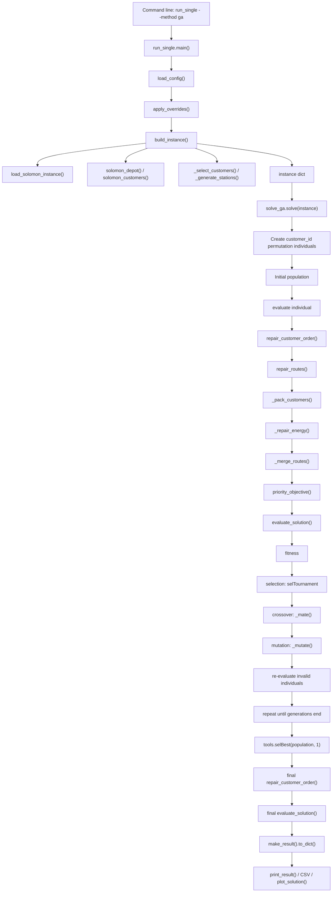
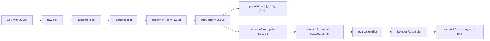

# Basic GA Code Walkthrough

本文档面向零基础读者，按真实调用顺序解释当前项目中 Basic GA 是如何完成一次 E-VRPTW 求解的。

重点模块：

```text
EVRPTW_Schneider2014/run_single.py
EVRPTW_Schneider2014/run_experiments.py
EVRPTW_Schneider2014/data_loader.py
EVRPTW_Schneider2014/instance_builder.py
EVRPTW_Schneider2014/solvers/solve_ga.py
EVRPTW_Schneider2014/route_repair.py
EVRPTW_Schneider2014/evaluator.py
EVRPTW_Schneider2014/result_schema.py
EVRPTW_Schneider2014/visualization.py
```

一句话理解 Basic GA：

```text
先把 Solomon 数据变成 E-VRPTW 实例
-> GA 随机生成很多客户访问顺序
-> 每个顺序先修复成 routes
-> 用统一 evaluator 计算可行性和成本
-> 通过选择、交叉、变异不断产生新顺序
-> 最后取最后一代中 fitness 最好的 individual
-> 再修复成 routes
-> 输出结果、CSV 和路线图
```

注意：当前 Basic GA 没有显式 elitism，也就是没有保证历史最优个体一定被保留到下一代。

---

# 0. True Call Order

如果你运行单个 GA：

```powershell
.\.venv\Scripts\python.exe -m EVRPTW_Schneider2014.run_single --instance R101 --customers 10 --method ga --show-plot
```

真实调用顺序是：

```text
run_single.main()
-> load_config()
-> apply_overrides()
-> build_instance()
   -> load_solomon_instance()
   -> solomon_depot()
   -> solomon_customers()
   -> _select_customers()
   -> _generate_stations()
   -> _estimate_battery_capacity()
-> save_instance()
-> SOLVERS["ga"]
-> solve_ga.solve()
   -> create individual type
   -> create toolbox
   -> create initial population
   -> evaluate each individual
      -> repair_customer_order()
         -> repair_routes()
            -> _pack_customers()
            -> _repair_energy()
            -> _merge_routes()
      -> priority_objective()
         -> evaluate_solution()
   -> repeat generations
      -> selection
      -> crossover
      -> mutation
      -> re-evaluate invalid individuals
   -> tools.selBest()
   -> repair_customer_order()
   -> evaluate_solution()
   -> make_result()
-> print_result()
-> plot_solution() if requested
```

如果你运行批量 GA：

```powershell
.\.venv\Scripts\python.exe -m EVRPTW_Schneider2014.run_experiments --method ga --plot
```

额外会经过：

```text
run_experiments.main()
-> _summary_row()
-> write raw_results.jsonl
-> write summary.csv
-> plot_solution()
```

---

## `EVRPTW_Schneider2014/run_single.py`: `main()`

### 1. 谁调用它

由命令行直接调用。例如：

```powershell
python -m EVRPTW_Schneider2014.run_single --instance R101 --customers 10 --method ga
```

### 2. 输入

来自命令行参数：

| 参数 | 类型 | 示例 |
|---|---|---|
| `--config` | `str` | `"configs/debug_small.yaml"` |
| `--instance` | `str` | `"R101"` |
| `--customers` | `int` | `10` |
| `--method` | `str` | `"ga"` |
| `--seed` | `int` | `1987` |
| `--instance-file` | `str` | `"generated_instances/R101_10_seed1987.json"` |
| `--save-plot` | `str` | `"figures/R101_10_ga.png"` |
| `--show-plot` | `bool` | `True` |

### 3. 输出

没有显式返回值，主要产生：

```text
终端输出 result
可选保存 generated_instances/*.json
可选保存 figures/*.png
```

### 4. 核心代码逻辑

关键代码片段：

```python
config = apply_overrides(load_config(args.config), args)
...
instance = build_instance(config, source_instance, customer_count)
save_instance(instance, output_dir)

result = SOLVERS[args.method](instance)
print_result(result)
```

执行顺序：

1. 读取配置文件。
2. 用命令行参数覆盖配置，例如 `--instance R101`。
3. 如果指定 `--instance-file`，直接读取已有实例。
4. 否则调用 `build_instance()` 生成新实例。
5. 根据 `--method ga` 从 `SOLVERS` 字典中找到 GA 求解器。
6. 调用 `solve_ga.solve(instance)`。
7. 打印结果。
8. 如果需要画图，调用 `plot_solution()`。

### 5. 对应的 GA 概念

这是 GA 的外部入口，不属于 GA 内部操作。它负责把数据交给 GA。

### 6. 对应的问题约束

本函数本身不直接处理约束，但它决定后续使用哪个数据、多少客户、哪个算法。

| 约束 | 是否处理 |
|---|---|
| 客户唯一服务 | 否 |
| 车辆容量 | 否 |
| 时间窗 | 否 |
| 电量 | 否 |
| 充电站 | 否 |
| 最大车辆数 | 否 |
| 路线起终点 | 否 |

### 7. 三客户示例

输入命令：

```powershell
python -m EVRPTW_Schneider2014.run_single --instance R101 --customers 3 --method ga
```

处理前：

```text
只有命令行参数：R101, 3 customers, ga
```

处理后：

```python
instance = {
    "name": "R101_3_seed1987",
    "customers": [{"id": 9}, {"id": 21}, {"id": 36}],
    "stations": [{"id": 1000}, ...],
    ...
}
result = solve_ga.solve(instance)
```

### 8. 风险点

| 风险 | 位置 |
|---|---|
| 选择了错误 method | `SOLVERS[args.method]` |
| 配置文件路径错误 | `load_config(args.config)` |
| 数据集文件不存在 | `build_instance()` 内部 |
| 画图路径不存在 | `plot_solution()` 内部会创建目录 |

---

## `EVRPTW_Schneider2014/config.py`: `load_config()`

### 1. 谁调用它

`run_single.main()` 和 `run_experiments.main()` 调用它。

### 2. 输入

| 参数 | 类型 | 示例 |
|---|---|---|
| `path` | `str | Path` | `"configs/debug_small.yaml"` |

### 3. 输出

返回 `dict[str, Any]`。

示例：

```python
{
    "dataset_dir": "D:/学习/FURP/VRP_project/datasets/solomon/json",
    "instances": ["R101", "C101", "RC101"],
    "customer_counts": [5, 10],
    "station_count": 21,
    "seed": 1987,
    ...
}
```

### 4. 核心代码逻辑

关键代码：

```python
config_path = Path(path)
if not config_path.is_absolute():
    config_path = ROOT / config_path
return _parse_simple_yaml(config_path.read_text(encoding="utf-8"))
```

执行顺序：

1. 把字符串路径转换成 `Path`。
2. 如果不是绝对路径，就拼接到 `EVRPTW_Schneider2014` 目录下。
3. 读取 YAML 文本。
4. 用项目自带的 `_parse_simple_yaml()` 解析配置。

### 5. 对应的 GA 概念

属于实验配置，不是遗传算法内部步骤。

### 6. 对应的问题约束

间接决定约束参数，例如客户数量、充电站数量、电池参数策略。

| 约束 | 是否处理 |
|---|---|
| 客户唯一服务 | 否 |
| 车辆容量 | 间接 |
| 时间窗 | 间接 |
| 电量 | 间接 |
| 充电站 | 间接 |
| 最大车辆数 | 否 |
| 路线起终点 | 否 |

### 7. 三客户示例

处理前：

```yaml
instances:
  - R101
customer_counts:
  - 3
```

处理后：

```python
config["instances"] == ["R101"]
config["customer_counts"] == [3]
```

### 8. 风险点

| 风险 | 说明 |
|---|---|
| 配置缩进错误 | `_parse_simple_yaml()` 只支持简单 YAML |
| 路径错误 | 后续 `load_solomon_instance()` 会失败 |
| 参数理解错误 | 例如 seed 会影响客户抽样和充电站生成 |

---

## `EVRPTW_Schneider2014/config.py`: `apply_overrides()`

### 1. 谁调用它

`run_single.main()` 和 `run_experiments.main()`。

### 2. 输入

| 参数 | 类型 | 示例 |
|---|---|---|
| `config` | `dict` | 从 `load_config()` 得到 |
| `args` | `argparse.Namespace` | 命令行参数 |

### 3. 输出

返回更新后的配置字典。

示例：

```python
updated["instances"] = ["R101"]
updated["customer_counts"] = [3]
updated["methods"] = ["ga"]
```

### 4. 核心代码逻辑

关键代码：

```python
if getattr(args, "instance", None):
    updated["instances"] = [args.instance]
if getattr(args, "customers", None):
    updated["customer_counts"] = [args.customers]
if getattr(args, "method", None):
    updated["methods"] = [args.method]
```

命令行参数优先级高于配置文件。

### 5. 对应的 GA 概念

实验配置，不是 GA 内部操作。

### 6. 对应的问题约束

间接影响数据规模和实验对象。

### 7. 三客户示例

配置文件里原本是：

```python
config["customer_counts"] = [5, 10]
```

命令行传入：

```powershell
--customers 3
```

处理后：

```python
config["customer_counts"] = [3]
```

### 8. 风险点

| 风险 | 说明 |
|---|---|
| 命令行覆盖配置导致实验数据变了 | 例如配置里是 10 客户，但命令行传了 3 |
| seed 被覆盖 | 可能导致生成实例不同 |

---

## `EVRPTW_Schneider2014/instance_builder.py`: `build_instance()`

### 1. 谁调用它

`run_single.main()` 和 `run_experiments.main()` 调用它。

### 2. 输入

| 参数 | 类型 | 示例 |
|---|---|---|
| `config` | `dict` | 配置字典 |
| `source_instance` | `str` | `"R101"` |
| `customer_count` | `int` | `3` |

### 3. 输出

返回一个完整的 E-VRPTW 实例对象 `dict`。

示例：

```python
{
    "name": "R101_3_seed1987",
    "source_instance": "R101",
    "customer_count": 3,
    "depot": {"id": 0, ...},
    "customers": [{"id": 9, ...}, {"id": 21, ...}, {"id": 36, ...}],
    "stations": [{"id": 1000, ...}, ...],
    "vehicle_capacity": 200.0,
    "battery_capacity": 123.4,
    "consumption_rate": 1.0,
    "recharge_rate": 4.5,
    "distance_matrix": [...]
}
```

### 4. 核心代码逻辑

关键代码：

```python
raw = load_solomon_instance(dataset_dir, source_instance)
depot = solomon_depot(raw)
customers = _select_customers(solomon_customers(raw), customer_count, ...)
stations = _generate_stations(depot, customers, station_count, ...)
battery_capacity = _estimate_battery_capacity(...)
nodes = [depot] + customers + stations
distance_matrix = [[_euclidean(left, right) for right in nodes] for left in nodes]
```

执行顺序：

1. 读取 Solomon 原始 JSON。
2. 提取仓库 depot。
3. 提取全部客户。
4. 按客户数量抽取一部分客户。
5. 生成虚拟充电站。
6. 估算车辆电池容量。
7. 计算充电速率。
8. 合并 depot、customers、stations 为统一节点列表。
9. 计算距离矩阵。

### 5. 对应的 GA 概念

这是 GA 的问题实例准备阶段。GA 后续所有 individual 都是在这个实例上求解。

### 6. 对应的问题约束

| 约束 | 是否处理 |
|---|---|
| 客户唯一服务 | 准备客户集合 |
| 车辆容量 | 从 Solomon 读取 `vehicle_capacity` |
| 时间窗 | 从 Solomon 读取 `ready_time`, `due_time` |
| 电量 | 生成 `battery_capacity`, `consumption_rate` |
| 充电站 | 生成 `stations` |
| 最大车辆数 | 不处理 |
| 路线起终点 | 准备 depot |

### 7. 三客户示例

处理前：

```python
source_instance = "R101"
customer_count = 3
```

处理后：

```python
customers = [9, 21, 36]
stations = [1000, 1001, 1002, ...]
nodes = [0, 9, 21, 36, 1000, 1001, ...]
```

### 8. 风险点

| 风险 | 说明 |
|---|---|
| 客户抽样导致实例和论文不完全一致 | 当前是 Solomon 改造数据，不是原论文 benchmark |
| 充电站是生成的 | 不一定等于论文原始充电站 |
| 电池容量是估算的 | 会影响可行率和车辆数 |
| seed 改变会改变客户和充电站 | 实验对比必须固定 instance seed |

---

## `EVRPTW_Schneider2014/data_loader.py`: `load_solomon_instance()`

### 1. 谁调用它

`instance_builder.build_instance()` 调用它。

### 2. 输入

| 参数 | 类型 | 示例 |
|---|---|---|
| `dataset_dir` | `str | Path` | `"D:/学习/FURP/VRP_project/datasets/solomon/json"` |
| `instance_name` | `str` | `"R101"` |

### 3. 输出

返回 Solomon JSON 读出的原始 `dict`。

示例：

```python
{
    "depart": {...},
    "customer_1": {...},
    "customer_2": {...},
    ...
}
```

### 4. 核心代码逻辑

```python
path = Path(dataset_dir) / f"{instance_name}.json"
if not path.exists():
    raise FileNotFoundError(...)
with path.open("r", encoding="utf-8") as file_object:
    return json.load(file_object)
```

### 5. 对应的 GA 概念

数据读取，不属于 GA 算法内部。

### 6. 对应的问题约束

本函数不处理约束，只读取原始数据。

### 7. 三客户示例

处理前：

```text
datasets/solomon/json/R101.json
```

处理后：

```python
raw["depart"]
raw["customer_1"]
raw["customer_2"]
raw["customer_3"]
```

### 8. 风险点

| 风险 | 说明 |
|---|---|
| 文件不存在 | 路径或实例名错误 |
| JSON 格式不符合预期 | 后续 `solomon_customers()` 会失败 |

---

## `EVRPTW_Schneider2014/data_loader.py`: `solomon_customers()`

### 1. 谁调用它

`instance_builder.build_instance()`。

### 2. 输入

| 参数 | 类型 | 示例 |
|---|---|---|
| `data` | `dict` | `load_solomon_instance()` 返回值 |

### 3. 输出

返回标准客户列表 `list[dict]`。

示例：

```python
[
    {
        "id": 1,
        "x": 35.0,
        "y": 40.0,
        "demand": 10.0,
        "ready_time": 0.0,
        "due_time": 230.0,
        "service_time": 10.0,
        "type": "customer"
    }
]
```

### 4. 核心代码逻辑

1. 找出所有 key 以 `customer_` 开头的数据。
2. 按客户编号排序。
3. 把 Solomon 原字段转换成项目统一字段。
4. 返回客户列表。

### 5. 对应的 GA 概念

准备 GA 的基因集合。每个客户 id 后续就是 individual 中的一个基因。

### 6. 对应的问题约束

| 约束 | 是否处理 |
|---|---|
| 客户唯一服务 | 提供客户 id |
| 车辆容量 | 提供 demand |
| 时间窗 | 提供 ready_time, due_time |
| 电量 | 否 |
| 充电站 | 否 |

### 7. 三客户示例

处理前：

```python
data = {
    "customer_1": {...},
    "customer_2": {...},
    "customer_3": {...}
}
```

处理后：

```python
customers = [
    {"id": 1, "type": "customer"},
    {"id": 2, "type": "customer"},
    {"id": 3, "type": "customer"}
]
```

### 8. 风险点

| 风险 | 说明 |
|---|---|
| 客户 id 转换错误 | 会导致 individual 无法对应节点 |
| 时间窗字段缺失 | evaluator 会失败 |
| demand 字段缺失 | 容量约束无法检查 |

---

## `EVRPTW_Schneider2014/data_loader.py`: `solomon_depot()`

### 1. 谁调用它

`instance_builder.build_instance()`。

### 2. 输入

| 参数 | 类型 | 示例 |
|---|---|---|
| `data` | `dict` | Solomon 原始 JSON |

### 3. 输出

返回 depot 字典。

示例：

```python
{
    "id": 0,
    "x": 35.0,
    "y": 35.0,
    "demand": 0.0,
    "ready_time": 0.0,
    "due_time": 1236.0,
    "service_time": 0.0,
    "type": "depot"
}
```

### 4. 核心代码逻辑

读取 `data["depart"]`，并把仓库 id 固定为 `0`。

### 5. 对应的 GA 概念

准备路线起点和终点。GA individual 中不包含 depot，但 routes 评价时会自动从 depot 出发并返回 depot。

### 6. 对应的问题约束

| 约束 | 是否处理 |
|---|---|
| 路线起终点 | 是，准备 depot |
| 时间窗 | 提供 depot 时间窗 |
| 其他 | 否 |

### 7. 三客户示例

GA individual：

```python
[1, 2, 3]
```

真实路线评价时：

```python
0 -> 1 -> 2 -> 3 -> 0
```

### 8. 风险点

| 风险 | 说明 |
|---|---|
| depot id 固定为 0 | 路线图和 evaluator 都默认 0 是仓库 |
| depot 时间窗过紧 | 可能影响最终可行性 |

---

## `EVRPTW_Schneider2014/solvers/solve_ga.py`: `solve()`

### 1. 谁调用它

`run_single.main()` 通过：

```python
result = SOLVERS[args.method](instance)
```

当 `args.method == "ga"` 时，实际调用：

```python
solve_ga.solve(instance)
```

`run_experiments.main()` 也会通过 `SOLVERS[method](instance)` 调用它。

### 2. 输入

| 参数 | 类型 | 默认值 | 示例 |
|---|---|---:|---|
| `instance` | `dict` | 必填 | `{"name": "R101_3_seed1987", ...}` |
| `population_size` | `int` | `80` | `80` |
| `generations` | `int` | `120` | `120` |
| `seed` | `int` | `64` | `64` |

### 3. 输出

返回统一结果字典 `dict`。

示例：

```python
{
    "instance": "R101_3_seed1987",
    "method": "ga",
    "routes": [[1, 2], [3]],
    "vehicle_count": 2,
    "distance": 123.45,
    "runtime_seconds": 0.5,
    "feasible": True,
    "violations": {
        "capacity": 0.0,
        "time_window": 0.0,
        "battery": 0.0,
        "customer_coverage": 0.0
    },
    "notes": "GA wrapper with feasibility-first decoding and charging repair."
}
```

### 4. 核心代码逻辑

关键代码片段：

```python
customer_ids = [customer["id"] for customer in instance["customers"]]
...
toolbox.register("indexes", random.sample, customer_ids, len(customer_ids))
toolbox.register("individual", tools.initIterate, creator.IndividualEVRPTW, toolbox.indexes)
toolbox.register("population", tools.initRepeat, list, toolbox.individual)
```

这部分定义 individual：

```python
[9, 21, 36]
```

含义是客户访问顺序，不包括 depot 和 charging station。

然后定义评价函数：

```python
def evaluate(individual: list[int]) -> tuple[float]:
    routes = repair_customer_order(instance, list(individual))
    return (priority_objective(instance, routes),)
```

执行顺序：

1. 设置随机种子。
2. 从 instance 中取出所有客户 id。
3. 创建 DEAP 的 fitness 类型，目标是最小化。
4. 创建 individual 类型，本质上是 list。
5. 注册初始化函数。
6. 注册评价函数。
7. 注册选择、交叉、变异函数。
8. 生成初始种群。
9. 评价初始种群。
10. 进入 `generations` 轮循环。
11. 每一代先选择 offspring。
12. 对 offspring 做交叉。
13. 对 offspring 做变异。
14. 重新评价 fitness 失效的个体。
15. 用 offspring 替换整个 population。
16. 最后一代结束后，取当前 population 中 fitness 最好的个体。
17. 修复成 routes。
18. 用 `evaluate_solution()` 做最终可行性检查。
19. 用 `make_result()` 生成统一结果。

### 5. 对应的 GA 概念

| 代码片段 | GA 概念 |
|---|---|
| `random.sample(customer_ids, len(customer_ids))` | 初始化 individual |
| `toolbox.population(n=population_size)` | 初始化种群 |
| `evaluate()` | fitness 计算 |
| `tools.selTournament` | selection 选择 |
| `_mate()` | crossover 交叉 |
| `_mutate()` | mutation 变异 |
| `tools.selBest(population, 1)` | 最终最优解选择 |

注意：当前代码没有显式 elitism。

标准 elitism 通常是：

```text
每一代强制保留上一代最优个体
```

当前代码是：

```python
population[:] = offspring
```

这表示父代会被 offspring 整体替换，历史最优个体可能丢失。

### 6. 对应的问题约束

`solve()` 本身不直接逐条检查约束，而是通过 `repair_customer_order()` 和 `priority_objective()` 间接处理。

| 约束 | 是否处理 | 代码位置 |
|---|---|---|
| 客户唯一服务 | 间接处理 | individual 是排列；repair 去重 |
| 车辆容量 | 间接处理 | `route_repair._pack_customers()` 和 `evaluate_solution()` |
| 时间窗 | 间接处理 | `route_repair._is_route_feasible()` 和 `evaluate_solution()` |
| 电量 | 间接处理 | `route_repair._repair_energy()` |
| 充电站 | 间接处理 | `route_repair._repair_energy()` |
| 最大车辆数 | 不显式处理 | 当前没有固定最大车辆数约束 |
| 路线起终点 | 间接处理 | evaluator 默认 depot 出发和返回 |

### 7. 三客户示例

假设客户是：

```python
customer_ids = [1, 2, 3]
```

初始种群可能是：

```python
[
    [1, 2, 3],
    [3, 1, 2],
    [2, 3, 1]
]
```

某个 individual：

```python
[3, 1, 2]
```

解码前只是访问顺序。

经过：

```python
routes = repair_customer_order(instance, [3, 1, 2])
```

可能变成：

```python
routes = [[3, 1], [2]]
```

评价时真实路线是：

```text
Vehicle 1: 0 -> 3 -> 1 -> 0
Vehicle 2: 0 -> 2 -> 0
```

### 8. 风险点

| 风险 | 位置 | 说明 |
|---|---|---|
| 重复客户 | crossover/mutation 后 | PMX 通常保持排列，但外部函数异常时仍需检查 |
| 丢失客户 | crossover/mutation 后 | 同上 |
| 不可行解 | repair 后仍可能不可行 | 由 `priority_objective()` 加大惩罚 |
| 过多车辆 | `_pack_customers()` 可能新开车辆 | 为保证可行性可能牺牲车辆数 |
| 成本计算错误 | `priority_objective()` 权重设计 | 标量目标可能掩盖指标取舍 |
| 运行时间过长 | `population_size * generations` 太大 | 每次 fitness 都要 repair 和 evaluate |
| 历史最优丢失 | 没有 elitism | `population[:] = offspring` |

---

## `EVRPTW_Schneider2014/solvers/solve_ga.py`: 内部 `evaluate()`

### 1. 谁调用它

DEAP 的 toolbox 调用：

```python
individual.fitness.values = toolbox.evaluate(individual)
```

### 2. 输入

| 参数 | 类型 | 示例 |
|---|---|---|
| `individual` | `list[int]` | `[3, 1, 2]` |

### 3. 输出

返回 tuple：

```python
(300045678.0,)
```

DEAP 要求 fitness 是 tuple，即使只有一个目标值。

### 4. 核心代码逻辑

```python
routes = repair_customer_order(instance, list(individual))
return (priority_objective(instance, routes),)
```

执行顺序：

1. 把 individual 复制成普通 list。
2. 调用 `repair_customer_order()` 把客户顺序变成 routes。
3. 调用 `priority_objective()` 计算适应度。
4. 返回一个单元素 tuple。

### 5. 对应的 GA 概念

这是 fitness evaluation，也就是“评价个体好坏”。

GA 不知道 VRP 约束，它只知道：

```text
fitness 越小越好
```

### 6. 对应的问题约束

| 约束 | 是否处理 |
|---|---|
| 客户唯一服务 | repair 中处理 |
| 车辆容量 | repair/evaluator 中处理 |
| 时间窗 | repair/evaluator 中处理 |
| 电量 | repair/evaluator 中处理 |
| 充电站 | repair 中处理 |
| 最大车辆数 | 不处理 |
| 路线起终点 | evaluator 默认处理 |

### 7. 三客户示例

输入：

```python
individual = [3, 1, 2]
```

中间：

```python
routes = [[3, 1], [2]]
```

输出：

```python
fitness = (20450.0,)
```

### 8. 风险点

| 风险 | 说明 |
|---|---|
| fitness 过于依赖 repair | GA 搜索的是排列，但真实路线由 repair 决定 |
| 不可行解只通过惩罚体现 | 不可行 individual 不会被直接丢弃 |
| 权重影响搜索方向 | 车辆数、距离、违反量的权重会决定 GA 偏好 |

---

## `EVRPTW_Schneider2014/solvers/solve_ga.py`: `_mate()`

### 1. 谁调用它

`solve()` 中通过：

```python
toolbox.register("mate", _mate)
...
toolbox.mate(child1, child2)
```

### 2. 输入

| 参数 | 类型 | 示例 |
|---|---|---|
| `ind1` | DEAP individual/list | `[1, 2, 3]` |
| `ind2` | DEAP individual/list | `[3, 1, 2]` |

### 3. 输出

返回两个交叉后的 individual。

示例：

```python
([1, 3, 2], [3, 2, 1])
```

### 4. 核心代码逻辑

```python
if cx_partially_matched is not None:
    child1, child2 = cx_partially_matched(list(ind1), list(ind2))
    ind1[:] = child1
    ind2[:] = child2
    return ind1, ind2
return tools.cxPartialyMatched(ind1, ind2)
```

执行顺序：

1. 如果能从 `gavrptw.core` 导入 `cx_partially_matched`，优先使用原 GA 仓库的 PMX 交叉。
2. 如果不能导入，则使用 DEAP 自带的 `tools.cxPartialyMatched()`。
3. PMX 的目标是让交叉后仍然保持合法排列。

### 5. 对应的 GA 概念

这是 crossover 交叉。

作用是组合两个父代的客户顺序，产生新的客户顺序。

### 6. 对应的问题约束

| 约束 | 是否处理 |
|---|---|
| 客户唯一服务 | 间接处理，PMX 尽量保持排列 |
| 车辆容量 | 否 |
| 时间窗 | 否 |
| 电量 | 否 |
| 充电站 | 否 |
| 最大车辆数 | 否 |
| 路线起终点 | 否 |

### 7. 三客户示例

处理前：

```python
parent1 = [1, 2, 3]
parent2 = [3, 1, 2]
```

处理后可能是：

```python
child1 = [1, 3, 2]
child2 = [3, 2, 1]
```

这些仍然是客户排列，不含 depot 和 station。

### 8. 风险点

| 风险 | 说明 |
|---|---|
| 重复客户 | 理论上 PMX 应避免，但如果外部实现异常可能出现 |
| 丢失客户 | 同上 |
| 不可行解 | 交叉只保证排列，不保证容量、时间窗、电量 |
| 运行时间 | PMX 本身不重，但后续重新评价会耗时 |

---

## `EVRPTW_Schneider2014/solvers/solve_ga.py`: `_mutate()`

### 1. 谁调用它

`solve()` 中通过：

```python
toolbox.register("mutate", _mutate)
...
toolbox.mutate(mutant)
```

### 2. 输入

| 参数 | 类型 | 示例 |
|---|---|---|
| `individual` | list-like | `[1, 2, 3]` |

### 3. 输出

返回变异后的 individual，通常仍是排列。

示例：

```python
([3, 2, 1],)
```

### 4. 核心代码逻辑

```python
if mut_inverse_indexes is not None:
    return mut_inverse_indexes(individual)
return tools.mutShuffleIndexes(individual, indpb=0.2)
```

执行顺序：

1. 如果能导入 `gavrptw.core.mut_inverse_indexes`，优先使用原 GA 仓库的逆序变异。
2. 否则使用 DEAP 的随机洗牌变异。
3. 变异后删除旧 fitness，后续重新评价。

### 5. 对应的 GA 概念

这是 mutation 变异。

作用是引入随机变化，避免种群太快收敛到同一种路线。

### 6. 对应的问题约束

| 约束 | 是否处理 |
|---|---|
| 客户唯一服务 | 间接处理，排列变异通常不改变客户集合 |
| 车辆容量 | 否 |
| 时间窗 | 否 |
| 电量 | 否 |
| 充电站 | 否 |
| 最大车辆数 | 否 |
| 路线起终点 | 否 |

### 7. 三客户示例

处理前：

```python
individual = [1, 2, 3]
```

处理后：

```python
individual = [3, 2, 1]
```

### 8. 风险点

| 风险 | 说明 |
|---|---|
| 不可行解 | 改顺序可能导致时间窗或电量不可行 |
| 搜索不稳定 | 变异率过高会破坏好解 |
| 搜索停滞 | 变异率过低会缺少多样性 |

---

## `EVRPTW_Schneider2014/route_repair.py`: `repair_customer_order()`

### 1. 谁调用它

`solve_ga.solve()` 内部的 `evaluate()` 和最终解生成都调用它。

### 2. 输入

| 参数 | 类型 | 示例 |
|---|---|---|
| `instance` | `dict` | E-VRPTW 实例 |
| `customer_order` | `list[int]` | `[3, 1, 2]` |

### 3. 输出

返回 routes：

```python
[[3, 1], [2]]
```

### 4. 核心代码逻辑

```python
return repair_routes(instance, [customer_order])
```

它只是一个简单包装器，把单个客户顺序包装成 routes 格式，再交给 `repair_routes()`。

### 5. 对应的 GA 概念

属于 decoding 解码和 repair 修复。

GA individual 本身只是排列，必须解码成车辆路线才能评价。

### 6. 对应的问题约束

约束实际由 `repair_routes()` 处理。

### 7. 三客户示例

处理前：

```python
customer_order = [3, 1, 2]
```

中间：

```python
routes = [[3, 1, 2]]
```

处理后：

```python
routes = repair_routes(instance, [[3, 1, 2]])
```

可能得到：

```python
[[3, 1], [2]]
```

### 8. 风险点

| 风险 | 说明 |
|---|---|
| 过度依赖 repair | GA 的排列质量和最终路线之间不是一一对应 |
| 不可行顺序被修复成多车 | 可能车辆数偏多 |

---

## `EVRPTW_Schneider2014/route_repair.py`: `repair_routes()`

### 1. 谁调用它

`repair_customer_order()`、ALNS、其他 solver 和 hybrid 模块都会调用它。

### 2. 输入

| 参数 | 类型 | 示例 |
|---|---|---|
| `instance` | `dict` | E-VRPTW 实例 |
| `routes` | `list[list[int]]` | `[[3, 1, 2]]` |

### 3. 输出

修复后的 routes：

```python
[[3, 1], [2]]
```

其中 route 内可能包含充电站：

```python
[[3, 1001, 1], [2]]
```

### 4. 核心代码逻辑

关键代码：

```python
customer_ids = {customer["id"] for customer in instance["customers"]}
seen = set()
ordered_customers = []
for route in routes:
    for node in route:
        if node in customer_ids and node not in seen:
            ordered_customers.append(node)
            seen.add(node)
return _merge_routes(instance, _pack_customers(instance, ordered_customers))
```

执行顺序：

1. 取出所有合法客户 id。
2. 遍历输入 routes。
3. 只保留客户节点，忽略 depot 和 station。
4. 去除重复客户。
5. 得到一个客户访问顺序 `ordered_customers`。
6. 调用 `_pack_customers()` 把客户插入车辆路线。
7. 调用 `_merge_routes()` 尝试合并路线减少车辆。

### 5. 对应的 GA 概念

属于 decoding 和 repair。

### 6. 对应的问题约束

| 约束 | 是否处理 | 方式 |
|---|---|---|
| 客户唯一服务 | 是 | `seen` 去重 |
| 车辆容量 | 间接 | `_pack_customers()` 中可行插入 |
| 时间窗 | 间接 | `_is_route_feasible()` |
| 电量 | 是 | `_repair_energy()` |
| 充电站 | 是 | `_repair_energy()` 插入 station |
| 最大车辆数 | 否 | 必要时新开车辆 |
| 路线起终点 | 间接 | route 不含 depot，evaluator 自动补 0 |

### 7. 三客户示例

处理前：

```python
routes = [[3, 1, 3, 2]]
```

去重后：

```python
ordered_customers = [3, 1, 2]
```

修复后：

```python
[[3, 1], [2]]
```

如果电量不够：

```python
[[3, 1001, 1], [2]]
```

### 8. 风险点

| 风险 | 说明 |
|---|---|
| 重复客户被静默删除 | 如果 individual 出错，repair 会去重但不报警 |
| 丢失客户 | 如果输入 routes 没包含某客户，repair 不会自动补回 |
| 过多车辆 | 插不进现有路线时会新开车辆 |
| 充电站过多 | `_repair_energy()` 可能插入绕路 station |
| repair 改变 GA 原始意图 | individual 顺序不等于最终路线结构 |

---

## `EVRPTW_Schneider2014/route_repair.py`: `_pack_customers()`

### 1. 谁调用它

`repair_routes()` 调用它。

### 2. 输入

| 参数 | 类型 | 示例 |
|---|---|---|
| `instance` | `dict` | E-VRPTW 实例 |
| `ordered_customers` | `list[int]` | `[3, 1, 2]` |

### 3. 输出

初步打包后的 routes：

```python
[[3, 1], [2]]
```

### 4. 核心代码逻辑

执行顺序：

1. 从空路线列表开始。
2. 依次处理 `ordered_customers` 中的每个客户。
3. 尝试把当前客户插入已有路线的每个位置。
4. 每次插入后调用 `_repair_energy()` 修复电量。
5. 调用 `_is_route_feasible()` 判断容量、时间窗、电量是否可行。
6. 选择距离增加最少的位置。
7. 如果没有任何可行插入位置，就新开一辆车。

### 5. 对应的 GA 概念

属于 decoding、repair 和 feasibility-aware insertion。

### 6. 对应的问题约束

| 约束 | 是否处理 |
|---|---|
| 客户唯一服务 | 输入已去重 |
| 车辆容量 | 是，通过 `_is_route_feasible()` |
| 时间窗 | 是，通过 `_is_route_feasible()` |
| 电量 | 是，通过 `_repair_energy()` |
| 充电站 | 是 |
| 最大车辆数 | 不限制 |
| 路线起终点 | 间接 |

### 7. 三客户示例

输入：

```python
ordered_customers = [3, 1, 2]
```

过程：

```text
插入 3 -> [[3]]
尝试插入 1 -> [[3, 1]]
尝试插入 2 -> 如果 [[3, 1, 2]] 不可行，则新开车
```

输出：

```python
[[3, 1], [2]]
```

### 8. 风险点

| 风险 | 说明 |
|---|---|
| 过多车辆 | 插入失败就新开车 |
| 局部贪心 | 每次只看当前客户插入成本，可能不是全局最优 |
| 时间复杂度增加 | 客户多时要尝试很多插入位置 |

---

## `EVRPTW_Schneider2014/route_repair.py`: `_repair_energy()`

### 1. 谁调用它

`_pack_customers()`、`_merge_routes()` 和 `_improve_time_feasibility()` 调用它。

### 2. 输入

| 参数 | 类型 | 示例 |
|---|---|---|
| `instance` | `dict` | E-VRPTW 实例 |
| `customer_route` | `list[int]` | `[3, 1, 2]` |

### 3. 输出

如果能修复，返回可能带充电站的 route：

```python
[3, 1001, 1, 2]
```

如果无法修复：

```python
None
```

### 4. 核心代码逻辑

执行顺序：

1. 从 depot 出发，电池为满电。
2. 按 `customer_route + [depot]` 依次前往目标节点。
3. 如果当前电量足够到达目标，就直接走过去。
4. 如果目标是客户，处理等待和服务时间。
5. 如果电量不够，就调用 `_best_reachable_station()` 找一个可达充电站。
6. 走到充电站，充满电。
7. 把充电站 id 加入 route。
8. 继续尝试到达原目标。
9. 如果找不到充电站，返回 `None`。

关键代码：

```python
if energy <= battery + 1e-9:
    battery -= energy
    time += leg
    ...
else:
    station = _best_reachable_station(...)
```

### 5. 对应的 GA 概念

属于 repair，专门处理电量和充电站。

### 6. 对应的问题约束

| 约束 | 是否处理 |
|---|---|
| 客户唯一服务 | 否 |
| 车辆容量 | 否 |
| 时间窗 | 部分处理等待，但不最终判断 due_time |
| 电量 | 是 |
| 充电站 | 是 |
| 最大车辆数 | 否 |
| 路线起终点 | 是，从 depot 模拟并返回 depot |

### 7. 三客户示例

处理前：

```python
customer_route = [3, 1, 2]
```

如果电量足够：

```python
[3, 1, 2]
```

如果从 3 到 1 电量不够：

```python
[3, 1001, 1, 2]
```

### 8. 风险点

| 风险 | 说明 |
|---|---|
| 充电策略简单 | 当前是到站后充满，不是非线性/部分充电 |
| 插入站点可能增加时间窗压力 | 充电绕路和充电时间可能导致 late |
| 找不到站点 | 返回 `None` |
| 重复站点 | 如果连续插入同一站点会返回 `None` |

---

## `EVRPTW_Schneider2014/route_repair.py`: `_best_reachable_station()`

### 1. 谁调用它

`_repair_energy()` 在电量不足时调用。

### 2. 输入

| 参数 | 类型 | 示例 |
|---|---|---|
| `node_map` | `dict[int, dict]` | `{0: depot, 3: customer, 1001: station}` |
| `stations` | `list[dict]` | `[{"id": 1001}, ...]` |
| `current_id` | `int` | `3` |
| `target_id` | `int` | `1` |
| `battery` | `float` | `20.0` |
| `battery_capacity` | `float` | `100.0` |
| `consumption` | `float` | `1.0` |

### 3. 输出

返回一个充电站 dict，或 `None`。

### 4. 核心代码逻辑

1. 遍历所有充电站。
2. 判断当前电量是否足够到达该站。
3. 判断满电后是否能从该站到达目标。
4. 计算绕行距离。
5. 选择绕行距离最小的站。

### 5. 对应的 GA 概念

属于 repair 中的 charging station insertion。

### 6. 对应的问题约束

| 约束 | 是否处理 |
|---|---|
| 电量 | 是 |
| 充电站 | 是 |
| 时间窗 | 否 |
| 容量 | 否 |

### 7. 三客户示例

当前路线想走：

```text
3 -> 1
```

但电量不够。

候选站：

```python
1001, 1002
```

如果：

```text
3 -> 1001 -> 1 绕路最短
```

则返回：

```python
{"id": 1001, "type": "station"}
```

### 8. 风险点

| 风险 | 说明 |
|---|---|
| 只按绕路距离选站 | 没考虑时间窗影响 |
| 只考虑充满后能到目标 | 不考虑后续更长路线 |
| 没有非线性充电 | 当前充电时间在 `_repair_energy()` 里按线性满充计算 |

---

## `EVRPTW_Schneider2014/route_repair.py`: `_merge_routes()`

### 1. 谁调用它

`repair_routes()` 在 `_pack_customers()` 后调用。

### 2. 输入

| 参数 | 类型 | 示例 |
|---|---|---|
| `instance` | `dict` | E-VRPTW 实例 |
| `routes` | `list[list[int]]` | `[[3], [1, 2]]` |

### 3. 输出

合并后的 routes：

```python
[[3, 1, 2]]
```

如果合并不可行，则保持原样。

### 4. 核心代码逻辑

执行顺序：

1. 如果路线数量大于 30，直接返回，避免运行太慢。
2. 枚举两条路线。
3. 尝试两种拼接顺序：
   - left + right
   - right + left
4. 对拼接后的客户路线调用 `_repair_energy()`。
5. 用 `_is_route_feasible()` 判断可行。
6. 如果合并后距离节省最多，就接受合并。
7. 重复直到无法继续改善。

### 5. 对应的 GA 概念

属于 repair 后处理，不是标准 GA 操作。

### 6. 对应的问题约束

| 约束 | 是否处理 |
|---|---|
| 车辆容量 | 是，通过 `_is_route_feasible()` |
| 时间窗 | 是 |
| 电量 | 是 |
| 充电站 | 是 |
| 最大车辆数 | 间接减少车辆数 |

### 7. 三客户示例

处理前：

```python
routes = [[3], [1, 2]]
```

尝试：

```python
[3, 1, 2]
[1, 2, 3]
```

如果 `[3, 1, 2]` 可行且距离更短：

```python
routes = [[3, 1, 2]]
```

### 8. 风险点

| 风险 | 说明 |
|---|---|
| 合并不充分 | 最多检查 300 对路线 |
| 只尝试简单拼接 | 不做复杂重排 |
| 大实例跳过 | 路线数超过 30 时直接返回 |

---

## `EVRPTW_Schneider2014/route_repair.py`: `_is_route_feasible()`

### 1. 谁调用它

`_pack_customers()`、`_merge_routes()`、`_improve_time_feasibility()`。

### 2. 输入

| 参数 | 类型 | 示例 |
|---|---|---|
| `instance` | `dict` | E-VRPTW 实例 |
| `route` | `list[int]` | `[3, 1001, 1]` |

### 3. 输出

返回 `bool`：

```python
True
```

或：

```python
False
```

### 4. 核心代码逻辑

```python
violations = evaluate_solution(instance, [route])["violations"]
return all(
    violations[key] <= 1e-6
    for key in ("capacity", "time_window", "battery")
)
```

它调用统一 evaluator，只检查单条路线的容量、时间窗、电量。

### 5. 对应的 GA 概念

属于 feasibility check。

### 6. 对应的问题约束

| 约束 | 是否处理 |
|---|---|
| 容量 | 是 |
| 时间窗 | 是 |
| 电量 | 是 |
| 客户覆盖 | 不检查全局覆盖 |
| 充电站 | 间接检查 |
| 路线起终点 | evaluator 自动补 depot |

### 7. 三客户示例

输入：

```python
route = [3, 1001, 1]
```

如果：

```python
violations = {
    "capacity": 0.0,
    "time_window": 0.0,
    "battery": 0.0
}
```

输出：

```python
True
```

### 8. 风险点

| 风险 | 说明 |
|---|---|
| 不检查客户覆盖 | 单路线可行不代表全局所有客户都服务 |
| 阈值问题 | `1e-6` 以内认为没有违反 |

---

## `EVRPTW_Schneider2014/route_repair.py`: `priority_objective()`

### 1. 谁调用它

`solve_ga.solve()` 内部 `evaluate()` 调用它。

### 2. 输入

| 参数 | 类型 | 示例 |
|---|---|---|
| `instance` | `dict` | E-VRPTW 实例 |
| `routes` | `list[list[int]]` | `[[3, 1], [2]]` |

### 3. 输出

返回一个 float，越小越好。

示例：

```python
20345.67
```

### 4. 核心代码逻辑

关键代码：

```python
evaluation = evaluate_solution(instance, routes)
violation = (
    violations["customer_coverage"]
    + violations["capacity"]
    + violations["battery"]
    + violations["time_window"]
)
service_cost = _waiting_and_charging_cost(instance, routes)
return (
    1_000_000_000.0 * violation
    + 1_000_000.0 * evaluation["vehicle_count"]
    + 100.0 * evaluation["distance"]
    + service_cost
)
```

优先级：

```text
约束违反最重要
-> 车辆数
-> 距离
-> 等待和充电时间
```

### 5. 对应的 GA 概念

这是 fitness function，即适应度函数。

### 6. 对应的问题约束

| 约束 | 是否处理 |
|---|---|
| 客户唯一服务 | 是，通过 customer_coverage violation |
| 车辆容量 | 是 |
| 时间窗 | 是 |
| 电量 | 是 |
| 充电站 | 间接 |
| 最大车辆数 | 不设硬约束，但车辆数进入目标 |
| 路线起终点 | evaluator 自动处理 |

### 7. 三客户示例

假设：

```python
routes = [[3, 1], [2]]
evaluation = {
    "vehicle_count": 2,
    "distance": 100.0,
    "violations": {
        "capacity": 0,
        "time_window": 0,
        "battery": 0,
        "customer_coverage": 0
    }
}
service_cost = 20
```

则：

```python
objective = 0 + 2 * 1_000_000 + 100 * 100 + 20
          = 2_010_020
```

### 8. 风险点

| 风险 | 说明 |
|---|---|
| 权重过大 | 车辆数权重可能压过距离优化 |
| 不是真正多目标 | 多个指标被压成一个数 |
| 违反量单位不同 | 时间窗、电量、容量直接相加可能尺度不同 |
| 可行性优先导致车辆偏多 | 为了减少违反，repair 可能开更多车 |

---

## `EVRPTW_Schneider2014/evaluator.py`: `evaluate_solution()`

### 1. 谁调用它

主要调用者：

```text
route_repair.priority_objective()
route_repair._is_route_feasible()
solve_ga.solve() 最终评价
其他 solvers
```

### 2. 输入

| 参数 | 类型 | 示例 |
|---|---|---|
| `instance` | `dict` | E-VRPTW 实例 |
| `routes` | `list[list[int]]` | `[[3, 1001, 1], [2]]` |

注意：route 中不需要写 depot。函数会自动按：

```text
0 -> route -> 0
```

评价。

### 3. 输出

返回 dict：

```python
{
    "distance": 123.45,
    "vehicle_count": 2,
    "feasible": True,
    "violations": {
        "capacity": 0.0,
        "time_window": 0.0,
        "battery": 0.0,
        "customer_coverage": 0.0
    }
}
```

### 4. 核心代码逻辑

执行顺序：

1. 建立 `node_map`，方便通过 id 找节点。
2. 建立 `customer_ids` 和 `station_ids`。
3. 遍历每条 route。
4. 每条 route 从 depot 开始：
   - `load = 0`
   - `time = 0`
   - `battery = battery_capacity`
5. 对 route 中每个节点，加上最后返回 depot：
   - 计算距离。
   - 累加总距离。
   - 扣除电量。
   - 累加行驶时间。
6. 如果节点是客户：
   - 记录 served。
   - 增加载重。
   - 如果早到，等待到 ready_time。
   - 如果晚到，记录 time_window_violation。
   - 加上 service_time。
7. 如果节点是充电站或 depot：
   - 计算充满电需要的时间。
   - 电池恢复满电。
8. 一条路线结束后检查容量是否超出。
9. 所有路线结束后检查：
   - missing customers
   - duplicate customers
10. 返回 distance、vehicle_count、feasible、violations。

### 5. 对应的 GA 概念

这是 final evaluation 和 feasibility check，也是 fitness 计算的基础。

### 6. 对应的问题约束

| 约束 | 是否处理 | 代码逻辑 |
|---|---|---|
| 客户唯一服务 | 是 | `missing`, `duplicate_count` |
| 车辆容量 | 是 | `load > vehicle_capacity` |
| 时间窗 | 是 | `time > due_time` |
| 电量 | 是 | `energy > battery` |
| 充电站 | 是 | station 处充满电 |
| 最大车辆数 | 否 | 只统计 vehicle_count |
| 路线起终点 | 是 | 自动 depot 出发和返回 |

### 7. 三客户示例

输入：

```python
routes = [[3, 1001, 1], [2]]
```

真实评价路径：

```text
Vehicle 1: 0 -> 3 -> 1001 -> 1 -> 0
Vehicle 2: 0 -> 2 -> 0
```

如果客户 1、2、3 都服务一次，且无违反：

```python
violations = {
    "capacity": 0.0,
    "time_window": 0.0,
    "battery": 0.0,
    "customer_coverage": 0.0
}
feasible = True
```

### 8. 风险点

| 风险 | 说明 |
|---|---|
| 重复客户 | `duplicate_count` 会变成 coverage violation |
| 丢失客户 | missing 会变成 coverage violation |
| 不可行解 | feasible=False，但仍会输出路线 |
| 充电假设简单 | 到充电站默认线性满充 |
| 成本不在这里完整计算 | 这里输出 distance 和 violation，不输出 total_cost |

---

## `EVRPTW_Schneider2014/result_schema.py`: `make_result()`

### 1. 谁调用它

`solve_ga.solve()` 最后调用它。

### 2. 输入

| 参数 | 类型 | 示例 |
|---|---|---|
| `instance` | `dict` | `{"name": "R101_3_seed1987"}` |
| `method` | `str` | `"ga"` |
| `routes` | `list[list[int]]` | `[[3, 1], [2]]` |
| `runtime_seconds` | `float` | `0.52` |
| `evaluation` | `dict` | `evaluate_solution()` 返回值 |
| `notes` | `str` | `"GA wrapper..."` |

### 3. 输出

返回 `SolutionResult` dataclass。

随后 `solve_ga.solve()` 调用：

```python
make_result(...).to_dict()
```

得到 dict。

### 4. 核心代码逻辑

```python
return SolutionResult(
    instance=instance["name"],
    method=method,
    routes=routes,
    vehicle_count=len([route for route in routes if route]),
    distance=float(evaluation["distance"]),
    runtime_seconds=float(runtime_seconds),
    feasible=bool(evaluation["feasible"]),
    violations=dict(evaluation["violations"]),
    notes=notes,
)
```

### 5. 对应的 GA 概念

结果封装，不属于 GA 内部进化操作。

### 6. 对应的问题约束

不重新检查约束，只保存 evaluator 的结果。

### 7. 三客户示例

输入：

```python
routes = [[3, 1], [2]]
evaluation["feasible"] = True
```

输出：

```python
{
    "instance": "R101_3_seed1987",
    "method": "ga",
    "routes": [[3, 1], [2]],
    "vehicle_count": 2,
    "feasible": True
}
```

### 8. 风险点

| 风险 | 说明 |
|---|---|
| vehicle_count 重新计算 | 使用非空 route 数量，不直接使用 evaluation 中的 vehicle_count |
| 不检查结果一致性 | 如果 evaluation 和 routes 不匹配，不会主动报错 |

---

## `EVRPTW_Schneider2014/run_single.py`: `print_result()`

### 1. 谁调用它

`run_single.main()` 在 solver 返回后调用。

### 2. 输入

| 参数 | 类型 | 示例 |
|---|---|---|
| `result` | `dict` | `solve_ga.solve()` 返回值 |

### 3. 输出

打印人类可读结果到终端。

示例：

```text
instance: R101_3_seed1987
method: ga
routes:
  Vehicle 1: 0 ---> 3 ---> 1 ---> 0
  Vehicle 2: 0 ---> 2 ---> 0
vehicle_count: 2
distance: 123.45
feasible: True
```

### 4. 核心代码逻辑

```python
for idx, route in enumerate(result.get("routes", []), start=1):
    print(f"  Vehicle {idx}: {format_route(route)}")
```

它用 `format_route()` 把 route 显示成：

```text
0 ---> ... ---> 0
```

### 5. 对应的 GA 概念

结果展示，不属于 GA 内部。

### 6. 对应的问题约束

不检查约束，只展示 `result["violations"]`。

### 7. 三客户示例

输入：

```python
routes = [[3, 1], [2]]
```

输出：

```text
Vehicle 1: 0 ---> 3 ---> 1 ---> 0
Vehicle 2: 0 ---> 2 ---> 0
```

### 8. 风险点

| 风险 | 说明 |
|---|---|
| 路线可读但未必可行 | 要看 feasible 和 violations |
| station id 会直接显示 | 例如 1001 是充电站，不是客户 |

---

## `EVRPTW_Schneider2014/run_experiments.py`: `main()`

### 1. 谁调用它

命令行批量运行时调用：

```powershell
python -m EVRPTW_Schneider2014.run_experiments --method ga --plot
```

### 2. 输入

命令行参数和配置文件。

| 参数 | 类型 | 示例 |
|---|---|---|
| `--config` | `str` | `"configs/debug_small.yaml"` |
| `--method` | `str` | `"ga"` |
| `--plot` | `bool` | `True` |

### 3. 输出

```text
EVRPTW_Schneider2014/results/raw_results.jsonl
EVRPTW_Schneider2014/results/summary.csv
EVRPTW_Schneider2014/figures/*.png
```

### 4. 核心代码逻辑

执行顺序：

1. 读取配置。
2. 建立 results 和 figures 目录。
3. 遍历所有 instances。
4. 遍历所有 customer_counts。
5. 调用 `build_instance()`。
6. 遍历所有 methods。
7. 调用对应 solver，例如 GA。
8. 把完整 instance 和 result 写入 `raw_results.jsonl`。
9. 用 `_summary_row()` 提取 CSV 行。
10. 如果 `--plot`，调用 `plot_solution()` 保存路线图。
11. 写出 `summary.csv`。

### 5. 对应的 GA 概念

实验调度，不属于 GA 内部。

### 6. 对应的问题约束

不处理约束，只保存 solver 的评价结果。

### 7. 三客户示例

配置：

```yaml
instances:
  - R101
customer_counts:
  - 3
methods:
  - ga
```

输出 CSV 中一行：

```csv
R101_3_seed1987,R101,3,ga,"0 ---> 3 ---> 1 ---> 0 ; 0 ---> 2 ---> 0",2,123.45,...
```

### 8. 风险点

| 风险 | 说明 |
|---|---|
| 批量结果覆盖 | 当前 `raw_results.jsonl` 和 `summary.csv` 会重新写入 |
| 大批量耗时 | 多实例、多方法、多客户规模会很慢 |
| CSV 只是摘要 | 完整路线和实例在 raw jsonl 中 |

---

## `EVRPTW_Schneider2014/run_experiments.py`: `_summary_row()`

### 1. 谁调用它

`run_experiments.main()` 每次 solver 运行后调用。

### 2. 输入

| 参数 | 类型 | 示例 |
|---|---|---|
| `instance` | `dict` | E-VRPTW 实例 |
| `result` | `dict` | GA 返回结果 |

### 3. 输出

返回 CSV 行 dict。

### 4. 核心代码逻辑

```python
"routes": " ; ".join(format_route(route) for route in result["routes"]),
"capacity_violation": violations.get("capacity", 0.0),
"time_window_violation": violations.get("time_window", 0.0),
"battery_violation": violations.get("battery", 0.0),
"customer_coverage_violation": violations.get("customer_coverage", 0.0),
```

它把嵌套 routes 转成人类可读字符串，并拆出 violation。

### 5. 对应的 GA 概念

结果导出，不属于 GA 内部。

### 6. 对应的问题约束

保存约束违反值，但不重新计算。

### 7. 三客户示例

输入：

```python
routes = [[3, 1], [2]]
```

输出：

```python
"routes": "0 ---> 3 ---> 1 ---> 0 ; 0 ---> 2 ---> 0"
```

### 8. 风险点

| 风险 | 说明 |
|---|---|
| CSV 中路线只是字符串 | 后续程序再读取不如 raw jsonl 方便 |
| Excel 显示可能截断长路线 | 大实例路线很长 |

---

## `EVRPTW_Schneider2014/visualization.py`: `plot_solution()`

### 1. 谁调用它

`run_single.main()` 和 `run_experiments.main()`。

### 2. 输入

| 参数 | 类型 | 示例 |
|---|---|---|
| `instance` | `dict` | E-VRPTW 实例 |
| `result` | `dict | SolutionResult` | GA 结果 |
| `show` | `bool` | `True` |
| `save_path` | `str | Path | None` | `"figures/R101_3_ga.png"` |

### 3. 输出

返回图片路径或 `None`。

```python
Path("figures/R101_3_ga.png")
```

### 4. 核心代码逻辑

执行顺序：

1. 读取 `result["routes"]`。
2. 遍历 instance 中所有节点。
3. depot 用黑色方块。
4. station 用绿色三角。
5. customer 用蓝色圆点。
6. 按每条 route 画线。
7. 如果传入 `save_path`，保存 PNG。
8. 如果 `show=True`，弹出 matplotlib 窗口。

### 5. 对应的 GA 概念

结果可视化，不属于 GA 内部。

### 6. 对应的问题约束

不检查约束，只画 result 中已有 routes。

### 7. 三客户示例

输入：

```python
routes = [[3, 1], [2]]
```

图中会画：

```text
Vehicle 1: depot -> 3 -> 1 -> depot
Vehicle 2: depot -> 2 -> depot
```

### 8. 风险点

| 风险 | 说明 |
|---|---|
| 图看起来正常不代表可行 | 仍要看 feasible |
| 绿色三角是充电站 | 不要误认为客户 |
| 大实例会比较密集 | 节点编号可能重叠 |

---

# 1. GA 调用流程图



# 2. GA 数据结构变化图



# 3. GA 核心函数表

| 调用顺序 | 文件路径 | 函数名 | 作用 | GA 概念 |
|---:|---|---|---|---|
| 1 | `run_single.py` | `main()` | 单次运行入口 | 实验入口 |
| 2 | `config.py` | `load_config()` | 读取配置 | 配置 |
| 3 | `config.py` | `apply_overrides()` | 命令行覆盖配置 | 配置 |
| 4 | `instance_builder.py` | `build_instance()` | 构建 E-VRPTW 实例 | 问题初始化 |
| 5 | `data_loader.py` | `load_solomon_instance()` | 读取 Solomon JSON | 数据加载 |
| 6 | `data_loader.py` | `solomon_customers()` | 提取客户 | 基因集合准备 |
| 7 | `data_loader.py` | `solomon_depot()` | 提取仓库 | 路线起终点 |
| 8 | `solve_ga.py` | `solve()` | Basic GA 主函数 | GA 主流程 |
| 9 | `solve_ga.py` | 内部 `evaluate()` | individual 评价 | Fitness |
| 10 | `route_repair.py` | `repair_customer_order()` | individual 解码为 routes | Decoding |
| 11 | `route_repair.py` | `repair_routes()` | 去重、修复路线 | Repair |
| 12 | `route_repair.py` | `_pack_customers()` | 插入客户、拆分路线 | Repair |
| 13 | `route_repair.py` | `_repair_energy()` | 插入充电站 | Energy repair |
| 14 | `route_repair.py` | `_merge_routes()` | 尝试合并路线 | Post-repair |
| 15 | `route_repair.py` | `priority_objective()` | 计算 GA fitness | Fitness |
| 16 | `evaluator.py` | `evaluate_solution()` | 统一可行性检查 | Feasibility |
| 17 | `solve_ga.py` | `_mate()` | PMX 交叉 | Crossover |
| 18 | `solve_ga.py` | `_mutate()` | 逆序或洗牌变异 | Mutation |
| 19 | `result_schema.py` | `make_result()` | 统一结果格式 | Result |
| 20 | `visualization.py` | `plot_solution()` | 路线图 | Visualization |

# 4. GA 中所有约束及其代码位置表

| 约束 | 含义 | 主要代码位置 | 处理方式 |
|---|---|---|---|
| 客户唯一服务 | 每个客户必须服务一次，不能重复 | `route_repair.repair_routes()` | `seen` 去重 |
| 客户覆盖 | 不能漏客户，不能重复客户 | `evaluator.evaluate_solution()` | `missing` 和 `duplicate_count` |
| 车辆容量 | 每辆车需求量不能超过容量 | `evaluator.evaluate_solution()` | `load > vehicle_capacity` 计入 violation |
| 时间窗 | 到达客户不能晚于 due_time，早到可等待 | `evaluator.evaluate_solution()` | `time < ready_time` 等待，`time > due_time` 记录违反 |
| 电量 | 每段行驶消耗不能超过当前电量 | `evaluator.evaluate_solution()` | `energy > battery` 记录违反 |
| 充电站 | 电量不足时可插入充电站，到站后充满 | `route_repair._repair_energy()` | `_best_reachable_station()` 插入 station |
| 充电时间 | 到站充满需要时间 | `route_repair._repair_energy()`, `evaluator.evaluate_solution()` | `recharge_amount / recharge_rate` |
| 路线起点 | 每条 route 从 depot 出发 | `evaluator.evaluate_solution()` | `current_id = depot_id` |
| 路线终点 | 每条 route 最后返回 depot | `evaluator.evaluate_solution()` | 遍历 `route + [depot_id]` |
| 最大车辆数 | 限制车辆总数量 | 当前未硬约束 | 只在 objective 中惩罚 vehicle_count |
| 路线合并 | 尝试减少车辆数和距离 | `route_repair._merge_routes()` | 两两路线拼接并检查可行性 |
| 可行性优先目标 | 先减少违反，再减少车辆数和距离 | `route_repair.priority_objective()` | 大权重惩罚 violation |

# 5. 我最应该优先读懂的 10 个函数

建议按下面顺序读。

| 优先级 | 文件路径 | 函数名 | 为什么重要 |
|---:|---|---|---|
| 1 | `EVRPTW_Schneider2014/run_single.py` | `main()` | 明白程序从哪里开始 |
| 2 | `EVRPTW_Schneider2014/instance_builder.py` | `build_instance()` | 明白 Solomon 数据如何变成 E-VRPTW 实例 |
| 3 | `EVRPTW_Schneider2014/data_loader.py` | `solomon_customers()` | 明白客户数据结构 |
| 4 | `EVRPTW_Schneider2014/solvers/solve_ga.py` | `solve()` | Basic GA 主流程 |
| 5 | `EVRPTW_Schneider2014/route_repair.py` | `repair_customer_order()` | 明白 individual 如何变成 routes |
| 6 | `EVRPTW_Schneider2014/route_repair.py` | `repair_routes()` | 明白去重、修复和路线重建 |
| 7 | `EVRPTW_Schneider2014/route_repair.py` | `_repair_energy()` | 明白电量和充电站如何处理 |
| 8 | `EVRPTW_Schneider2014/evaluator.py` | `evaluate_solution()` | 明白所有约束如何检查 |
| 9 | `EVRPTW_Schneider2014/route_repair.py` | `priority_objective()` | 明白 GA 的 fitness 是怎么算的 |
| 10 | `EVRPTW_Schneider2014/result_schema.py` | `make_result()` | 明白最终结果如何统一输出 |

读完这 10 个函数后，再看 `_mate()`、`_mutate()`、`run_experiments.py` 和 `visualization.py` 会容易很多。

