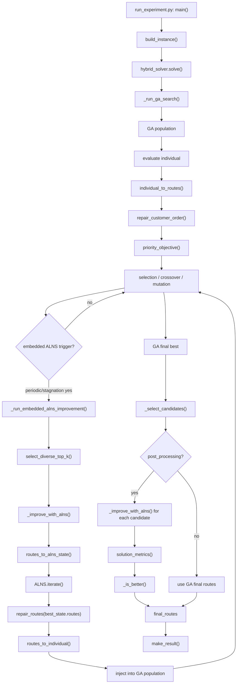
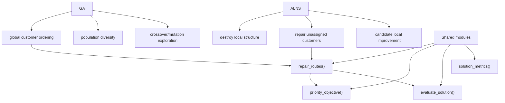
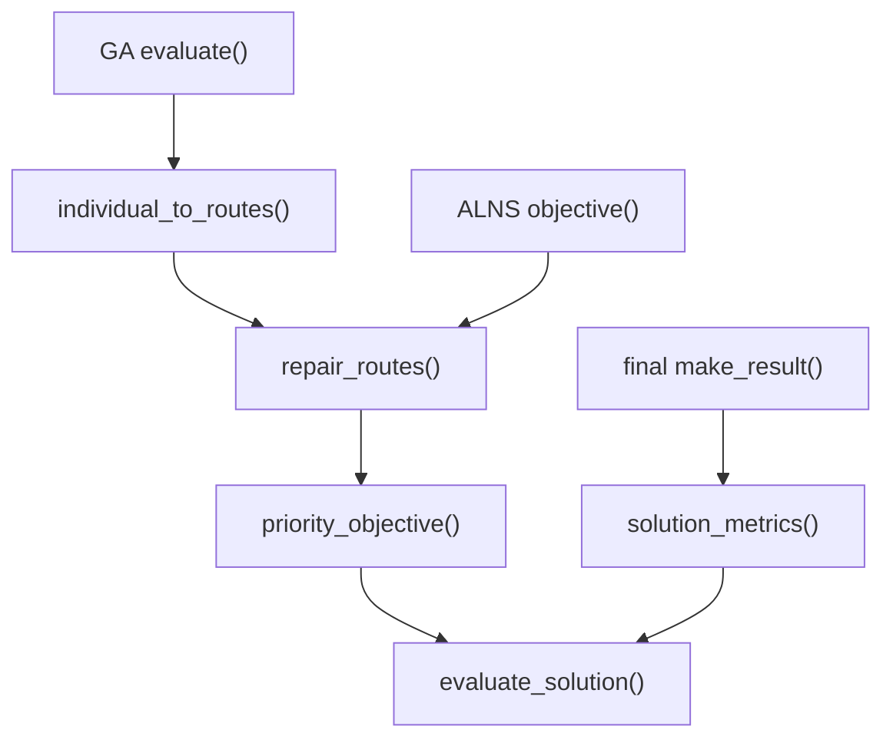

# Hybrid GA+ALNS Code Walkthrough

本文档分析当前项目中的 GA+ALNS 混合方法。重点不是重复介绍 GA 或 ALNS，而是解释：

1. GA 和 ALNS 为什么能连接；
2. 两者之间传递了什么数据；
3. 转换过程中保留和丢失了哪些信息；
4. 当前混合算法有哪些模式；
5. 为什么当前 GA+ALNS 可能没有明显优于 Basic GA 或 Basic ALNS。

本文档只基于当前项目实际代码分析，不修改任何代码。

---

# 0. Current Conclusion

当前 GA+ALNS 的核心在：

```text
EVRPTW_Schneider2014/algorithms/hybrid_ga_alns/
```

最重要文件：

```text
hybrid_solver.py
solution_adapter.py
candidate_selection.py
config.py
diagnostics.py
enhanced_destroy.py
enhanced_repair.py
local_search.py
run_experiment.py
run_unified_benchmark.py
```

当前混合方法支持三类模式：

| 模式 | `hybrid_mode` | 当前真实含义 |
| -- | -- | -- |
| GA 后处理 | `post_processing` | GA 先完整运行，再选候选解交给 ALNS 改进 |
| 周期性精英改进 | `periodic` | GA 运行过程中每隔固定代数调用短时 ALNS，并把更优解注入种群 |
| 停滞触发改进 | `stagnation` | GA 连续多代无改进时调用 ALNS，并注入改进解和随机移民 |

当前默认配置是：

```python
"candidate_mode": "single_best"
"hybrid_mode": "post_processing"
"use_enhanced_destroy": False
"use_enhanced_repair": False
"local_search": {"enabled": False}
```

所以如果不额外传参，默认不是最复杂版本，而是：

```text
Basic GA -> 选择 GA 最优解 -> Basic ALNS 后处理 -> 如果更好则替换
```

---

# 1. Why GA and ALNS Can Be Combined

GA 和 ALNS 能结合，是因为当前项目把两者都压缩到同一种核心解表达：

```text
客户访问顺序
```

GA 的 individual 是：

```python
[customer_id_1, customer_id_2, customer_id_3, ...]
```

ALNS 的 state 是：

```python
EVRPTWState(
    instance=instance,
    routes=[[...], [...]],
    unassigned=[...]
)
```

中间通过 `solution_adapter.py` 转换：

```text
GA individual
-> individual_to_routes()
-> repaired routes
-> routes_to_alns_state()
-> ALNS state
```

ALNS 改进后再转换回 GA：

```text
ALNS routes
-> routes_to_individual()
-> GA individual
```

所以二者能结合的根本原因是：

```text
GA 和 ALNS 都围绕 customer ids 组成的路线结构工作。
```

但也正因为只传递“客户顺序/路线”，混合过程中会丢失很多动态信息：

- 到达时间；
- 等待时间；
- 剩余电量；
- 充电开始电量；
- 充电结束电量；
- 充电站选择历史；
- 车辆类型；
- 无人机任务；
- 同步时间。

这些信息不是保存在解里，而是每次由 `repair_routes()` 和 `evaluate_solution()` 重新计算。

---

# 2. True Call Order

## 2.1 Post-processing mode

默认模式：

```powershell
python -m EVRPTW_Schneider2014.algorithms.hybrid_ga_alns.run_experiment --hybrid-mode post_processing
```

真实流程：

```text
run_experiment.py:main()
-> build_instance()
-> hybrid_solver.solve()
   -> _run_ga_search()
      -> create GA population
      -> evaluate individuals
      -> selection/crossover/mutation
      -> keep best individual
      -> individual_to_routes()
      -> summarize_ga_population()
   -> _select_candidates()
      -> single_best OR select_diverse_top_k()
   -> _improve_with_alns()
      -> _run_alns_from_routes()
         -> routes_to_alns_state()
         -> ALNS.iterate()
         -> destroy/repair
         -> best_state
         -> repair_routes()
         -> optional local_search
   -> solution_metrics()
   -> _is_better()
   -> make_result()
```

## 2.2 Periodic mode

```text
GA evolution
-> every interval_generations
-> select top_k_elites
-> ALNS short improvement
-> routes_to_individual()
-> inject improved individual into population
-> continue GA
```

触发条件在：

```python
_should_trigger_embedded_alns()
```

## 2.3 Stagnation mode

```text
GA evolution
-> if stagnation_generations >= stagnation_limit
-> select top_k_elites
-> ALNS short improvement
-> inject improved individual
-> inject random immigrants
-> reset stagnation counter
```

触发和随机移民在：

```python
_should_trigger_embedded_alns()
_run_embedded_alns_improvement()
_inject_random_immigrants()
```

---

# 3. Key Function Walkthrough

## `EVRPTW_Schneider2014/algorithms/hybrid_ga_alns/run_experiment.py`: `main()`

### 1. 谁调用它

用户通过终端调用：

```powershell
python -m EVRPTW_Schneider2014.algorithms.hybrid_ga_alns.run_experiment
```

### 2. 输入

命令行参数。

关键参数包括：

```text
--instance
--customers
--seed
--population-size
--generations
--alns-iterations
--time-budget
--candidate-mode
--hybrid-mode
--top-k
--top-k-elites
--interval-generations
--stagnation-limit
--use-enhanced-destroy
--use-enhanced-repair
--local-search
--compare-hybrid-modes
```

### 3. 输出

写入：

```text
results/hybrid_ga_alns_summary.csv
results/diagnostics/
```

### 4. 转换逻辑

此函数本身不做 GA/ALNS 转换，只负责：

1. 读取配置；
2. 构造 instance；
3. 组织 solver 参数；
4. 调用 `solve_basic_ga()`、`solve_basic_alns()`、`solve()`；
5. 写 summary 和 diagnostics。

关键代码：

```python
METHODS = {
    "basic_ga": solve_basic_ga,
    "basic_alns": solve_basic_alns,
    "ga_alns": solve,
}
```

### 5. 保留了哪些信息

保留：

- instance；
- 参数；
- result；
- diagnostics。

### 6. 丢失或重算了哪些信息

不涉及算法内部状态。

### 7. 三客户示例

```text
instance = R101
customers = 3
methods = basic_ga, basic_alns, ga_alns
```

会依次运行三种 solver，并写入 summary。

### 8. 风险点

- 如果不加 `--compare-hybrid-modes`，只比较 Basic GA、Basic ALNS 和一个指定 hybrid mode。
- 如果不开 `--use-enhanced-destroy`、`--use-enhanced-repair`、`--local-search`，增强功能不会启用。

---

## `EVRPTW_Schneider2014/algorithms/hybrid_ga_alns/hybrid_solver.py`: `solve()`

### 1. 谁调用它

由：

- `run_experiment.py:main()`
- `run_unified_benchmark.py:_method_specs()`
- `verify_hybrid_modes.py:main()`

调用。

### 2. 输入

```python
instance: dict[str, Any]
**kwargs
```

常见 kwargs：

```python
{
    "seed": 64,
    "population_size": 80,
    "generations": 120,
    "alns_iterations": 30,
    "candidate_mode": "single_best",
    "hybrid_mode": "post_processing",
}
```

### 3. 输出

统一 result dict：

```python
{
    "method": "ga_alns",
    "routes": [[...], [...]],
    "vehicle_count": ...,
    "distance": ...,
    "feasible": ...,
    "total_cost": ...,
    "charging_count": ...,
    "charging_time": ...,
    "waiting_time": ...,
    "ga_best_value": ...,
    "alns_improved_value": ...,
    "improvement_percentage": ...,
    "diagnostics": {...}
}
```

### 4. 转换逻辑

主流程代码片段：

```python
ga_data = _run_ga_search(instance, ga_config, experiment_id, "ga_alns")
candidates = _select_candidates(instance, ga_data, config) if hybrid_mode == "post_processing" else []
...
for idx, candidate in enumerate(candidates):
    alns_routes, ... = _improve_with_alns(instance, candidate.routes, ...)
    alns_metrics = solution_metrics(instance, alns_routes)
    if alns_metrics["feasible"] and _is_better(alns_metrics, best_metrics):
        best_routes = alns_routes
        best_metrics = alns_metrics
        replaced = True
```

流程：

1. 合并默认配置和传入参数。
2. 分配 GA/ALNS 时间预算。
3. 运行 GA 搜索。
4. 如果是 `post_processing`，选择候选解。
5. 每个候选解短时运行 ALNS。
6. ALNS 结果如果可行且更优，则替换当前 best。
7. 生成统一 result。

### 5. 保留了哪些信息

保留：

- GA 最优 individual；
- GA 最优 routes；
- GA population；
- selected candidates；
- ALNS final routes；
- diagnostics；
- total_cost、charging_time、waiting_time 等统一指标。

### 6. 丢失或重算了哪些信息

丢失或重算：

- GA individual 中没有充电站；
- ALNS routes 转回 individual 时会丢弃充电站；
- 到达时间、电量、等待、充电量不保存；
- 每次通过 `solution_metrics()`、`evaluate_solution()`、`repair_routes()` 重算。

### 7. 三客户示例

GA 最优：

```python
individual = [1, 2, 3]
```

转 routes：

```python
individual_to_routes(instance, [1,2,3])
-> [[1, 1000, 2], [3]]
```

ALNS 改进：

```python
routes_to_alns_state(instance, [[1,1000,2],[3]])
-> EVRPTWState(routes=[[1,1000,2],[3]], unassigned=[])
```

ALNS 可能输出：

```python
[[1, 2, 1001, 3]]
```

如果可行且更优，替换 GA 解。

### 8. 风险点

- 默认 `post_processing` 只改进 GA 选出的候选，不在 GA 每代都调用 ALNS。
- 如果 GA 解已经经过同一个 `repair_routes()` 修复，ALNS 的基础 repair 可能重复相同行为。
- 如果 ALNS 没有找到更优可行解，最终 improvement 可能为 0。
- `improvement_percentage` 以 `ga_final_best_cost` 和最终 `total_cost` 比较，但二者不是完全同一目标函数体系。

---

## `EVRPTW_Schneider2014/algorithms/hybrid_ga_alns/hybrid_solver.py`: `_run_ga_search()`

### 1. 谁调用它

由：

- `solve()`
- `solve_basic_ga()`

调用。

### 2. 输入

```python
instance: dict[str, Any]
config: dict[str, Any]
experiment_id: str
method: str
```

### 3. 输出

```python
{
    "individual": list[int],
    "routes": list[list[int]],
    "priority_objective": float,
    "diagnostics": dict,
    "population": list[individual],
    "trigger_logs": list[dict],
    "ga_history": list[dict],
}
```

### 4. 转换逻辑

GA individual 的评价函数：

```python
def evaluate(individual: list[int]) -> tuple[float]:
    routes = individual_to_routes(instance, list(individual))
    return (priority_objective(instance, routes),)
```

也就是说：

```text
individual
-> individual_to_routes()
-> repair_customer_order()
-> routes
-> priority_objective()
-> fitness
```

GA 演化：

```python
offspring = toolbox.select(...)
crossover
mutation
evaluate invalid
population[:] = offspring
```

嵌入式 ALNS 触发：

```python
if _should_trigger_embedded_alns(...):
    logs, injected_best = _run_embedded_alns_improvement(...)
```

### 5. 保留了哪些信息

保留：

- 最优 individual；
- 最优 routes；
- 最终 population；
- GA history；
- trigger logs。

### 6. 丢失或重算了哪些信息

- individual 只保存客户排列；
- 充电站不进入 individual；
- 路线拆分、电量、充电站、时间窗都由 `individual_to_routes()` 每次重算。

### 7. 三客户示例

individual：

```python
[2, 1, 3]
```

评价：

```text
individual_to_routes()
-> repair_customer_order(instance, [2,1,3])
-> maybe [[2,1000,1], [3]]
-> priority_objective()
```

### 8. 风险点

- 当前 GA 使用的是 `population[:] = offspring`，没有显式保留历史最优个体在种群中。
- 但 `_run_ga_search()` 用变量 `best` 保存历史最优。
- GA 的 fitness 是 `priority_objective`，而输出指标中的 `total_cost` 来自 `solution_metrics`，两者权重不同。

---

## `EVRPTW_Schneider2014/algorithms/hybrid_ga_alns/solution_adapter.py`: `individual_to_routes()`

### 1. 谁调用它

由：

- `_run_ga_search()`
- `candidate_selection.select_diverse_top_k()`
- `diagnostics.summarize_ga_population()`
- `_population_diversity()`

调用。

### 2. 输入

```python
instance: dict[str, Any]
individual: list[int]
```

示例：

```python
[52, 18, 90]
```

### 3. 输出

```python
list[list[int]]
```

示例：

```python
[[52, 1000, 18], [90]]
```

### 4. 转换逻辑

代码：

```python
return repair_customer_order(instance, list(individual))
```

即：

```text
客户排列
-> repair_customer_order()
-> repair_routes()
-> repaired E-VRPTW routes
```

### 5. 保留了哪些信息

保留：

- 客户访问顺序；
- 所有客户 id。

### 6. 丢失或重算了哪些信息

重算：

- 路线拆分；
- 充电站；
- 电量；
- 等待；
- 充电时间；
- 车辆数。

### 7. 三客户示例

```python
individual = [1, 2, 3]
```

如果一车不可行：

```python
individual_to_routes()
-> [[1, 1000, 2], [3]]
```

### 8. 风险点

- 同一个 individual 的质量高度依赖 `repair_customer_order()`。
- 如果 repair 太保守，GA 搜索的差异会被 repair 抹平。

---

## `EVRPTW_Schneider2014/algorithms/hybrid_ga_alns/solution_adapter.py`: `routes_to_individual()`

### 1. 谁调用它

由：

- `_run_embedded_alns_improvement()`

调用。

### 2. 输入

```python
instance: dict[str, Any]
routes: list[list[int]]
```

示例：

```python
[[1, 1000, 2], [3]]
```

### 3. 输出

```python
list[int]
```

示例：

```python
[1, 2, 3]
```

### 4. 转换逻辑

代码：

```python
customer_ids = {customer["id"] for customer in instance["customers"]}
seen = set()
individual = []
for route in routes:
    for node in route:
        if node in customer_ids and node not in seen:
            individual.append(node)
            seen.add(node)
return individual
```

逻辑：

1. 只保留客户节点。
2. 忽略充电站。
3. 去掉重复客户。
4. 按路线出现顺序拼成一个排列。

### 5. 保留了哪些信息

保留：

- 客户访问顺序；
- 路线之间的先后顺序被压平成一个排列。

### 6. 丢失或重算了哪些信息

丢失：

- 充电站；
- 路线边界信息的一部分；
- 每辆车原本的具体路线分组；
- 到达时间；
- 电量状态；
- 等待和充电记录。

### 7. 三客户示例

```python
routes = [[1, 1000, 2], [3]]
```

输出：

```python
[1, 2, 3]
```

### 8. 风险点

- ALNS 改进出的“充电站布局”不能注入 GA。
- ALNS 改进出的“路线边界”也可能在转回 individual 后被重新 repair 改变。
- 这会削弱 periodic/stagnation 模式中 ALNS 对 GA 种群的贡献。

---

## `EVRPTW_Schneider2014/algorithms/hybrid_ga_alns/solution_adapter.py`: `routes_to_alns_state()`

### 1. 谁调用它

由：

- `_run_alns_from_routes()`

调用。

### 2. 输入

```python
instance: dict[str, Any]
routes: list[list[int]]
```

示例：

```python
[[1, 1000, 2], [3]]
```

### 3. 输出

```python
EVRPTWState
```

示例：

```python
EVRPTWState(instance, routes=[[1,1000,2],[3]], unassigned=[])
```

### 4. 转换逻辑

代码：

```python
assigned = set(routes_to_individual(instance, routes))
unassigned = [customer_id for customer_id in customer_ids if customer_id not in assigned]
return EVRPTWState(instance, repair_routes(instance, routes), unassigned)
```

逻辑：

1. 从 routes 抽取已分配客户。
2. 计算未分配客户。
3. 对 routes 再次调用 `repair_routes()`。
4. 封装为 ALNS state。

### 5. 保留了哪些信息

保留：

- 客户分配；
- repair 后路线；
- 未分配客户列表。

### 6. 丢失或重算了哪些信息

重算：

- 充电站；
- 路线合并；
- 电量；
- 时间窗可行性。

### 7. 三客户示例

输入：

```python
routes = [[1, 1000, 2]]
customers = {1,2,3}
```

输出：

```python
EVRPTWState(
    routes=repair_routes(instance, [[1,1000,2]]),
    unassigned=[3]
)
```

### 8. 风险点

- 如果输入 routes 缺客户，ALNS state 会把缺失客户放入 `unassigned`。
- 如果输入 routes 已有充电站，`repair_routes()` 可能重新决定充电站。

---

## `EVRPTW_Schneider2014/algorithms/hybrid_ga_alns/solution_adapter.py`: `alns_state_to_routes()`

### 1. 谁调用它

当前读取到的 `hybrid_solver.py` 中没有直接调用它；它是转换工具函数。

### 2. 输入

```python
instance: dict[str, Any]
state: EVRPTWState
```

### 3. 输出

```python
list[list[int]]
```

### 4. 转换逻辑

代码：

```python
return repair_routes(instance, state.routes)
```

### 5. 保留了哪些信息

保留 state.routes 中的客户结构。

### 6. 丢失或重算了哪些信息

仍会通过 `repair_routes()` 重算充电站和路线合并。

### 7. 三客户示例

```python
state.routes = [[1, 2], [3]]
```

输出可能是：

```python
[[1, 1000, 2], [3]]
```

### 8. 风险点

- 当前主流程直接用 `repair_routes(instance, result.best_state.routes)`，没有统一调用这个函数。

---

## `EVRPTW_Schneider2014/algorithms/hybrid_ga_alns/solution_adapter.py`: `solution_metrics()`

### 1. 谁调用它

由：

- `hybrid_solver.py`
- `candidate_selection.py`
- `diagnostics.py`
- `enhanced_repair.py`
- `local_search.py`

调用。

### 2. 输入

```python
instance: dict[str, Any]
routes: list[list[int]]
```

### 3. 输出

```python
{
    "feasible": bool,
    "vehicle_count": int,
    "total_distance": float,
    "total_cost": float,
    "charging_count": int,
    "charging_time": float,
    "waiting_time": float,
    "violations": dict,
    "priority_objective": float,
}
```

### 4. 转换逻辑

代码：

```python
evaluation = evaluate_solution(instance, routes)
service = _service_metrics(instance, routes)
violation_sum = sum(float(value) for value in evaluation["violations"].values())
total_cost = (
    float(evaluation["distance"])
    + service["waiting_time"]
    + service["charging_time"]
    + 1_000_000.0 * violation_sum
)
```

### 5. 保留了哪些信息

输出统一指标：

- 可行性；
- 车辆数；
- 距离；
- 总成本；
- 充电次数；
- 充电时间；
- 等待时间；
- 违反约束。

### 6. 丢失或重算了哪些信息

只输出聚合指标，不输出：

- 每个客户到达时间；
- 每段剩余电量；
- 每次具体充电量；
- 每辆车详细时间表。

### 7. 三客户示例

```python
routes = [[1, 1000, 2], [3]]
```

输出：

```python
{
    "vehicle_count": 2,
    "charging_count": 1,
    "waiting_time": ...,
    "charging_time": ...,
}
```

### 8. 风险点

- `total_cost` 与 `priority_objective()` 不是同一个公式。
- `_is_better()` 用 `total_cost`，GA fitness 用 `priority_objective`，因此“GA 最优”和“最终最优”的评价口径不同。

---

## `EVRPTW_Schneider2014/algorithms/hybrid_ga_alns/candidate_selection.py`: `select_diverse_top_k()`

### 1. 谁调用它

由：

- `_select_candidates()`
- `_run_embedded_alns_improvement()`

调用。

### 2. 输入

```python
instance: dict[str, Any]
population: list[Any]
k: int
similarity_threshold: float
```

### 3. 输出

```python
list[Candidate]
```

每个 Candidate：

```python
Candidate(
    rank=...,
    individual=[...],
    routes=[...],
    cost=...,
    vehicle_count=...,
    similarity_to_best=...
)
```

### 4. 转换逻辑

代码主线：

```python
routes = individual_to_routes(instance, list(individual))
metrics = solution_metrics(instance, routes)
if not metrics["feasible"]:
    continue
...
scored.sort(key=lambda item: (item["vehicle_count"], item["cost"]))
...
similarity_to_best = edge_similarity(item["edges"], best_edges)
```

逻辑：

1. 遍历 GA population。
2. 把 individual 转 routes。
3. 用统一 metrics 评价。
4. 只保留 feasible 个体。
5. 按车辆数和成本排序。
6. 用 route edge set 计算相似度。
7. 选择质量好且结构不同的 Top-K。

### 5. 保留了哪些信息

保留：

- individual；
- routes；
- cost；
- vehicle_count；
- similarity_to_best。

### 6. 丢失或重算了哪些信息

不保存：

- 到达时间；
- 电量轨迹；
- 充电轨迹。

### 7. 三客户示例

两个候选：

```python
A routes = [[1,2,3]]
B routes = [[1,3,2]]
```

edge set：

```python
A = {(0,1),(1,2),(2,3),(3,0)}
B = {(0,1),(1,3),(3,2),(2,0)}
```

相似度低，则可能同时入选。

### 8. 风险点

- 只选择 feasible 个体，如果 GA 种群中可行解很少，Top-K 可能为空。
- 相似度基于边集合，不包含时间、电量、充电站动态信息。
- 如果不同 individual 经 repair 后变成相同 routes，多样性会降低。

---

## `EVRPTW_Schneider2014/algorithms/hybrid_ga_alns/hybrid_solver.py`: `_select_candidates()`

### 1. 谁调用它

由 `solve()` 在 `post_processing` 模式下调用。

### 2. 输入

```python
instance: dict[str, Any]
ga_data: dict[str, Any]
config: dict[str, Any]
```

### 3. 输出

```python
list[Candidate]
```

### 4. 转换逻辑

代码：

```python
mode = config.get("candidate_mode", "single_best")
if mode == "diverse_top_k":
    candidates = select_diverse_top_k(...)
    if candidates:
        return candidates
metrics = solution_metrics(instance, ga_data["routes"])
return [Candidate(rank=1, individual=..., routes=..., ...)]
```

逻辑：

1. 如果 `candidate_mode == diverse_top_k`，尝试从种群中选多个结构不同可行解。
2. 如果失败或不是该模式，退回 single best。

### 5. 保留了哪些信息

保留候选的 individual、routes、cost、vehicle_count。

### 6. 丢失或重算了哪些信息

候选只保存聚合信息，不保存动态轨迹。

### 7. 三客户示例

默认：

```python
candidate_mode = "single_best"
```

输出：

```python
[GA best candidate]
```

### 8. 风险点

- 默认不是 Top-K。
- 如果用户以为默认做多起点，其实不是。

---

## `EVRPTW_Schneider2014/algorithms/hybrid_ga_alns/hybrid_solver.py`: `_run_alns_from_routes()`

### 1. 谁调用它

由：

- `_run_basic_alns_routes()`
- `_improve_with_alns()`

调用。

### 2. 输入

```python
instance
routes
iterations
seed
method
config
time_budget_seconds
```

### 3. 输出

```python
(
    final_routes,
    alns_diagnostics_row,
    operator_rows,
    local_search_rows
)
```

### 4. 转换逻辑

核心代码：

```python
initial = routes_to_alns_state(instance, routes)
...
alns.add_destroy_operator(...)
alns.add_repair_operator(...)
...
result = alns.iterate(initial, selector, accept, stop)
final_routes = repair_routes(instance, result.best_state.routes)
if config.get("local_search", {}).get("enabled"):
    local_result = run_local_search(...)
```

流程：

1. routes 转 ALNS state。
2. 注册基础 destroy/repair。
3. 如果配置打开，注册增强 destroy/repair。
4. 设置 RouletteWheel 和 SimulatedAnnealing。
5. 运行 ALNS。
6. best state 转 repaired routes。
7. 可选 local search。
8. 返回 routes 和 diagnostics。

### 5. 保留了哪些信息

保留：

- routes；
- ALNS diagnostics；
- operator diagnostics；
- local search diagnostics。

### 6. 丢失或重算了哪些信息

ALNS state 不保存轨迹，final routes 再次 repair。

### 7. 三客户示例

输入：

```python
routes = [[1,1000,2], [3]]
```

ALNS destroy/repair 后：

```python
result.best_state.routes = [[1,3], [2]]
```

最终：

```python
repair_routes(instance, [[1,3],[2]])
-> [[1,1001,3], [2]]
```

### 8. 风险点

- 默认增强算子关闭。
- local search 默认关闭。
- `result.best_state.routes` 还会再 repair，一定程度上会覆盖 ALNS 内部路线细节。

---

## `EVRPTW_Schneider2014/algorithms/hybrid_ga_alns/hybrid_solver.py`: `_improve_with_alns()`

### 1. 谁调用它

由：

- `solve()` 的 post-processing candidate loop；
- `_run_embedded_alns_improvement()`；

调用。

### 2. 输入

```python
instance
routes
iterations
seed
method
config
time_budget_seconds
```

### 3. 输出

与 `_run_alns_from_routes()` 相同。

### 4. 转换逻辑

代码：

```python
return _run_alns_from_routes(instance, routes, iterations, seed, method, config, time_budget_seconds)
```

这是封装函数。

### 5. 保留了哪些信息

保留 routes。

### 6. 丢失或重算了哪些信息

同 `_run_alns_from_routes()`。

### 7. 三客户示例

GA candidate：

```python
[[1,2,3]]
```

传入 ALNS 改进：

```python
_improve_with_alns(instance, [[1,2,3]], ...)
```

### 8. 风险点

- 本身不判断是否更好，只负责调用 ALNS。
- 是否替换由外层 `_is_better()` 决定。

---

## `EVRPTW_Schneider2014/algorithms/hybrid_ga_alns/hybrid_solver.py`: `_run_embedded_alns_improvement()`

### 1. 谁调用它

由 `_run_ga_search()` 在 `periodic` 或 `stagnation` 模式触发。

### 2. 输入

```python
instance
population
toolbox
config
generation
trigger_reason
seed
```

### 3. 输出

```python
(
    logs: list[dict],
    injected_best: Individual | None
)
```

### 4. 转换逻辑

核心代码：

```python
elites = select_diverse_top_k(instance, population, k=top_k_elites, ...)
...
alns_routes, ... = _improve_with_alns(instance, elite.routes, ...)
alns_metrics = solution_metrics(instance, alns_routes)
improved_individual = routes_to_individual(instance, alns_routes)
if alns_metrics["feasible"] and improvement > 1e-9 and _valid_individual(...):
    injected_individual = creator.IndividualHybridEVRPTW(improved_individual)
    injected_individual.fitness.values = toolbox.evaluate(injected_individual)
    _replace_worst_individual(population, injected_individual)
```

流程：

1. 从当前 GA 种群中选多样化精英。
2. 对每个 elite routes 运行短时 ALNS。
3. 把 ALNS routes 转回 GA individual。
4. 如果可行、成本改善、individual 合法，就替换种群中最差个体。

### 5. 保留了哪些信息

保留：

- 改进后的客户顺序；
- 注入记录；
- population diversity before/after；
- improvement。

### 6. 丢失或重算了哪些信息

关键丢失：

- ALNS 插入的充电站；
- ALNS route 边界；
- ALNS 电量/时间安排。

因为：

```python
improved_individual = routes_to_individual(instance, alns_routes)
```

只返回客户排列。

### 7. 三客户示例

ALNS 得到：

```python
alns_routes = [[1, 1000, 2], [3]]
```

转回 GA：

```python
routes_to_individual()
-> [1, 2, 3]
```

注入后再次 evaluate：

```python
toolbox.evaluate([1,2,3])
-> individual_to_routes()
-> repair_customer_order()
```

可能重新得到不同的路线。

### 8. 风险点

- ALNS 真正改进的充电站位置不能直接保留到 GA。
- 如果改进主要来自路线边界或充电站，转回 individual 后可能失效。
- 这会导致 periodic/stagnation 的实际改进弱于理论预期。

---

## `EVRPTW_Schneider2014/algorithms/hybrid_ga_alns/hybrid_solver.py`: `_is_better()`

### 1. 谁调用它

由：

- `solve()`
- `local_search.py` 中也有独立同名逻辑

调用。

### 2. 输入

```python
candidate: dict[str, Any]
incumbent: dict[str, Any]
```

### 3. 输出

```python
bool
```

### 4. 转换逻辑

代码：

```python
if bool(candidate["feasible"]) != bool(incumbent["feasible"]):
    return bool(candidate["feasible"])
return (
    candidate["vehicle_count"],
    candidate["total_cost"],
    candidate["total_distance"],
) < (
    incumbent["vehicle_count"],
    incumbent["total_cost"],
    incumbent["total_distance"],
)
```

比较优先级：

1. 可行优先；
2. 车辆数少优先；
3. 总成本低优先；
4. 总距离低优先。

### 5. 保留了哪些信息

只使用聚合指标：

- feasible；
- vehicle_count；
- total_cost；
- total_distance。

### 6. 丢失或重算了哪些信息

不单独比较：

- charging_count；
- charging_time；
- waiting_time；
- route smoothness；
- synchronization。

这些只进入 total_cost 或结果记录。

### 7. 三客户示例

GA：

```python
vehicle_count=2, total_cost=100
```

ALNS：

```python
vehicle_count=1, total_cost=130
```

ALNS 更好，因为车辆数优先。

### 8. 风险点

- 车辆数优先可能接受距离更长的方案。
- total_cost 与 GA fitness 的 `priority_objective` 不一致。
- 如果研究目标变成论文式目标函数，需要重新定义比较规则。

---

## `EVRPTW_Schneider2014/algorithms/hybrid_ga_alns/hybrid_solver.py`: `_should_trigger_embedded_alns()`

### 1. 谁调用它

由 `_run_ga_search()` 每代调用。

### 2. 输入

```python
method: str
config: dict
generation: int
stagnation_generations: int
```

### 3. 输出

```python
bool
```

### 4. 转换逻辑

代码：

```python
if method != "ga_alns":
    return False
mode = config.get("hybrid_mode", "post_processing")
if mode == "periodic":
    return generation > 0 and generation % interval == 0
if mode == "stagnation":
    return stagnation_generations >= limit
return False
```

### 5. 保留了哪些信息

只判断触发，不保存状态。

### 6. 丢失或重算了哪些信息

不涉及转换。

### 7. 三客户示例

```python
hybrid_mode = "periodic"
interval_generations = 4
generation = 8
```

返回：

```python
True
```

### 8. 风险点

- `post_processing` 模式不会在 GA 中途触发。
- 如果 `method != "ga_alns"`，Basic GA 不会触发 ALNS。

---

## `EVRPTW_Schneider2014/algorithms/hybrid_ga_alns/candidate_selection.py`: `route_edges()` and `edge_similarity()`

### 1. 谁调用它

由 `select_diverse_top_k()` 调用。

### 2. 输入

```python
routes: list[list[int]]
left/right: set[tuple[int, int]]
```

### 3. 输出

```python
route_edges() -> set[tuple[int, int]]
edge_similarity() -> float
```

### 4. 转换逻辑

代码：

```python
nodes = [0] + list(route) + [0]
edges.add((left, right))
```

相似度：

```python
return len(left & right) / len(union)
```

### 5. 保留了哪些信息

保留路线边结构。

### 6. 丢失或重算了哪些信息

不考虑：

- 时间窗；
- 电量；
- 充电站动态成本；
- 等待时间。

### 7. 三客户示例

```python
routes = [[1,2,3]]
edges = {(0,1),(1,2),(2,3),(3,0)}
```

### 8. 风险点

- 如果充电站被 repair 插入，edge set 也会包含充电站边。
- 但 candidate selection 的根本目标仍是路线结构多样，不是电量状态多样。

---

# 4. Responsibility Table

| 模块 | GA 负责 | ALNS 负责 | 共享模块负责 |
| -- | -- | -- | -- |
| `hybrid_solver.py` | 种群初始化、选择、交叉、变异、精英追踪 | 调用 ALNS 改进候选解或精英解 | 组织整体流程、比较结果 |
| `solution_adapter.py` | individual 转 routes | routes 转 ALNS state | 统一 metrics |
| `candidate_selection.py` | 从 GA population 中选候选 | 提供 ALNS 起点 | 边相似度与 Top-K |
| `solve_alns.py` | 无 | 基础 destroy/repair state 搜索 | EVRPTWState |
| `route_repair.py` | GA 解码时修复 | ALNS objective/repair 时修复 | 电量、充电站、路线合并 |
| `evaluator.py` | 最终检查 GA routes | 最终检查 ALNS routes | 统一可行性 |
| `diagnostics.py` | GA 种群诊断 | ALNS 算子诊断 | CSV 输出 |
| `enhanced_destroy.py` | 无 | 可选增强 destroy | 约束感知破坏 |
| `enhanced_repair.py` | 无 | 可选增强 repair | 约束感知插入 |
| `local_search.py` | 无 | ALNS 后局部搜索 | 可行性保持邻域 |

---

# 5. Information Flow Table

| 阶段 | 数据格式 | 关键字段 | 转换函数 | 风险 |
| -- | -- | -- | -- | -- |
| GA population | `list[Individual]` | 客户排列 | `toolbox.population()` | 不含充电站/时间/电量 |
| GA evaluation | `individual -> routes` | routes, priority objective | `individual_to_routes()` | repair 可能抹平个体差异 |
| GA best | `list[int]` + routes | best individual, routes | `_run_ga_search()` | best fitness 与 total_cost 不同 |
| Candidate selection | `Candidate` | rank, routes, cost, similarity | `_select_candidates()` | 默认 single_best |
| Routes to ALNS | `EVRPTWState` | routes, unassigned | `routes_to_alns_state()` | 充电站会重算 |
| ALNS iteration | `EVRPTWState` | routes, unassigned | destroy/repair | state 不缓存时间电量 |
| ALNS result | routes | best_state.routes | `repair_routes()` | best routes 再次后处理 |
| Embedded injection | `routes -> individual` | 客户顺序 | `routes_to_individual()` | 丢失充电站和路线边界 |
| Final comparison | metrics dict | feasible, vehicles, cost, distance | `_is_better()` | 车辆数优先，可能牺牲距离 |
| Output | result dict | routes, metrics, diagnostics | `make_result()` | 输出是最终 repair 后 routes |

---

# 6. Current Hybrid Modes

## 6.1 Mode 1: Post-processing

代码位置：

```python
hybrid_solver.py:solve()
```

流程：

```text
GA 完整运行
-> _select_candidates()
-> 每个 candidate 调用 _improve_with_alns()
-> 用 _is_better() 选择最终解
```

特点：

- 默认模式；
- 默认候选是 single best；
- 不改变 GA 搜索过程；
- ALNS 只作为后处理。

为什么可能效果不好：

1. 只优化单个 GA 最优解时，起点太少。
2. GA 解已经经过 `repair_routes()`，ALNS 基础 repair 可能重复同样逻辑。
3. ALNS 默认迭代次数有限。
4. 如果 ALNS 改进主要是充电站/路线边界，最终 comparison 可能看不到明显变化。

## 6.2 Mode 2: Periodic

代码位置：

```python
_should_trigger_embedded_alns()
_run_embedded_alns_improvement()
```

流程：

```text
GA 每隔 interval_generations 代
-> select_diverse_top_k()
-> ALNS 短时改进 elite routes
-> routes_to_individual()
-> 替换最差个体
```

特点：

- ALNS 参与 GA 过程；
- 可以把局部改进反馈给种群；
- 但只反馈客户顺序。

为什么可能效果不好：

1. ALNS 改进 routes 转回 individual 时丢充电站。
2. 注入后 fitness 会重新调用 `individual_to_routes()`，可能得不到 ALNS 原路线。
3. ALNS 每次调用很短，改进空间有限。
4. 如果 GA 种群多样性不足，elite 起点相似。

## 6.3 Mode 3: Stagnation

代码位置：

```python
_should_trigger_embedded_alns()
_inject_random_immigrants()
```

流程：

```text
如果 GA 连续 stagnation_limit 代无改进
-> ALNS 改进 elite
-> 注入改进个体
-> 注入随机移民
-> 重置 stagnation
```

特点：

- 针对 GA 停滞；
- 额外引入随机移民；
- 更强调恢复种群多样性。

为什么可能效果不好：

1. 停滞判定基于 GA fitness，不一定等同于 total_cost 停滞。
2. 随机移民可能破坏已有较好种群结构。
3. ALNS 改进仍受 routes_to_individual 信息丢失影响。

---

# 7. Why the Hybrid Can Be Useful

从算法角色看：

| 问题 | GA 适合解决 | ALNS 适合解决 |
| -- | -- | -- |
| 大范围搜索客户顺序 | 是 | 否，ALNS 依赖起点 |
| 避免陷入单一路线结构 | 是，靠种群 | 部分，靠 destroy |
| 对已有解做局部重排 | 一般 | 是 |
| 修复困难客户插入 | 一般 | 是，尤其 regret/repair |
| 路线合并和细节优化 | 一般 | 是 |
| 约束感知局部调整 | 需要额外设计 | 更适合 |

所以结合的合理动机是：

```text
GA 先提供多个全局结构不同的候选路线；
ALNS 再对这些候选路线做局部破坏、修复、合并和约束感知优化。
```

但这个动机成立的前提是：

1. GA 的候选解结构确实不同；
2. ALNS 的邻域比 GA repair 更强；
3. ALNS 改进的信息能被保留下来；
4. 比较目标和研究目标一致；
5. 总运行时间预算公平。

当前项目中，这些条件只部分满足。

---

# 8. Why Current Hybrid May Not Improve Much

## 8.1 GA repair 与 ALNS repair 高度重复

GA evaluation：

```python
routes = individual_to_routes(instance, list(individual))
return (priority_objective(instance, routes),)
```

`individual_to_routes()`：

```python
return repair_customer_order(instance, list(individual))
```

ALNS objective：

```python
repaired = repair_routes(self.instance, self.routes)
return priority_objective(...)
```

两者都依赖 `repair_routes()` 和 `priority_objective()`。

因此：

```text
GA 已经在搜索“repair 后的解”；
ALNS 再 repair 时，可能只是重复同一种修复逻辑。
```

## 8.2 ALNS 默认邻域不够强

默认只注册基础算子：

```python
_random_removal
_worst_distance_removal
_route_segment_removal
_greedy_repair
_regret_repair
```

增强算子默认关闭：

```python
"use_enhanced_destroy": False
"use_enhanced_repair": False
"local_search": {"enabled": False}
```

所以默认 GA+ALNS 不会自动使用：

- energy-critical removal；
- route removal；
- cluster removal；
- time-window-aware insertion；
- energy-aware insertion；
- route merge local search；
- 2-opt*。

## 8.3 信息转换损失

最关键损失发生在：

```python
routes_to_individual()
```

它只保留客户，丢弃充电站：

```python
if node in customer_ids and node not in seen:
    individual.append(node)
```

如果 ALNS 改进主要来自：

- 插入更好的充电站；
- 改变路线边界；
- 减少等待；
- 改变充电次数；

转回 GA individual 后可能无法完整保留。

## 8.4 目标函数不完全一致

GA fitness：

```python
priority_objective()
= 1e9 * violation
+ 1e6 * vehicle_count
+ 100 * distance
+ waiting_and_charging
```

Hybrid final metrics：

```python
total_cost
= distance
+ waiting_time
+ charging_time
+ 1e6 * violation_sum
```

Final comparison：

```python
feasible -> vehicle_count -> total_cost -> total_distance
```

这三个评价口径不完全一致：

| 环节 | 使用目标 |
| -- | -- |
| GA fitness | `priority_objective` |
| ALNS objective | `EVRPTWState.objective()` -> `priority_objective` |
| final comparison | `_is_better()` -> vehicle_count + total_cost |
| output improvement | `ga_final_best_cost` vs `final_metrics["total_cost"]` |

所以 improvement_percentage 可能不完全反映 GA fitness 的真实提升。

## 8.5 ALNS 时间预算可能不足

post-processing 中时间分配：

```python
ga_time = 70%
alns_time = 30%
```

多候选时：

```python
per_candidate_time = alns_time_budget / candidate_count
```

如果 Top-K 多，每个 ALNS 起点时间更少。

periodic/stagnation 中：

```python
alns_iterations_per_call = 5
```

默认每次嵌入式 ALNS 很短，可能不足以产生明显改进。

---

# 9. Direct Answers

## 9.1 当前混合属于哪一种形式？

当前代码支持三种：

| 形式 | 是否支持 | 证据 |
| -- | -- | -- |
| GA 后处理 | 是 | `hybrid_mode="post_processing"` |
| 周期性调用 ALNS | 是 | `hybrid_mode="periodic"` |
| 停滞触发 ALNS | 是 | `hybrid_mode="stagnation"` |
| ALNS 作为变异 | 否 | 没有把 ALNS 注册为 GA mutation |
| 每代都调用 ALNS | 否 | 只按 interval/stagnation 触发 |

## 9.2 GA 交给 ALNS 的是什么？

取决于模式：

| 模式 | GA 交给 ALNS |
| -- | -- |
| `post_processing + single_best` | 单个 GA 最优解 |
| `post_processing + diverse_top_k` | 多个高质量且结构不同的可行候选 |
| `periodic` | 当前种群中的 Top-K diverse elites |
| `stagnation` | 停滞时的 Top-K diverse elites |

不是整个种群全部交给 ALNS。

## 9.3 转换过程中是否丢失信息？

| 信息 | 是否保留 | 说明 |
| -- | -- | -- |
| 客户顺序 | 保留 | individual/routes 都包含客户 id |
| 客户覆盖 | 保留并检查 | `_valid_individual()` / evaluator |
| 充电站 | 不稳定保留 | routes 中有，但转 individual 时丢弃 |
| 到达时间 | 不保留 | evaluator 重算 |
| 电量 | 不保留 | repair/evaluator 重算 |
| 等待 | 不保留 | `solution_metrics()` 重算 |
| 路线边界 | 部分保留 | routes 保留；转 individual 后丢失 |
| 车辆类型 | 不保留 | 当前无多车辆类型 |
| 无人机任务 | 不支持 | 当前 schema 无 drone task |

## 9.4 ALNS 是否真正改善了 GA 弱点？

部分改善，但受限。

能改善：

- GA 单点变异/交叉不擅长的局部重插入；
- 通过 destroy/repair 对路线片段重构；
- 通过 Top-K 多起点增强稳定性；
- 通过 periodic/stagnation 给 GA 种群注入外部改进。

效果有限的原因：

- 默认 ALNS 算子较弱；
- GA 和 ALNS 都依赖相同 repair；
- ALNS 改进信息转回 GA 时丢失；
- 时间预算有限；
- 目标函数口径不完全统一。

## 9.5 如果 ALNS 得到更差解，是否会错误替换 GA？

post-processing 中不会。

代码：

```python
if alns_metrics["feasible"] and _is_better(alns_metrics, best_metrics):
    best_routes = alns_routes
```

只有 ALNS 可行且 `_is_better()` 为真才替换。

periodic/stagnation 中也有保护：

```python
if alns_metrics["feasible"] and improvement > 1e-9 and _valid_individual(...):
    _replace_worst_individual(...)
```

所以不会把更差解强行注入。

## 9.6 比较使用哪个 objective？

最终比较使用：

```python
_is_better()
```

优先级：

```text
feasible
-> vehicle_count
-> total_cost
-> total_distance
```

不是直接用 GA fitness。

## 9.7 比较前是否重新统一评价？

是。

ALNS routes 后：

```python
alns_metrics = solution_metrics(instance, alns_routes)
```

GA routes 初始：

```python
best_metrics = solution_metrics(instance, best_routes)
```

`solution_metrics()` 内部调用：

```python
evaluate_solution(instance, routes)
```

## 9.8 GA+ALNS 的额外运行时间来自哪些函数？

主要来自：

| 函数 | 运行时间来源 |
| -- | -- |
| `_run_ga_search()` | GA population 多代评价 |
| `individual_to_routes()` | 每个 individual 都要 repair |
| `priority_objective()` | evaluator + waiting/charging cost |
| `_select_candidates()` | population 转 routes + metrics + similarity |
| `_run_alns_from_routes()` | ALNS iterate |
| `wrap_alns_operator()` | operator diagnostics 额外计算 |
| `repair_routes()` | 高频调用，含插入、充电修复、合并 |
| `solution_metrics()` | 高频 evaluator |
| `run_local_search()` | 如果开启，邻域枚举成本高 |

## 9.9 当前混合为什么可能不优于单独 GA 或 ALNS？

主要原因排序：

1. GA 和 ALNS 共享同一个 `repair_routes()`，行为重复；
2. 默认 ALNS 算子不够强；
3. ALNS 改进信息转回 GA 时丢失充电站和路线边界；
4. 默认 single-best 起点太少；
5. ALNS 时间预算有限；
6. 目标函数不完全一致；
7. 如果 Basic GA 已经找到了当前 repair 规则下的局部优解，ALNS 很难继续改。

---

# 10. What Is the Real Innovation?

当前 Hybrid 的真实创新或改动不是创造了一个全新的底层求解器，而是建立了一个组合框架：

```text
GA global search
+ ALNS local improvement
+ shared repair/evaluator
+ diverse candidate selection
+ optional embedded ALNS
+ diagnostics
+ optional enhanced operators/local search
```

具体创新点：

1. 统一 GA individual、routes、ALNS state 的转换；
2. 能把 GA 最优解或 Top-K 解交给 ALNS；
3. 能在 GA 过程中周期性或停滞时调用 ALNS；
4. 能把 ALNS 改进结果转回 GA individual 并注入种群；
5. 能记录 GA/ALNS/operator/candidate/trigger diagnostics；
6. 能在统一 benchmark 中比较 Basic GA、Basic ALNS 和多个 hybrid variants。

但默认版本仍可以被描述为：

```text
一个以 GA 为主、ALNS 为后处理或轻量嵌入的混合启发式框架。
```

如果只用默认 `post_processing + single_best + basic ALNS`，它确实接近简单串联。

---

# 11. What Should GA Solve vs ALNS Solve?

## 11.1 GA 应解决的瓶颈

GA 适合解决：

- 全局客户顺序；
- 大范围路线结构；
- 不同区域客户的组合；
- 多样化初始解；
- 避免只从最近邻起点搜索。

代码体现：

```python
population = toolbox.population(...)
selection + crossover + mutation
```

## 11.2 ALNS 应解决的瓶颈

ALNS 适合解决：

- 某些客户从一条路线搬到另一条路线；
- 破坏局部结构再修复；
- 路线合并；
- 困难客户 regret 插入；
- 电量/时间窗/充电站敏感调整；
- 局部搜索。

代码体现：

```python
destroy operators
repair operators
local_search
```

## 11.3 哪些问题只需要增强 repair，不一定需要完整 hybrid？

如果问题主要是：

- 充电站插入不合理；
- 电量修复太保守；
- 新开车辆太早；
- 时间窗传播不精细；
- 充电站 cleanup 不够；

那么优先应该增强：

```text
route_repair.py
enhanced_repair.py
evaluator.py
```

不一定要先做更复杂的 GA+ALNS 融合。

如果问题是：

- GA 起点结构单一；
- ALNS 起点太差；
- 单次运行不稳定；
- 不同 seed 差异大；

那么 hybrid 才更有明确价值。

---

# 12. What Experiments Are Needed to Justify Hybrid?

要让 Hybrid 有明确研究动机，需要先观察这些实验现象：

1. Basic GA 收敛后长期停滞；
2. Basic ALNS 从最近邻起点结果不稳定或质量受限；
3. GA 种群中存在多个结构不同但成本接近的候选；
4. ALNS 对某些非最优 GA 候选反而改进更多；
5. Top-K multi-start 比 single-best 更稳定；
6. periodic/stagnation 触发后能降低最终车辆数或 total_cost；
7. enhanced repair 的 operator success rate 高于 basic repair；
8. route_merge 或 local_search 能稳定减少车辆数或距离；
9. 额外运行时间带来的质量提升超过成本；
10. 在 R/C/RC 和不同客户规模下趋势一致。

如果这些现象不存在，就应该诚实说明：

```text
当前 GA+ALNS 没有稳定优于 Basic GA 或 Basic ALNS。
```

---

# 13. Complete Call Flow Diagram



---

# 14. Data Structure Conversion Diagram

```mermaid
flowchart LR
    A["GA individual<br/>[1,2,3]"] --> B["individual_to_routes()"]
    B --> C["repaired routes<br/>[[1,1000,2],[3]]"]
    C --> D["routes_to_alns_state()"]
    D --> E["EVRPTWState<br/>routes, unassigned"]
    E --> F["ALNS destroy/repair"]
    F --> G["best_state.routes"]
    G --> H["repair_routes()"]
    H --> I["final routes"]
    I --> J["routes_to_individual()<br/>embedded modes only"]
    J --> K["GA individual<br/>[1,2,3]"]
```



关键损失：

```text
routes_to_individual() 会删除 1000 这类充电站节点。
```

---

# 15. GA and ALNS Responsibility Diagram



---

# 16. Shared Evaluator Call Diagram



说明：

```text
GA、ALNS、Hybrid 最终都依赖同一个 evaluate_solution() 判断 feasible。
```

---

# 17. Conversion Function Table

| 函数 | 输入 | 输出 | 用途 | 主要风险 |
| -- | -- | -- | -- | -- |
| `individual_to_routes()` | GA individual | repaired routes | GA 解码 | repair 可能抹平 individual 差异 |
| `routes_to_individual()` | routes | customer permutation | ALNS 注入 GA | 丢失充电站和路线边界 |
| `routes_to_alns_state()` | routes | EVRPTWState | ALNS 起点 | routes 再次 repair |
| `alns_state_to_routes()` | EVRPTWState | repaired routes | 工具函数 | 当前主流程未直接用 |
| `solution_metrics()` | routes | metrics dict | 统一比较 | 与 priority_objective 不完全一致 |
| `select_diverse_top_k()` | GA population | Candidate list | 多起点 | 只选 feasible，可能候选少 |
| `_is_better()` | metrics | bool | 最终替换规则 | 车辆数优先，可能牺牲距离 |

---

# 18. Current Hybrid: 10 Main Risks

| 编号 | 风险 | 代码依据 | 影响 |
| -- | -- | -- | -- |
| 1 | GA 和 ALNS 共用 `repair_routes()`，行为重复 | `individual_to_routes()` 和 `EVRPTWState.objective()` | ALNS 改进有限 |
| 2 | 默认只 single-best | `candidate_mode="single_best"` | 起点太少 |
| 3 | 增强算子默认关闭 | `use_enhanced_destroy=False`, `use_enhanced_repair=False` | 邻域不够强 |
| 4 | local search 默认关闭 | `local_search.enabled=False` | 缺少深度局部优化 |
| 5 | routes 转 individual 丢充电站 | `routes_to_individual()` | ALNS 改进难注入 GA |
| 6 | state 不保存时间/电量轨迹 | `EVRPTWState` 只有 routes/unassigned | 难做精细约束优化 |
| 7 | GA fitness 和 final total_cost 不一致 | `priority_objective` vs `solution_metrics` | improvement 解读困难 |
| 8 | 嵌入式 ALNS 调用短 | `alns_iterations_per_call=5` | 改进不足 |
| 9 | 车辆数优先可能压过距离 | `_is_better()` | 结果偏向少车 |
| 10 | 诊断显示不等于真实因果 | diagnostics 统计聚合 | 需要多 seed 验证 |

---

# 19. Most Important 10 Functions to Read

| 顺序 | 文件 | 函数 | 为什么重要 |
| -- | -- | -- | -- |
| 1 | `hybrid_ga_alns/hybrid_solver.py` | `solve()` | GA+ALNS 总入口 |
| 2 | `hybrid_ga_alns/hybrid_solver.py` | `_run_ga_search()` | GA 阶段真实逻辑 |
| 3 | `hybrid_ga_alns/solution_adapter.py` | `individual_to_routes()` | GA 如何交给 repair |
| 4 | `hybrid_ga_alns/solution_adapter.py` | `routes_to_alns_state()` | routes 如何进入 ALNS |
| 5 | `hybrid_ga_alns/hybrid_solver.py` | `_run_alns_from_routes()` | ALNS 改进核心 |
| 6 | `hybrid_ga_alns/hybrid_solver.py` | `_run_embedded_alns_improvement()` | periodic/stagnation 如何注入 |
| 7 | `hybrid_ga_alns/solution_adapter.py` | `routes_to_individual()` | ALNS 如何转回 GA |
| 8 | `hybrid_ga_alns/candidate_selection.py` | `select_diverse_top_k()` | 多起点选择 |
| 9 | `hybrid_ga_alns/solution_adapter.py` | `solution_metrics()` | 统一指标 |
| 10 | `hybrid_ga_alns/hybrid_solver.py` | `_is_better()` | 最终替换规则 |

---

# 20. Final Summary

当前 GA+ALNS 的本质是：

```text
用 GA 搜索全局客户顺序，
用 ALNS 对 GA 产生的路线做局部破坏和修复，
用统一 repair/evaluator 保证约束检查，
用 diagnostics 观察 ALNS 是否真正产生改进。
```

它不是简单地把两个黑盒拼在一起，因为代码中已经实现了：

- individual/routes/state 转换；
- single-best 和 Top-K candidate selection；
- post-processing、periodic、stagnation 三种模式；
- ALNS 改进解注入 GA population；
- 诊断日志；
- 可选增强 destroy/repair；
- 可选 local search；
- 统一 benchmark。

但在默认设置下，它确实接近：

```text
GA 完整运行 + ALNS 后处理
```

当前效果不好的主要原因不是“GA 和 ALNS 不能结合”，而是：

```text
结合接口只传递客户顺序和 routes；
大量关键 E-VRPTW 信息由 repair/evaluator 重算；
默认 ALNS 邻域较弱；
GA 和 ALNS 都依赖同一个 repair；
ALNS 改进很容易在转回 GA individual 时丢失。
```

如果后续要让 Hybrid 更有研究价值，优先方向不是盲目增加迭代次数，而是：

1. 让 ALNS 算子真正约束感知；
2. 让 routes_to_individual 尽量保留路线边界或增加 richer individual；
3. 统一 GA fitness、ALNS objective 和 final comparison；
4. 证明 Top-K multi-start 比 single-best 稳定；
5. 证明 periodic/stagnation 能在 GA 停滞时带来可重复改进；
6. 对比增强 repair/local search 的真实贡献。

