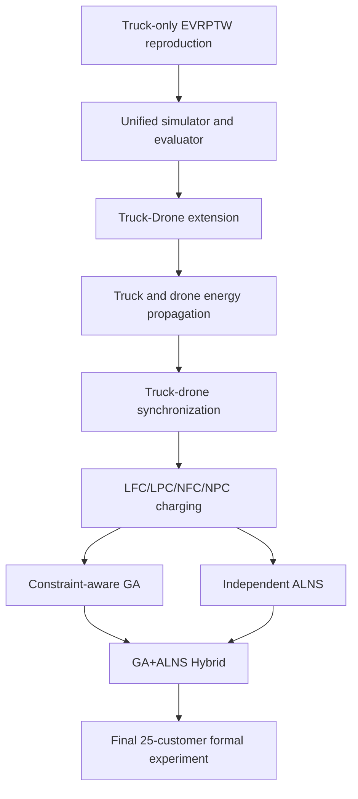

# Master Experimental Report: Truck-Drone EVRPTW-NL

> This document is a paper-writing master draft, not the final conference paper. Its goal is to preserve the model definition, method development, experimental design, results, ablation evidence, and negative findings based on current code and saved data.

## Evidence Coverage Statement

Highest-priority evidence used: `docs/final_model_freeze_spec.md`, final code, `configs/hybrid_final_25_overnight.yaml`, and final 25-customer CSV/JSONL. Second-priority development reports were used for method evolution. Early truck-only and debug outputs were inventoried or used as historical context only. Main analysis uses 108 final 25-customer runs. Smoke/debug/backup files are excluded from main statistics. Missing evidence includes a complete formal 50-customer batch, final bibliography metadata, and profiling-level runtime cause analysis.

**Key facts from the final 108-run batch:** `alns_full` feasible rate is 75.0%, `ga_td` feasible rate is 66.667%, and `hybrid_diverse_topk` feasible rate is 72.222%. There are 31 infeasible rows and 4 runtime rows above 500 seconds. These rows are not deleted. Any paper claim must therefore discuss feasibility and runtime risk explicitly.

## 1. Research Scope and Evolution

The project evolved from truck-only EVRPTW reproduction to a final Truck-Drone EVRPTW-NL model. Early OR-Tools, GA, PyVRP, and ALNS work was used to understand EVRPTW constraints and baseline behavior. The final frozen model is not the early truck-only model; it includes multi-route electric trucks, same-route drone launch/recovery, drone service, drone charging, synchronization, and four charging policies.

## 2. Source Problem Comparison

| Dimension | Schneider E-VRPTW | ETRD-NL | Final Truck-Drone EVRPTW-NL |
|---|---|---|---|
| time windows | Yes | Project deep reading; details in report | Yes, hard constraint |
| electric truck | Yes | Yes, per project report | Yes |
| auxiliary vehicle | No | Robot | Drone |
| synchronization | No | Truck-robot synchronization | Truck-drone recovery synchronization |
| nonlinear charging | No in classic E-VRPTW | Yes | Segmented NFC/NPC |
| partial charging | Not final source for partial charging | Yes | LPC/NPC |
| multiple truck routes | Vehicle routes | Model-dependent | truck_routes |
| service structure | Truck-only customer service | Truck-robot cooperative service | Truck or same-route drone service |
## 3. Final Problem Definition

### 3.1 Problem assumptions

The final problem is a Solomon-derived multi-electric-truck and same-route-drone routing problem with time windows, energy, charging, synchronization, and soft spatial quality metrics. Cross-truck drone recovery, road networks, wind, weather, no-fly zones, heterogeneous fleets, and exact physical battery curves are not included.

### 3.2 Entities and parameters

Entities are depot, customers, generated charging stations, homogeneous trucks, homogeneous drones, charging parameters, and Euclidean distance matrix. Customer ids keep Solomon ids and are not renumbered.

### 3.3 Instance construction

`instance_builder.build_instance()` samples Solomon customers with fixed seeds and generates charging stations before solving.

### 3.4 Final solution representation

The final schema is `truck_routes + drone_tasks + charging_plan`. `truck_route` remains only for backward compatibility.

### 3.5 Customer coverage

Every customer must be served exactly once by truck or drone. Violation fields: `customer_missing`, `customer_duplicate`, `customer_coverage`. Hard constraint.

### 3.6 Truck and drone capacity

Truck route demand includes truck-served and route-level drone-served customers. Drone task demand sums all customers in that drone_route. Violation: `capacity`. Hard constraint.

### 3.7 Time-window propagation

Travel time is distance divided by speed. Early arrival waits. Late service start creates `time_window` violation. Hard constraint.

### 3.8 Truck-drone synchronization

Drone launch/recovery occur on the same truck route. At recovery, the early side waits. Waiting is a soft metric; invalid mission structure is `drone_mission`.

### 3.9 Truck battery

Truck energy starts full per route and decreases by distance times truck consumption rate. Negative energy creates `truck_battery` violation.

### 3.10 Drone battery

Drone energy starts full per task, decreases by distance times drone consumption rate, and may recover at station visits with charging plan. Negative energy creates `drone_battery` violation.

### 3.11 Charging stations

Stations are generated instance entities. Algorithms may insert visits to existing stations but cannot create new stations.

### 3.12 LFC / LPC / NFC / NPC

LFC/NFC charge to full. LPC/NPC charge to required energy plus safety margin. Linear policies use constant rate; nonlinear policies use SOC segments.

### 3.13 Feasibility definition

`feasible=True` iff all violation fields are <= 1e-6. Feasibility percentage is diagnostic only.

### 3.14 Evaluation metrics

Metrics include vehicle_count, distances, completion_time, waiting, charging, petal score, crossing count, runtime, violations, feasibility rates, diagnostics, and trace.

### 3.15 Hybrid ranking and paper_cost

Hybrid can use lexicographic research ranking or paper-cost priority. `paper_cost = total_distance + charging_time + 0.25*waiting_time + 0.25*drone_waiting_time`.

### Table: Constraint Implementation Map

| Constraint | Code file | Key function | Violation | Hard | Affects evaluation |
|---|---|---|---|---|---|
| customer coverage | route_simulator.py | _simulate_multi_route_solution / _check_customer_coverage | customer_coverage | Yes | Yes |
| truck route start/end | route_simulator.py | _simulate_multi_route_solution | truck_route | Yes | Yes |
| drone mission structure | route_simulator.py | _check_drone_tasks | drone_mission | Yes | Yes |
| capacity | route_simulator.py | _check_capacity / multi-route capacity loop | capacity | Yes | Yes |
| time windows | route_simulator.py | _simulate_one_route_states / _simulate_drone_task | time_window | Yes | Yes |
| truck battery | route_simulator.py | _simulate_one_route_states | truck_battery | Yes | Yes |
| drone battery | route_simulator.py | _simulate_drone_task | drone_battery | Yes | Yes |
| charging target validity | route_simulator.py + charging.py | charge_time / charging plan handling | charging | Yes | Yes |
| petal route structure | spatial_metrics.py | analyze_spatial_quality | None | No | Soft metric |
## 4. Unified Computational Framework

All final full-model methods follow the same computational chain. GA, ALNS, and Hybrid produce the same solution schema, then the route simulator/evaluator computes feasibility and metrics. The evaluator itself does not force a single scalar objective; Hybrid uses its own ranking criterion internally.

## 5. GA Development

| Stage | Problem addressed | Change | Observed evidence | Final status |
|---|---|---|---|---|
| Basic customer-order GA | Simple routes ignored final truck-drone constraints | Customer-order construction | Historical only; not controlled ablation | Superseded |
| Structured truck-drone representation | Single-route/single-sortie schema was too limited | truck_routes, service modes, drone task fields | Development logs | Included |
| Constraint-aware decoder | Random routes caused TW/energy violations | TW/Energy/Charging/Drone/Sync-aware construction | Development checks; not controlled ablation | Included |
| Multi-customer drone and charging mechanisms | Drone was decorative and could not recharge | multi-customer drone_route with station visits | GA report and freeze spec | Included |
| Diversity/search enhancements | Hybrid needed diverse GA starts | candidate types and diverse selection | Final Hybrid experiments | Included for Hybrid |
Historical GA experiments used changing configurations and should be treated as method development evidence, not a strict controlled ablation.

## 6. ALNS Development

Final ALNS uses an explicit state, initial construction, destroy/repair/local-search operators, layered candidate evaluation, diagnostics, and profile-based configurations. ALNS is an independent full-model method and is also used as a refinement component inside Hybrid.

### ALNS Operator Analysis

The table below is aggregated from `alns_operator_summary.csv`. A call count only means the operator was tried; effectiveness should be judged by accepted/improved results and rates.

| operator_name | operator_type | runs | calls | accepted_results | improved_results | acceptance_rate | improvement_rate | average_runtime_mean |
|---|---|---|---|---|---|---|---|---|
| D-AngleSector | destroy | 150 | 1498.0 | 938.0 | 27.0 | 0.626168 | 0.018024 | 0.566477 |
| D-ChargingCritical | destroy | 501 | 5350.0 | 2615.0 | 193.0 | 0.488785 | 0.036075 | 0.35983 |
| D-Cluster | destroy | 157 | 1094.0 | 598.0 | 20.0 | 0.546618 | 0.018282 | 10.382357 |
| D-Crossing | destroy | 536 | 4815.0 | 2436.0 | 171.0 | 0.505919 | 0.035514 | 1.439996 |
| D-DroneTask | destroy | 588 | 10701.0 | 8370.0 | 375.0 | 0.78217 | 0.035043 | 1.849215 |
| D-Random | destroy | 249 | 2717.0 | 1871.0 | 19.0 | 0.688627 | 0.006993 | 0.311961 |
| D-RouteRemoval | destroy | 237 | 4225.0 | 3377.0 | 28.0 | 0.79929 | 0.006627 | 0.416441 |
| D-SyncCritical | destroy | 153 | 2086.0 | 1603.0 | 31.0 | 0.768456 | 0.014861 | 0.69792 |
| D-WorstTime | destroy | 610 | 7530.0 | 4396.0 | 210.0 | 0.583798 | 0.027888 | 0.25181 |
| H-ChargingPolish | local_search | 291 | 9098.0 | 9098.0 | 0.0 | 1.0 | 0.0 | 0.006323 |
| H-CrossRouteRelocateNoNewVehicle | local_search | 291 | 9098.0 | 9098.0 | 121.0 | 1.0 | 0.0133 | 0.012981 |
| H-DroneReassign | local_search | 291 | 9098.0 | 9098.0 | 1433.0 | 1.0 | 0.157507 | 2.962238 |
| H-LaunchRecoverAdjust | local_search | 291 | 9098.0 | 9098.0 | 1.0 | 1.0 | 0.00011 | 0.001686 |
| H-PetalPolish | local_search | 291 | 9098.0 | 9098.0 | 0.0 | 1.0 | 0.0 | 0.01268 |
| H-RelocateSameVehicle | local_search | 291 | 9098.0 | 9098.0 | 7.0 | 1.0 | 0.000769 | 0.011732 |
| H-SwapSameVehicle | local_search | 291 | 9098.0 | 9098.0 | 9.0 | 1.0 | 0.000989 | 0.011389 |
| H-WaitingReduction | local_search | 291 | 9098.0 | 9098.0 | 0.0 | 1.0 | 0.0 | 0.0678 |
| LS-ChargingCleanup | local_search | 389 | 21729.0 | 21729.0 | 0.0 | 1.0 | 0.0 | 0.001992 |
| LS-CrossingRemoval | local_search | 350 | 18261.0 | 18261.0 | 65.0 | 1.0 | 0.003559 | 0.031464 |
| LS-DroneRebuild | local_search | 49 | 7320.0 | 7232.0 | 812.0 | 0.987978 | 0.110929 | 0.00459 |
| LS-DroneRebuildV2 | local_search | 353 | 18998.0 | 18550.0 | 2791.0 | 0.976419 | 0.14691 | 0.060545 |
| LS-PetalPolish | local_search | 167 | 8574.0 | 8574.0 | 1.0 | 1.0 | 0.000117 | 0.005981 |
| LS-Relocate | local_search | 49 | 7320.0 | 7320.0 | 31.0 | 1.0 | 0.004235 | 0.010584 |
| LS-RelocateV2 | local_search | 389 | 21738.0 | 21738.0 | 254.0 | 1.0 | 0.011685 | 0.101334 |
| LS-RouteMerge | local_search | 49 | 7320.0 | 7320.0 | 0.0 | 1.0 | 0.0 | 0.001254 |
| LS-RouteMergeV2 | local_search | 240 | 13701.0 | 13701.0 | 393.0 | 1.0 | 0.028684 | 3.444325 |
| R-ChargingAwareV2 | repair | 8 | 194.0 | 153.0 | 0.0 | 0.78866 | 0.0 | 0.041226 |
| R-ClusterInsertion | repair | 144 | 1505.0 | 866.0 | 25.0 | 0.575415 | 0.016611 | 0.515172 |
| R-DroneAware | repair | 576 | 6170.0 | 3634.0 | 98.0 | 0.588979 | 0.015883 | 0.468999 |
| R-EnergyAware | repair | 631 | 7724.0 | 5196.0 | 264.0 | 0.672708 | 0.034179 | 1.765718 |
## 7. Hybrid GA-ALNS Development

| Stage | Reason | Difference | Result | Final status |
|---|---|---|---|---|
| Naive GA -> ALNS / selector | Test basic combination | GA and ALNS were separate or single-best refinement | Runnable but no stable dominance | Baseline |
| Top-K candidate refinement | GA best may not be best ALNS start | Refine diverse candidates | Useful but inconsistent | Supporting |
| Vehicle-preserving refinement | Avoid distance improvement by increasing vehicles | Reject vehicle-count increase | More defensible, less aggressive | Included |
| Periodic/stagnation Hybrid | Post-processing may be too late | ALNS during evolution/stagnation | Diagnostic value, mixed injections | Supporting |
| Hybrid-local operators | Generic ALNS too disruptive or overlapping | Same-vehicle and no-new-vehicle local refinements | Some successes, not guaranteed dominance | Development evidence |
| Diverse Top-K final Hybrid | Need structurally different starts | Candidate-type coverage and paper-cost priority | Final method in 25-customer matrix | Final Hybrid |
Simple hybridization does not guarantee dominance. In this project, ALNS local successes sometimes failed to become final Hybrid improvements because they increased vehicle count, failed paper-cost priority, or refined a GA solution that was already strong under the accepted ranking rule. Candidate diversity became the final focus.

## 8. Experimental Design

### 8.1 Preliminary truck-only experiments

Truck-only OR-Tools and PyVRP were historical references and are not directly comparable with the complete Truck-Drone EVRPTW-NL methods.

### 8.2 5-customer validation

5-customer experiments were correctness and diagnosis runs.

### 8.3 10-customer development experiments

10-customer experiments were method development and Hybrid diagnostics.

### 8.4 25-customer final main experiment

| source_instances | customer_count | methods | charging_policies | seeds | station_count | nominal_time_budget | total_runs |
|---|---|---|---|---|---|---|---|
| R101, C101, RC101 | 25 | ga_td, alns_full, hybrid_diverse_topk | LFC, LPC, NFC, NPC | 1987, 42, 128 | 8 | 90s | 108 |
### Table: Algorithm and System Parameters

| Parameter | Value |
|---|---|
| truck speed | 1.0 |
| truck consumption_rate | 1.0 |
| drone speed | 1.5 |
| drone capacity | 40.0 |
| drone battery_capacity | 80.0 |
| launch/recover time | 1.0 / 1.0 |
| linear_recharge_rate | 2.0 |
| nonlinear rates | low 2.5, mid 1.4, high 0.7 |
| safety_margin | 5.0 |
## 9. Data Quality Audit

| detected issue | affected rows | whether corrected | correction rule |
|---|---|---|---|
| row count | 108 | No correction needed | Expected 108 from 3 instances * 3 methods * 4 policies * 3 seeds |
| duplicate run keys | 0 | No | No duplicate removed |
| empty cells | 5842 | No | Kept as unavailable; many hybrid-only fields are empty for GA/ALNS |
| infeasible final main runs | 31 | No | No infeasible run deleted |
| numeric consistency flags | 0 | No | Flag only; original rows kept |
| runtime > 500s | 4 | No | Outliers are kept |
## 10. Statistical Rules

- Feasible rate uses all runs.
- Vehicle count, distance, charging, waiting, completion, and paper cost are mainly reported on feasible-only rows.
- Runtime uses all rows and reports median, mean, std, and max.
- Runtime outliers are not deleted.
- Different problem versions are not averaged together.
- Truck-only baselines are not used in the final complete-model ranking.

## 11. Main Experimental Results

### RQ1: Overall algorithm performance

| method | runs | feasible_rate | feasible_vehicle_count_mean | feasible_total_distance_mean | feasible_completion_time_mean | feasible_charging_time_mean | feasible_waiting_time_mean | feasible_paper_cost_mean | runtime_median | runtime_mean | runtime_std | runtime_max |
|---|---|---|---|---|---|---|---|---|---|---|---|---|
| alns_full | 36 | 75.0 | 8.888889 | 874.735865 | 353.255505 | 137.720392 | 1114.748686 | 1319.028256 | 90.529717 | 456.633936 | 1835.505163 | 10929.261842 |
| ga_td | 36 | 66.667 | 7.666667 | 906.231298 | 379.337941 | 170.940348 | 683.615107 | 1262.172734 | 76.122086 | 402.306639 | 1811.42546 | 10922.699444 |
| hybrid_diverse_topk | 36 | 72.222 | 7.884615 | 891.437547 | 362.986364 | 156.253175 | 684.790325 | 1232.753151 | 63.404685 | 62.724606 | 6.03889 | 73.821376 |
The final main experiment does not support assuming a universal winner before checking metrics. All three methods produced feasible solutions in part of the saved final matrix, but none reached 100% feasible rate in the 108-run final batch. Therefore, feasibility rate must be reported as a primary result before comparing vehicle count, distance, charging, and runtime.

### RQ2: Instance-type sensitivity

| source_instance | method | runs | feasible_rate | feasible_vehicle_count_mean | feasible_total_distance_mean | feasible_paper_cost_mean | runtime_mean |
|---|---|---|---|---|---|---|---|
| C101 | alns_full | 12 | 33.333 | 9.0 | 1056.818485 | 2616.060205 | 997.810454 |
| C101 | ga_td | 12 | 33.333 | 5.75 | 1094.484442 | 1999.379462 | 73.002336 |
| C101 | hybrid_diverse_topk | 12 | 33.333 | 5.5 | 1088.223049 | 2007.170985 | 63.488062 |
| R101 | alns_full | 12 | 100.0 | 9.583333 | 782.233274 | 1027.033111 | 90.437677 |
| R101 | ga_td | 12 | 66.667 | 8.25 | 777.78524 | 1020.995354 | 984.440674 |
| R101 | hybrid_diverse_topk | 12 | 83.333 | 8.8 | 814.379064 | 1039.55973 | 63.640798 |
| RC101 | alns_full | 12 | 91.667 | 8.090909 | 909.43592 | 1165.920433 | 281.653678 |
| RC101 | ga_td | 12 | 100.0 | 7.916667 | 929.110956 | 1177.222078 | 149.476907 |
| RC101 | hybrid_diverse_topk | 12 | 100.0 | 7.916667 | 890.057783 | 1135.608391 | 61.044957 |
Algorithm behavior is instance-dependent; C, R, and RC structures should be discussed separately.

### RQ3: Charging-policy impact

| charging_policy | method | runs | feasible_rate | feasible_charging_time_mean | feasible_completion_time_mean | feasible_total_distance_mean | feasible_paper_cost_mean | runtime_mean |
|---|---|---|---|---|---|---|---|---|
| LFC | alns_full | 9 | 77.778 | 166.309045 | 347.996813 | 883.476187 | 1345.546328 | 90.633511 |
| LFC | ga_td | 9 | 66.667 | 200.75867 | 375.692237 | 918.289716 | 1274.279824 | 182.508805 |
| LFC | hybrid_diverse_topk | 9 | 66.667 | 157.639818 | 373.191635 | 875.013361 | 1205.885795 | 61.55694 |
| LPC | alns_full | 9 | 77.778 | 80.751952 | 343.707607 | 883.501689 | 1267.473768 | 90.556759 |
| LPC | ga_td | 9 | 66.667 | 110.420603 | 374.745151 | 909.184741 | 1240.383916 | 73.030853 |
| LPC | hybrid_diverse_topk | 9 | 77.778 | 97.579998 | 346.082273 | 897.990784 | 1194.859496 | 64.210524 |
| NFC | alns_full | 9 | 66.667 | 242.731195 | 380.916144 | 849.55962 | 1422.167524 | 1294.781204 |
| NFC | ga_td | 9 | 66.667 | 248.166275 | 392.378315 | 871.686244 | 1319.676731 | 1279.066011 |
| NFC | hybrid_diverse_topk | 9 | 66.667 | 287.641738 | 393.434386 | 894.485362 | 1361.623411 | 62.656817 |
| NPC | alns_full | 9 | 77.778 | 76.090921 | 344.352976 | 878.809357 | 1255.659586 | 350.56427 |
| NPC | ga_td | 9 | 66.667 | 124.415843 | 374.536061 | 925.764491 | 1214.350464 | 74.620886 |
| NPC | hybrid_diverse_topk | 9 | 77.778 | 101.119031 | 345.044777 | 896.349772 | 1183.215746 | 62.474142 |
The policy comparison should distinguish full vs partial charging and linear vs nonlinear charging. The saved data supports descriptive comparisons only.

### RQ4: Hybrid effectiveness

| method | runs | feasible_rate | feasible_vehicle_count_mean | feasible_total_distance_mean | feasible_paper_cost_mean | runtime_mean | candidate_count_mean | alns_improved_candidates_mean | best_improvement_percentage_mean | paper_cost_before_mean | paper_cost_after_mean |
|---|---|---|---|---|---|---|---|---|---|---|---|
| hybrid_diverse_topk | 36 | 72.222 | 7.884615 | 891.437547 | 1232.753151 | 62.724606 | 15.0 | 1.25 | 26.281756 | 1327.070384 | 1333.246508 |
#### Hybrid win/tie/loss under paper-cost priority

| method | vs | wins | ties | losses |
|---|---|---|---|---|
| hybrid_diverse_topk | ga_td | 18 | 5 | 13 |
| hybrid_diverse_topk | alns_full | 25 | 0 | 11 |
Hybrid effectiveness is conditional. In the final 25-customer batch, `hybrid_diverse_topk` wins against `ga_td` in part of the matched runs and wins against `alns_full` more often under the paper-cost priority rule, but it does not dominate every run and does not reach 100% feasibility. It is useful when diverse GA candidates give ALNS a structurally different and refinable starting point. It is not automatically superior to GA or ALNS on every metric.

### RQ5: Runtime behavior

| method | runs | runtime_median | runtime_mean | runtime_std | runtime_max | runtime_gt_500_count | runtime_gt_1000_count |
|---|---|---|---|---|---|---|---|
| alns_full | 36 | 90.529717 | 456.633936 | 1835.505163 | 10929.261842 | 2 | 2 |
| ga_td | 36 | 76.122086 | 402.306639 | 1811.42546 | 10922.699444 | 2 | 2 |
| hybrid_diverse_topk | 36 | 63.404685 | 62.724606 | 6.03889 | 73.821376 | 0 | 0 |
#### Extreme runtime cases

| instance | method | charging_policy | seed | runtime_seconds | feasible | vehicle_count | total_distance |
|---|---|---|---|---|---|---|---|
| RC101_25_seed1987_td | ga_td | LFC | 1987 | 1083.48245 | True | 9 | 964.869714 |
| R101_25_seed42_td | ga_td | NFC | 42 | 10922.699444 | False | 7 | 992.996183 |
| C101_25_seed42_td | alns_full | NFC | 42 | 10929.261842 | False | 7 | 792.28255 |
| RC101_25_seed42_td | alns_full | NPC | 42 | 2384.601612 | True | 8 | 970.163119 |
## 12. Supporting Experiments

### 12.1 5-customer correctness examples
5-customer runs validate mechanics and diagnostics only.

### 12.2 10-customer method development
10-customer results explain method evolution, not the final main matrix.

### 12.3 5/10/25 empirical scalability
Available scale data are empirical development trends, not formal complexity comparisons.

### 12.4 Truck-only reference
OR-Tools and PyVRP are truck-only references and are not directly comparable with the complete Truck-Drone EVRPTW-NL methods.

## 13. Figures

| Figure | Path | Purpose / note |
|---|---|---|
| Overall feasibility by method | results/paper_analysis/figures/overall_feasibility_by_method.png | RQ1 |
| Vehicle count vs total distance | results/paper_analysis/figures/vehicle_count_vs_total_distance.png | RQ1 tradeoff |
| Performance by instance type | results/paper_analysis/figures/performance_by_instance_type.png | RQ2 |
| Charging-policy impact | results/paper_analysis/figures/charging_policy_impact.png | RQ3 |
| Runtime boxplot log | results/paper_analysis/figures/runtime_boxplot_log.png | RQ5 |
| Hybrid refinement outcome | results/paper_analysis/figures/hybrid_refinement_outcome.png | RQ4 |
| ALNS operator effectiveness | results/paper_analysis/figures/alns_operator_effectiveness.png | Operator analysis |
| Representative solution | results/paper_analysis/figures/representative_hybrid_solution.png | Representative route figure generated from final raw result row 84: `results\paper_analysis\figures\representative_hybrid_solution.png` |
## 14. Discussion

GA's main strength is relatively strong construction under the final constraints, but the final batch still contains infeasible GA runs. ALNS's main strength is explicit local operator diagnostics and independent search, but quality depends on accepted vehicle reduction, drone rebuild, and charging cleanup, and some ALNS runs are infeasible or runtime-heavy. Hybrid's main strength is combining diverse GA starts with ALNS refinement; its weakness is that local improvements do not necessarily pass the final ranking rule and feasibility is still not guaranteed. There is no universal winner because C/R/RC structure, charging policy, vehicle-count priority, and runtime budget create different tradeoffs.

Partial charging policies can reduce unnecessary charging in some cases, while nonlinear policies change charging-time pressure. The project uses segmented engineering curves, so results should be described as model-based computational evidence rather than real battery validation.

## 15. Limitations

- 25 customers is the main formal scale; 50 customers is not the main hard conclusion.
- OR-Tools and PyVRP are not complete-model competitors.
- Truck and drone currently both use Euclidean distance.
- No road-network or airspace constraints are modeled.
- No wind, weather, or no-fly zones are modeled.
- No cross-truck drone recovery is supported.
- Charging curves are segmented engineering approximations.
- No global optimality proof is provided.
- Hybrid does not have stable dominance on every metric.
- Extreme runtime events occurred historically; final main data should still report runtime distribution.
- Some historical experiments are not controlled ablations.

## 16. References

- [Solomon1987] Solomon VRPTW dataset. [REFERENCE NEEDED for final formatting]
- [Schneider2014] The Electric Vehicle-Routing Problem with Time Windows and Recharging Stations.
- [ETRD-NL] ETRD-NL paper used in project deep reading. [REFERENCE NEEDED for full metadata]
- [RopkePisinger2006] Adaptive Large Neighborhood Search. [REFERENCE NEEDED for final formatting]
- [GA] Genetic algorithm and hybrid metaheuristic background. [REFERENCE NEEDED]
- [TruckDrone] Truck-drone routing literature. [REFERENCE NEEDED]
- [EVCharging] Nonlinear and partial EV charging literature. [REFERENCE NEEDED]

## 17. Recommended Paper Narrative

### 17.1 Most suitable research question
How can constraint-aware metaheuristics solve a Solomon-derived Truck-Drone EVRPTW-NL model with time windows, energy propagation, synchronization, and multiple charging policies?

### 17.2 Safest contributions
- A unified Truck-Drone EVRPTW-NL modeling and evaluation framework.
- A constraint-aware GA for feasible truck-drone solutions.
- An independent ALNS with operator diagnostics.
- A GA+ALNS Hybrid based on diverse GA candidates and ALNS refinement.
- A 25-customer computational comparison across C/R/RC instances and LFC/LPC/NFC/NPC policies.

### 17.3 Claims that can be made
- Final methods are compared under a shared evaluator and solution schema.
- Hybrid is conditionally useful, especially when candidate diversity provides better ALNS starting points.
- No method should be described as universally dominant unless supported by the final summary tables.

### 17.4 Claims that cannot be made
- Do not claim exact reproduction of Schneider or ETRD-NL benchmark results.
- Do not claim OR-Tools/PyVRP solve the final truck-drone model.
- Do not claim global optimality.
- Do not claim Hybrid always significantly outperforms GA and ALNS.

### 17.5 Possible titles
1. Constraint-Aware Metaheuristics for a Truck-Drone EVRPTW with Nonlinear Charging.
2. A Unified Computational Framework for Truck-Drone Electric Vehicle Routing with Time Windows and Charging Policies.
3. Comparing GA, ALNS, and GA-ALNS Hybrid Methods for Truck-Drone EVRPTW-NL.
4. Feasibility-First Heuristics for Truck-Drone Routing with Electric Trucks and Nonlinear Charging.

### 17.6 Recommended 6-10 page EI paper structure
1. Introduction
2. Related Work
3. Problem Definition
4. Solution Methods
5. Experimental Design
6. Results and Discussion
7. Limitations and Conclusion

### 17.7 Figures and tables for main text
Use source problem comparison, final model schema, method architecture, main overall results, instance/policy breakdown, runtime plot, Hybrid win/tie/loss, and one representative route. Put experiment inventory, full operator tables, and historical development details in appendix.

### 17.8 Whether more experiments are required
The 25-customer final matrix is enough to draft the experimental section and identify the defensible claims, but it is not enough to claim robust scalability or universal Hybrid superiority. More experiments are required if the paper claims scalability to 50 customers, strong Hybrid dominance, or general superiority across all charging policies. Without those claims, 50-customer runs can remain pressure tests and Hybrid should be framed as a conditional enhancement rather than an always-best method.

## Appendix A. Experiment Inventory

Full inventory is saved to `results/paper_analysis/experiment_inventory.csv`. Preview:

| Experiment ID | Stage | problem version | customer count | source instance | algorithm | charging policy | seeds | time budget / iterations | config path | result path | 实验目的 | 是否可与其他实验直接比较 | 最终分类 |
|---|---|---|---|---|---|---|---|---|---|---|---|---|---|
| alns_ablation_25 | ALNS ablation | final Truck-Drone EVRPTW-NL | 25 | R101; C101; RC101 | alns_core; alns_vehicle; alns_petal; alns_drone; alns_charging; alns_full | LFC; LPC; NFC; NPC | 1987 |  | configs\alns_ablation_25.yaml |  | operator/profile evidence | Partially, within ALNS profiles | SUPPORTING |
| alns_ablation_50 | ALNS ablation | final Truck-Drone EVRPTW-NL | 50 | R101; C101; RC101 | alns_core; alns_vehicle; alns_petal; alns_drone; alns_charging; alns_full | LFC; LPC; NFC; NPC | 1987 |  | configs\alns_ablation_50.yaml |  | operator/profile evidence | Partially, within ALNS profiles | SUPPORTING |
| alns_ablation_debug | debug | final Truck-Drone EVRPTW-NL | 5; 10 | R101; C101; RC101 | alns_core; alns_vehicle; alns_petal; alns_drone; alns_charging; alns_full | NPC | 1987 |  | configs\alns_ablation_debug.yaml | results | debug or correctness test | No | HISTORICAL |
| debug_small | debug | early development | 5; 10 | R101; C101; RC101 | ga; alns; hybrid | LFC; LPC; NFC; NPC | 1987 |  | configs\debug_small.yaml |  | debug or correctness test | No | HISTORICAL |
| hybrid_final_25 | final hybrid validation | final Truck-Drone EVRPTW-NL | 25 | R101; C101; RC101 | ga; alns_full; hybrid_topk; hybrid_stagnation; hybrid_diverse_topk; hybrid_diverse_stagnation | NPC | 1987; 42; 128 | 120 | configs\hybrid_final_25.yaml | results | supporting Hybrid validation | Partially, same config only | SUPPORTING |
| hybrid_final_25_overnight | final 25-customer main experiment | final Truck-Drone EVRPTW-NL | 25 | R101; C101; RC101 | ga; alns_full; hybrid_diverse_topk | LFC; LPC; NFC; NPC | 1987; 42; 128 | 90 | configs\hybrid_final_25_overnight.yaml | results/hybrid_final_25_overnight | formal 25-customer method and charging-policy comparison | Yes, within this config | MAIN |
| hybrid_final_25_smoke | smoke | final Truck-Drone EVRPTW-NL | 25 | R101 | ga; alns_full; hybrid_diverse_topk | NPC | 1987 | 120 | configs\hybrid_final_25_smoke.yaml | results/hybrid_final_25_smoke | smoke test | No | EXCLUDED |
| hybrid_final_50 | development | final Truck-Drone EVRPTW-NL | 50 | R101; C101; RC101 | ga; alns_full; hybrid_topk; hybrid_stagnation; hybrid_diverse_topk; hybrid_diverse_stagnation | NPC | 1987; 42; 128 | 240 | configs\hybrid_final_50.yaml | results | development or debug configuration | No | HISTORICAL |
| hybrid_final_debug | final hybrid validation | final Truck-Drone EVRPTW-NL | 10 | R101; C101; RC101 | ga; alns_full; hybrid_topk; hybrid_stagnation; hybrid_diverse_topk; hybrid_diverse_stagnation | NPC | 1987 | 30 | configs\hybrid_final_debug.yaml | results | supporting Hybrid validation | Partially, same config only | SUPPORTING |
| hybrid_stage6_25 | development | final Truck-Drone EVRPTW-NL | 25 | R101; C101; RC101 | ga; alns_full; hybrid_topk; hybrid_preserve; hybrid_periodic; hybrid_stagnation | NPC | 1987 | 120 | configs\hybrid_stage6_25.yaml | results | development or debug configuration | No | HISTORICAL |
| hybrid_stage6_debug | debug | final Truck-Drone EVRPTW-NL | 10 | R101; C101; RC101 | ga; alns_full; hybrid_topk; hybrid_preserve; hybrid_periodic; hybrid_stagnation | NPC | 1987 |  | configs\hybrid_stage6_debug.yaml | results | debug or correctness test | No | HISTORICAL |
| hybrid_stage_25 | development | final Truck-Drone EVRPTW-NL | 25 | R101; C101; RC101 | ga; alns_full; hybrid_topk; hybrid_preserve; hybrid_periodic; hybrid_stagnation | LFC; LPC; NFC; NPC | 1987 | 120 | configs\hybrid_stage_25.yaml | results | development or debug configuration | No | HISTORICAL |
| hybrid_stage_debug | debug | final Truck-Drone EVRPTW-NL | 5; 10 | R101; C101; RC101 | ga; alns_full; hybrid_refine; hybrid_topk; hybrid_preserve; hybrid_periodic; hybrid_stagnation | NPC | 1987 |  | configs\hybrid_stage_debug.yaml | results | debug or correctness test | No | HISTORICAL |
| petal_25 | petal route development | final Truck-Drone EVRPTW-NL | 25 | R101; C101; RC101 | ga_td_petal; alns_td_petal | LFC; LPC; NFC; NPC | 1987 |  | configs\petal_25.yaml | results | spatial/petal soft metric study | Partially | SUPPORTING |
| petal_50 | petal route development | final Truck-Drone EVRPTW-NL | 50 | R101; C101; RC101 | ga_td_petal; alns_td_petal | NPC | 1987 |  | configs\petal_50.yaml | results | spatial/petal soft metric study | Partially | SUPPORTING |
| alns_ablation_summary | result artifact | final or historical result artifact | unknown from file alone | unknown from file alone | unknown from file alone | unknown from file alone | unknown from file alone | unknown from file alone |  | results\alns_ablation_summary.csv | statistics or diagnostics artifact | Depends on source config | SUPPORTING |
| alns_diagnostics | result artifact | final or historical result artifact | unknown from file alone | unknown from file alone | unknown from file alone | unknown from file alone | unknown from file alone | unknown from file alone |  | results\alns_diagnostics.csv | statistics or diagnostics artifact | Depends on source config | SUPPORTING |
| alns_operator_summary | result artifact | final or historical result artifact | unknown from file alone | unknown from file alone | unknown from file alone | unknown from file alone | unknown from file alone | unknown from file alone |  | results\alns_operator_summary.csv | statistics or diagnostics artifact | Depends on source config | SUPPORTING |
| petal_comparison_summary | result artifact | final or historical result artifact | unknown from file alone | unknown from file alone | unknown from file alone | unknown from file alone | unknown from file alone | unknown from file alone |  | results\hybrid_final_25_overnight\petal_comparison_summary.csv | statistics or diagnostics artifact | Depends on source config | SUPPORTING |
| summary | final 25-customer main experiment | final or historical result artifact | unknown from file alone | unknown from file alone | unknown from file alone | unknown from file alone | unknown from file alone | unknown from file alone |  | results\hybrid_final_25_overnight\summary.csv | main formal result table | Yes | MAIN |
| hybrid_final_by_instance | smoke/debug/backup | final or historical result artifact | unknown from file alone | unknown from file alone | unknown from file alone | unknown from file alone | unknown from file alone | unknown from file alone |  | results\hybrid_final_25_smoke\hybrid_final_by_instance.csv | not used in main analysis | No | EXCLUDED |
| hybrid_final_raw_results | smoke/debug/backup | final or historical result artifact | unknown from file alone | unknown from file alone | unknown from file alone | unknown from file alone | unknown from file alone | unknown from file alone |  | results\hybrid_final_25_smoke\hybrid_final_raw_results.csv | not used in main analysis | No | EXCLUDED |
| hybrid_final_summary | smoke/debug/backup | final or historical result artifact | unknown from file alone | unknown from file alone | unknown from file alone | unknown from file alone | unknown from file alone | unknown from file alone |  | results\hybrid_final_25_smoke\hybrid_final_summary.csv | not used in main analysis | No | EXCLUDED |
| petal_comparison_summary | smoke/debug/backup | final or historical result artifact | unknown from file alone | unknown from file alone | unknown from file alone | unknown from file alone | unknown from file alone | unknown from file alone |  | results\hybrid_final_25_smoke\petal_comparison_summary.csv | not used in main analysis | No | EXCLUDED |
| summary | smoke/debug/backup | final or historical result artifact | unknown from file alone | unknown from file alone | unknown from file alone | unknown from file alone | unknown from file alone | unknown from file alone |  | results\hybrid_final_25_smoke\summary.csv | not used in main analysis | No | EXCLUDED |
| hybrid_final_by_instance | result artifact | final or historical result artifact | unknown from file alone | unknown from file alone | unknown from file alone | unknown from file alone | unknown from file alone | unknown from file alone |  | results\hybrid_final_by_instance.csv | statistics or diagnostics artifact | Depends on source config | SUPPORTING |
| hybrid_final_raw_results | result artifact | final or historical result artifact | unknown from file alone | unknown from file alone | unknown from file alone | unknown from file alone | unknown from file alone | unknown from file alone |  | results\hybrid_final_raw_results.csv | statistics or diagnostics artifact | Depends on source config | SUPPORTING |
| hybrid_final_summary | result artifact | final or historical result artifact | unknown from file alone | unknown from file alone | unknown from file alone | unknown from file alone | unknown from file alone | unknown from file alone |  | results\hybrid_final_summary.csv | statistics or diagnostics artifact | Depends on source config | SUPPORTING |
| hybrid_stage6_summary | result artifact | final or historical result artifact | unknown from file alone | unknown from file alone | unknown from file alone | unknown from file alone | unknown from file alone | unknown from file alone |  | results\hybrid_stage6_summary.csv | statistics or diagnostics artifact | Depends on source config | SUPPORTING |
| petal_comparison_summary | result artifact | final or historical result artifact | unknown from file alone | unknown from file alone | unknown from file alone | unknown from file alone | unknown from file alone | unknown from file alone |  | results\petal_comparison_summary.csv | statistics or diagnostics artifact | Depends on source config | SUPPORTING |
| summary | result artifact | final or historical result artifact | unknown from file alone | unknown from file alone | unknown from file alone | unknown from file alone | unknown from file alone | unknown from file alone |  | results\summary.csv | statistics or diagnostics artifact | Depends on source config | SUPPORTING |
| summary_20260727_175156 | smoke/debug/backup | final or historical result artifact | unknown from file alone | unknown from file alone | unknown from file alone | unknown from file alone | unknown from file alone | unknown from file alone |  | results\summary_20260727_175156.csv | not used in main analysis | No | EXCLUDED |
