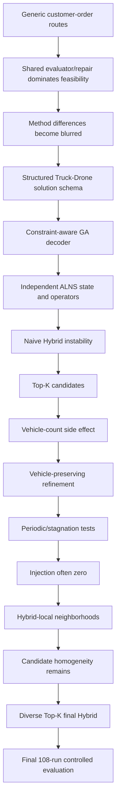

# Master Experimental Report V2 Deep Argumentation Edition

> This edition preserves the V2 structure and statistics, but expands the causal argumentation. It does not rerun solvers or modify algorithms. It integrates development logs, supporting experiments, diagnostics, and the final 108-run matrix.

## How To Read This Deep Edition

Evidence is separated into **final controlled evidence** and **developmental evidence**. Final controlled evidence comes from the 25-customer 108-run matrix and is used for final performance claims. Developmental evidence comes from logs, stage reports, small runs, smoke tests, and diagnostics; it explains why the algorithms evolved, but is not treated as strict controlled ablation.

## Development Evidence Matrix

Full CSV: `results/paper_analysis_v2/development_evidence_matrix.csv`.

| Stage | Method | Observed problem | Hypothesis | Modification | Before result | After result | Interpretation | Final status |
| --- | --- | --- | --- | --- | --- | --- | --- | --- |
| GA Stage 0 | GA | Customer-order-only encoding could not express truck/drone assignment, launch/recovery, charging, or multi-vehicle structure. | A richer solution representation is required before GA can search the final Truck-Drone EVRPTW-NL space. | Move from simple customer_order to structured solution with truck_routes, drone_tasks, charging_plan. | Early GA produced infeasible cases; time-window feasibility was reported around 20-40% in user-provided diagnostics. | Later GA output could represent multi-route truck-drone charging-capable solutions. | The bottleneck was not just search quality; it was missing expressiveness. | Superseded by final structured GA |
| GA Stage 1-3 | GA | Drone tasks were decorative when limited to single-customer missions without station visits. | Allowing multi-customer drone_route and drone charging should make drone service a real routing decision. | Upgrade drone task to route_index + launch + drone_route + recover + customers; allow station nodes and charging_plan vehicle='drone'. | Single-customer sortie could not express realistic drone contribution. | Final raw results contain drone_tasks and truck/drone distances in 25-customer solutions. | Problem complexity expansion and algorithm search had to evolve together. | Retained in final method |
| GA Stage 4-8 | GA | Multi-customer drone and charging search created a large candidate space and could threaten runtime. | Hierarchical pruning, evaluation cache, route rebalance, specialized mutation, route split, and diversity anchors can keep GA usable at 25/50 customers. | Add layered drone search, caching, Truck-Drone mutations, incremental vehicle expansion, route-preserving crossover, and time budget. | Unbounded drone construction risked slow or infeasible outputs. | GA development report states GA can generate feasible 25/50-customer solutions, but remains conservative. | GA became a strong feasible constructor rather than a pure optimizer. | Retained in final GA |
| ALNS Phase 1 | ALNS | Initial ALNS scaffold was not a real independent ALNS; it could not explain destroy/repair/local operator effects. | An explicit ALNSState and independent initial construction can make ALNS a fair standalone comparison method. | Add ALNSState, initial solution, D-Random/D-WorstTime/D-RouteRemoval/D-DroneTask, R-Regret/TW/Energy/Drone, and local operators. | Scaffold behavior was not comparable to final GA. | R101-5 True, 3 vehicles, distance 161.151, runtime 0.845s; R101-10 True, 3 vehicles, distance 240.500, runtime 5.497s; C101-5 and RC101-5 also True. | Independence was established before quality optimization. | Modified later |
| ALNS layered/petal/post-stage | ALNS | ALNS was feasible but conservative; full evaluator calls and many weak operators increased runtime. | Layered candidate evaluation and targeted operators can improve distance, crossing, drone, charging, and vehicle behavior without uncontrolled runtime. | Add route merge V2, crossing removal, drone rebuild, charging cleanup, vehicle reduction, spatial/petal metrics, and quick/local/full evaluation layers. | R101-25 alns_core True, 9 vehicles, distance 710.524, runtime 47.507s, evaluator calls 965. | Later R101-25 alns_core True, 9 vehicles, distance 643.225, runtime 45.195s, crossing successes 7; post-stage alns_full True, 10 vehicles, distance 780.638, drone tasks 4 in one snapshot. | The ALNS search landscape is operator-sensitive and not monotonic. | Retained in final ALNS with limitations |
| Hybrid Stage 1 | Hybrid | Simple GA best -> ALNS refine often failed to improve final accepted solution. | GA global search plus ALNS local refinement should be complementary. | Implement single-best post-processing from GA solution to ALNS state. | No true integration; selector simply chose GA or ALNS. | R101-5 retained GA because ALNS used more vehicles; R101-10 ALNS refine replaced GA with improvement_percentage about 0.64%; R101-25 retained GA because ALNS distance was shorter but vehicles higher. | Complementarity existed only under the ranking rule. | Superseded by Top-K |
| Hybrid Stage 2-2.5 | Hybrid | GA rank-1 was not always the best ALNS starting point; ALNS could reduce distance by adding vehicles. | Diverse Top-K plus vehicle-preserving refinement improves robustness. | select_diverse_top_k and preserve_vehicle_count. | Single-best refine was blocked by vehicle increases. | R101-10 Top-K selected rank 3 GA candidate; R101-25 Top-K selected rank 3; preserve kept R101-5 and R101-25 vehicle counts while accepting same-vehicle improvement on R101-10. | Hybrid needs both diversity and aligned objective rules. | Retained in final Hybrid logic |
| Hybrid Stage 3-6 | Hybrid | Post-processing might be too late, but fixed ALNS triggering did not guarantee injection. | Periodic/stagnation ALNS and hybrid-local operators can inject improvements during candidate evolution. | Periodic elite improvement, stagnation-triggered ALNS, H-local operators. | Top-K alone could be limited. | R101-5 periodic injected 1 candidate; R101-25 periodic completed in about 97.2s but injection count was 0. Stagnation R101-10/25 triggered but injected 0. Stage6 summary: GA 100% feasible, 3.000 vehicles, distance 349.970; hybrid_topk 371.125; hybrid_preserve 358.810. | Timing was less important than candidate quality and neighborhood compatibility. | Supporting evidence |
| Hybrid Stage 7-9 | Hybrid | GA candidate pool was too homogeneous; ALNS refined similar neighborhoods. | Multi-type high-diversity candidates plus paper-cost priority can give ALNS better starts and make final ranking consistent. | distance/vehicle/TW/drone/charging/petal/balanced candidate types, hybrid_diverse_topk, paper_cost_priority. | C101-10 hybrid_diverse_topk once had about 532s runtime before fix. | Debug: hybrid_diverse_topk 100% feasible, 2.667 vehicles, distance 344.074, paper cost 494.442, runtime 4.584s; final 108-run matrix retained for controlled conclusions. | Final Hybrid is a conditional enhancement, not guaranteed dominance. | Retained in final Hybrid |
| Petal/spatial development | GA/ALNS/Hybrid metrics | Distance and vehicle count alone did not describe route shape; routes could cross or overlap spatially. | Petal/spatial soft metrics help diagnose and guide route quality without becoming hard constraints. | Add petal_score, crossing_count, route_compactness, sector_coherence, depot_radial_consistency. | R101-25 alns_core crossing_count 19 and petal_score 967.846 in one report. | Updated alns_full snapshot showed crossing_count 8 and petal_score 411.927 but vehicle_count 10 and distance 780.638. | Petal is a soft diagnostic/secondary metric, not a hard optimization goal. | Retained as soft metric/diagnostic |

## Expanded Mathematical Model and Coupling Logic

The final problem has three coupled decision layers: route construction, service-mode assignment, and energy/charging scheduling. A customer cannot be inserted as if it only changes distance. If customer \(i\) is moved from truck service to a drone mission, the truck route loses one service node, the drone route gains one or more legs, the launch and recovery nodes become binding, the drone SOC changes, the recovery time changes, and the truck may wait. That waiting can then delay all later truck customers and create time-window violations. Similarly, inserting a charging station solves battery feasibility but may increase completion time and cause later due-time violations.

Conceptually, a solution is \(S=(R,M,G)\), where \(R\) is the set of truck routes, \(M\) is the set of same-route drone missions, and \(G\) is the charging plan. For each customer \(i \in C\), the coverage constraint is

$$\sum_{r \in R} \mathbf{1}[i \in r] + \sum_{m \in M} \mathbf{1}[i \in P_m] = 1.$$

Truck and drone time propagation follow the same causal form. If node \(j\) follows \(i\), then arrival is \(a_j = t_i^{dep} + d_{ij}/v\), service begins at \(b_j=\max(a_j,e_j)\), and hard time-window feasibility requires \(b_j \le l_j\). Waiting is \(b_j-a_j\), and is not itself infeasibility unless it causes downstream lateness.

Truck SOC and drone SOC are propagated as \(E_j = E_i - \rho d_{ij} + g_i\), with \(0 \le E_j \le B\). Station visits are not created arbitrarily by algorithms; only generated station nodes can be inserted. Linear charging uses a constant rate. Nonlinear charging is implemented as segmented cumulative time over SOC intervals. Full policies set target energy to battery capacity; partial policies set target energy to a required-energy estimate plus safety margin. Thus, NFC can become expensive when it pushes charging into high-SOC low-rate segments, while NPC can avoid some high-SOC time if partial charge is enough for feasibility.

This coupling explains why the early **route first + repair later** approach was structurally weak. If search ignores service mode, launch/recovery, energy, and charging, it spends most effort in regions that the simulator later rejects or heavily modifies. This reduces method differentiation and makes Hybrid shallow: GA and ALNS both rely on the same downstream feasibility machinery instead of exploring genuinely different feasible neighborhoods.

## Deep GA Development Narrative

### GA Stage 1 - From customer order to structured representation

**Problem.** The first GA was close to a generic VRP/VRPTW genetic algorithm: it searched a customer permutation and decoded it into routes. This is not enough for Truck-Drone EVRPTW-NL because the chromosome did not express whether a customer is truck-served or drone-served, which truck route owns a drone mission, where the drone launches and recovers, or whether the truck/drone needs charging.

**Evidence.** The GA development report records that early solutions frequently relied on final evaluator checks and could not show that GA itself understood the final constraints. User-observed diagnostics before the first GA-aware decoder showed low time-window feasibility in small R101 cases, with failures concentrated in time-window nodes rather than coverage or battery only.

**Diagnosis.** This was not random noise. A customer-order chromosome simply cannot encode final-model decisions. If the representation lacks service mode and mission structure, no amount of crossover or mutation can directly improve those decisions.

**Modification and mechanism.** The solution schema was expanded to `truck_routes`, `drone_tasks`, and `charging_plan`, and the GA individual gained service-mode, drone-priority, route-split, vehicle-count, and charging-policy information. This changes GA from a route-order optimizer into a constructive solver over the final solution structure.

**Result and next decision.** The modification solved expressiveness but enlarged the search space. This motivated the constraint-aware decoder: once GA can represent the final model, it must construct within feasible neighborhoods instead of generating arbitrary structures and asking the evaluator to reject them.

### GA Stage 2 - Constraint-aware decoder

**Problem.** The project identified the original symptom: current small instances could have high aggregate feasibility rate but still be `feasible=False`, mainly because a few time-window nodes violated hard due times. A simple True/False feasible column was too coarse, so feasibility-rate diagnostics were introduced first.

**Hypothesis.** If time windows, energy, charging, drone feasibility, and synchronization are considered during decoding, GA should stop wasting search effort on obviously invalid structures.

**Modification.** The decoder moved from search-first/repair-later to TW/Energy/Charging/Drone/Sync-aware construction. Truck insertion evaluates time propagation and battery. Drone assignment is accepted only when launch/recovery, demand, endurance, time windows, and synchronization are reasonable. Fallback returns impossible drone customers to truck service.

**Interpretation.** This is the most important GA methodological shift. Feasibility is no longer created mainly after the fact; it becomes part of how candidate solutions are generated. The remaining evaluator is still the final judge, but GA now searches a more meaningful region.

### GA Stage 3 - Multi-customer drone and drone charging

**Problem.** A single-customer sortie made the drone look decorative. It could occasionally remove one customer from a truck route, but it could not represent realistic local drone service or station-supported drone movement.

**Modification.** The drone mission schema became `launch -> customer/station/... -> recover`, with `customers` listing all drone-served customers and `charging_plan` indicating truck or drone charging. This retained same-route launch/recovery but removed artificial limits on the number of drone-served customers inside a mission.

**Mechanism.** A multi-customer drone route can reduce truck detours more meaningfully, but it must also pay drone travel, service, charging, and recovery synchronization time. This creates a real trade-off rather than decorative drone usage.

**Remaining limitation.** The combinatorial space became larger, so later GA stages added hierarchical pruning, caching, route split, specialized mutation, and time budgets. This is why final GA is feasible and scalable enough for 25-customer experiments but still conservative in vehicle compression and local distance polishing.

### GA Stage 4 - Diversity as a Hybrid role

The final Hybrid work changed GA's role. GA was no longer only a standalone solver; it also became a generator of structurally different promising starts for ALNS. This explains the final candidate types: distance-oriented, vehicle-oriented, time-window-oriented, drone-aggressive, drone-conservative, charging-oriented, petal-oriented, and balanced. These were not arbitrary labels. They directly answer the Hybrid failure that quality-ranked Top-K candidates were still structurally similar.

## Deep ALNS Development Narrative

### ALNS Stage 1 - From scaffold to independent method

The first ALNS limitation was methodological: a nearest-neighbor scaffold with fixed drone behavior was not a true ALNS and could not serve as a paper comparison method. The fix was to create `ALNSState`, independent initial construction, named destroy/repair/local-search operators, and diagnostics. Development evidence shows this made small cases feasible: R101-5 NPC was True with 3 vehicles, distance 161.151, runtime 0.845s; R101-10 NPC was True with 3 vehicles, distance 240.500, runtime 5.497s. This evidence is developmental, but it shows the transition from scaffold to independent runnable method.

### ALNS Stage 2 - Problem-aware operators

Generic random removal and simple insertion were insufficient because Truck-Drone EVRPTW-NL violations are not random. Time-window pressure, charging detours, drone synchronization, route crossing, and vehicle overuse have structure. Therefore destroy operators became time/route/drone/charging/spatial-aware, and repair operators became regret/TW/energy/drone/vehicle-aware. The mechanism is simple: destroy should expose the part of the solution causing pressure, while repair should reinsert customers with the constraints that caused the pressure in mind.

### ALNS Stage 3 - Diagnostics-driven interpretation

ALNS diagnostics are not just implementation logs. They reveal the search landscape. A high acceptance count but low improvement count means an operator often produces feasible or accepted moves but rarely changes the final objective. A low-frequency high-improvement operator may be valuable but hard to trigger. The final operator summary classifies operators into high-frequency/high-value, high-frequency/low-value, low-frequency/high-value, and low-frequency/low-value. This supports a conservative interpretation: ALNS has real local search capability, but its value depends on which neighborhoods align with the final ranking.

### ALNS Stage 4 - Spatial and layered evaluation

Petal and crossing metrics were introduced after visual route-quality concerns. R101-25 alns_core was reported with crossing_count 19 and petal_score 967.846 in one developmental snapshot. Later updated alns_full had crossing_count 8 and petal_score 411.927, but also 10 vehicles and distance 780.638. This is important negative evidence: a visually better route can trade off against vehicles and distance. Therefore petal_score is retained as a soft diagnostic/secondary metric, not a hard constraint.

## Deep Hybrid Development Narrative

### Hybrid Stage 1 - Naive GA to ALNS

The initial rationale was valid: GA provides population-level global search and ALNS provides adaptive local refinement. The failure was also instructive. R101-5 retained GA because ALNS found a shorter but higher-vehicle candidate; R101-10 accepted ALNS refine with about 0.64% improvement; R101-25 again retained GA because the ALNS candidate used more vehicles. This showed that complementarity does not automatically become accepted synergy. The same local move can look good under distance but bad under vehicle-priority ranking.

### Hybrid Stage 2 - Top-K and vehicle preservation

Top-K addressed the diagnosis that GA rank-1 is not necessarily the best ALNS starting point. Development evidence reports R101-10 and R101-25 selecting rank-3 candidates, showing that candidate rank under GA is not identical to refinement potential. Vehicle-preserving refinement then fixed a second issue: ALNS could improve distance by increasing vehicles. The benefit is a more defensible Hybrid; the cost is reduced aggressiveness and rejection of some distance improvements.

### Hybrid Stage 3 - Periodic, stagnation, and local neighborhoods

The next hypothesis was that post-processing might be too late, so ALNS was inserted periodically or when GA stagnated. The experiments did not fully support this. R101-25 periodic completed within about 97.2s but had zero periodic injection. Stagnation triggered on R101-10 and R101-25 but also injected zero improvements. This means the bottleneck was not merely when ALNS was called. It was whether the candidate and neighborhood were compatible.

Hybrid-local operators then tried same-vehicle and no-new-vehicle moves. This reduced the risk of damaging GA structures, but Stage6 still showed uneven benefit: GA had 100% feasibility, 3.000 vehicles, distance 349.970 in the debug batch; hybrid_topk had 371.125; hybrid_preserve had 358.810. The interpretation is not that Hybrid was useless, but that shallow local refinement cannot overcome homogeneous candidate pools.

### Hybrid Stage 4 - Diverse Top-K final direction

The final Hybrid shift was therefore from more ALNS calls to more structurally diverse GA candidates. The debug evidence was strong enough to justify the final direction: hybrid_diverse_topk reached 100% feasibility, 2.667 vehicles, distance 344.074, paper cost 494.442, runtime 4.584s in the 10-customer debug summary, outperforming the other debug methods on paper cost. But smoke and final evidence still required caution: in one R101-25 single-case audit, Hybrid found shorter distance than GA but used 8 vehicles instead of 7; in the 25-customer smoke, Hybrid had 7 vehicles and distance 812.254 versus GA 7 vehicles and 810.202. Final positioning must therefore depend on the controlled 108-run matrix rather than the most favorable developmental result.

## Recovered Supporting Experiment Roles

- **5-customer evidence** demonstrates that the full state machinery can run: coverage, time windows, battery, drone mission, charging, and synchronization can all be traced. It is correctness/development evidence, not final performance evidence.
- **10-customer evidence** is the main method-development scale. It exposed Hybrid runtime pathology, candidate homogeneity, and the benefit of diverse candidate types.
- **25-customer development evidence** shows medium-scale behavior and smoke risks. It is useful for explaining why final 108-run controlled testing was needed.
- **50-customer evidence** is stress/development evidence only unless a controlled final matrix is later run. It should support robustness discussion but not primary claims.

## Research / Method Development Causal Map

## Deep RQ Interpretation

### RQ1 Constraint Adaptation

The project progressively moved constraints inside the algorithms. Early feasibility was mostly downstream. Final GA considers service mode, vehicle split, drone feasibility, time windows, charging, and synchronization during decoding. Final ALNS uses destroy/repair/local operators that target time, energy, drone, charging, and spatial structure. Final Hybrid adds conversion and vehicle-preserving rules. The evaluator remains the final court; this is appropriate because shared feasibility checking prevents methods from silently relaxing constraints.

### RQ2 Algorithmic Behavior

GA tends to be stable because it constructs conservatively. ALNS can discover independent local structures but may use more vehicles or spend time in low-yield neighborhoods. Hybrid can improve paper cost only when candidate diversity plus ALNS refinement beats the GA baseline under the same vehicle-feasibility priorities. Therefore vehicle count, distance, waiting, charging, and runtime must be interpreted together.

### RQ3 Instance Sensitivity

Instance families change the geometry and time-window pressure. C-type clustered instances can look simple spatially but may create concentrated time-window and route-balance pressure. R-type random instances create longer spatial spread. RC mixes both. Without profiling every violation by instance, the correct wording is: observed performance is instance-dependent; the plausible mechanisms are customer dispersion, cluster tightness, and time-window/synchronization pressure; exact causal attribution requires deeper per-node diagnostics.

### RQ4 Charging Policy

The charging-policy analysis must follow the 2x2 model. Full policies reduce energy risk but can waste time by charging beyond what is needed. Partial policies can reduce charging time but require good target-energy estimation. Nonlinear policies penalize high SOC because the segmented high-SOC rate is lower. Therefore NPC can be attractive when partial charge avoids the slow high-SOC region, but it can also be risky if target energy is underestimated.

### RQ5 Hybrid Effectiveness

Hybrid's research value lies in explaining when fusion works. The development chain shows four necessary conditions: candidate diversity, compatible ALNS neighborhood, vehicle-preserving acceptance, and ranking alignment. If any one fails, ALNS may improve a local metric but fail the final Hybrid rule. This is why Hybrid should be presented as a conditional method rather than a guaranteed dominant method.

### RQ6 Computational Robustness

Every major improvement increased computational burden: more GA candidates, more drone-task options, more ALNS operators, more local search candidates, more simulations, and more Hybrid refinement calls. The response was pruning, caching, layered evaluation, time budgets, and candidate Top-K. The correct research conclusion is a quality-runtime trade-off, not simply 'long runtime is a bug'.

## Expanded Negative Results

### Hybrid non-dominance

Evidence: development reports show cases where Hybrid retained GA, and final V2 W/T/L tables report conditional wins/losses. Explanation: ALNS local improvements may conflict with vehicle count or paper-cost priority. Lesson: Hybrid needs aligned acceptance rules and candidate diversity.

### Vehicle-distance conflict

Evidence: R101-25 single-case audit reported Hybrid shorter distance but more vehicles than GA. Explanation: splitting service across more routes can reduce route distance while violating the research preference for fewer vehicles. Lesson: vehicle-preserving refinement is necessary for credible paper comparison.

### Ineffective operators

Evidence: ALNS operator diagnostics show many operators are called far more often than they improve. Explanation: feasibility-preserving neighborhoods in this problem are narrow; many moves are accepted or feasible but not ranking-improving. Lesson: operator count is not contribution; improvement rate and accepted improvement matter.

### Runtime pathology

Evidence: Hybrid final development recorded a C101-10 hybrid_diverse_topk runtime around 532s before budget fixes; final runtime outliers are retained in V2. Explanation: candidate enumeration and full evaluation can create heavy tails. Lesson: runtime must be a first-class metric.

### Early repair/evaluator dependence

Evidence: early GA and ALNS generated rough structures and relied heavily on shared checks. Explanation: when feasibility comes mainly from a common downstream mechanism, method differences shrink and Hybrid complementarity weakens. Lesson: constraints must enter decoder/state/operator design.

## Original V2 Report

# Master Experimental Report V2: Truck-Drone EVRPTW-NL

> Paper master draft. This file reconstructs the research record from the final code, frozen model, saved configurations, diagnostics, and existing results. It is not the final conference paper.

## Evidence Coverage Statement

Highest-priority evidence used: final code in `TruckDrone_EVRPTW_NL`, `docs/final_model_freeze_spec.md`, `configs/hybrid_final_25_overnight.yaml`, `results/hybrid_final_25_overnight/summary.csv`, and `results/hybrid_final_25_overnight/raw_results.jsonl`. Development reports are used for method evolution. Early 5/10-customer and truck-only results are supporting or historical only. No solver was rerun.

Main analysis uses **108 final 25-customer runs**. Infeasible rows and runtime outliers are retained. Literature gaps are marked `[REFERENCE NEEDED]`.

## 1. Executive Summary

This study investigates **constraint-aware metaheuristic solution and computational analysis for a unified Truck-Drone EVRPTW-NL**. The final model combines routing, hard time windows, truck/drone energy propagation, launch-recovery synchronization, station charging, and LFC/LPC/NFC/NPC charging policies. The evidence does not support a preset universal winner. It supports a trade-off analysis: GA is a strong constructive baseline, ALNS provides independent neighborhood search and diagnostics, and Hybrid is conditionally useful when candidate diversity gives ALNS refinable starting structures.

| method | runs | feasible_runs | feasible_rate | feasible_vehicle_count_mean | feasible_total_distance_mean | feasible_paper_cost_mean | runtime_median | runtime_mean | runtime_max |
| --- | --- | --- | --- | --- | --- | --- | --- | --- | --- |
| ALNS | 36 | 27 | 75.0 | 8.888889 | 874.735865 | 1319.028256 | 90.529717 | 456.633936 | 10929.261842 |
| GA | 36 | 24 | 66.667 | 7.666667 | 906.231298 | 1262.172734 | 76.122086 | 402.306639 | 10922.699444 |
| Hybrid | 36 | 26 | 72.222 | 7.884615 | 891.437547 | 1232.753151 | 63.404685 | 62.724606 | 73.821376 |

## 2. Research Focus and Questions

| RQ | Question | Evidence |
| --- | --- | --- |
| RQ1 | How can GA and ALNS be adapted into constraint-aware Truck-Drone EVRPTW-NL methods? | solution schema, simulator, GA/ALNS code |
| RQ2 | How do GA, ALNS, and Hybrid differ across feasibility, vehicles, distance, charging, waiting, paper cost, and runtime? | final 108-row summary |
| RQ3 | How do C/R/RC instance structures affect method behavior? | instance_type_summary.csv |
| RQ4 | How do LFC/LPC/NFC/NPC affect performance? | charging_policy_summary.csv and charging.py |
| RQ5 | When and why does Hybrid improve, fail, or degrade? | hybrid diagnostics and W/T/L |
| RQ6 | How stable are runtimes and what extreme cases appear? | runtime_summary.csv and runtime_outliers.csv |

## 3. Literature and Research Context

Solomon VRPTW motivates C/R/RC time-window benchmarks [Solomon1987, REFERENCE NEEDED]. Schneider E-VRPTW motivates electric truck routing with time windows and charging stations [Schneider2014]. ETRD-NL motivates auxiliary vehicle synchronization and nonlinear/partial charging context [ETRD-NL, REFERENCE NEEDED]. ALNS, GA, Hybrid metaheuristics, truck-drone routing, and EV charging references require final bibliography completion; see `docs/reference_gaps.md`.

## 4. Problem Motivation

The complexity chain is VRP -> VRPTW -> EVRPTW -> Truck-Drone Routing -> Energy-constrained Truck-Drone Routing -> Nonlinear/Partial Charging -> Truck-Drone EVRPTW-NL. Each step adds decisions and hard constraints: customer sequence, service timing, battery state, station visits, service assignment, launch/recovery, synchronization, charging amount, and SOC-dependent charging time. These decisions are coupled, so a route change can affect time windows, energy feasibility, drone synchronization, and charging time at the same time.

## 5. Source Problem Evolution

| Dimension | Schneider E-VRPTW | ETRD-NL | Final model |
| --- | --- | --- | --- |
| Time windows | Yes | project deep reading context | hard TW for truck/drone service |
| Electric truck | Yes | yes in project context | truck SOC and station charging |
| Auxiliary vehicle | No | robot | drone |
| Synchronization | No | truck-robot synchronization | same-route truck-drone recovery synchronization |
| Nonlinear/partial charging | not final source for NL/partial | yes | LFC/LPC/NFC/NPC |
| Service structure | truck-only | truck-robot | truck or multi-customer drone mission |

## 6. Final Mathematical Model

These variables form a conceptual mathematical representation, while the actual solvers use structured solution objects and simulation.

Sets: depot $0$, customers $C$, charging stations $F$, nodes $N={0}\cup C\cup F$, truck routes $R$, drone missions $M_r$ attached to route $r$. Parameters include Euclidean distance $d_{ij}$, travel time $d_{ij}/v$, demand $q_i$, time window $[e_i,l_i]$, service time $s_i$, truck/drone capacities $Q_T,Q_D$, batteries $B_T,B_D$, consumption rates $\rho_T,\rho_D$, and charging functions. Conceptual variables include truck arc use, service mode, mission use, arrival/start/waiting times, truck/drone SOC, and charged energy.

| Constraint | Formula/rule | Code | Violation | Hard |
| --- | --- | --- | --- | --- |
| Customer coverage | each customer served exactly once by truck or drone | route_simulator.py:_check_customer_coverage | customer_coverage | Yes |
| Depot start/end | each truck route starts and ends at depot | route_simulator.py:_simulate_multi_route_solution | truck_route | Yes |
| Truck/drone capacity | route demand <= capacity | route_simulator.py capacity checks | capacity | Yes |
| Drone mission legality | launch/recover in same truck route and ordered | route_simulator.py:_check_drone_tasks | drone_mission | Yes |
| Time propagation/TW | arrival + waiting; service_start <= due | route_simulator.py:_simulate_one_route_states/_simulate_drone_task | time_window | Yes |
| Synchronization | early side waits at recovery | route_simulator.py | sync / waiting metrics | structure hard, waiting soft |
| Truck/drone SOC | SOC decreases by distance*rate and recovers by charging | route_simulator.py + charging.py | truck_battery/drone_battery | Yes |
| Charging station use | use existing generated stations only | instance_builder.py + route_simulator.py | charging | Yes |
| Petal/spatial quality | compactness/crossing/petal score | spatial_metrics.py | none | No |

The report scalar `paper_cost = total_distance + charging_time + 0.25*waiting_time + 0.25*drone_waiting_time`. It is an analysis scalar, not a claim of global optimality.

## 7. Mathematical Charging Model

| Policy | Linearity | Target | Meaning |
| --- | --- | --- | --- |
| LFC | Linear | Full | constant-rate charge to battery capacity |
| LPC | Linear | Partial | constant-rate charge to required energy plus safety margin |
| NFC | Nonlinear | Full | segmented SOC charge to battery capacity |
| NPC | Nonlinear | Partial | segmented SOC charge to required energy plus safety margin |

## 8. Unified Computational Framework

Instance -> Solver -> Solution schema -> Route simulator -> Evaluator -> CSV/JSONL/Figures. GA, ALNS, and Hybrid use the same final schema and evaluator; the evaluator reports metrics rather than enforcing a single scalar objective.

## 9. Final GA Method

Final GA uses structured individuals rather than only customer order. It encodes customer order, service-mode preference, drone priority, charging policy, route split bias, and vehicle allowance. The decoder constructs multi-route truck solutions, tries truck/drone service choices, inserts charging when necessary, uses fallback when drone service is infeasible or unhelpful, and then calls the unified evaluator.

| Step | Purpose | Code |
| --- | --- | --- |
| Representation | encode order, service mode, drone/charging preference | solvers/solve_ga.py, solvers/ga_tools.py |
| Initialization | seed balanced, distance, vehicle, TW, drone, charging, petal candidates | generate_diverse_ga_candidates_for_hybrid |
| Decoder | build truck_routes, drone_tasks, charging_plan | ga_tools.py |
| Mutation/crossover | change order, service mode, route bias, policy | solve_ga.py helpers |
| Evaluation | shared evaluator and ranking metrics | evaluator.py |

## 10. Final ALNS Method

Final ALNS is an independent method with explicit state, initial construction, destroy/repair/local search, candidate evaluation, acceptance, diagnostics, and best-state update. It does not use GA initial solutions in baseline mode.

## 11. Final Hybrid GA-ALNS

Final Hybrid uses diverse GA candidate generation, Top-K diversity selection, conversion to ALNS state, vehicle-preserving ALNS refinement, evaluator validation, and paper-cost/ranking comparison. Its theoretical complementarity is GA global/diverse construction plus ALNS local restructuring; the data show this is conditional, not guaranteed.

## 12. Algorithm Development History

| Stage | Problem | Interpretation |
| --- | --- | --- |
| Naive Hybrid | GA best + ALNS often gave zero improvement | single best start was too narrow |
| Top-K | GA best was not always best ALNS start | candidate diversity matters |
| Vehicle-preserving | ALNS lowered distance but increased vehicles | refinement must obey paper ranking |
| Periodic/Stagnation | post-processing may be too late | timing alone did not guarantee injection |
| Hybrid-local | independent ALNS neighborhoods too disruptive | small local refinements are safer but uneven |
| Diverse Top-K final | candidate homogeneity limited synergy | explicit candidate types are the final Hybrid direction |

## 13. Experimental Design

| source_instances | customer_count | methods | charging_policies | seeds | station_count | nominal_time_budget | total_runs |
| --- | --- | --- | --- | --- | --- | --- | --- |
| R101, C101, RC101 | 25 | GA, ALNS, Hybrid | LFC, LPC, NFC, NPC | 1987, 42, 128 | 8 | 90s | 108 |

## 14. Experiment Inventory

| Experiment ID | Stage | customer count | source instance | algorithm | charging policy | seeds | final classification |
| --- | --- | --- | --- | --- | --- | --- | --- |
| E001 | ALNS ablation | 25 | R101, C101, RC101 | alns_core, alns_vehicle, alns_petal, alns_drone, alns_charging, alns_full | LFC, LPC, NFC, NPC |  | SUPPORTING |
| E002 | ALNS ablation | 50 | R101, C101, RC101 | alns_core, alns_vehicle, alns_petal, alns_drone, alns_charging, alns_full | LFC, LPC, NFC, NPC |  | SUPPORTING |
| E003 | debug/smoke validation | 5, 10 | R101, C101, RC101 | alns_core, alns_vehicle, alns_petal, alns_drone, alns_charging, alns_full | NPC |  | EXCLUDED |
| E004 | debug/smoke validation | 5, 10 | R101, C101, RC101 | ga, alns, hybrid | LFC, LPC, NFC, NPC |  | EXCLUDED |
| E005 | Hybrid development | 25 | R101, C101, RC101 | ga, alns_full, hybrid_topk, hybrid_stagnation, hybrid_diverse_topk, hybrid_diverse_stagnation | NPC | 1987, 42, 128 | SUPPORTING |
| E006 | final 25-customer formal experiment | 25 | R101, C101, RC101 | ga, alns_full, hybrid_diverse_topk | LFC, LPC, NFC, NPC | 1987, 42, 128 | MAIN |
| E007 | debug/smoke validation | 25 | R101 | ga, alns_full, hybrid_diverse_topk | NPC | 1987 | EXCLUDED |
| E008 | Hybrid development | 50 | R101, C101, RC101 | ga, alns_full, hybrid_topk, hybrid_stagnation, hybrid_diverse_topk, hybrid_diverse_stagnation | NPC | 1987, 42, 128 | SUPPORTING |
| E009 | debug/smoke validation | 10 | R101, C101, RC101 | ga, alns_full, hybrid_topk, hybrid_stagnation, hybrid_diverse_topk, hybrid_diverse_stagnation | NPC |  | EXCLUDED |
| E010 | Hybrid development | 25 | R101, C101, RC101 | ga, alns_full, hybrid_topk, hybrid_preserve, hybrid_periodic, hybrid_stagnation | NPC |  | SUPPORTING |
| E011 | debug/smoke validation | 10 | R101, C101, RC101 | ga, alns_full, hybrid_topk, hybrid_preserve, hybrid_periodic, hybrid_stagnation | NPC |  | EXCLUDED |
| E012 | Hybrid development | 25 | R101, C101, RC101 | ga, alns_full, hybrid_topk, hybrid_preserve, hybrid_periodic, hybrid_stagnation | LFC, LPC, NFC, NPC |  | SUPPORTING |
| E013 | debug/smoke validation | 5, 10 | R101, C101, RC101 | ga, alns_full, hybrid_refine, hybrid_topk, hybrid_preserve, hybrid_periodic, hybrid_stagnation | NPC |  | EXCLUDED |
| E014 | petal/spatial development | 25 | R101, C101, RC101 | ga_td_petal, alns_td_petal | LFC, LPC, NFC, NPC |  | SUPPORTING |
| E015 | petal/spatial development | 50 | R101, C101, RC101 | ga_td_petal, alns_td_petal | NPC |  | SUPPORTING |

## 15. Data Quality Audit

| detected issue | affected rows | whether corrected | correction rule |
| --- | --- | --- | --- |
| main row count | 108 | not corrected | Expected 108 from config; observed 108. |
| duplicate runs | 0 | not corrected | Duplicates are reported, not deleted. |
| missing expected combinations | 0 | not corrected | No imputation. |
| infeasible runs | 31 | not corrected | Retained for feasible-rate analysis. |
| runtime > 500s | 4 | not corrected | Outliers retained. |
| feasible-total_violation inconsistency | 0 | not corrected | Reported only. |

## 16. Statistical Rules

Feasible rate uses all runs. Vehicle count, distance, charging, waiting, completion, and paper cost are reported mainly on feasible-only rows. Runtime uses all rows. Outliers and infeasible rows are retained. Historical truck-only results are not mixed into final Truck-Drone averages.

## 17. RQ1 Constraint Adaptation Evidence

All final methods produce a shared solution schema and pass through the same simulator/evaluator. GA adapts mainly through constraint-aware construction. ALNS adapts through state-level destroy/repair/local operators. Hybrid adapts through diverse candidate generation, ALNS state conversion, and vehicle-preserving refinement.

## 18. RQ2 Overall Algorithm Behavior

| method | runs | feasible_rate | feasible_vehicle_count_mean | feasible_total_distance_mean | feasible_truck_distance_mean | feasible_drone_distance_mean | feasible_completion_time_mean | feasible_charging_time_mean | feasible_waiting_time_mean | feasible_paper_cost_mean | runtime_median | runtime_max |
| --- | --- | --- | --- | --- | --- | --- | --- | --- | --- | --- | --- | --- |
| ALNS | 36 | 75.0 | 8.888889 | 874.735865 | 800.865731 | 73.870134 | 353.255505 | 137.720392 | 1114.748686 | 1319.028256 | 90.529717 | 10929.261842 |
| GA | 36 | 66.667 | 7.666667 | 906.231298 | 804.239413 | 101.991886 | 379.337941 | 170.940348 | 683.615107 | 1262.172734 | 76.122086 | 10922.699444 |
| Hybrid | 36 | 72.222 | 7.884615 | 891.437547 | 786.474962 | 104.962585 | 362.986364 | 156.253175 | 684.790325 | 1232.753151 | 63.404685 | 73.821376 |

## 19. RQ3 Instance Sensitivity

| source_instance | method | runs | feasible_rate | feasible_vehicle_count_mean | feasible_total_distance_mean | feasible_paper_cost_mean | runtime_mean |
| --- | --- | --- | --- | --- | --- | --- | --- |
| C101 | ALNS | 12 | 33.333 | 9.0 | 1056.818485 | 2616.060205 | 997.810454 |
| C101 | GA | 12 | 33.333 | 5.75 | 1094.484442 | 1999.379462 | 73.002336 |
| C101 | Hybrid | 12 | 33.333 | 5.5 | 1088.223049 | 2007.170985 | 63.488062 |
| R101 | ALNS | 12 | 100.0 | 9.583333 | 782.233274 | 1027.033111 | 90.437677 |
| R101 | GA | 12 | 66.667 | 8.25 | 777.78524 | 1020.995354 | 984.440674 |
| R101 | Hybrid | 12 | 83.333 | 8.8 | 814.379064 | 1039.55973 | 63.640798 |
| RC101 | ALNS | 12 | 91.667 | 8.090909 | 909.43592 | 1165.920433 | 281.653678 |
| RC101 | GA | 12 | 100.0 | 7.916667 | 929.110956 | 1177.222078 | 149.476907 |
| RC101 | Hybrid | 12 | 100.0 | 7.916667 | 890.057783 | 1135.608391 | 61.044957 |

## 20. RQ4 Charging Policy Analysis

| charging_policy | policy_family | method | runs | feasible_rate | feasible_charging_time_mean | feasible_completion_time_mean | feasible_total_distance_mean | feasible_paper_cost_mean | runtime_mean |
| --- | --- | --- | --- | --- | --- | --- | --- | --- | --- |
| LFC | Linear / Full | ALNS | 9 | 77.778 | 166.309045 | 347.996813 | 883.476187 | 1345.546328 | 90.633511 |
| LFC | Linear / Full | GA | 9 | 66.667 | 200.75867 | 375.692237 | 918.289716 | 1274.279824 | 182.508805 |
| LFC | Linear / Full | Hybrid | 9 | 66.667 | 157.639818 | 373.191635 | 875.013361 | 1205.885795 | 61.55694 |
| LPC | Linear / Partial | ALNS | 9 | 77.778 | 80.751952 | 343.707607 | 883.501689 | 1267.473768 | 90.556759 |
| LPC | Linear / Partial | GA | 9 | 66.667 | 110.420603 | 374.745151 | 909.184741 | 1240.383916 | 73.030853 |
| LPC | Linear / Partial | Hybrid | 9 | 77.778 | 97.579998 | 346.082273 | 897.990784 | 1194.859496 | 64.210524 |
| NFC | Nonlinear / Full | ALNS | 9 | 66.667 | 242.731195 | 380.916144 | 849.55962 | 1422.167524 | 1294.781204 |
| NFC | Nonlinear / Full | GA | 9 | 66.667 | 248.166275 | 392.378315 | 871.686244 | 1319.676731 | 1279.066011 |
| NFC | Nonlinear / Full | Hybrid | 9 | 66.667 | 287.641738 | 393.434386 | 894.485362 | 1361.623411 | 62.656817 |
| NPC | Nonlinear / Partial | ALNS | 9 | 77.778 | 76.090921 | 344.352976 | 878.809357 | 1255.659586 | 350.56427 |
| NPC | Nonlinear / Partial | GA | 9 | 66.667 | 124.415843 | 374.536061 | 925.764491 | 1214.350464 | 74.620886 |
| NPC | Nonlinear / Partial | Hybrid | 9 | 77.778 | 101.119031 | 345.044777 | 896.349772 | 1183.215746 | 62.474142 |

## 21. RQ5 Hybrid Effectiveness

| source_instance | charging_policy | runs | feasible_rate | candidate_count_mean | selected_candidate_count_mean | alns_improved_candidates_mean | best_improvement_percentage_mean | paper_cost_before_mean | paper_cost_after_mean | selected_candidate_types |
| --- | --- | --- | --- | --- | --- | --- | --- | --- | --- | --- |
| R101 | LFC | 3 | 66.667 | 15.0 | 3.0 | 1.666667 | 31.762425 | 1114.114105 | 1081.345784 | drone_aggressive,balanced,vehicle_oriented;time_window_oriented,balanced,vehicle_oriented;vehicle_oriented,balanced,time_window_oriented |
| R101 | LPC | 3 | 100.0 | 13.666667 | 3.0 | 1.666667 | 33.282005 | 1040.535136 | 1019.098831 | distance_oriented,vehicle_oriented,balanced;drone_aggressive,balanced,time_window_oriented;vehicle_oriented,petal_oriented,drone_aggressive |
| R101 | NFC | 3 | 66.667 | 15.0 | 3.0 | 2.0 | 26.336414 | 1187.183989 | 1189.923087 | drone_aggressive,vehicle_oriented,distance_oriented;drone_aggressive,vehicle_oriented,drone_conservative;vehicle_oriented,balanced,charging_oriented |
| R101 | NPC | 3 | 100.0 | 13.0 | 3.0 | 2.0 | 33.598582 | 1064.758765 | 984.898053 | drone_aggressive,balanced,distance_oriented;time_window_oriented,balanced,vehicle_oriented;vehicle_oriented,drone_aggressive,balanced |
| C101 | LFC | 3 | 33.333 | 13.0 | 3.0 | 0.666667 | 61.501346 | 1637.679731 | 1698.601102 | time_window_oriented,balanced,drone_aggressive;vehicle_oriented,distance_oriented,balanced;vehicle_oriented,time_window_oriented,balanced |
| C101 | LPC | 3 | 33.333 | 15.0 | 3.0 | 0.333333 | 14.850938 | 1703.822586 | 1740.45974 | balanced,time_window_oriented,distance_oriented;drone_aggressive,vehicle_oriented,charging_oriented;drone_conservative,drone_aggressive,balanced |
| C101 | NFC | 3 | 33.333 | 15.0 | 3.0 | 0.666667 | 63.403084 | 1864.683099 | 2032.040715 | time_window_oriented,balanced,drone_aggressive;vehicle_oriented,balanced,drone_aggressive;vehicle_oriented,balanced,time_window_oriented |
| C101 | NPC | 3 | 33.333 | 17.0 | 3.0 | 0.666667 | 44.828295 | 1682.0394 | 1710.157219 | drone_aggressive,vehicle_oriented,balanced;drone_conservative,balanced,drone_aggressive;vehicle_oriented,drone_conservative,balanced |
| RC101 | LFC | 3 | 100.0 | 16.0 | 3.0 | 2.0 | 3.443179 | 1135.73918 | 1067.165347 | balanced,drone_aggressive,vehicle_oriented;balanced,time_window_oriented,vehicle_oriented;drone_conservative,balanced,charging_oriented |
| RC101 | LPC | 3 | 100.0 | 15.333333 | 3.0 | 0.666667 | 0.000612 | 1056.59957 | 1055.462323 | balanced,drone_conservative,distance_oriented;balanced,time_window_oriented,distance_oriented;drone_conservative,charging_oriented,drone_aggressive |
| RC101 | NFC | 3 | 100.0 | 16.0 | 3.0 | 2.0 | 2.374188 | 1317.871942 | 1299.988794 | drone_conservative,balanced,time_window_oriented;petal_oriented,vehicle_oriented,drone_conservative;time_window_oriented,vehicle_oriented,distance_oriented |
| RC101 | NPC | 3 | 100.0 | 16.0 | 3.0 | 0.666667 | 0.0 | 1119.8171 | 1119.8171 | balanced,drone_conservative,distance_oriented;drone_conservative,distance_oriented,balanced;drone_conservative,drone_aggressive,time_window_oriented |

| method | vs | wins | ties | losses | feasible_paired_delta_paper_cost_mean | feasible_paired_delta_paper_cost_median |
| --- | --- | --- | --- | --- | --- | --- |
| Hybrid | GA | 18 | 5 | 13 | -15.170217 | -6.00501 |
| Hybrid | ALNS | 25 | 0 | 11 | -111.195871 | -34.200711 |

Hybrid is useful when diverse GA candidates give ALNS a refinable structure. It fails when refinement increases vehicles, remains infeasible, or does not improve the selected ranking. This is a negative result to preserve, not hide.

## 22. RQ6 Computational Robustness

| method | runs | runtime_median | runtime_mean | runtime_std | runtime_max | runtime_gt_500_count | runtime_gt_1000_count |
| --- | --- | --- | --- | --- | --- | --- | --- |
| GA | 36 | 76.122086 | 402.306639 | 1811.42546 | 10922.699444 | 2 | 2 |
| ALNS | 36 | 90.529717 | 456.633936 | 1835.505163 | 10929.261842 | 2 | 2 |
| Hybrid | 36 | 63.404685 | 62.724606 | 6.03889 | 73.821376 | 0 | 0 |

### Extreme Runtime Cases

| instance | source_instance | customer_count | seed | method | charging_policy | truck_route | truck_routes | drone_tasks | feasible | vehicle_count | truck_distance | drone_distance | total_distance | completion_time | waiting_time | truck_waiting_time | drone_waiting_time | charging_count | charging_time | petal_score | crossing_count | route_compactness | sector_coherence | depot_radial_consistency | runtime_seconds | feasibility_rate | customer_coverage_rate | time_window_feasibility_rate | truck_battery_feasibility_rate | drone_battery_feasibility_rate | capacity_feasibility_rate | sync_feasibility_rate | total_violation | ga_before_cost | alns_after_cost | improvement_percentage | selected_source | ga_runtime | alns_refine_runtime | candidate_count | selected_candidate_count | selected_candidate_rank | selected_candidate_similarity_to_ga_best | comparison_mode | candidate_types | selected_candidate_types | ga_best_cost | candidate_before_cost | candidate_after_cost | candidate_vehicle_count_before | candidate_vehicle_count_after | alns_improved_candidates | best_improvement_percentage | per_candidate_runtime | vehicle_preserving_refine | baseline_vehicle_count | refined_vehicle_count | distance_improved | completion_time_improved | charging_time_improved | waiting_time_improved | petal_score_improved | accepted_by_hybrid_rule | rejected_reason | paper_cost_before | paper_cost_after | paper_distance_improved | paper_cost_improved | accepted_by_paper_rule | rejected_by_cost_rule | periodic_trigger_count | periodic_selected_elites | periodic_injected_count | periodic_rejected_count | periodic_best_before | periodic_best_after | stagnation_trigger_count | stagnation_selected_elites | stagnation_injected_count | stagnation_rejected_count | stagnation_immigrant_count | stagnation_best_before | stagnation_best_after | stagnation_batches | alns_called_due_to_no_improvement | alns_called_due_to_low_diversity | population_diversity_before | population_diversity_after | hybrid_local_operator_calls | hybrid_local_operator_successes | same_vehicle_relocate_successes | same_vehicle_swap_successes | no_new_vehicle_relocate_successes | drone_reassign_successes | launch_recover_adjust_successes | charging_polish_successes | waiting_reduction_successes | petal_polish_successes | accepted_same_vehicle_improvements | rejected_by_vehicle_increase | time_window_failed_nodes | truck_battery_failed_legs | drone_failed_tasks | customer_coverage_violation | time_window_violation | truck_battery_violation | drone_battery_violation | capacity_violation |
| --- | --- | --- | --- | --- | --- | --- | --- | --- | --- | --- | --- | --- | --- | --- | --- | --- | --- | --- | --- | --- | --- | --- | --- | --- | --- | --- | --- | --- | --- | --- | --- | --- | --- | --- | --- | --- | --- | --- | --- | --- | --- | --- | --- | --- | --- | --- | --- | --- | --- | --- | --- | --- | --- | --- | --- | --- | --- | --- | --- | --- | --- | --- | --- | --- | --- | --- | --- | --- | --- | --- | --- | --- | --- | --- | --- | --- | --- | --- | --- | --- | --- | --- | --- | --- | --- | --- | --- | --- | --- | --- | --- | --- | --- | --- | --- | --- | --- | --- | --- | --- | --- | --- | --- | --- | --- | --- | --- | --- |
| RC101_25_seed1987_td | RC101 | 25 | 1987 | ga_td | LFC | 0 ---> 5 ---> 46 ---> 55 ---> 0 | v1:0 ---> 5 ---> 46 ---> 55 ---> 0 | v2:0 ---> 42 ---> 35 ---> 0 | v3:0 ---> 45 ---> 88 ---> 53 ---> 0 | v4:0 ---> 36 ---> 1006 ---> 34 ---> 93 ---> 0 | v5:0 ---> 59 ---> 75 ---> 1005 ---> 0 | v6:0 ---> 11 ---> 99 ---> 1002 ---> 77 ---> 0 | v7:0 ---> 19 ---> 18 ---> 49 ---> 48 ---> 1005 ---> 0 | v8:0 ---> 95 ---> 62 ---> 71 ---> 0 | v9:0 ---> 28 ---> 30 ---> 1003 ---> 0 |  | True | 9 | 964.869714 | 0.0 | 964.869714 | 249.432235 | 256.413741 | 256.413741 | 0.0 | 5 | 197.60289 | 520.35229 | 10.0 | 10.28554 | 0.526772 | 1.098917 | 1083.48245 | 100.0 | 100.0 | 100.0 | 100.0 | 100.0 | 100.0 | 100.0 | 0.0 |  |  |  |  |  |  |  |  |  |  |  |  |  |  |  |  |  |  |  |  |  |  |  |  |  |  |  |  |  |  |  |  |  |  |  |  |  |  |  |  |  |  |  |  |  |  |  |  |  |  |  |  |  |  |  |  |  |  |  |  |  |  |  |  |  |  |  |  |  |  | 0.0 | 0.0 | 0.0 | 0.0 | 0.0 |
| R101_25_seed42_td | R101 | 25 | 42 | ga_td | NFC | 0 ---> 72 ---> 3 ---> 0 | v1:0 ---> 72 ---> 3 ---> 0 | v2:0 ---> 29 ---> 53 ---> 0 | v3:0 ---> 65 ---> 1005 ---> 0 | v4:0 ---> 83 ---> 18 ---> 13 ---> 0 | v5:0 ---> 69 ---> 85 ---> 91 ---> 0 | v6:0 ---> 36 ---> 1001 ---> 54 ---> 0 | v7:0 ---> 64 ---> 1001 ---> 0 | r1:53 ---> 97 ---> 0; r2:65 ---> 81 ---> 34 ---> 0; r0:72 ---> 2 ---> 23 ---> 3; r4:69 ---> 88 ---> 84 ---> 8 ---> 0; r3:83 ---> 98 ---> 31 ---> 13; r6:64 ---> 46 ---> 0 | False | 7 | 594.206286 | 398.789897 | 992.996183 | 197.962169 | 442.82309 | 340.440976 | 102.382114 | 3 | 163.365534 | 1148.245252 | 22.0 | 16.777959 | 1.891708 | 2.263675 | 10922.699444 | 94.666667 | 100.0 | 68.0 | 100.0 | 100.0 | 100.0 | 100.0 | 69.304372 |  |  |  |  |  |  |  |  |  |  |  |  |  |  |  |  |  |  |  |  |  |  |  |  |  |  |  |  |  |  |  |  |  |  |  |  |  |  |  |  |  |  |  |  |  |  |  |  |  |  |  |  |  |  |  |  |  |  |  |  |  |  |  |  |  |  |  | 2; 8; 23; 31; 54; 84; 88; 98 |  | 72->2->23->3; 83->98->31->13; 69->88->84->8->0 | 0.0 | 69.304372 | 0.0 | 0.0 | 0.0 |
| C101_25_seed42_td | C101 | 25 | 42 | alns_full | NFC | 0 ---> 20 ---> 35 ---> 1000 ---> 30 ---> 36 ---> 1000 ---> 50 ---> 0 | v1:0 ---> 20 ---> 35 ---> 1000 ---> 30 ---> 36 ---> 1000 ---> 50 ---> 0 | v2:0 ---> 67 ---> 1001 ---> 95 ---> 93 ---> 0 | v3:0 ---> 57 ---> 55 ---> 40 ---> 1006 ---> 59 ---> 66 ---> 0 | v4:0 ---> 96 ---> 99 ---> 1000 ---> 52 ---> 0 | v5:0 ---> 3 ---> 9 ---> 1 ---> 0 | v6:0 ---> 65 ---> 71 ---> 1007 ---> 61 ---> 0 | v7:0 ---> 90 ---> 82 ---> 91 ---> 0 |  | False | 7 | 792.28255 | 0.0 | 792.28255 | 1055.320325 | 2843.380199 | 2843.380199 | 0.0 | 6 | 304.70114 | 573.963136 | 11.0 | 14.148956 | 1.174916 | 1.042192 | 10929.261842 | 99.561404 | 100.0 | 100.0 | 97.368421 | 100.0 | 100.0 | 100.0 | 4.653332 |  |  |  |  |  |  |  |  |  |  |  |  |  |  |  |  |  |  |  |  |  |  |  |  |  |  |  |  |  |  |  |  |  |  |  |  |  |  |  |  |  |  |  |  |  |  |  |  |  |  |  |  |  |  |  |  |  |  |  |  |  |  |  |  |  |  |  |  | r1:93->0 |  | 0.0 | 0.0 | 4.653332 | 0.0 | 0.0 |
| RC101_25_seed42_td | RC101 | 25 | 42 | alns_full | NPC | 0 ---> 92 ---> 72 ---> 61 ---> 0 | v1:0 ---> 92 ---> 72 ---> 61 ---> 0 | v2:0 ---> 36 ---> 39 ---> 38 ---> 40 ---> 1001 ---> 0 | v3:0 ---> 5 ---> 2 ---> 8 ---> 7 ---> 1007 ---> 0 | v4:0 ---> 82 ---> 52 ---> 51 ---> 1006 ---> 91 ---> 0 | v5:0 ---> 47 ---> 1003 ---> 48 ---> 1003 ---> 0 | v6:0 ---> 62 ---> 27 ---> 1005 ---> 0 | v7:0 ---> 1003 ---> 75 ---> 97 ---> 1003 ---> 0 | v8:0 ---> 17 ---> 0 | r0:72 ---> 41 ---> 0; r1:39 ---> 44 ---> 40; r4:48 ---> 24 ---> 0 | True | 8 | 871.133393 | 99.029726 | 970.163119 | 219.334686 | 261.978721 | 245.370593 | 16.608128 | 8 | 117.376227 | 567.087553 | 11.0 | 10.267258 | 0.75829 | 0.961871 | 2384.601612 | 100.0 | 100.0 | 100.0 | 100.0 | 100.0 | 100.0 | 100.0 | 0.0 |  |  |  |  |  |  |  |  |  |  |  |  |  |  |  |  |  |  |  |  |  |  |  |  |  |  |  |  |  |  |  |  |  |  |  |  |  |  |  |  |  |  |  |  |  |  |  |  |  |  |  |  |  |  |  |  |  |  |  |  |  |  |  |  |  |  |  |  |  |  | 0.0 | 0.0 | 0.0 | 0.0 | 0.0 |

Observed evidence is limited to saved runtime fields. Without profiling, runtime causes remain plausible mechanisms rather than confirmed causes.

## 23. ALNS Operator Analysis

| operator_name | operator_type | calls | accepted_results | improved_results | acceptance_rate | improvement_rate | average_runtime_weighted | effectiveness_class |
| --- | --- | --- | --- | --- | --- | --- | --- | --- |
| D-DroneTask | destroy | 10701 | 8370 | 375 | 0.78217 | 0.035043 | 0.283368 | High-frequency / high-value |
| D-WorstTime | destroy | 7530 | 4396 | 210 | 0.583798 | 0.027888 | 0.14871 | High-frequency / high-value |
| D-ChargingCritical | destroy | 5350 | 2615 | 193 | 0.488785 | 0.036075 | 0.325508 | High-frequency / high-value |
| D-Crossing | destroy | 4815 | 2436 | 171 | 0.505919 | 0.035514 | 0.757803 | High-frequency / high-value |
| D-SyncCritical | destroy | 2086 | 1603 | 31 | 0.768456 | 0.014861 | 0.304434 | High-frequency / high-value |
| D-RouteRemoval | destroy | 4225 | 3377 | 28 | 0.79929 | 0.006627 | 0.156639 | High-frequency / low-value |
| D-AngleSector | destroy | 1498 | 938 | 27 | 0.626168 | 0.018024 | 0.363083 | High-frequency / high-value |
| D-Cluster | destroy | 1094 | 598 | 20 | 0.546618 | 0.018282 | 10.38884 | High-frequency / high-value |
| D-Random | destroy | 2717 | 1871 | 19 | 0.688627 | 0.006993 | 0.163954 | High-frequency / low-value |
| LS-DroneRebuildV2 | local_search | 18998 | 18550 | 2791 | 0.976419 | 0.14691 | 0.053495 | High-frequency / high-value |
| H-DroneReassign | local_search | 9098 | 9098 | 1433 | 1.0 | 0.157507 | 0.23665 | High-frequency / high-value |
| LS-DroneRebuild | local_search | 7320 | 7232 | 812 | 0.987978 | 0.110929 | 0.005128 | High-frequency / high-value |
| LS-RouteMergeV2 | local_search | 13701 | 13701 | 393 | 1.0 | 0.028684 | 1.2141 | High-frequency / high-value |
| LS-RelocateV2 | local_search | 21738 | 21738 | 254 | 1.0 | 0.011685 | 0.040734 | High-frequency / high-value |
| H-CrossRouteRelocateNoNewVehicle | local_search | 9098 | 9098 | 121 | 1.0 | 0.0133 | 0.00919 | High-frequency / high-value |
| LS-CrossingRemoval | local_search | 18261 | 18261 | 65 | 1.0 | 0.003559 | 0.019963 | High-frequency / low-value |
| LS-Relocate | local_search | 7320 | 7320 | 31 | 1.0 | 0.004235 | 0.011988 | High-frequency / low-value |
| H-SwapSameVehicle | local_search | 9098 | 9098 | 9 | 1.0 | 0.000989 | 0.007393 | High-frequency / low-value |
| H-RelocateSameVehicle | local_search | 9098 | 9098 | 7 | 1.0 | 0.000769 | 0.00805 | High-frequency / low-value |
| H-LaunchRecoverAdjust | local_search | 9098 | 9098 | 1 | 1.0 | 0.00011 | 0.001167 | High-frequency / low-value |
| LS-PetalPolish | local_search | 8574 | 8574 | 1 | 1.0 | 0.000117 | 0.005167 | High-frequency / low-value |
| LS-ChargingCleanup | local_search | 21729 | 21729 | 0 | 1.0 | 0.0 | 0.001419 | High-frequency / low-value |
| H-ChargingPolish | local_search | 9098 | 9098 | 0 | 1.0 | 0.0 | 0.00405 | High-frequency / low-value |
| H-WaitingReduction | local_search | 9098 | 9098 | 0 | 1.0 | 0.0 | 0.043295 | High-frequency / low-value |
| H-PetalPolish | local_search | 9098 | 9098 | 0 | 1.0 | 0.0 | 0.008008 | High-frequency / low-value |
| LS-RouteMerge | local_search | 7320 | 7320 | 0 | 1.0 | 0.0 | 0.0014 | High-frequency / low-value |
| R-TWAware | repair | 9899 | 6776 | 329 | 0.684514 | 0.033236 | 0.107647 | High-frequency / high-value |
| R-EnergyAware | repair | 7724 | 5196 | 264 | 0.672708 | 0.034179 | 0.465045 | High-frequency / high-value |
| R-Regret2 | repair | 9434 | 6491 | 262 | 0.688043 | 0.027772 | 1.520277 | High-frequency / high-value |
| R-DroneAware | repair | 6170 | 3634 | 98 | 0.588979 | 0.015883 | 0.162695 | High-frequency / high-value |
| R-VehicleReduction | repair | 2574 | 1669 | 58 | 0.648407 | 0.022533 | 0.507693 | High-frequency / high-value |
| R-ClusterInsertion | repair | 1505 | 866 | 25 | 0.575415 | 0.016611 | 0.461027 | High-frequency / high-value |
| R-PetalAware | repair | 1301 | 729 | 20 | 0.560338 | 0.015373 | 0.446513 | High-frequency / high-value |
| R-SweepInsertion | repair | 1215 | 690 | 18 | 0.567901 | 0.014815 | 0.498411 | High-frequency / high-value |
| R-ChargingAwareV2 | repair | 194 | 153 | 0 | 0.78866 | 0.0 | 0.016265 | Low-frequency / low-value |

## 24. Supporting 5/10-Customer Experiments

5-customer experiments validate mechanics and diagnostics. 10-customer experiments support method development. They are not the main controlled experiment.

## 25. Historical Truck-Only References

OR-Tools and PyVRP are truck-only references and are not directly comparable against complete Truck-Drone EVRPTW-NL methods.

## 26. Representative Solutions

Representative route uses saved raw result: instance=RC101_25_seed128_td, method=hybrid_diverse_topk, policy=LFC, vehicle_count=8, drone_tasks=1.

## 27. Negative Results and Failure Analysis

Hybrid non-dominance, infeasible runs, ineffective operators, vehicle-distance conflict, and runtime outliers are evidence. The correct structure is Evidence -> Mechanism -> Limitation -> Design implication. The final paper should not claim Hybrid always wins.

## 28. Discussion

GA's strength is stable constraint-aware construction. ALNS's strength is explicit neighborhood search and diagnostics. Hybrid's strength is conditional synergy through diverse starts and ALNS refinement; its weakness is that complementarity does not guarantee accepted improvement. Charging policies and instance structures change the search landscape, so no universal winner should be asserted.

## 29. Limitations

- 25 customers is the main formal scale; 50 customers is not a hard conclusion here.
- OR-Tools and PyVRP are not complete-model competitors.
- Truck and drone both use Euclidean distance.
- No road-network, airspace, wind, weather, no-fly zones, or cross-truck drone recovery are modeled.
- Charging curves are segmented approximations.
- No global optimality proof is provided.
- Hybrid does not have stable dominance on every metric.
- Runtime outliers are retained, but root causes are not proven without profiling.

## 30. Research Contributions

| Contribution | RQ | Evidence | Table/Figure | Limitation |
| --- | --- | --- | --- | --- |
| Unified Truck-Drone EVRPTW-NL computational model | RQ1 | final model, simulator, evaluator | model-code map, problem schematic | engineering model, not complete real-world physics |
| Constraint-aware GA adaptation | RQ1/RQ2 | solve_ga.py, ga_tools.py, final results | GA method table, overall summary | not globally optimal |
| Independent ALNS with diagnostics | RQ1/RQ2 | ALNS code and operator summary | operator bubble/heatmap | operator effects uneven |
| Diverse Top-K GA-ALNS Hybrid | RQ5 | hybrid code and diagnostics | win/tie/loss, paired deltas | conditional, not universal dominance |
| Charging policy analysis | RQ4 | charging.py and final 108 rows | 2x2 charging figure | segmented approximation |
| Runtime robustness analysis | RQ6 | runtime fields | runtime ECDF/outlier table | no profiling proof |

## 31. Paper Positioning

Recommended narrative: present a unified Truck-Drone EVRPTW-NL computational model and a feasibility-first comparison of constraint-aware GA, independent ALNS, and diverse Top-K Hybrid. Hybrid can be a main method only if the final tables show competitive feasibility and lower paper cost; otherwise it should be positioned as a conditional enhancement and negative-result analysis.

## 32. References

- [Solomon1987] Solomon VRPTW benchmark. [REFERENCE NEEDED]
- [Schneider2014] The Electric Vehicle-Routing Problem with Time Windows and Recharging Stations.
- [ETRD-NL] ETRD-NL paper. [REFERENCE NEEDED]
- [ALNS] Adaptive Large Neighborhood Search literature. [REFERENCE NEEDED]
- [GA] Genetic algorithms for routing. [REFERENCE NEEDED]
- [TruckDrone] Truck-drone routing literature. [REFERENCE NEEDED]
- [EVCharging] Nonlinear and partial charging literature. [REFERENCE NEEDED]

## Appendix A. Figure Inventory

| Figure | Path |
| --- | --- |
| A1_problem_schematic.png | D:/学习/FURP/VRP_project/TruckDrone_EVRPTW_NL/results/paper_figures_v2/A1_problem_schematic.png |
| A2_charging_mechanism.png | D:/学习/FURP/VRP_project/TruckDrone_EVRPTW_NL/results/paper_figures_v2/A2_charging_mechanism.png |
| C1_overall_feasibility_by_method.png | D:/学习/FURP/VRP_project/TruckDrone_EVRPTW_NL/results/paper_figures_v2/C1_overall_feasibility_by_method.png |
| C2_method_instance_feasibility_heatmap.png | D:/学习/FURP/VRP_project/TruckDrone_EVRPTW_NL/results/paper_figures_v2/C2_method_instance_feasibility_heatmap.png |
| C3_method_policy_feasibility_heatmap.png | D:/学习/FURP/VRP_project/TruckDrone_EVRPTW_NL/results/paper_figures_v2/C3_method_policy_feasibility_heatmap.png |
| D1_paper_cost_distribution.png | D:/学习/FURP/VRP_project/TruckDrone_EVRPTW_NL/results/paper_figures_v2/D1_paper_cost_distribution.png |
| D2_vehicle_count_vs_total_distance.png | D:/学习/FURP/VRP_project/TruckDrone_EVRPTW_NL/results/paper_figures_v2/D2_vehicle_count_vs_total_distance.png |
| E1_hybrid_win_tie_loss.png | D:/学习/FURP/VRP_project/TruckDrone_EVRPTW_NL/results/paper_figures_v2/E1_hybrid_win_tie_loss.png |
| E2_paired_delta_paper_cost.png | D:/学习/FURP/VRP_project/TruckDrone_EVRPTW_NL/results/paper_figures_v2/E2_paired_delta_paper_cost.png |
| F1_charging_policy_2x2.png | D:/学习/FURP/VRP_project/TruckDrone_EVRPTW_NL/results/paper_figures_v2/F1_charging_policy_2x2.png |
| G1_alns_operator_effectiveness_bubble.png | D:/学习/FURP/VRP_project/TruckDrone_EVRPTW_NL/results/paper_figures_v2/G1_alns_operator_effectiveness_bubble.png |
| H1_runtime_log_boxplot.png | D:/学习/FURP/VRP_project/TruckDrone_EVRPTW_NL/results/paper_figures_v2/H1_runtime_log_boxplot.png |
| H2_runtime_ecdf.png | D:/学习/FURP/VRP_project/TruckDrone_EVRPTW_NL/results/paper_figures_v2/H2_runtime_ecdf.png |
| I1_representative_hybrid_solution.png | D:/学习/FURP/VRP_project/TruckDrone_EVRPTW_NL/results/paper_figures_v2/I1_representative_hybrid_solution.png |

## V2 Completion Audit

| Item | Status | Reason |
| --- | --- | --- |
| Research focus explicit | PASS | Six RQs and focus are stated. |
| Mathematical notation complete | PARTIAL | Conceptual model included; no fake MILP solver variables. |
| Nonlinear charging explained | PASS | 2x2 charging and SOC-rate logic included. |
| Final GA/ALNS/Hybrid clear | PASS | Final methods are separated from history. |
| 108-run main experiment analyzed | PASS | Observed 108 rows. |
| Negative results preserved | PASS | Hybrid non-dominance and runtime limits are stated. |
| Figures answer RQs | PASS | Conceptual, heatmap, distribution, paired, operator, runtime, and route figures generated. |
| No fabricated references | PASS | Unknown references marked [REFERENCE NEEDED]. |
| Representative route from saved data | PASS | Representative route uses saved raw result: instance=RC101_25_seed128_td, method=hybrid_diverse_topk, policy=LFC, vehicle_count=8, drone_tasks=1. |
| No solver rerun | PASS | Only read/audit/statistics/visualization/report generation performed. |

## Deep Completion Audit

| Item | Status | Reason |
| --- | --- | --- |
| Read docs development records | PASS | GA, ALNS, Hybrid, petal, modeling log, final audit, smoke audit, and stage6 report were mined. |
| Do not rely only on final 108 runs | PASS | Developmental evidence matrix and supporting experiment narrative were added. |
| Recover 5/10/25/50 evidence | PARTIAL | 5/10/25 evidence is recovered with numbers; 50-customer evidence remains stress/development only because no controlled final matrix is used. |
| GA why/mechanism explained | PASS | GA representation, decoder, drone/charging, pruning, and diversity roles are argued causally. |
| ALNS why/mechanism explained | PASS | ALNS state, operators, diagnostics, layered evaluation, and limitations are explained. |
| Hybrid stage problem-hypothesis-result-next step | PASS | Naive, Top-K, preserve, periodic/stagnation, local, and diverse stages are reconstructed. |
| Mathematical coupling expanded | PASS | Coverage, time, SOC, charging, synchronization, and coupling logic are expanded. |
| Charging mathematical mechanism | PASS | Full/partial and linear/nonlinear mechanisms are connected to RQ4. |
| Negative results expanded | PASS | Hybrid non-dominance, vehicle-distance conflict, operator weakness, runtime, and early repair dependence are discussed. |
| No solver rerun or algorithm modification | PASS | Only docs/results analysis files were generated. |

