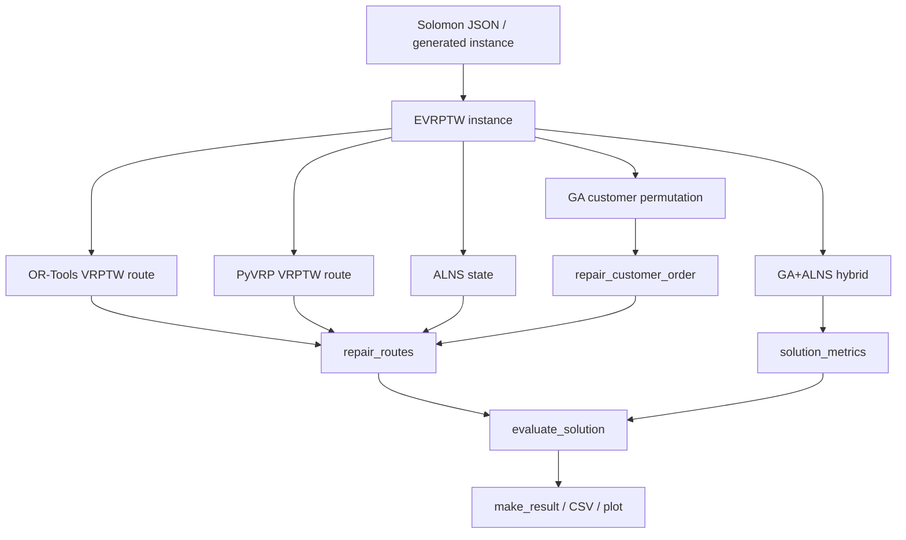

# Methods and Constraints Comparison

本文档综合 `docs/project_code_map.md`、`docs/evaluator_code_walkthrough.md`、`docs/ga_code_walkthrough.md`、`docs/ortools_code_walkthrough.md`、`docs/pyvrp_code_walkthrough.md`、`docs/alns_code_walkthrough.md` 和 `docs/hybrid_ga_alns_code_walkthrough.md` 的结论，横向比较当前项目中的五种方法：

- OR-Tools
- GA
- PyVRP
- ALNS
- GA+ALNS

本文只基于当前项目真实代码和前面 walkthrough 文档，不把通用算法知识当作当前代码事实。

---

# 1. Overall Conclusion

当前项目中，五种方法最终都输出统一格式：

```python
routes: list[list[int]]
```

例如：

```python
[
    [21, 9, 1003, 36],
    [47, 27],
]
```

含义是：

```text
Vehicle 1: 0 -> 21 -> 9 -> charging station 1003 -> 36 -> 0
Vehicle 2: 0 -> 47 -> 27 -> 0
```

所有方法最终都会被统一 evaluator 检查：

```text
EVRPTW_Schneider2014/evaluator.py:evaluate_solution()
```

但是，五种方法在“搜索过程中真正知道哪些约束”上并不一致：

| 方法 | 当前真实定位 |
| -- | -- |
| OR-Tools | VRPTW-style baseline，内部知道容量和时间窗，但不知道电池和充电站 |
| GA | 客户排列搜索 + feasibility-first repair/evaluator，复杂约束主要在解码和 repair 中处理 |
| PyVRP | VRPTW/CVRPTW-style baseline，内部知道容量、时间窗、服务时间，但不知道电池和充电站 |
| ALNS | 基于 routes/state 的启发式，复杂约束主要通过 `repair_routes()` 和 `priority_objective()` 间接进入 |
| GA+ALNS | GA 负责全局客户顺序，ALNS 负责后处理或嵌入式局部破坏修复，但两者共享 repair，存在行为重复 |

因此，当前五种方法的最终结果可以统一比较，但它们还没有严格意义上求解完全相同的 E-VRPTW 数学模型。

---

# 2. 五种方法完整流程对比

| 方法 | 完整流程 |
| -- | -- |
| OR-Tools | `run_single/run_experiments -> build_instance -> solve_ortools.solve -> RoutingIndexManager -> RoutingModel -> callbacks -> Capacity Dimension -> Time Dimension -> SolveWithParameters -> 提取客户路线 -> repair_routes -> evaluate_solution -> make_result` |
| GA | `run_single/run_experiments -> build_instance -> solve_ga.solve -> 初始化客户排列 population -> repair_customer_order -> priority_objective -> selection -> crossover -> mutation -> 多代进化 -> selBest -> repair_customer_order -> evaluate_solution -> make_result` |
| PyVRP | `run_single/run_experiments -> build_instance -> solve_pyvrp.solve -> Model() -> add_depot -> add_client -> add_vehicle_type -> add_edge -> model.solve -> result.best.routes -> visits 转客户 id -> repair_routes -> evaluate_solution -> make_result` |
| ALNS | `run_single/run_experiments -> build_instance -> solve_alns.solve -> nearest_neighbor_routes -> repair_routes -> EVRPTWState -> add destroy/repair operators -> ALNS.iterate -> best_state -> repair_routes -> evaluate_solution -> make_result` |
| GA+ALNS | `run_experiment/run_unified_benchmark -> build_instance -> hybrid_solver.solve -> _run_ga_search -> individual_to_routes -> select candidates -> routes_to_alns_state -> _run_alns_from_routes -> ALNS destroy/repair -> solution_metrics -> _is_better -> make_result -> diagnostics/export` |

流程图：



---

# 3. 五种方法解表示对比

| 方法 | 解表示 | 搜索核心 | 可行性来源 | repair | evaluator |
|---|---|---|---|---|---|
| OR-Tools | OR-Tools 内部 routing index；输出后转为 `routes: list[list[int]]` | RoutingModel + callback + dimension + local search | 内部处理容量/时间窗；最终由 `evaluate_solution()` 复检 | `repair_routes()` 在求解后插入充电站并重构路线 | `evaluate_solution()` |
| GA | individual 是客户排列，例如 `[36, 47, 27, 21, 9]` | selection + crossover + mutation | fitness 调用 `priority_objective()`，后者调用 evaluator | `repair_customer_order()` 和 `repair_routes()` 是解码核心 | `evaluate_solution()` |
| PyVRP | PyVRP route visits；转换为客户 id routes | PyVRP Model + HGS/内部求解逻辑 | PyVRP 内部处理容量/时间窗；最终由 evaluator 复检 | `repair_routes()` 在求解后处理电量和充电 | `evaluate_solution()` |
| ALNS | `EVRPTWState(instance, routes, unassigned)` | destroy + repair + simulated annealing + roulette wheel | `EVRPTWState.objective()` 调用 `repair_routes()` 和 `priority_objective()` | 内部 repair 算子会调用公共 `repair_routes()` | `evaluate_solution()` |
| GA+ALNS | GA individual、routes、ALNS state、Candidate、metrics dict | GA 全局搜索 + ALNS 局部改进 | `solution_metrics()` 调用 evaluator；最终 `_is_better()` 比较 | GA 和 ALNS 都依赖 `repair_routes()` | `evaluate_solution()` 和 `solution_metrics()` |

重要区别：

- OR-Tools 和 PyVRP 的内部解不是项目 routes，需要转换。
- GA 的 individual 不含车辆边界、不含充电站、不含时间和电量轨迹。
- ALNS 的 state 比 GA individual 多了 `routes` 和 `unassigned`，但仍不保存到达时间、电量、等待、充电记录。
- GA+ALNS 能结合，是因为两者都能转换到 `routes`；效果受限，也是因为只传递 `routes`，很多动态信息要重算或丢失。

---

# 4. 五种方法如何产生候选解

| 方法 | 第一条候选解如何产生 | 后续候选解如何产生 | 候选解评价 |
| -- | -- | -- | -- |
| OR-Tools | `PATH_CHEAPEST_ARC` 生成初始路径 | `GUIDED_LOCAL_SEARCH` 在 OR-Tools 内部改进 | OR-Tools 内部目标先评价；最终 `repair_routes + evaluate_solution` |
| GA | `random.sample(customer_ids, len(customer_ids))` 随机生成客户排列 | tournament selection、PMX crossover、mutation 产生新排列 | `repair_customer_order -> priority_objective` |
| PyVRP | Model 内部基于 PyVRP 求解器生成初始解 | PyVRP 内部继续搜索和改进 | PyVRP 内部评价；最终 `repair_routes + evaluate_solution` |
| ALNS | `nearest_neighbor_routes(instance)` 生成初始路线，再 `repair_routes` | destroy 移除客户，repair 重新插入客户 | `EVRPTWState.objective -> repair_routes -> priority_objective` |
| GA+ALNS | GA 先生成 population 并进化 | 选择 GA 候选 routes，再由 ALNS destroy/repair 改进；可选 post-processing、periodic、stagnation | `solution_metrics` + `_is_better` |

---

# 5. 五种方法如何处理不可行解

| 方法 | 搜索中是否允许不可行 | 不可行处理方式 | 最终是否隐藏不可行结果 |
| -- | -- | -- | -- |
| OR-Tools | OR-Tools 内部会避免违反其已建模约束，但不知道电量/充电 | 求解后 `repair_routes()` 尝试修复；最终 evaluator 记录 violations | 不隐藏，`feasible=False` 仍输出路线 |
| GA | 允许产生任意客户排列；解码后可能不可行 | `priority_objective()` 用 `1e9 * violation` 惩罚不可行 | 不隐藏 |
| PyVRP | 内部会处理自己知道的约束；不知道电量/充电 | 求解后 `repair_routes()` 修复；最终 evaluator 检查 | 不隐藏 |
| ALNS | destroy 后会有 `unassigned`，允许暂时不完整；模拟退火可能接受较差解 | `EVRPTWState.objective()` 对 unassigned 和 violation 大惩罚 | 不隐藏 |
| GA+ALNS | GA 和 ALNS 都可能产生不可行候选 | `solution_metrics()` 记录 violation；`_is_better()` 优先选择 feasible | 不隐藏 |

核心规则：

```python
feasible = all(value <= 1e-6 for value in violations.values())
```

当前 feasible 只看四类违反：

```text
capacity
time_window
battery
customer_coverage
```

车辆数不是硬可行性约束，只是优化目标中的重要比较项。

---

# 6. 同一约束在不同方法中的实现位置

| 约束 | OR-Tools | GA | PyVRP | ALNS | GA+ALNS |
|---|---|---|---|---|---|
| 客户唯一服务 | RoutingModel 内部节点访问；最终 evaluator 复检 | individual 是客户排列；`repair_routes` 去重；evaluator 检查 missing/duplicate | PyVRP client visits；转换后 repair/evaluator 复检 | `unassigned` + routes；objective 惩罚未分配；evaluator 复检 | GA population + routes/state 转换；`solution_metrics` 复检 |
| 路线从仓库出发返回 | RoutingIndexManager depot=0 | evaluator 自动按 depot -> route -> depot | PyVRP start/end depot | evaluator 自动补 depot | evaluator 自动补 depot |
| 容量 | OR-Tools `Capacity` dimension | `repair_routes/_is_route_feasible` 和 `evaluate_solution` | PyVRP `delivery` + vehicle capacity | `repair_routes` 和 evaluator 间接处理 | `repair_routes`、`solution_metrics`、evaluator |
| 时间窗 | OR-Tools `Time` dimension + cumul range | `repair_routes/_is_route_feasible` 和 evaluator | PyVRP `tw_early/tw_late` | `repair_routes` 和 evaluator 间接处理 | `repair_routes`、`solution_metrics`、evaluator |
| 等待 | OR-Tools Time dimension slack | evaluator/`_waiting_and_charging_cost` | PyVRP 内部时间窗等待机制，最终 evaluator 重算 | objective 中低优先级统计 | `solution_metrics/_service_metrics` |
| 服务时间 | OR-Tools `time_callback` 使用 from node service time | evaluator 访问客户后加 service time | PyVRP `service_duration` | evaluator/repair 间接计算 | evaluator/solution_metrics 重算 |
| 距离 | OR-Tools `distance_callback` arc cost | `priority_objective` 中 `100 * distance` | PyVRP `add_edge(distance=dist)` | `priority_objective`，`_worst_distance_removal` | `solution_metrics.total_distance` |
| 车辆数 | OR-Tools vehicle count 上限设为客户数 | `priority_objective` 中 `1e6 * vehicle_count` | `num_available=max(1, len(customers))` | `priority_objective` + `_merge_routes` | `_is_better` 中可行后优先比较 vehicle_count |
| 电池容量 | 不在 OR-Tools 内部建模 | `repair_routes/_repair_energy` 和 evaluator | 不在 PyVRP 内部建模 | `repair_routes/_repair_energy` 和 evaluator | repair/evaluator/solution_metrics |
| 充电站访问 | 不在 OR-Tools 节点集合 | repair 插入 station id | 不在 PyVRP Model 节点 | repair 自动插入 station | repair 自动插入；转换回 individual 会丢失 station |
| 充电时间 | OR-Tools 不知道 | repair/evaluator 线性满充 | PyVRP 不知道 | repair/evaluator 线性满充 | `solution_metrics` 额外统计 |
| 非线性充电 | 未实现 | 未实现 | 未实现 | 未实现 | 未实现 |
| 无人机服务 | 未实现 | 未实现 | 未实现 | 未实现 | 未实现 |
| 卡车-无人机同步 | 未实现 | 未实现 | 未实现 | 未实现 | 未实现 |

---

# 7. 哪些约束是搜索过程真正知道的

这里的“真正知道”指：算法在搜索候选解时，这个约束会直接影响候选解生成，而不是事后才被修复或检查。

| 约束 | OR-Tools | GA | PyVRP | ALNS | GA+ALNS |
| -- | -- | -- | -- | -- | -- |
| 客户访问 | 是 | 是，排列包含客户 | 是 | 是，routes/unassigned | 是 |
| 容量 | 是，Capacity dimension | 间接，fitness 通过 repair/evaluator 惩罚 | 是，vehicle capacity | 间接，objective/repair | 间接，GA fitness 和 ALNS objective |
| 时间窗 | 是，Time dimension | 间接，fitness 通过 repair/evaluator 惩罚 | 是，client tw | 间接，objective/repair | 间接 |
| 距离 | 是，arc cost | 是，priority objective | 是，edge distance | 是，objective 和 removal | 是，metrics 和 comparison |
| 车辆数 | 是，车辆上限；但优化上未严格最小化 | 是，priority objective 高权重 | 是，车辆上限 | 是，priority objective 和 merge | 是，`_is_better` 优先比较 |
| 电池 | 否 | 间接 | 否 | 间接 | 间接 |
| 充电站 | 否 | 间接 | 否 | 间接 | 间接 |
| 充电时间 | 否 | 间接且低权重 | 否 | 间接且低权重 | 是，扩展 total_cost 统计，但不一定指导所有搜索阶段 |
| 非线性充电 | 否 | 否 | 否 | 否 | 否 |
| 无人机同步 | 否 | 否 | 否 | 否 | 否 |

结论：

- OR-Tools 和 PyVRP 对 VRPTW 约束更“直接”。
- GA 和 ALNS 对 E-VRPTW 约束更依赖 repair/evaluator。
- ALNS 更适合未来扩展复杂约束，因为 destroy/repair/objective 都可以被项目代码直接控制。
- GA+ALNS 的扩展潜力取决于是否能让 ALNS 算子真正约束感知，而不是继续依赖同一个公共 repair。

---

# 8. 哪些约束只在 repair 中处理

| 约束 | repair 位置 | 说明 |
| -- | -- | -- |
| 电池不足时插入充电站 | `route_repair.py:_repair_energy()` | 如果当前电量不足以到下一个目标，尝试找可达充电站 |
| 选择可达充电站 | `route_repair.py:_best_reachable_station()` | 选当前电量可达，且满电后能到目标的站点 |
| 客户去重与保序 | `route_repair.py:repair_routes()` | 只保留第一次出现的客户 |
| 容量/时间窗/电量的局部可行插入 | `route_repair.py:_pack_customers()` + `_is_route_feasible()` | 尝试把客户插入已有路线 |
| 必要时新开车辆 | `route_repair.py:_pack_customers()` | 插入已有路线失败时新开路线 |
| 路线合并 | `route_repair.py:_merge_routes()` | 合并后仍可行才接受 |

这些 repair 会影响 OR-Tools、GA、PyVRP、ALNS 和 GA+ALNS 的最终路线。因此，当前项目的“E-VRPTW 可行性能力”很大程度集中在公共 `route_repair.py`。

---

# 9. 哪些约束只在最终 evaluator 中检查

| 约束 | evaluator 位置 | 当前作用 |
| -- | -- | -- |
| 客户遗漏/重复 | `evaluate_solution()` 中 `missing` 和 `duplicate_count` | 决定 `customer_coverage_violation` |
| 容量违反 | `evaluate_solution()` 中 `load > vehicle_capacity` | 决定 `capacity_violation` |
| 时间窗违反 | `evaluate_solution()` 中 `time > due_time` | 决定 `time_window_violation` |
| 电量违反 | `evaluate_solution()` 中 `energy > battery` | 决定 `battery_violation` |
| 充电后的时间变化 | `evaluate_solution()` 中 `time += recharge_amount / recharge_rate` | 影响后续时间窗，但基础 CSV 不输出 charging_time |

当前 evaluator 没有检查：

- 最大车辆数硬约束；
- 充电站容量；
- 充电站排队；
- 非线性充电；
- 部分充电决策；
- 多车辆类型；
- 无人机任务；
- 卡车-无人机同步。

---

# 10. 当前项目中各方法是否真正求解同一个模型

严格说：没有。

更准确的说法：

```text
五种方法使用同一份 instance，
最终统一转换为 routes，
最终统一交给 evaluate_solution() 检查，
但搜索阶段的模型并不完全相同。
```

| 方法 | 搜索阶段真实模型 | 最终评价模型 |
| -- | -- | -- |
| OR-Tools | depot + customers 的 VRPTW/CVRPTW-style 模型 | E-VRPTW evaluator |
| GA | 客户排列 + repair 后的 E-VRPTW 候选路线 | E-VRPTW evaluator |
| PyVRP | depot + clients 的 VRPTW/CVRPTW-style 模型 | E-VRPTW evaluator |
| ALNS | routes/unassigned 上的 destroy/repair 启发式 | E-VRPTW evaluator |
| GA+ALNS | GA 排列 + ALNS state 的混合启发式 | E-VRPTW evaluator + solution_metrics |

因此，当前比较适合作为“统一数据、统一最终评价下的 baseline comparison”，但不适合声称“五种方法严格求解同一个完整 E-VRPTW 数学模型”。

---

# 11. 当前比较是否公平

## 11.1 公平的部分

| 公平点 | 说明 |
| -- | -- |
| 使用同一数据 | 都接收同一个 `instance` |
| 使用统一最终结果格式 | 都输出 `routes`、`vehicle_count`、`distance`、`feasible`、`violations` |
| 使用统一最终 evaluator | 最终由 `evaluate_solution()` 判断可行性 |
| 使用统一绘图 | 都可以进入 `plot_solution()` |
| 使用统一基础 CSV | `run_experiments.py` 对所有基础方法写同一 `summary.csv` |

## 11.2 不公平或需要解释的部分

| 问题 | 影响 |
| -- | -- |
| 搜索阶段知道的约束不同 | OR-Tools/PyVRP 知道时间窗容量；不知道电池充电。GA/ALNS 主要靠 repair/evaluator。 |
| 内部目标函数不同 | OR-Tools/PyVRP 内部目标与 `priority_objective` 不一致 |
| 距离尺度不同 | PyVRP 内部使用欧氏距离乘 100 后取整，evaluator 用原始欧氏距离 |
| seed 传递不完全统一 | 文档指出部分 `run_single.py` 参数没有传入 solver 的 seed |
| POMO 不调用 `repair_routes()` | 如果纳入比较，E-VRPTW 修复程度与其他方法不同 |
| GA+ALNS 指标更丰富 | hybrid summary 有 `total_cost/charging_time/waiting_time`，基础 summary 没有 |
| 时间预算不一定统一 | 基础 `run_experiments.py` 中各 solver 默认时间/迭代参数不同 |

结论：

当前比较可以用于本科阶段的“方法横向观察”，但如果写论文或正式报告，应明确说明：

```text
这是统一最终评价下的启发式/求解器 baseline 对比，
不是完全等价数学模型、完全统一搜索预算的严格算法竞赛。
```

---

# 12. 各方法适合解决什么、不适合解决什么

| 方法 | 最适合解决什么 | 不适合解决什么 |
| -- | -- | -- |
| OR-Tools | 小中规模 VRPTW、容量和时间窗清晰的问题、需要快速稳定 baseline | 复杂电池恢复、非线性充电、多次访问充电站、无人机同步等状态依赖强的问题 |
| GA | 搜索客户访问顺序、做全局随机搜索、易于加入自定义 fitness 惩罚 | 精细建模时间/电量轨迹、保证强可行性、处理复杂同步约束 |
| PyVRP | 快速生成高质量 VRPTW/CVRPTW 路线，作为强 baseline | 当前代码下不能直接建模电池、充电站、非线性充电和无人机同步 |
| ALNS | 适合 destroy/repair 结构、适合逐步加入 energy-aware/time-window-aware/drone-aware 算子 | 当前基础算子偏简单；如果不增强算子，容易只重复公共 repair |
| GA+ALNS | GA 提供全局候选，ALNS 做局部破坏修复；适合研究混合启发式 | 当前只传递 routes/客户顺序，充电站、时间、电量轨迹容易丢失，默认效果不一定优于单独 GA/ALNS |

---

# 13. 未来添加无人机和非线性充电时，各方法需要修改什么

## 13.1 共同必须修改的模块

无论使用哪种方法，未来研究“无人机卡车协同 EVRPTW-NL”时，以下模块都必须扩展：

| 模块 | 必须增加的内容 |
| -- | -- |
| `instance_builder.py` | 增加无人机参数：速度、载重、电池、续航、服务限制；增加非线性充电参数 |
| `result_schema.py` | 当前只保存 `routes`，未来需要保存 `drone_tasks`、truck route、drone sortie |
| `evaluator.py` | 同时模拟卡车时间线、无人机时间线、电量变化、同步等待和非线性充电 |
| `route_repair.py` | 增加无人机任务插入、发射回收同步修复、非线性充电站插入 |
| `visualization.py` | 画 truck routes 和 drone sorties，不再只画车辆折线 |
| CSV exporter | 增加 drone_count、sortie_count、sync_waiting、charging_policy、nonlinear_charging_time 等字段 |

## 13.2 OR-Tools 需要修改什么

| 扩展内容 | 当前难点 | 修改位置 |
| -- | -- | -- |
| 电池容量 | 当前没有 Battery dimension | `solve_ortools.py` 新增电量相关 callback/dimension 或后处理 |
| 充电站访问 | 当前 stations 不在 OR-Tools nodes | `nodes = [depot] + customers + stations/copies` |
| 非线性充电 | 充电时间依赖到站电量，普通 transit callback 难表达 | 可能仍放在 repair/evaluator，OR-Tools 做近似 |
| 无人机同步 | RoutingModel 当前只表达车辆 route | 需要外部 drone assignment/repair；或大幅重构模型 |

当前建议：OR-Tools 继续作为 truck main route baseline，不建议优先把完整无人机同步强塞进当前 OR-Tools wrapper。

## 13.3 GA 需要修改什么

| 扩展内容 | 当前难点 | 修改位置 |
| -- | -- | -- |
| 无人机服务选择 | individual 现在只有客户顺序 | 扩展 individual，例如客户顺序 + 服务类型编码 |
| 发射/回收点 | 当前 routes 不表达 drone task | 新增 decoder，把部分客户解码为 drone sortie |
| 非线性充电 | 当前 repair/evaluator 是线性满充 | 修改 `route_repair.py` 和 `evaluator.py`，GA fitness 调用新 objective |
| 同步等待 | 当前没有 truck/drone 双时间线 | evaluator 增加同步时间传播 |

GA 的优点是编码灵活；缺点是如果编码过复杂，交叉变异后更容易产生不可行解。

## 13.4 PyVRP 需要修改什么

| 扩展内容 | 当前难点 | 修改位置 |
| -- | -- | -- |
| 电池状态 | 当前代码没有使用 PyVRP 电池/资源 API | 若 API 支持，改 `_solve_pyvrp()`；否则外部 repair |
| 充电站 | 当前 stations 不进入 Model | `_solve_pyvrp()` 加 station/copy 节点，并修改 route conversion |
| 非线性充电 | PyVRP edge duration 是固定的，非线性依赖电量状态 | 多半需要外部 repair/evaluator 或近似 |
| 无人机同步 | 当前 PyVRP 只输出车辆 routes | 外部 drone assignment 更现实 |

当前建议：PyVRP 适合作为 truck route baseline，不建议把它作为无人机同步主算法，除非后续确认 PyVRP API 能表达相关资源状态。

## 13.5 ALNS 需要修改什么

| 扩展内容 | 当前难点 | 修改位置 |
| -- | -- | -- |
| 电池状态 | state 不保存电量轨迹 | 扩展 `EVRPTWState` 或新增 enriched state |
| 非线性充电 | 当前 `_repair_energy()` 线性满充 | 新增 nonlinear charging function，repair/evaluator/objective 共用 |
| 无人机任务 | state 只有 `routes/unassigned` | state 增加 `drone_tasks`、truck assignment、drone assignment |
| 同步约束 | 当前 evaluator 只有单车辆时间线 | evaluator 增加 truck/drone timeline |
| 算子 | destroy/repair 不懂无人机 | 新增 drone-task removal、sync-aware insertion、energy-aware insertion |

当前建议：ALNS 是最适合后续作为主研究算法的框架，因为复杂约束可以自然进入 state、destroy、repair、objective 和 evaluator。

## 13.6 GA+ALNS 需要修改什么

| 扩展内容 | 当前难点 | 修改位置 |
| -- | -- | -- |
| richer individual | 当前 routes 转回 individual 会丢充电站和路线边界 | `solution_adapter.py:routes_to_individual()` 和 GA 编码 |
| drone task 转换 | 当前没有 drone task schema | `solution_adapter.py` 新增 `routes_and_tasks_to_state()` |
| 统一目标函数 | 当前 GA fitness、ALNS objective、final total_cost 不完全一致 | 统一 `priority_objective/solution_metrics/_is_better` |
| 保留 ALNS 改进 | 当前 ALNS 改进转回 GA individual 会丢信息 | 需要 richer individual 或只在 post-processing 使用 ALNS |
| 非线性充电 | 需要 evaluator、repair、metrics 同步修改 | `evaluator.py`、`route_repair.py`、`solution_adapter.py` |

当前建议：如果继续 GA+ALNS，优先把它定位为：

```text
GA 负责产生多样 truck/drone 分配和客户顺序；
ALNS 负责带约束的局部重构和修复。
```

不要让两者都只重复调用同一个 `repair_routes()`，否则混合价值有限。

---

# 14. 方法扩展能力总表

| 方法 | 适合直接扩展 | 需要后处理 | 修改难度 | 当前定位 |
|---|---|---|---|---|
| OR-Tools | 容量、时间窗、车辆数、距离 | 电池、充电站、非线性充电、无人机同步 | 中到高 | 快速 VRPTW baseline |
| GA | 自定义编码、fitness、服务方式选择 | 时间窗、电量、充电、同步通常靠 decoder/repair/evaluator | 中 | 灵活全局搜索 baseline |
| PyVRP | 容量、时间窗、服务时间、距离 | 电池、充电站、非线性充电、无人机同步 | 中到高，且受 PyVRP API 限制 | 强 VRPTW baseline |
| ALNS | destroy/repair/objective/state 都可扩展 | 仍需统一 evaluator 复检 | 中 | 最适合复杂约束主算法 |
| GA+ALNS | 多起点、全局+局部混合、诊断分析 | 需要解决信息丢失和目标不一致 | 高 | 研究型混合启发式 |

---

# 15. 推荐学习路线

面向零基础读者，不建议直接从 OR-Tools/PyVRP/ALNS 的库概念开始。应先理解项目自己的统一数据结构和评价规则。

推荐顺序：

```text
1. run_single.py
2. config.py
3. data_loader.py
4. instance_builder.py
5. result_schema.py
6. evaluator.py
7. route_repair.py
8. visualization.py
9. solve_ga.py
10. solve_alns.py
11. solve_ortools.py
12. solve_pyvrp.py
13. solution_adapter.py
14. hybrid_solver.py
15. enhanced_destroy.py / enhanced_repair.py / local_search.py
```

学习逻辑：

1. 先知道程序从哪里运行。
2. 再知道数据如何进入项目。
3. 再知道一个解长什么样。
4. 再知道可行性如何判断。
5. 再读 GA 和 ALNS，因为它们最依赖项目自己的 repair/evaluator。
6. 最后读 OR-Tools 和 PyVRP，理解外部求解器如何接入。
7. GA+ALNS 放最后，因为它同时依赖 GA、ALNS、repair、evaluator 和 solution adapter。

---

# 16. 必须真正读懂的 20 个核心函数

| 优先级 | 文件 | 函数/类 | 为什么重要 |
| -- | -- | -- | -- |
| 1 | `EVRPTW_Schneider2014/run_single.py` | `main()` | 单次运行入口，理解命令如何进入项目 |
| 2 | `EVRPTW_Schneider2014/run_experiments.py` | `main()` | 批量实验入口，理解 summary.csv 如何生成 |
| 3 | `EVRPTW_Schneider2014/config.py` | `load_config()` | 理解配置如何读取 |
| 4 | `EVRPTW_Schneider2014/config.py` | `apply_overrides()` | 理解命令行如何覆盖配置 |
| 5 | `EVRPTW_Schneider2014/data_loader.py` | `load_solomon_instance()` | 理解 Solomon JSON 如何进入项目 |
| 6 | `EVRPTW_Schneider2014/data_loader.py` | `solomon_customers()` | 理解客户字段和 customer id |
| 7 | `EVRPTW_Schneider2014/data_loader.py` | `solomon_depot()` | 理解 depot id 和路线起终点 |
| 8 | `EVRPTW_Schneider2014/instance_builder.py` | `build_instance()` | 理解 E-VRPTW instance 如何生成 |
| 9 | `EVRPTW_Schneider2014/evaluator.py` | `evaluate_solution()` | 全项目最核心的可行性检查 |
| 10 | `EVRPTW_Schneider2014/route_repair.py` | `repair_routes()` | 所有方法共享的 E-VRPTW 修复入口 |
| 11 | `EVRPTW_Schneider2014/route_repair.py` | `repair_customer_order()` | GA individual 如何解码成 routes |
| 12 | `EVRPTW_Schneider2014/route_repair.py` | `_repair_energy()` | 电量和充电站插入核心 |
| 13 | `EVRPTW_Schneider2014/route_repair.py` | `_merge_routes()` | 车辆数减少的公共后处理 |
| 14 | `EVRPTW_Schneider2014/route_repair.py` | `priority_objective()` | GA 和 ALNS 的主要优化目标 |
| 15 | `EVRPTW_Schneider2014/result_schema.py` | `make_result()` | 不同算法如何统一输出 |
| 16 | `EVRPTW_Schneider2014/solvers/solve_ga.py` | `solve()` | Basic GA 主流程 |
| 17 | `EVRPTW_Schneider2014/solvers/solve_alns.py` | `EVRPTWState.objective()` | ALNS 如何评价 state |
| 18 | `EVRPTW_Schneider2014/solvers/solve_alns.py` | `_insert_customer()` | ALNS repair 的核心插入动作 |
| 19 | `EVRPTW_Schneider2014/solvers/solve_ortools.py` | `solve()` | OR-Tools wrapper 如何建模和提取路线 |
| 20 | `EVRPTW_Schneider2014/algorithms/hybrid_ga_alns/solution_adapter.py` | `solution_metrics()` | GA+ALNS 扩展指标和最终比较基础 |

如果继续深入 GA+ALNS，还需要额外读：

| 文件 | 函数 | 用途 |
| -- | -- | -- |
| `hybrid_ga_alns/solution_adapter.py` | `individual_to_routes()` | GA 到 routes |
| `hybrid_ga_alns/solution_adapter.py` | `routes_to_individual()` | ALNS routes 回 GA individual |
| `hybrid_ga_alns/solution_adapter.py` | `routes_to_alns_state()` | routes 到 ALNS state |
| `hybrid_ga_alns/hybrid_solver.py` | `_run_ga_search()` | Hybrid 中 GA 阶段 |
| `hybrid_ga_alns/hybrid_solver.py` | `_run_alns_from_routes()` | Hybrid 中 ALNS 阶段 |
| `hybrid_ga_alns/hybrid_solver.py` | `_is_better()` | 最终替换规则 |
| `hybrid_ga_alns/candidate_selection.py` | `select_diverse_top_k()` | 多起点候选选择 |

---

# 17. Final Practical Recommendation

如果下一阶段目标是无人机卡车协同 EVRPTW-NL，建议不要同时强改五种方法。更稳妥的路线是：

1. 先扩展统一数据结构：增加 `drone_tasks`、无人机参数、非线性充电参数。
2. 先扩展 evaluator：能计算 truck route、drone sortie、同步等待、非线性充电、电量违反。
3. 再扩展 repair：能修复电量、充电站、无人机发射回收和同步。
4. 先用 ALNS 做主算法，因为它最适合把复杂约束写进 destroy/repair/objective。
5. GA 作为全局候选生成器，后续再和 ALNS 结合。
6. OR-Tools 和 PyVRP 暂时作为 truck-route baseline，不强求它们直接求完整无人机协同模型。

当前最关键的判断是：

```text
未来真正的研究重点不应只是“换一个求解器”，
而是先把 evaluator、repair 和 solution schema 扩展到能表达 EVRPTW-NL + truck-drone synchronization。
```

