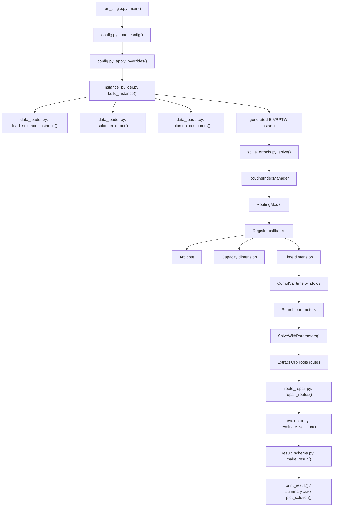
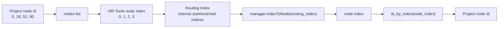

# OR-Tools Code Walkthrough

本文档从当前项目中的 OR-Tools 主运行入口开始，按真实调用顺序追踪一次求解流程。

目标不是介绍 OR-Tools 的全部功能，而是解释本项目里 OR-Tools 到底做了什么、哪些 E-VRPTW 约束是在求解器内部处理的、哪些是在求解后由 repair 和 evaluator 处理的。

当前结论先写在前面：

- 本项目的 OR-Tools 方法本质上是一个 **VRPTW-style baseline**。
- OR-Tools 内部直接建模了：客户访问、车辆容量、时间窗、等待、距离目标、多车辆。
- OR-Tools 内部没有直接建模：电池容量、充电站访问、充电时间、非线性充电。
- 电量和充电主要由 `route_repair.py:repair_routes()` 在 OR-Tools 求出普通客户路线之后后处理。
- 最终是否满足 E-VRPTW，由 `evaluator.py:evaluate_solution()` 统一重新检查。

---

# 0. True Call Order

单独运行 OR-Tools 时，真实调用顺序是：

```text
run_single.py:main()
-> config.py:load_config()
-> config.py:apply_overrides()
-> instance_builder.py:build_instance()
-> data_loader.py:load_solomon_instance()
-> data_loader.py:solomon_depot()
-> data_loader.py:solomon_customers()
-> instance_builder.py:_select_customers()
-> instance_builder.py:_generate_stations()
-> instance_builder.py:_estimate_battery_capacity()
-> instance_builder.py:save_instance()
-> solvers/solve_ortools.py:solve()
   -> RoutingIndexManager
   -> RoutingModel
   -> distance_callback()
   -> SetArcCostEvaluatorOfAllVehicles()
   -> demand_callback()
   -> AddDimensionWithVehicleCapacity()
   -> time_callback()
   -> AddDimension()
   -> Time dimension CumulVar().SetRange()
   -> search parameters
   -> SolveWithParameters()
   -> route extraction
   -> route_repair.py:repair_routes()
   -> evaluator.py:evaluate_solution()
   -> result_schema.py:make_result()
-> run_single.py:print_result()
-> visualization.py:plot_solution()  # only when --show-plot or --save-plot
```

批量运行 OR-Tools 时，入口变成：

```text
run_experiments.py:main()
-> build_instance()
-> save_instance()
-> SOLVERS["ortools"](instance)
-> _summary_row()
-> raw_results.jsonl
-> summary.csv
-> plot_solution()  # only when --plot
```

---

## `EVRPTW_Schneider2014/run_single.py`: `main()`

### 1. 谁调用它

用户在终端运行：

```powershell
python -m EVRPTW_Schneider2014.run_single --instance R101 --customers 10 --method ortools
```

Python 执行文件末尾：

```python
if __name__ == "__main__":
    main()
```

### 2. 输入

来自命令行参数：

| 参数 | 类型 | 示例 | 作用 |
| -- | -- | -- | -- |
| `--config` | `str` | `configs/debug_small.yaml` | 配置文件 |
| `--instance` | `str` | `R101` | Solomon 实例名 |
| `--customers` | `int` | `10` | 抽取客户数量 |
| `--stations` | `int` | `21` | 充电站数量 |
| `--method` | `str` | `ortools` | 选择求解方法 |
| `--seed` | `int` | `1987` | 随机种子 |
| `--instance-file` | `str` | `generated_instances/R101_10_seed1987.json` | 直接读取已生成实例 |
| `--save-plot` | `str` | `figures/R101.png` | 保存路线图 |
| `--show-plot` | `bool` | `True` | 显示路线图 |

### 3. 输出

没有 Python 返回值。它会：

- 在终端打印结果；
- 必要时保存生成实例 JSON；
- 必要时保存或显示路线图。

示例终端输出：

```text
instance: R101_10_seed1987
method: ortools
routes:
  Vehicle 1: 0 ---> 52 ---> 18 ---> 61 ---> 0
vehicle_count: 1
distance: 226.22
feasible: False
```

### 4. 核心代码逻辑

执行顺序：

1. 创建 `argparse.ArgumentParser()`。
2. 读取配置文件路径、实例名、客户数量、求解方法等参数。
3. 调用 `load_config()` 读取 YAML 配置。
4. 调用 `apply_overrides()` 用命令行参数覆盖配置。
5. 如果传入 `--instance-file`，直接读取已生成实例。
6. 否则调用 `build_instance()` 从 Solomon JSON 构造 E-VRPTW 实例。
7. 调用 `save_instance()` 把生成实例保存到 `generated_instances/`。
8. 通过 `SOLVERS[args.method]` 找到 OR-Tools 求解函数。
9. 调用 `solve_ortools.solve(instance)`。
10. 调用 `print_result(result)` 打印统一结果。
11. 如果要求画图，调用 `plot_solution()`。

关键代码：

```python
result = SOLVERS[args.method](instance)
print_result(result)
```

### 5. 对应的 OR-Tools 概念

这个函数本身不是 OR-Tools 概念。它是项目的 **实验入口**，负责选择求解器。

### 6. 对应的问题约束

`main()` 不直接处理约束。它只负责把实例传给 OR-Tools。

| 约束 | 是否在这里处理 |
| -- | -- |
| 客户唯一服务 | 否 |
| 容量 | 否 |
| 时间窗 | 否 |
| 等待 | 否 |
| 最大车辆数 | 否 |
| 距离 | 否 |
| 电量 | 否 |
| 充电站 | 否 |

### 7. 三客户示例

命令：

```powershell
python -m EVRPTW_Schneider2014.run_single --instance R101 --customers 3 --method ortools
```

数据流：

```text
R101 + 3 customers
-> build_instance()
-> instance = {depot, customers=[c1,c2,c3], stations=[...]}
-> solve_ortools.solve(instance)
-> result = {routes=[[...]], feasible=...}
```

### 8. 风险点

- 如果 `--method` 不是 `ortools`，不会进入 OR-Tools。
- 如果不用 `--instance-file`，每次会按配置重新构造实例，但固定 seed 下结果应一致。
- `main()` 不知道 OR-Tools 内部是否真正处理了电量约束，最终只能依赖 result。

---

## `EVRPTW_Schneider2014/config.py`: `load_config()`

### 1. 谁调用它

由：

- `run_single.py:main()`
- `run_experiments.py:main()`

调用。

### 2. 输入

```python
path: str | Path
```

示例：

```python
"configs/debug_small.yaml"
```

### 3. 输出

```python
dict[str, Any]
```

示例：

```python
{
    "dataset_dir": "D:/学习/FURP/VRP_project/datasets/solomon/json",
    "instances": ["R101", "C101", "RC101"],
    "customer_counts": [5, 10],
    "station_count": 21,
    "seed": 1987,
    "methods": ["ortools", "ga", "pyvrp", "alns"]
}
```

### 4. 核心代码逻辑

1. 如果传入路径不是绝对路径，就拼接到 `EVRPTW_Schneider2014/` 目录下。
2. 读取 YAML 文本。
3. 用项目自带的 `_parse_simple_yaml()` 解析成 Python 字典。

关键代码：

```python
if not config_path.is_absolute():
    config_path = ROOT / config_path
return _parse_simple_yaml(config_path.read_text(encoding="utf-8"))
```

### 5. 对应的 OR-Tools 概念

不是 OR-Tools 概念。它决定 OR-Tools 后续使用哪组数据、多少客户、多少充电站。

### 6. 对应的问题约束

间接影响：

- 客户数量；
- 充电站数量；
- 电池参数；
- 充电参数；
- 时间窗策略；
- 方法列表。

### 7. 三客户示例

配置中如果写：

```yaml
instances:
  - R101
customer_counts:
  - 3
station_count: 5
```

输出配置字典后，后续会构造：

```text
1 depot + 3 customers + 5 stations
```

### 8. 风险点

- 自带 YAML 解析器只支持简单 YAML，不支持复杂语法。
- 如果配置路径错误，会直接读取失败。
- 配置只决定参数，不保证构造出的实例一定可行。

---

## `EVRPTW_Schneider2014/config.py`: `apply_overrides()`

### 1. 谁调用它

由：

- `run_single.py:main()`
- `run_experiments.py:main()`

调用。

### 2. 输入

```python
config: dict[str, Any]
args: argparse.Namespace
```

示例：

```python
config["instances"] = ["R101", "C101"]
args.instance = "RC101"
args.customers = 10
args.method = "ortools"
```

### 3. 输出

更新后的配置字典。

示例：

```python
{
    "instances": ["RC101"],
    "customer_counts": [10],
    "methods": ["ortools"]
}
```

### 4. 核心代码逻辑

1. 复制原配置。
2. 如果命令行传入 `--instance`，覆盖 `instances`。
3. 如果传入 `--customers`，覆盖 `customer_counts`。
4. 如果传入 `--stations`，覆盖 `station_count`。
5. 如果传入 `--method`，覆盖 `methods`。
6. 如果传入 `--seed`，覆盖 `seed`。

### 5. 对应的 OR-Tools 概念

不是 OR-Tools 概念。它控制本次实验规模。

### 6. 对应的问题约束

间接影响最大车辆数，因为 OR-Tools 中车辆数设置为客户数：

```python
max(1, len(instance["customers"]))
```

### 7. 三客户示例

命令行：

```powershell
--instance R101 --customers 3 --method ortools
```

覆盖后：

```python
config["instances"] = ["R101"]
config["customer_counts"] = [3]
config["methods"] = ["ortools"]
```

### 8. 风险点

- 如果没有传 `--method`，批量运行会使用配置中的所有方法，不一定只跑 OR-Tools。
- 如果命令行和配置不一致，以命令行为准。

---

## `EVRPTW_Schneider2014/instance_builder.py`: `build_instance()`

### 1. 谁调用它

由：

- `run_single.py:main()`
- `run_experiments.py:main()`

调用。

### 2. 输入

```python
config: dict[str, Any]
source_instance: str
customer_count: int
```

示例：

```python
build_instance(config, "R101", 10)
```

### 3. 输出

统一实例对象 `dict`。

示例结构：

```python
{
    "name": "R101_10_seed1987",
    "depot": {"id": 0, "x": 35.0, "y": 35.0, ...},
    "customers": [{"id": 18, "demand": 10.0, ...}, ...],
    "stations": [{"id": 1000, "type": "station", ...}, ...],
    "nodes": [depot, customers..., stations...],
    "vehicle_capacity": 200.0,
    "battery_capacity": 123.4,
    "consumption_rate": 1.0,
    "recharge_rate": 5.6,
    "distance_matrix": [...]
}
```

### 4. 核心代码逻辑

1. 从配置读取随机种子、充电站数量、数据集目录。
2. 调用 `load_solomon_instance()` 读取 Solomon JSON。
3. 调用 `solomon_depot()` 得到仓库。
4. 调用 `solomon_customers()` 得到全部客户。
5. 调用 `_select_customers()` 抽取本次实验客户。
6. 调用 `_generate_stations()` 生成虚拟充电站。
7. 从 Solomon 数据读取车辆容量。
8. 设置电量消耗率 `consumption_rate`。
9. 调用 `_estimate_battery_capacity()` 估算电池容量。
10. 根据平均服务时间估算充电速率 `recharge_rate`。
11. 组合 `nodes = [depot] + customers + stations`。
12. 构造 `id_to_index` 和 `distance_matrix`。

关键代码：

```python
nodes = [depot] + customers + stations
id_to_index = {node["id"]: idx for idx, node in enumerate(nodes)}
```

### 5. 对应的 OR-Tools 概念

这是 OR-Tools 建模前的数据准备。后续 OR-Tools 的 `nodes` 只使用：

```python
nodes = [instance["depot"]] + instance["customers"]
```

注意：OR-Tools 模型中没有直接把 `stations` 放进 manager。

### 6. 对应的问题约束

| 约束 | 是否在这里处理 |
| -- | -- |
| 客户唯一服务 | 只准备客户列表 |
| 容量 | 读取 `vehicle_capacity` |
| 时间窗 | 保留 Solomon `ready_time/due_time` |
| 等待 | 不处理 |
| 最大车辆数 | 不处理 |
| 距离 | 构造距离矩阵 |
| 电量 | 估算 `battery_capacity` |
| 充电站 | 生成 `stations` |

### 7. 三客户示例

输入：

```text
R101, customer_count=3, station_count=2
```

输出：

```python
depot = {"id": 0}
customers = [{"id": 1}, {"id": 2}, {"id": 3}]
stations = [{"id": 1000}, {"id": 1001}]
nodes = [0, 1, 2, 3, 1000, 1001]
```

但 OR-Tools 内部只会拿：

```python
nodes = [0, 1, 2, 3]
```

充电站只在后处理 repair/evaluator 使用。

### 8. 风险点

- OR-Tools 求解时没有把充电站作为可访问节点，所以它不知道车辆可以绕路充电。
- `battery_capacity` 是估算值，不是原论文 benchmark 的精确参数。
- `distance_matrix` 构造了，但 `solve_ortools.py` 实际用 callback 重新计算欧氏距离，没有直接用矩阵。

---

## `EVRPTW_Schneider2014/data_loader.py`: `load_solomon_instance()`

### 1. 谁调用它

由 `instance_builder.py:build_instance()` 调用。

### 2. 输入

```python
dataset_dir: str | Path
instance_name: str
```

示例：

```python
load_solomon_instance("D:/学习/FURP/VRP_project/datasets/solomon/json", "R101")
```

### 3. 输出

Solomon 原始 JSON 读成的字典。

示例：

```python
{
    "depart": {...},
    "customer_1": {...},
    "customer_2": {...},
    "vehicle_capacity": 200
}
```

### 4. 核心代码逻辑

1. 拼接路径：`dataset_dir / f"{instance_name}.json"`。
2. 如果文件不存在，抛出 `FileNotFoundError`。
3. 用 UTF-8 打开并 `json.load()`。

### 5. 对应的 OR-Tools 概念

不是 OR-Tools 概念。它是数据源入口。

### 6. 对应的问题约束

只是读取，不解释约束。

### 7. 三客户示例

读取 `R101.json` 后，后续可能只抽取：

```python
customer_1, customer_2, customer_3
```

### 8. 风险点

- 数据路径错误会导致文件不存在。
- 读取的是 Solomon JSON，不是 Schneider 论文原始 E-VRPTW benchmark。

---

## `EVRPTW_Schneider2014/data_loader.py`: `solomon_customers()`

### 1. 谁调用它

由 `instance_builder.py:build_instance()` 调用。

### 2. 输入

```python
data: dict
```

示例：

```python
{"customer_1": {"coordinates": {"x": 10, "y": 20}, ...}}
```

### 3. 输出

标准化客户列表：

```python
[
    {
        "id": 1,
        "x": 10.0,
        "y": 20.0,
        "demand": 10.0,
        "ready_time": 0.0,
        "due_time": 230.0,
        "service_time": 10.0,
        "type": "customer"
    }
]
```

### 4. 核心代码逻辑

1. 找出所有 `customer_` 开头的 key。
2. 按客户编号排序。
3. 把坐标、需求、时间窗、服务时间统一转成 float。

### 5. 对应的 OR-Tools 概念

为 OR-Tools 的节点、需求 callback、时间窗 dimension 准备数据。

### 6. 对应的问题约束

准备：

- 客户需求；
- ready time；
- due time；
- service time；
- 坐标。

### 7. 三客户示例

输入：

```text
customer_1, customer_2, customer_3
```

输出：

```python
[{"id": 1}, {"id": 2}, {"id": 3}]
```

### 8. 风险点

- 客户 id 使用 Solomon 原始编号，不一定连续出现在抽样后的实例中。例如抽到 `[18, 52, 90]`。
- OR-Tools 内部 node index 是 `[0,1,2,3]`，不是客户原始 id。

---

## `EVRPTW_Schneider2014/data_loader.py`: `solomon_depot()`

### 1. 谁调用它

由 `instance_builder.py:build_instance()` 调用。

### 2. 输入

```python
data: dict
```

示例：

```python
{"depart": {"coordinates": {"x": 35, "y": 35}, "ready_time": 0, "due_time": 230}}
```

### 3. 输出

仓库节点：

```python
{
    "id": 0,
    "x": 35.0,
    "y": 35.0,
    "demand": 0.0,
    "ready_time": 0.0,
    "due_time": 230.0,
    "service_time": 0.0,
    "type": "depot"
}
```

### 4. 核心代码逻辑

读取 `depart`，标准化为 id 为 `0` 的 depot。

### 5. 对应的 OR-Tools 概念

OR-Tools manager 里 depot node 固定为 `0`：

```python
manager = pywrapcp.RoutingIndexManager(n, vehicle_count, 0)
```

### 6. 对应的问题约束

准备 depot 时间窗和起终点。

### 7. 三客户示例

节点结构：

```text
node 0 = depot
node 1 = customer A
node 2 = customer B
node 3 = customer C
```

### 8. 风险点

- depot id 和 OR-Tools node index 都是 0，这里刚好一致。
- 客户 id 不一定和 OR-Tools node index 一致。

---

## `EVRPTW_Schneider2014/solvers/solve_ortools.py`: `solve()`

### 1. 谁调用它

由：

- `run_single.py:main()` 通过 `SOLVERS["ortools"]`
- `run_experiments.py:main()` 通过 `SOLVERS[method]`

调用。

### 2. 输入

```python
instance: dict
time_limit_seconds: int = 5
```

示例：

```python
solve(instance, time_limit_seconds=5)
```

其中 `instance` 至少包含：

```python
{
    "depot": {"id": 0, "x": 35.0, "y": 35.0, ...},
    "customers": [{"id": 18, "demand": 10.0, ...}, ...],
    "stations": [{"id": 1000, ...}, ...],
    "vehicle_capacity": 200.0,
    "battery_capacity": 120.0,
    "consumption_rate": 1.0,
    "recharge_rate": 5.0
}
```

### 3. 输出

统一结果字典：

```python
{
    "instance": "R101_10_seed1987",
    "method": "ortools",
    "routes": [[52, 18, 61, 1003, 86]],
    "vehicle_count": 1,
    "distance": 226.22,
    "runtime_seconds": 5.01,
    "feasible": False,
    "violations": {
        "capacity": 0.0,
        "time_window": 928.65,
        "battery": 166.01,
        "customer_coverage": 0.0
    },
    "notes": "OR-Tools VRPTW-style baseline with feasibility-first charging repair."
}
```

### 4. 核心代码逻辑

这个函数是 OR-Tools 方法的核心，执行顺序如下。

#### Step 1：准备 OR-Tools 节点

```python
nodes = [instance["depot"]] + instance["customers"]
demands = [0] + [int(round(customer["demand"])) for customer in instance["customers"]]
id_by_index = [node["id"] for node in nodes]
n = len(nodes)
```

这里有一个重要事实：

```text
OR-Tools nodes = depot + customers
不包含 stations
```

所以 OR-Tools 本身不会主动访问充电站。

#### Step 2：创建 manager

```python
manager = pywrapcp.RoutingIndexManager(n, max(1, len(instance["customers"])), 0)
```

含义：

- `n`：节点数量，等于 1 个仓库 + 客户数；
- `max(1, len(customers))`：车辆数量上限，当前设置为客户数；
- `0`：depot node index。

#### Step 3：创建 routing model

```python
routing = pywrapcp.RoutingModel(manager)
```

`RoutingModel` 是真正添加路径约束、容量约束、时间维度和搜索参数的对象。

#### Step 4：注册距离 callback

```python
transit_idx = routing.RegisterTransitCallback(distance_callback)
routing.SetArcCostEvaluatorOfAllVehicles(transit_idx)
```

距离 callback 返回两点欧氏距离乘以 100 后取整。乘以 100 是为了让 OR-Tools 用整数成本。

#### Step 5：注册需求 callback 并添加容量维度

```python
demand_idx = routing.RegisterUnaryTransitCallback(demand_callback)
routing.AddDimensionWithVehicleCapacity(
    demand_idx,
    0,
    [int(round(instance["vehicle_capacity"]))] * max(1, len(instance["customers"])),
    True,
    "Capacity",
)
```

这里让每辆车的累计需求不能超过 `vehicle_capacity`。

#### Step 6：注册时间 callback 并添加时间维度

```python
time_idx = routing.RegisterTransitCallback(time_callback)
horizon = int(max(node["due_time"] for node in nodes) + 10000)
routing.AddDimension(time_idx, horizon, horizon, False, "Time")
```

时间 callback 返回：

```text
travel_time + from_node.service_time
```

这表示离开一个客户时，把该客户服务时间加入下一段弧的 transit。

#### Step 7：设置每个节点时间窗

```python
time_dimension = routing.GetDimensionOrDie("Time")
for node_idx, node in enumerate(nodes):
    index = manager.NodeToIndex(node_idx)
    time_dimension.CumulVar(index).SetRange(int(node["ready_time"]), int(node["due_time"]))
```

`CumulVar(index)` 表示车辆到达该 routing index 时的累计时间。

#### Step 8：设置每辆车起点 depot 时间窗

```python
for vehicle_id in range(max(1, len(instance["customers"]))):
    start = routing.Start(vehicle_id)
    time_dimension.CumulVar(start).SetRange(
        int(instance["depot"]["ready_time"]),
        int(instance["depot"]["due_time"]),
    )
```

#### Step 9：设置搜索策略

```python
search.first_solution_strategy = PATH_CHEAPEST_ARC
search.local_search_metaheuristic = GUIDED_LOCAL_SEARCH
search.time_limit.seconds = int(time_limit_seconds)
```

含义：

- 初始解策略：优先连接当前看来成本最低的弧；
- 局部搜索：Guided Local Search；
- 时间限制：默认 5 秒。

#### Step 10：求解

```python
solution = routing.SolveWithParameters(search)
```

#### Step 11：提取路线

```python
while not routing.IsEnd(index):
    node_index = manager.IndexToNode(index)
    node_id = id_by_index[node_index]
    if node_id != 0:
        route.append(node_id)
    index = solution.Value(routing.NextVar(index))
```

这里把 OR-Tools 内部 routing index 转回项目里的客户 id。

#### Step 12：求解失败时 fallback

```python
if not routes:
    routes = nearest_neighbor_routes(instance)
```

如果 OR-Tools 没有得到任何路线，就用最近邻构造基础路线。

#### Step 13：E-VRPTW repair

```python
routes = repair_routes(instance, routes)
```

这里才开始处理充电站插入、电量修复、路线合并等。

#### Step 14：统一 evaluator 检查

```python
evaluation = evaluate_solution(instance, routes)
```

#### Step 15：返回统一结果

```python
return make_result(...).to_dict()
```

### 5. 对应的 OR-Tools 概念

这个函数覆盖了本项目用到的主要 OR-Tools 概念：

| 概念 | 代码位置 | 含义 |
| -- | -- | -- |
| manager | `RoutingIndexManager(...)` | 管理 node index 和 routing index 的转换 |
| routing model | `RoutingModel(manager)` | 路由模型本体 |
| callback | `distance_callback`, `time_callback`, `demand_callback` | 告诉 OR-Tools 弧成本、时间、需求 |
| arc cost | `SetArcCostEvaluatorOfAllVehicles()` | 设置优化目标里的路线距离成本 |
| dimension | `AddDimensionWithVehicleCapacity`, `AddDimension` | 添加容量、时间累计量 |
| cumul variable | `time_dimension.CumulVar(index)` | 某个节点的累计时间 |
| search parameter | `DefaultRoutingSearchParameters()` | 搜索策略与时间限制 |
| solution assignment | `solution.Value(routing.NextVar(index))` | 读取求解结果中的下一节点 |

### 6. 对应的问题约束

| 约束 | 是否处理 | 方式 |
| -- | -- | -- |
| 客户唯一服务 | 是 | RoutingModel 默认每个 node 被访问一次 |
| 容量 | 是 | Capacity dimension |
| 时间窗 | 是 | Time dimension 的 CumulVar range |
| 等待 | 是 | Time dimension slack |
| 最大车辆数 | 是 | 车辆数上限为客户数 |
| 距离 | 是 | distance callback 作为 arc cost |
| 电量 | 否 | OR-Tools 内部没有 Battery dimension |
| 充电站 | 否 | stations 未加入 OR-Tools nodes |
| 充电时间 | 否 | 后处理 evaluator/repair 中计算 |

### 7. 三客户示例

假设：

```text
depot id = 0
customer ids = 18, 52, 90
```

OR-Tools 内部节点列表：

```python
nodes = [depot, customer18, customer52, customer90]
id_by_index = [0, 18, 52, 90]
```

OR-Tools node index：

```text
node index 0 -> depot id 0
node index 1 -> customer id 18
node index 2 -> customer id 52
node index 3 -> customer id 90
```

routing index 是 OR-Tools 内部用于区分车辆起点、终点和访问节点的索引。不能直接当客户 id 使用。

距离 callback 示例：

```python
distance_callback(from_index, to_index)
-> manager.IndexToNode(from_index)
-> nodes[node_index]
-> 计算欧氏距离 * 100
```

如果 OR-Tools 解为：

```text
vehicle 0: routing start -> node 2 -> node 1 -> node 3 -> routing end
```

路线提取后变成：

```python
[52, 18, 90]
```

repair 后可能变成：

```python
[52, 1003, 18, 90]
```

其中 `1003` 是充电站，注意它不是 OR-Tools 原始解的一部分。

### 8. 风险点

#### node index 与 routing index 混淆

代码中正确使用了：

```python
node_index = manager.IndexToNode(index)
node_id = id_by_index[node_index]
```

如果直接把 `index` 当客户 id，会出错。

#### service time 是否加入 transit callback

当前时间 callback 是：

```python
return int(round(travel + float(left.get("service_time", 0.0))))
```

服务时间加在 `from_node` 上。这样从客户离开到下一个点时，会累计当前客户服务时间。

#### 早到是否允许等待

当前：

```python
routing.AddDimension(time_idx, horizon, horizon, False, "Time")
```

第二个参数 slack 最大值是 `horizon`，所以允许等待。

#### due time 约束是否正确

当前对每个节点设置：

```python
time_dimension.CumulVar(index).SetRange(ready_time, due_time)
```

这表示到达该节点的累计时间必须落在时间窗内。

#### depot 时间窗是否设置

设置了每辆车 start 的 depot 时间窗。但 OR-Tools end 的 depot 时间窗没有显式设置。

#### 车辆数是否被过度放宽

车辆数上限为客户数：

```python
max(1, len(instance["customers"]))
```

这能提高可行性，但可能过度放宽车辆数。

#### charging repair 是否一遇到失败就新开车辆

OR-Tools 原始解之后调用 `repair_routes()`。在 repair 中，`_pack_customers()` 会先尝试插入已有路线，失败后才新开路线；但如果充电修复和时间窗都很紧，仍可能产生较多车辆。

#### 后处理是否改变了 OR-Tools 原始解

会改变。`repair_routes()` 会：

- 去掉非客户节点；
- 重新按客户出现顺序打包；
- 插入充电站；
- 尝试合并路线。

所以最终输出不是纯 OR-Tools 原始路线，而是：

```text
OR-Tools VRPTW route + E-VRPTW repair
```

---

## `EVRPTW_Schneider2014/solvers/solve_ortools.py`: `distance_callback()`

### 1. 谁调用它

由 OR-Tools 内部调用。注册位置：

```python
transit_idx = routing.RegisterTransitCallback(distance_callback)
routing.SetArcCostEvaluatorOfAllVehicles(transit_idx)
```

### 2. 输入

```python
from_index: int
to_index: int
```

这是 routing index，不是客户 id。

示例：

```python
distance_callback(7, 12)
```

### 3. 输出

整数距离成本：

```python
int
```

示例：

```python
2534
```

表示真实欧氏距离约 `25.34`。

### 4. 核心代码逻辑

1. 用 `manager.IndexToNode(from_index)` 转成 node index。
2. 从 `nodes` 取出左节点。
3. 同理取右节点。
4. 计算欧氏距离。
5. 乘以 100 并四舍五入成整数。

关键代码：

```python
left = nodes[manager.IndexToNode(from_index)]
right = nodes[manager.IndexToNode(to_index)]
return int(round(((left["x"] - right["x"]) ** 2 + (left["y"] - right["y"]) ** 2) ** 0.5 * 100))
```

### 5. 对应的 OR-Tools 概念

- callback；
- arc cost evaluator。

它告诉 OR-Tools：走一条边的成本是多少。

### 6. 对应的问题约束

| 约束 | 是否处理 |
| -- | -- |
| 距离 | 是 |
| 容量 | 否 |
| 时间窗 | 否 |
| 电量 | 否 |
| 充电站 | 否 |

### 7. 三客户示例

```text
depot: (0, 0)
customer A: (3, 4)
```

距离是 `5`，callback 返回：

```python
500
```

因为乘以了 100。

### 8. 风险点

- OR-Tools 使用整数成本，乘以 100 会改变数值尺度。
- 最终 evaluator 使用真实浮点距离，所以 OR-Tools 内部目标和最终报告距离不是完全同一个数值。
- callback 没有加入服务时间、电量、充电时间。

---

## `EVRPTW_Schneider2014/solvers/solve_ortools.py`: `time_callback()`

### 1. 谁调用它

由 OR-Tools Time dimension 调用。注册位置：

```python
time_idx = routing.RegisterTransitCallback(time_callback)
routing.AddDimension(time_idx, horizon, horizon, False, "Time")
```

### 2. 输入

```python
from_index: int
to_index: int
```

### 3. 输出

整数 transit time：

```python
int
```

示例：

```python
35
```

表示从 from node 到 to node 的旅行时间加 from node 服务时间。

### 4. 核心代码逻辑

1. 把 routing index 转 node index。
2. 取出 from/to 节点。
3. 计算欧氏旅行距离，视为旅行时间。
4. 加上 `left["service_time"]`。
5. 四舍五入成整数。

关键代码：

```python
travel = ((left["x"] - right["x"]) ** 2 + (left["y"] - right["y"]) ** 2) ** 0.5
return int(round(travel + float(left.get("service_time", 0.0))))
```

### 5. 对应的 OR-Tools 概念

- transit callback；
- Time dimension；
- cumul variable。

### 6. 对应的问题约束

| 约束 | 是否处理 |
| -- | -- |
| 时间传播 | 是 |
| 服务时间 | 是，作为 from node service time |
| 等待 | 间接，由 Time dimension slack 允许 |
| due time | 间接，通过 CumulVar SetRange |
| 充电时间 | 否 |
| 电量 | 否 |

### 7. 三客户示例

```text
0 depot -> 1 customer
travel = 12
depot service_time = 0
time_callback(0,1) = 12
```

```text
1 customer -> 2 customer
travel = 8
customer 1 service_time = 10
time_callback(1,2) = 18
```

### 8. 风险点

- 充电站没有进入 OR-Tools nodes，所以充电时间不可能在这个 callback 中出现。
- 服务时间加在 from node，而不是 to node；这是常见写法，但初学者容易误解。
- 如果浮点时间窗很细，四舍五入可能影响可行性。

---

## `EVRPTW_Schneider2014/solvers/solve_ortools.py`: `demand_callback()`

### 1. 谁调用它

由 OR-Tools Capacity dimension 调用。注册位置：

```python
demand_idx = routing.RegisterUnaryTransitCallback(demand_callback)
routing.AddDimensionWithVehicleCapacity(...)
```

### 2. 输入

```python
from_index: int
```

### 3. 输出

当前节点需求：

```python
int
```

示例：

```python
10
```

### 4. 核心代码逻辑

1. 用 manager 把 routing index 转 node index。
2. 从 `demands` 列表取需求。

关键代码：

```python
return demands[manager.IndexToNode(from_index)]
```

### 5. 对应的 OR-Tools 概念

- unary transit callback；
- Capacity dimension。

### 6. 对应的问题约束

处理车辆容量。

### 7. 三客户示例

```python
demands = [0, 5, 7, 3]
```

含义：

```text
node 0 depot demand 0
node 1 customer A demand 5
node 2 customer B demand 7
node 3 customer C demand 3
```

如果车辆路线是：

```text
0 -> A -> C -> 0
```

Capacity dimension 累计需求为：

```text
0 + 5 + 3 = 8
```

### 8. 风险点

- 需求被 `int(round(...))`，如果原始需求不是整数，可能产生误差。
- 充电站不在 OR-Tools nodes 中，因此不会有站点需求。

---

## `EVRPTW_Schneider2014/solvers/common.py`: `nearest_neighbor_routes()`

### 1. 谁调用它

由 `solve_ortools.py:solve()` 在 OR-Tools 没有解时调用：

```python
if not routes:
    routes = nearest_neighbor_routes(instance)
```

### 2. 输入

```python
instance: dict
```

### 3. 输出

客户路线：

```python
list[list[int]]
```

示例：

```python
[[18, 52, 90], [7, 11]]
```

### 4. 核心代码逻辑

1. 从 depot 出发。
2. 在剩余客户里找不会超过容量的候选。
3. 选择离当前点最近的客户。
4. 加入当前路线。
5. 如果没有客户能加入，就结束当前车路线。
6. 继续直到所有客户被分配。

### 5. 对应的 OR-Tools 概念

不是 OR-Tools 概念。它是 OR-Tools 求解失败时的启发式 fallback。

### 6. 对应的问题约束

| 约束 | 是否处理 |
| -- | -- |
| 客户覆盖 | 是，尽量分配全部客户 |
| 容量 | 是，按容量拆分 |
| 时间窗 | 否 |
| 电量 | 否 |
| 充电站 | 否 |

### 7. 三客户示例

```text
vehicle_capacity = 10
A demand 6
B demand 5
C demand 4
```

可能得到：

```python
[[A, C], [B]]
```

因为 `6 + 4 <= 10`，但再加 B 会超载。

### 8. 风险点

- 只是 fallback，不保证时间窗和电量。
- 如果 OR-Tools 求解失败，最终结果仍可能有路线，但这不是 OR-Tools 求出的。

---

## `EVRPTW_Schneider2014/route_repair.py`: `repair_routes()`

### 1. 谁调用它

由：

- `solve_ortools.py:solve()`
- 其他 solver

调用。

OR-Tools 中调用位置：

```python
routes = repair_routes(instance, routes)
```

### 2. 输入

```python
instance: dict
routes: list[list[int]]
```

示例：

```python
routes = [[52, 18, 61, 86]]
```

### 3. 输出

修复后的路线：

```python
list[list[int]]
```

示例：

```python
[[52, 18, 1003, 61], [86]]
```

其中 `1003` 是充电站。

### 4. 核心代码逻辑

1. 获取所有客户 id。
2. 遍历输入路线，只保留客户节点。
3. 去重，避免重复客户。
4. 按出现顺序得到 `ordered_customers`。
5. 调用 `_pack_customers()` 尝试把客户插入可行路线。
6. 调用 `_merge_routes()` 尝试合并路线，减少车辆数。

关键代码：

```python
for route in routes:
    for node in route:
        if node in customer_ids and node not in seen:
            ordered_customers.append(node)
            seen.add(node)
return _merge_routes(instance, _pack_customers(instance, ordered_customers))
```

### 5. 对应的 OR-Tools 概念

不是 OR-Tools 概念。它是求解后的 E-VRPTW repair。

### 6. 对应的问题约束

| 约束 | 是否处理 |
| -- | -- |
| 客户唯一服务 | 是，去重 |
| 容量 | 通过 `_pack_customers()` 和 `_is_route_feasible()` |
| 时间窗 | 通过 `_is_route_feasible()` 检查 |
| 等待 | evaluator 中模拟 |
| 最大车辆数 | 间接，尝试合并路线 |
| 距离 | 用于插入和合并评价 |
| 电量 | 通过 `_repair_energy()` |
| 充电站 | 通过 `_repair_energy()` 插入 |

### 7. 三客户示例

输入：

```python
[[1, 2, 3]]
```

如果 `1 -> 2 -> 3` 电量不足，repair 可能输出：

```python
[[1, 1000, 2], [3]]
```

表示一辆车访问 1、充电、访问 2；另一辆车访问 3。

### 8. 风险点

- 后处理会改变 OR-Tools 原始路线。
- 如果 OR-Tools 原始路线有充电站，它也会被先过滤掉；不过当前 OR-Tools 原始路线本来也没有充电站。
- repair 优先保证可行性，可能增加车辆数或改变客户分组。

---

## `EVRPTW_Schneider2014/route_repair.py`: `_pack_customers()`

### 1. 谁调用它

由 `repair_routes()` 调用。

### 2. 输入

```python
instance: dict
ordered_customers: list[int]
```

示例：

```python
ordered_customers = [52, 18, 61, 86]
```

### 3. 输出

打包后的路线：

```python
list[list[int]]
```

示例：

```python
[[52, 18], [61, 86]]
```

### 4. 核心代码逻辑

对每个客户：

1. 遍历所有已有路线。
2. 取出路线中的客户节点，忽略充电站。
3. 遍历所有插入位置。
4. 把客户插入候选位置。
5. 调用 `_repair_energy()` 尝试插入充电站。
6. 调用 `_is_route_feasible()` 检查容量、时间窗、电量。
7. 在所有可行插入中选择距离增量最小的位置。
8. 如果没有任何已有路线可行，创建新路线。

### 5. 对应的 OR-Tools 概念

不是 OR-Tools 概念。它是 repair operator。

### 6. 对应的问题约束

处理或检查：

- 容量；
- 时间窗；
- 电量；
- 充电站；
- 路线起终点由 evaluator 隐式补 depot。

### 7. 三客户示例

假设当前已有：

```python
packed = [[1, 2]]
```

现在插入客户 `3`。

候选：

```python
[3, 1, 2]
[1, 3, 2]
[1, 2, 3]
```

每个候选都经过：

```text
_repair_energy()
-> _is_route_feasible()
-> 计算距离增量
```

如果三个位置都不可行，则：

```python
packed.append([3])
```

### 8. 风险点

- 若约束很紧，容易新开车辆。
- 插入时只看当前客户逐个插入，不是全局最优。
- 充电插入可能让时间窗更难满足。

---

## `EVRPTW_Schneider2014/route_repair.py`: `_repair_energy()`

### 1. 谁调用它

由：

- `_pack_customers()`
- `_merge_routes()`
- `_improve_time_feasibility()`  

调用。

### 2. 输入

```python
instance: dict
customer_route: list[int]
```

示例：

```python
customer_route = [52, 18, 61]
```

### 3. 输出

如果可修复：

```python
list[int]
```

示例：

```python
[52, 1003, 18, 61]
```

如果无法找到可达充电站：

```python
None
```

### 4. 核心代码逻辑

1. 从 depot 出发。
2. 初始电量为 `battery_capacity`。
3. 对路线中每个目标客户以及最终 depot：
   - 计算当前点到目标点距离；
   - 计算所需能量；
   - 如果电量足够，直接前往；
   - 如果电量不足，调用 `_best_reachable_station()` 找充电站；
   - 前往充电站，充满电；
   - 把充电站 id 插入路线。
4. 如果找不到充电站，返回 `None`。

关键代码：

```python
if energy <= battery + 1e-9:
    battery -= energy
    time += leg
else:
    station = _best_reachable_station(...)
```

### 5. 对应的 OR-Tools 概念

不是 OR-Tools 概念。这是后处理中的 battery/charging repair。

### 6. 对应的问题约束

| 约束 | 是否处理 |
| -- | -- |
| 电池容量 | 是 |
| 充电站访问 | 是 |
| 线性充电时间 | 是 |
| 非线性充电 | 否 |
| 时间窗 | 只模拟部分时间，最终由 `_is_route_feasible()` 检查 |

### 7. 三客户示例

```text
battery_capacity = 10
0 -> 1 distance 4
1 -> 2 distance 8
2 -> 3 distance 4
```

走完 `0 -> 1` 后剩余电量 6，不够走 `1 -> 2`。

如果站点 `1000` 可达，则输出：

```python
[1, 1000, 2, 3]
```

### 8. 风险点

- 使用的是充满电策略，不是部分充电。
- 充电时间是线性的。
- 选择充电站按绕行距离，不一定对时间窗最优。
- 如果插入充电站导致时间窗失败，后续只能由 `_is_route_feasible()` 判不可行。

---

## `EVRPTW_Schneider2014/route_repair.py`: `_best_reachable_station()`

### 1. 谁调用它

由 `_repair_energy()` 调用。

### 2. 输入

```python
node_map: dict[int, dict]
stations: list[dict]
current_id: int
target_id: int
battery: float
battery_capacity: float
consumption: float
```

### 3. 输出

可达充电站 `dict`，或者 `None`。

示例：

```python
{"id": 1003, "x": 30.0, "y": 40.0, "type": "station"}
```

### 4. 核心代码逻辑

1. 遍历全部充电站。
2. 检查当前点到充电站是否当前电量可达。
3. 检查充满电后从充电站到目标点是否可达。
4. 计算绕行距离：

```text
current -> station -> target
```

5. 选择绕行距离最小的站。

### 5. 对应的 OR-Tools 概念

不是 OR-Tools 概念。

### 6. 对应的问题约束

处理充电站可达性。

### 7. 三客户示例

当前在客户 1，目标是客户 2，剩余电量不够。

候选站：

```text
station 1000: 当前可达，充满后可到目标，绕行 15
station 1001: 当前可达，充满后可到目标，绕行 20
```

选择：

```python
station 1000
```

### 8. 风险点

- 只看绕行距离，不看时间窗紧迫程度。
- 不考虑充电排队、充电站容量、非线性充电。

---

## `EVRPTW_Schneider2014/route_repair.py`: `_merge_routes()`

### 1. 谁调用它

由 `repair_routes()` 调用：

```python
return _merge_routes(instance, _pack_customers(instance, ordered_customers))
```

### 2. 输入

```python
instance: dict
routes: list[list[int]]
```

示例：

```python
routes = [[1, 2], [3]]
```

### 3. 输出

合并后的路线：

```python
list[list[int]]
```

示例：

```python
[[1, 2, 3]]
```

如果合并不可行，则保持原样。

### 4. 核心代码逻辑

1. 如果路线数大于 30，直接返回，避免运行太慢。
2. 遍历路线对。
3. 尝试两种合并顺序：

```text
left + right
right + left
```

4. 对合并后的客户序列调用 `_repair_energy()`。
5. 调用 `_is_route_feasible()` 检查容量、时间窗、电量。
6. 如果可行，计算距离节省。
7. 接受节省最大的合并。
8. 重复直到没有改进。

### 5. 对应的 OR-Tools 概念

不是 OR-Tools 概念。它是后处理路线合并。

### 6. 对应的问题约束

用于减少车辆数，同时保持：

- 容量可行；
- 时间窗可行；
- 电量可行。

### 7. 三客户示例

输入：

```python
[[1], [2, 3]]
```

尝试：

```python
[1, 2, 3]
[2, 3, 1]
```

如果 `[1, 2, 3]` 可行且距离更短，则输出：

```python
[[1, 2, 3]]
```

### 8. 风险点

- 只尝试整条路线拼接，不做复杂跨路线局部搜索。
- 路线数大于 30 时跳过合并，可能保留较多车辆。
- 合并后可能插入充电站，改变路线形态。

---

## `EVRPTW_Schneider2014/route_repair.py`: `_is_route_feasible()`

### 1. 谁调用它

由：

- `_pack_customers()`
- `_merge_routes()`
- `_improve_time_feasibility()`

调用。

### 2. 输入

```python
instance: dict
route: list[int]
```

示例：

```python
route = [52, 1003, 18, 61]
```

### 3. 输出

```python
bool
```

示例：

```python
True
```

### 4. 核心代码逻辑

1. 调用 `evaluate_solution(instance, [route])`。
2. 读取 violations。
3. 检查容量、时间窗、电量是否都小于 `1e-6`。

关键代码：

```python
return all(
    violations[key] <= 1e-6
    for key in ("capacity", "time_window", "battery")
)
```

### 5. 对应的 OR-Tools 概念

不是 OR-Tools 概念。

### 6. 对应的问题约束

检查：

- 容量；
- 时间窗；
- 电量。

注意：单路线检查不负责全局客户覆盖。

### 7. 三客户示例

```python
_is_route_feasible(instance, [1, 1000, 2])
```

如果该路线：

- 不超载；
- 不迟到；
- 不缺电；

返回：

```python
True
```

### 8. 风险点

- 不检查客户是否重复或遗漏，因为只传入单条 route。
- 全局覆盖由最终 `evaluate_solution(instance, routes)` 检查。

---

## `EVRPTW_Schneider2014/evaluator.py`: `evaluate_solution()`

### 1. 谁调用它

由：

- `solve_ortools.py:solve()`
- `route_repair.py:_is_route_feasible()`
- `route_repair.py:priority_objective()`
- 其他 solver

调用。

### 2. 输入

```python
instance: dict
routes: list[list[int]]
```

示例：

```python
routes = [[52, 1003, 18], [61, 86]]
```

### 3. 输出

评价字典：

```python
{
    "distance": 226.22,
    "vehicle_count": 2,
    "feasible": True,
    "violations": {
        "capacity": 0.0,
        "time_window": 0.0,
        "battery": 0.0,
        "customer_coverage": 0.0
    }
}
```

### 4. 核心代码逻辑

对每条路线：

1. 初始化：

```python
load = 0.0
time = 0.0
battery = battery_capacity
current_id = depot_id
```

2. 按 `route + [depot_id]` 模拟行驶。
3. 每走一段：
   - 累加距离；
   - 计算能耗；
   - 如果能耗超过剩余电量，记录 battery violation；
   - 更新时间。
4. 如果到达客户：
   - 记录服务客户；
   - 累加载重；
   - 如果早到，等待到 ready time；
   - 如果晚于 due time，记录 time window violation；
   - 加服务时间。
5. 如果到达充电站或 depot：
   - 按线性充电充满；
   - 增加充电时间；
   - 电量恢复到满电。
6. 路线结束后检查容量 violation。
7. 所有路线结束后检查客户遗漏和重复。
8. 如果所有 violation 都为 0，`feasible=True`。

### 5. 对应的 OR-Tools 概念

不是 OR-Tools 求解器概念。它是项目统一 evaluator。

### 6. 对应的问题约束

| 约束 | 是否检查 |
| -- | -- |
| 客户唯一服务 | 是 |
| 容量 | 是 |
| 时间窗 | 是 |
| 等待 | 是 |
| 最大车辆数 | 只统计，不限制 |
| 距离 | 是 |
| 电量 | 是 |
| 充电站 | 是 |
| 充电时间 | 是，线性充电 |

### 7. 三客户示例

路线：

```python
[[1, 1000, 2, 3]]
```

模拟：

```text
depot -> 1: 消耗电量，若早到则等待，服务 1
1 -> 1000: 消耗电量，到站充满
1000 -> 2: 消耗电量，服务 2
2 -> 3: 消耗电量，服务 3
3 -> depot: 消耗电量，到 depot 充满
```

最后检查：

```text
served = [1,2,3]
missing = {}
duplicate_count = 0
```

### 8. 风险点

- evaluator 是事后检查，不会反过来指导 OR-Tools 搜索。
- 这里采用线性满充，不是非线性充电。
- depot 被当作可充电点。
- 不限制最大车辆数，只统计 `vehicle_count`。

---

## `EVRPTW_Schneider2014/result_schema.py`: `make_result()`

### 1. 谁调用它

由 `solve_ortools.py:solve()` 调用。

### 2. 输入

```python
instance: dict
method: str
routes: list[list[int]]
runtime_seconds: float
evaluation: dict
notes: str
```

示例：

```python
make_result(instance, "ortools", routes, 5.01, evaluation, notes="...")
```

### 3. 输出

`SolutionResult` dataclass。

`solve_ortools.py` 最后调用 `.to_dict()` 转成字典。

### 4. 核心代码逻辑

1. 从 instance 取实例名。
2. 保存方法名。
3. 保存 routes。
4. 统计非空路线数量。
5. 从 evaluation 取 distance、feasible、violations。
6. 保存 notes。

### 5. 对应的 OR-Tools 概念

不是 OR-Tools 概念。它是统一输出格式。

### 6. 对应的问题约束

不计算约束，只保存 evaluator 结果。

### 7. 三客户示例

输入：

```python
routes = [[1, 2, 3]]
evaluation["feasible"] = True
```

输出：

```python
SolutionResult(
    method="ortools",
    routes=[[1,2,3]],
    vehicle_count=1,
    feasible=True
)
```

### 8. 风险点

- `vehicle_count` 使用非空 routes 数量，不考虑是否超过某个最大车辆数。
- 如果 evaluator 结果不准确，输出也会不准确。

---

## `EVRPTW_Schneider2014/run_single.py`: `print_result()`

### 1. 谁调用它

由 `run_single.py:main()` 调用。

### 2. 输入

```python
result: dict
```

### 3. 输出

没有返回值，直接打印。

### 4. 核心代码逻辑

1. 打印 instance。
2. 打印 method。
3. 遍历 routes。
4. 调用 `format_route()` 把 `[1,2,3]` 变成 `0 ---> 1 ---> 2 ---> 3 ---> 0`。
5. 打印车辆数、距离、运行时间、可行性和 violations。

### 5. 对应的 OR-Tools 概念

不是 OR-Tools 概念。

### 6. 对应的问题约束

只展示结果，不检查约束。

### 7. 三客户示例

输入：

```python
routes = [[1, 2, 3]]
```

输出：

```text
Vehicle 1: 0 ---> 1 ---> 2 ---> 3 ---> 0
```

### 8. 风险点

- 打印的是 repair 后最终路线，不是 OR-Tools 原始路线。
- 如果路线中出现 `1000`，那是充电站。

---

## `EVRPTW_Schneider2014/run_experiments.py`: `main()`

### 1. 谁调用它

用户运行：

```powershell
python -m EVRPTW_Schneider2014.run_experiments --config configs/debug_small.yaml
```

### 2. 输入

命令行参数：

| 参数 | 示例 |
| -- | -- |
| `--config` | `configs/debug_small.yaml` |
| `--instance` | `R101` |
| `--customers` | `10` |
| `--method` | `ortools` |
| `--plot` | 保存路线图 |

### 3. 输出

写入：

```text
EVRPTW_Schneider2014/results/raw_results.jsonl
EVRPTW_Schneider2014/results/summary.csv
EVRPTW_Schneider2014/figures/*.png  # if --plot
```

### 4. 核心代码逻辑

1. 读取并覆盖配置。
2. 创建 results 和 figures 目录。
3. 遍历所有实例名。
4. 遍历所有客户规模。
5. 调用 `build_instance()`。
6. 保存生成实例。
7. 遍历所有方法。
8. 调用对应 solver。
9. 写 raw JSONL。
10. 调用 `_summary_row()` 生成 CSV 行。
11. 如果 `--plot`，调用 `plot_solution()`。

### 5. 对应的 OR-Tools 概念

不是 OR-Tools 概念，是批量实验入口。

### 6. 对应的问题约束

不处理约束，只保存各方法结果。

### 7. 三客户示例

配置：

```yaml
instances:
  - R101
customer_counts:
  - 3
methods:
  - ortools
```

输出一行 CSV：

```text
R101_3_seed1987, R101, 3, ortools, 0 ---> ... ---> 0, ...
```

### 8. 风险点

- `raw_results.jsonl` 和 `summary.csv` 每次批量运行会覆盖写入。
- 如果配置里有多个 method，不是只跑 OR-Tools。

---

## `EVRPTW_Schneider2014/run_experiments.py`: `_summary_row()`

### 1. 谁调用它

由 `run_experiments.py:main()` 调用。

### 2. 输入

```python
instance: dict
result: dict
```

### 3. 输出

CSV 行字典：

```python
{
    "instance": "R101_10_seed1987",
    "method": "ortools",
    "routes": "0 ---> 52 ---> 18 ---> 0",
    "vehicle_count": 1,
    "distance": 226.22,
    "feasible": False,
    "battery_violation": 166.01
}
```

### 4. 核心代码逻辑

1. 从 result 取 violations。
2. 调用 `format_route()` 格式化每条路线。
3. 把路线、车辆数、距离、运行时间、可行性、各项 violation 放进字典。

### 5. 对应的 OR-Tools 概念

不是 OR-Tools 概念。

### 6. 对应的问题约束

只是记录约束违反值。

### 7. 三客户示例

```python
routes = [[1, 2], [3]]
```

CSV 中：

```text
0 ---> 1 ---> 2 ---> 0 ; 0 ---> 3 ---> 0
```

### 8. 风险点

- CSV 中显示的是最终 repair 后路线。
- 不保留 OR-Tools 原始路线。

---

## `EVRPTW_Schneider2014/visualization.py`: `plot_solution()`

### 1. 谁调用它

由：

- `run_single.py:main()` 在 `--show-plot` 或 `--save-plot` 时调用；
- `run_experiments.py:main()` 在 `--plot` 时调用。

### 2. 输入

```python
instance: dict
result: dict
show: bool = False
save_path: str | Path | None = None
```

### 3. 输出

如果保存图片，返回图片路径：

```python
Path("figures/R101_10_seed1987_ortools.png")
```

否则返回 `None`。

### 4. 核心代码逻辑

1. 读取 routes。
2. 绘制 depot：黑色方块。
3. 绘制 charging stations：绿色三角。
4. 绘制 customers：蓝色圆点。
5. 对每条 route 补上 depot 起终点。
6. 连线绘制车辆路线。
7. 保存或显示图像。

### 5. 对应的 OR-Tools 概念

不是 OR-Tools 概念。

### 6. 对应的问题约束

不检查约束，只可视化最终路线。

### 7. 三客户示例

```python
route = [1, 1000, 2, 3]
```

图上路径：

```text
0 -> 1 -> 1000 -> 2 -> 3 -> 0
```

### 8. 风险点

- 图展示的是最终路线，不是 OR-Tools 原始路线。
- 绿色三角是可用充电站，只有路线穿过某个站点才表示该车辆实际访问了该站点。

---

# 1. Constraint Mapping

| 约束 | OR-Tools 中的实现方式 | 文件 | 函数 | 关键代码 |
| -- | -- | -- | -- | -- |
| 客户唯一服务 | `RoutingModel` 默认每个非 depot node 被访问一次 | `EVRPTW_Schneider2014/solvers/solve_ortools.py` | `solve()` | `routing = pywrapcp.RoutingModel(manager)` |
| 路线起点 | manager 指定 depot node 为 0 | `solve_ortools.py` | `solve()` | `RoutingIndexManager(n, vehicle_count, 0)` |
| 路线终点 | OR-Tools 每辆车有 end index，提取时回到 depot | `solve_ortools.py` | `solve()` | `while not routing.IsEnd(index)` |
| 距离成本 | distance callback 注册为 arc cost | `solve_ortools.py` | `distance_callback()` / `solve()` | `SetArcCostEvaluatorOfAllVehicles(transit_idx)` |
| 车辆容量 | Capacity dimension | `solve_ortools.py` | `demand_callback()` / `solve()` | `AddDimensionWithVehicleCapacity(...)` |
| 时间传播 | Time dimension transit callback | `solve_ortools.py` | `time_callback()` / `solve()` | `AddDimension(time_idx, horizon, horizon, False, "Time")` |
| 服务时间 | 加入 `time_callback()` 的 from node transit | `solve_ortools.py` | `time_callback()` | `travel + service_time` |
| 时间窗 | Time dimension cumul range | `solve_ortools.py` | `solve()` | `CumulVar(index).SetRange(ready_time, due_time)` |
| 等待 | Time dimension slack 允许等待 | `solve_ortools.py` | `solve()` | `AddDimension(time_idx, horizon, horizon, False, "Time")` |
| depot 起点时间窗 | 每辆车 start cumul range | `solve_ortools.py` | `solve()` | `CumulVar(start).SetRange(depot ready, depot due)` |
| 最大车辆数 | 车辆上限设为客户数 | `solve_ortools.py` | `solve()` | `max(1, len(instance["customers"]))` |
| 电池容量 | OR-Tools 内部未建模，repair/evaluator 处理 | `route_repair.py` / `evaluator.py` | `_repair_energy()` / `evaluate_solution()` | `battery = battery_capacity` |
| 充电站访问 | OR-Tools 内部未建模，repair 插入 | `route_repair.py` | `_repair_energy()` | `route.append(station_id)` |
| 充电时间 | OR-Tools 内部未建模，repair/evaluator 线性计算 | `route_repair.py` / `evaluator.py` | `_repair_energy()` / `evaluate_solution()` | `time += recharge_amount / recharge_rate` |
| 客户遗漏/重复 | OR-Tools 内部通常保证；最终 evaluator 再检查 | `evaluator.py` | `evaluate_solution()` | `coverage_violation = missing + duplicate_count` |

---

# 2. Direct Constraints vs Post-processing

这一部分是理解当前 OR-Tools 方法的关键。

## 2.1 OR-Tools 求解器内部直接处理的约束

这些约束在 `routing.SolveWithParameters(search)` 搜索过程中就会影响路线生成。

| 约束 | 是否直接进入 OR-Tools 搜索 | 实现 |
| -- | -- | -- |
| 客户唯一服务 | 是 | `RoutingModel` 中的客户 node |
| depot 起点和终点 | 是 | `RoutingIndexManager(..., depot=0)` |
| 距离目标 | 是 | `distance_callback` + arc cost |
| 车辆容量 | 是 | `Capacity` dimension |
| 时间窗 | 是 | `Time` dimension + `CumulVar.SetRange()` |
| 等待 | 是 | Time dimension slack |
| 车辆数量上限 | 是 | manager vehicle count |
| 初始解策略 | 是 | `PATH_CHEAPEST_ARC` |
| 局部搜索策略 | 是 | `GUIDED_LOCAL_SEARCH` |

因此，当前 OR-Tools 真实求的是：

```text
带容量和时间窗的多车辆 VRP
```

也就是 VRPTW / CVRPTW 风格问题。

## 2.2 求解结束后由 repair 处理的约束

这些约束不进入 OR-Tools 搜索，而是在路线出来之后处理。

| 约束 | repair 方式 | 文件 |
| -- | -- | -- |
| 电池容量 | 沿路线模拟电量，不够时找充电站 | `route_repair.py:_repair_energy()` |
| 充电站访问 | 把 station id 插入 route | `route_repair.py:_repair_energy()` |
| 充电时间 | 按满充线性时间增加 | `route_repair.py:_repair_energy()` |
| 路线重新打包 | 尝试插入已有路线，失败新开车辆 | `route_repair.py:_pack_customers()` |
| 减少车辆数 | 尝试两条路线合并 | `route_repair.py:_merge_routes()` |

这意味着：

```text
OR-Tools 不知道充电站存在。
OR-Tools 不知道车辆什么时候缺电。
OR-Tools 不知道充电会花时间。
```

## 2.3 仅由 evaluator 检查、但搜索过程不知道的约束

这些约束最终会影响 `feasible`，但不会指导 OR-Tools 搜索。

| 约束 | evaluator 是否检查 | OR-Tools 是否知道 |
| -- | -- | -- |
| battery violation | 是 | 否 |
| charging time | 是 | 否 |
| customer coverage violation | 是 | 部分知道 |
| repair 后的时间窗 violation | 是 | 否 |
| repair 后的容量 violation | 是 | 否 |

例如 OR-Tools 原始路线可能满足时间窗，但 repair 插入充电站后，充电绕行和充电时间可能导致迟到。这个迟到只会被最终 evaluator 发现，OR-Tools 搜索过程无法提前避免。

## 2.4 当前 OR-Tools 是否真正求解了 E-VRPTW

严格来说：没有。

更准确的说法是：

```text
当前 OR-Tools 先求一个 VRPTW-style 主路线，
再用 repair 把它转成 E-VRPTW 候选路线，
最后用 evaluator 判断是否满足 E-VRPTW。
```

因此当前方法适合作为 baseline，但不是完整数学意义上的 E-VRPTW 精确建模。

---

# 3. How to Add a New Constraint

本节不修改代码，只说明如果未来要加约束，应该改哪里。

## 3.1 电池容量约束

### 能否直接由 OR-Tools 表达

可以部分表达，但当前架构中没有直接表达。

一种思路是新增 `Battery` dimension：

```text
Battery cumul = 剩余电量或已消耗电量
```

但是 OR-Tools Routing dimension 更擅长处理单调累计量，例如距离、时间、载重。电量有一个难点：

```text
到客户：电量减少
到充电站：电量增加
```

这种“可恢复资源”比普通容量更复杂。

### 需要新增什么状态

至少需要：

- 每个节点是否是充电站；
- 从 i 到 j 的能耗；
- 电池容量上限；
- 到站后充电恢复规则。

### 需要修改哪里

| 位置 | 修改内容 |
| -- | -- |
| `solve_ortools.py` | 把 stations 加入 OR-Tools nodes |
| callback | 新增 energy callback |
| dimension | 尝试新增 Battery/Distance dimension |
| constraint | 限制两次充电之间能耗不超过电池容量 |
| repair | 仍可能保留，用于更复杂的充电修复 |
| evaluator | 继续作为最终检查 |

### 当前架构限制

当前 OR-Tools nodes 不包含 stations，因此无法在求解器内部选择充电站。

---

## 3.2 充电站访问约束

### 能否直接由 OR-Tools 表达

可以部分表达。

需要把充电站也作为可访问 node 加进 manager：

```python
nodes = [depot] + customers + stations
```

但充电站与客户不同：

- 客户必须访问一次；
- 充电站可访问 0 次、1 次或多次。

OR-Tools 标准 RoutingModel 中，一个 node 通常最多访问一次。充电站“可多次访问”需要复制站点节点，例如：

```text
station 1000 copy 1
station 1000 copy 2
station 1000 copy 3
```

### 需要新增什么状态

- station copy id；
- copy 与真实 station 的映射；
- station 是否可跳过；
- station 访问成本；
- station 充电时间。

### 需要修改哪里

| 位置 | 修改内容 |
| -- | -- |
| `instance_builder.py` | 可以保留原 stations，不一定改 |
| `solve_ortools.py` | nodes 中加入 station copies |
| disjunction | 充电站节点设为可跳过 |
| time_callback | 到充电站加入充电服务时间 |
| evaluator | 支持 station copies 映射回真实站点 |

### 当前架构限制

当前 result route 使用真实 node id。如果引入 station copy，需要保证最终输出路线仍能被 evaluator 和 plotter 识别。

---

## 3.3 非线性充电时间约束

### 能否直接由 OR-Tools 表达

很难完整直接表达。

非线性充电通常依赖：

```text
到站时剩余电量
目标充到多少电
充电曲线函数
```

例如：

```text
低电量区间充电快
高电量区间充电慢
```

OR-Tools 的 time callback 通常只知道 `from_index` 和 `to_index`，不直接知道车辆到站时的电量状态。

### 需要新增什么状态

- 到站前电量；
- 充电开始电量；
- 充电结束电量；
- 充电曲线；
- 是否允许部分充电。

### 需要修改哪里

| 位置 | 修改内容 |
| -- | -- |
| `route_repair.py` | 增加 nonlinear charging function |
| `evaluator.py` | 用同样的非线性函数重新评价 |
| `solve_ortools.py` | 若做近似，可用分段服务时间或 station copies |
| result schema | 如果要输出 charging_time，可能需要扩展结果字段 |

### 当前架构限制

当前 evaluator 只做：

```python
time += recharge_amount / recharge_rate
```

这是线性充电。非线性充电需要重写充电时间计算逻辑，并保证 repair 和 evaluator 使用同一套函数。

---

## 3.4 无人机发射与回收同步约束

### 能否直接由 OR-Tools 表达

标准 RoutingModel 很难直接完整表达。

无人机卡车协同需要考虑：

```text
卡车到达发射点时间
无人机飞行服务客户时间
卡车到达回收点时间
两者必须同步
等待时间计入成本
无人机电量和续航
一架或多架无人机资源限制
```

这不再是普通单层 VRP，而是 truck-drone synchronized routing。

### 需要新增什么状态

- 客户由卡车服务还是无人机服务；
- 无人机 launch node；
- 无人机 recover node；
- 无人机 sortie；
- 卡车到达时间；
- 无人机到达时间；
- 同步等待时间；
- 无人机电量；
- 无人机充电状态。

### 需要修改哪里

| 位置 | 修改内容 |
| -- | -- |
| instance object | 增加 drone 参数 |
| solver | 不只是路线，还要输出 drone_tasks |
| repair | 增加 truck-drone synchronization repair |
| evaluator | 同时模拟 truck timeline 和 drone timeline |
| visualization | 画卡车路线和无人机 sortie |

### 当前架构限制

当前统一 `routes: list[list[int]]` 只表达车辆路线，不能表达：

```python
drone_task = {
    "launch": 12,
    "customer": 35,
    "recover": 18
}
```

所以未来研究无人机卡车协同问题时，结果格式可能需要扩展。

---

# 4. Final Summary

## 4.1 OR-Tools 调用流程图



## 4.2 OR-Tools 索引关系图



三客户示例：

| 项目真实 id | OR-Tools node index | 说明 |
| -- | -- | -- |
| `0` | `0` | depot |
| `18` | `1` | customer |
| `52` | `2` | customer |
| `90` | `3` | customer |

routing index 是 OR-Tools 内部索引，不应直接当成客户 id。

## 4.3 所有 callback 表

| callback | 注册方式 | 输入 | 输出 | 用途 | 是否包含 service time | 是否包含 charging |
| -- | -- | -- | -- | -- | -- | -- |
| `distance_callback` | `RegisterTransitCallback` | `from_index, to_index` | 距离整数成本 | arc cost | 否 | 否 |
| `time_callback` | `RegisterTransitCallback` | `from_index, to_index` | travel + from service time | Time dimension | 是 | 否 |
| `demand_callback` | `RegisterUnaryTransitCallback` | `from_index` | 当前节点需求 | Capacity dimension | 否 | 否 |

## 4.4 所有 dimension 表

| dimension | 添加函数 | transit callback | slack | capacity/horizon | start cumul zero | 作用 |
| -- | -- | -- | -- | -- | -- | -- |
| `Capacity` | `AddDimensionWithVehicleCapacity` | `demand_callback` | `0` | `vehicle_capacity` per vehicle | `True` | 限制每辆车载重 |
| `Time` | `AddDimension` | `time_callback` | `horizon` | `horizon` | `False` | 限制时间窗并允许等待 |

当前没有：

| 缺失 dimension | 后果 |
| -- | -- |
| `Battery` | OR-Tools 搜索不知道电量约束 |
| `Charging` | OR-Tools 搜索不知道充电时间 |
| `DroneSync` | OR-Tools 搜索不知道无人机同步 |

## 4.5 约束位置表

| 约束 | 代码位置 | 当前处理方式 |
| -- | -- | -- |
| 客户访问 | `solve_ortools.py:solve()` | OR-Tools node 访问 |
| 容量 | `solve_ortools.py:solve()` | Capacity dimension |
| 时间窗 | `solve_ortools.py:solve()` | Time dimension |
| 等待 | `solve_ortools.py:solve()` | Time dimension slack |
| 距离目标 | `solve_ortools.py:distance_callback()` | Arc cost |
| 服务时间 | `solve_ortools.py:time_callback()` | from node service time |
| 车辆数上限 | `solve_ortools.py:solve()` | vehicle count = customer count |
| 电量 | `route_repair.py:_repair_energy()` / `evaluator.py:evaluate_solution()` | 后处理和最终检查 |
| 充电站 | `route_repair.py:_best_reachable_station()` | 后处理选择 |
| 充电时间 | `route_repair.py:_repair_energy()` / `evaluator.py:evaluate_solution()` | 线性满充 |
| 客户遗漏/重复 | `evaluator.py:evaluate_solution()` | 最终检查 |

## 4.6 求解器内约束与后处理约束对照表

| 类别 | 约束 | 是否影响 OR-Tools 搜索 | 是否影响最终 feasible |
| -- | -- | -- | -- |
| 求解器内 | 客户访问 | 是 | 是 |
| 求解器内 | 容量 | 是 | 是 |
| 求解器内 | 时间窗 | 是 | 是 |
| 求解器内 | 等待 | 是 | 是 |
| 求解器内 | 距离 | 是 | 是 |
| 后处理 | 充电站插入 | 否 | 是 |
| 后处理 | 电量修复 | 否 | 是 |
| 后处理 | 路线重新打包 | 否 | 是 |
| 后处理 | 路线合并 | 否 | 是 |
| 仅 evaluator | battery violation | 否 | 是 |
| 仅 evaluator | customer coverage violation | 部分 | 是 |
| 仅 evaluator | repair 后时间窗 violation | 否 | 是 |

一句话总结：

```text
OR-Tools 优化的是修复前的 VRPTW 路线；
最终报告的是修复后的 E-VRPTW 候选路线。
```

## 4.7 最应该优先读懂的 10 个函数

建议阅读顺序：

| 顺序 | 文件 | 函数 | 为什么先读 |
| -- | -- | -- | -- |
| 1 | `EVRPTW_Schneider2014/run_single.py` | `main()` | 理解单次运行从哪里开始 |
| 2 | `EVRPTW_Schneider2014/instance_builder.py` | `build_instance()` | 理解 instance 里有什么 |
| 3 | `EVRPTW_Schneider2014/data_loader.py` | `solomon_customers()` | 理解客户字段如何标准化 |
| 4 | `EVRPTW_Schneider2014/solvers/solve_ortools.py` | `solve()` | OR-Tools 核心主流程 |
| 5 | `EVRPTW_Schneider2014/solvers/solve_ortools.py` | `distance_callback()` | 理解 arc cost |
| 6 | `EVRPTW_Schneider2014/solvers/solve_ortools.py` | `time_callback()` | 理解时间窗和服务时间 |
| 7 | `EVRPTW_Schneider2014/solvers/solve_ortools.py` | `demand_callback()` | 理解容量约束 |
| 8 | `EVRPTW_Schneider2014/route_repair.py` | `repair_routes()` | 理解 OR-Tools 解如何被后处理 |
| 9 | `EVRPTW_Schneider2014/route_repair.py` | `_repair_energy()` | 理解电量和充电站如何补救 |
| 10 | `EVRPTW_Schneider2014/evaluator.py` | `evaluate_solution()` | 理解最终 feasible 是怎么来的 |

---

# 5. Practical Reading Advice

如果你是第一次看 OR-Tools，不要先纠结所有参数。建议按这个顺序理解：

1. `RoutingIndexManager`：解决“项目客户 id”和“OR-Tools 内部索引”之间的转换。
2. `RoutingModel`：真正承载路径变量和约束。
3. callback：告诉求解器两点之间的距离、时间、需求是多少。
4. dimension：把“累计载重”“累计时间”这种沿路线变化的量建模出来。
5. search parameters：告诉 OR-Tools 先怎么找第一条路线，再怎么局部搜索。
6. route extraction：把 OR-Tools 的解转回项目中的客户 id。
7. repair：把普通 VRPTW 路线修成带充电站的 E-VRPTW 候选路线。
8. evaluator：最终判断这条路线到底是否满足全部约束。

最容易混淆的一点是：

```text
OR-Tools 求出的路线不等于最终输出路线。
最终输出路线 = OR-Tools 原始客户路线 + repair 后处理。
```

