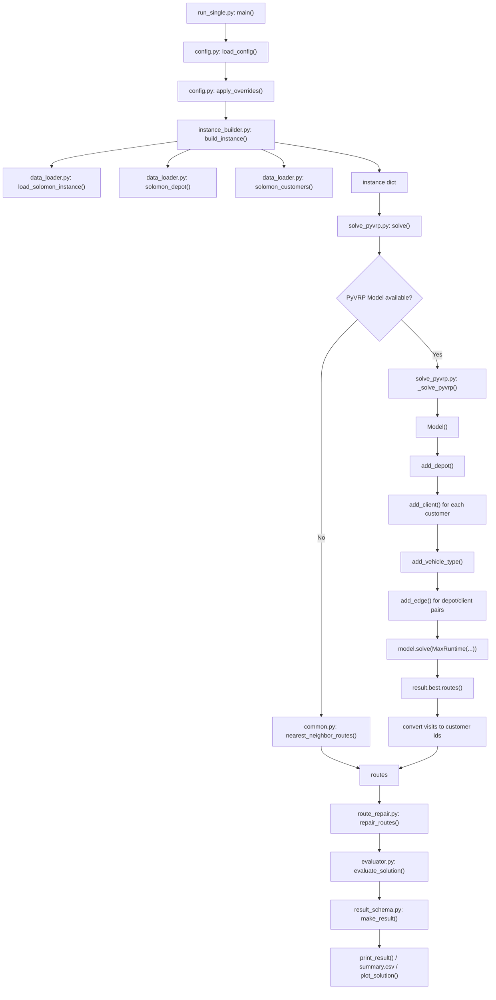
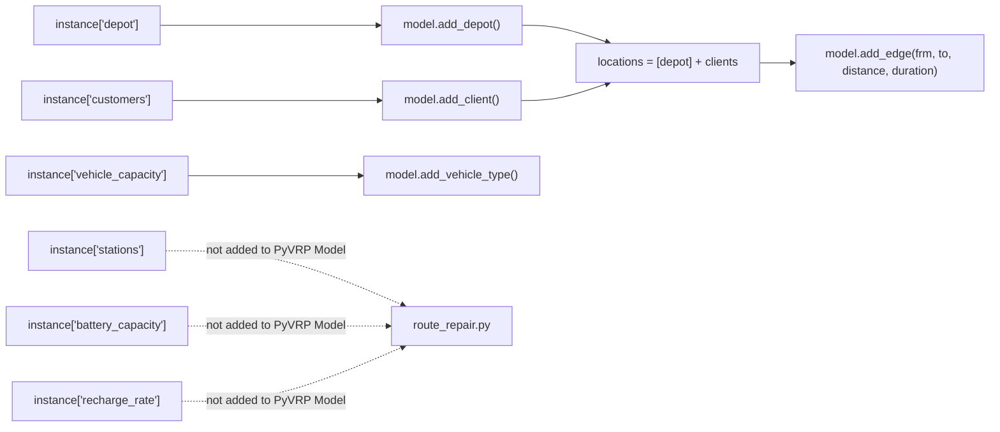

# PyVRP Code Walkthrough

本文档只分析当前项目中的 PyVRP 方法。分析依据是实际读取到的项目代码，而不是通用 PyVRP 教程。

当前读取确认的 PyVRP 版本：

```text
pyvrp 0.13.4
```

注意：当前安装包中 `pyvrp.__version__` 不可用，版本是通过 `importlib.metadata.version("pyvrp")` 查询到的。因此代码中不能假设 `pyvrp.__version__` 一定存在。

---

# 0. Current Conclusion

当前项目中的 PyVRP 方法不是完整 E-VRPTW 求解器。

更准确的描述是：

```text
PyVRP 先求一个带容量、时间窗、服务时间和距离边的 VRPTW/CVRPTW-style 路线；
然后项目自己的 route_repair.py 插入充电站并修复电量；
最后 evaluator.py 统一检查容量、时间窗、电量和客户覆盖。
```

重点结论：

1. PyVRP 当前直接处理的是 **VRPTW-style problem**，不是严格 E-VRPTW。
2. PyVRP 模型中加入了 depot 和 clients。
3. PyVRP 模型中没有加入 charging stations。
4. 电池状态、充电站访问、充电时间和非线性充电都不在 PyVRP 内部建模。
5. PyVRP 输出的 route visits 会被转换成项目统一格式 `list[list[int]]`。
6. 最终路线会经过 `repair_routes()`，所以最终输出路线不一定是 PyVRP 原始路线。
7. 最终可行性由 `evaluate_solution()` 判断，而不是 PyVRP 单独判断。

---

# 1. True Call Order

单独运行 PyVRP：

```powershell
python -m EVRPTW_Schneider2014.run_single --instance R101 --customers 10 --method pyvrp
```

真实调用顺序：

```text
run_single.py:main()
-> config.py:load_config()
-> config.py:apply_overrides()
-> instance_builder.py:build_instance()
   -> data_loader.py:load_solomon_instance()
   -> data_loader.py:solomon_depot()
   -> data_loader.py:solomon_customers()
   -> instance_builder.py:_select_customers()
   -> instance_builder.py:_generate_stations()
   -> instance_builder.py:_estimate_battery_capacity()
-> instance_builder.py:save_instance()
-> run_single.py:SOLVERS["pyvrp"]
-> solvers/solve_pyvrp.py:solve()
   -> solvers/solve_pyvrp.py:_solve_pyvrp()
      -> Model()
      -> model.add_depot()
      -> model.add_client()
      -> model.add_vehicle_type()
      -> model.add_edge()
      -> model.solve(MaxRuntime(...), seed=..., display=False)
      -> result.best
      -> solution.routes()
      -> route.visits()
      -> convert visits to project customer ids
   -> route_repair.py:repair_routes()
   -> evaluator.py:evaluate_solution()
   -> result_schema.py:make_result()
-> run_single.py:print_result()
-> visualization.py:plot_solution()  # only with --show-plot or --save-plot
```

批量运行 PyVRP：

```powershell
python -m EVRPTW_Schneider2014.run_experiments --config configs/debug_small.yaml --method pyvrp
```

真实调用顺序：

```text
run_experiments.py:main()
-> build_instance()
-> save_instance()
-> SOLVERS["pyvrp"](instance)
-> _summary_row()
-> results/raw_results.jsonl
-> results/summary.csv
-> visualization.py:plot_solution()  # only with --plot
```

---

## `EVRPTW_Schneider2014/run_single.py`: `main()`

### 1. 谁调用它

用户通过终端调用：

```powershell
python -m EVRPTW_Schneider2014.run_single --instance R101 --customers 10 --method pyvrp
```

文件末尾执行：

```python
if __name__ == "__main__":
    main()
```

### 2. 输入

来自命令行参数。

| 参数 | 类型 | 示例 | 作用 |
| -- | -- | -- | -- |
| `--config` | `str` | `configs/debug_small.yaml` | 配置文件 |
| `--instance` | `str` | `R101` | Solomon 实例名 |
| `--customers` | `int` | `10` | 客户数量 |
| `--stations` | `int` | `21` | 充电站数量 |
| `--method` | `str` | `pyvrp` | 选择 PyVRP |
| `--seed` | `int` | `1987` | 数据构造随机种子 |
| `--instance-file` | `str` | `generated_instances/R101_10_seed1987.json` | 直接读取已生成实例 |
| `--save-plot` | `str` | `figures/R101_pyvrp.png` | 保存图片 |
| `--show-plot` | `bool` | `True` | 显示图片 |

### 3. 输出

无函数返回值。它会：

- 生成或读取 instance；
- 调用 PyVRP solver；
- 打印结果；
- 可选保存或显示路线图。

终端输出示例：

```text
instance: R101_10_seed1987
method: pyvrp
routes:
  Vehicle 1: 0 ---> 52 ---> 18 ---> 61 ---> 0
vehicle_count: 1
distance: 311.64
runtime_seconds: 5.01
feasible: False
```

### 4. 核心逻辑

核心代码片段：

```python
config = apply_overrides(load_config(args.config), args)
if args.instance_file:
    instance = load_generated_instance(args.instance_file)
else:
    source_instance = config["instances"][0]
    customer_count = int(config["customer_counts"][0])
    instance = build_instance(config, source_instance, customer_count)
    output_dir = resolve_path(config.get("output_instance_dir", "generated_instances"))
    save_instance(instance, output_dir)

result = SOLVERS[args.method](instance)
print_result(result)
```

执行顺序：

1. 解析命令行参数。
2. 读取配置。
3. 用命令行参数覆盖配置。
4. 如果提供 `--instance-file`，直接读取实例。
5. 否则从 Solomon JSON 构造实例。
6. 保存生成实例。
7. 通过 `SOLVERS["pyvrp"]` 调用 `solve_pyvrp.solve(instance)`。
8. 打印结果。
9. 根据参数决定是否画图。

### 5. 对应的 PyVRP 概念

这不是 PyVRP 内部概念。它是项目的单次实验入口。

### 6. 对应的问题约束

不直接处理约束。只负责把 instance 交给 PyVRP solver。

| 约束 | 是否在这里处理 |
| -- | -- |
| 客户唯一服务 | 否 |
| 容量 | 否 |
| 时间窗 | 否 |
| 电量 | 否 |
| 充电站 | 否 |
| 路线输出 | 是，调用打印函数 |

### 7. 三客户示例

运行：

```powershell
python -m EVRPTW_Schneider2014.run_single --instance R101 --customers 3 --method pyvrp
```

数据流：

```text
R101 + 3 customers
-> build_instance()
-> instance
-> solve_pyvrp.solve(instance)
-> result
-> print_result()
```

### 8. 风险点

- 如果 `--method` 没有设为 `pyvrp`，不会进入 PyVRP。
- `--seed` 在这里只覆盖配置中的实例生成 seed，不直接传给 `solve_pyvrp.solve()`；当前 `solve_pyvrp.solve()` 默认 seed 是 `64`。
- 打印的路线是 repair 后路线，不一定是 PyVRP 原始路线。

---

## `EVRPTW_Schneider2014/config.py`: `load_config()`

### 1. 谁调用它

由：

- `run_single.py:main()`
- `run_experiments.py:main()`

调用。

### 2. 输入

```python
path: str | Path
```

示例：

```python
"configs/debug_small.yaml"
```

### 3. 输出

配置字典：

```python
dict[str, Any]
```

示例：

```python
{
    "dataset_dir": "D:/学习/FURP/VRP_project/datasets/solomon/json",
    "instances": ["R101"],
    "customer_counts": [10],
    "station_count": 21,
    "seed": 1987,
    "methods": ["pyvrp"]
}
```

### 4. 核心逻辑

代码片段：

```python
config_path = Path(path)
if not config_path.is_absolute():
    config_path = ROOT / config_path
return _parse_simple_yaml(config_path.read_text(encoding="utf-8"))
```

逻辑：

1. 把配置路径转为 `Path`。
2. 相对路径自动基于 `EVRPTW_Schneider2014/` 目录解析。
3. 读取 YAML 文本。
4. 用项目内置简单 YAML parser 转成字典。

### 5. 对应的 PyVRP 概念

不是 PyVRP 概念。它决定 PyVRP 使用什么数据。

### 6. 对应的问题约束

间接影响：

- 客户规模；
- 实例类型；
- 充电站数量；
- 电池和充电参数。

### 7. 三客户示例

配置：

```yaml
instances:
  - R101
customer_counts:
  - 3
methods:
  - pyvrp
```

读取后：

```python
config["customer_counts"] == [3]
config["methods"] == ["pyvrp"]
```

### 8. 风险点

- 内置 YAML parser 只支持简单 YAML。
- 配置中的 `methods` 如果包含多个方法，批量运行会跑多个方法。

---

## `EVRPTW_Schneider2014/config.py`: `apply_overrides()`

### 1. 谁调用它

由：

- `run_single.py:main()`
- `run_experiments.py:main()`

调用。

### 2. 输入

```python
config: dict[str, Any]
args: argparse.Namespace
```

示例：

```python
args.instance = "R101"
args.customers = 10
args.method = "pyvrp"
```

### 3. 输出

更新后的配置字典。

示例：

```python
{
    "instances": ["R101"],
    "customer_counts": [10],
    "methods": ["pyvrp"]
}
```

### 4. 核心逻辑

代码片段：

```python
if getattr(args, "instance", None):
    updated["instances"] = [args.instance]
if getattr(args, "customers", None):
    updated["customer_counts"] = [args.customers]
if getattr(args, "method", None):
    updated["methods"] = [args.method]
```

逻辑：

1. 复制配置。
2. 用命令行的 instance/customers/stations/method/seed 覆盖配置。
3. 返回覆盖后的配置。

### 5. 对应的 PyVRP 概念

不是 PyVRP 概念。它控制本次 PyVRP 实验输入规模。

### 6. 对应的问题约束

间接影响客户数量、车辆数量上限和充电站数量。

### 7. 三客户示例

命令行：

```powershell
--instance R101 --customers 3 --method pyvrp
```

覆盖后：

```python
instances = ["R101"]
customer_counts = [3]
methods = ["pyvrp"]
```

### 8. 风险点

- `--seed` 覆盖的是配置里的 instance generation seed，不等于 PyVRP solver 的 seed。
- 当前 `run_single.py` 调用 `SOLVERS[args.method](instance)`，没有把 `args.seed` 传给 `solve_pyvrp.solve()`。

---

## `EVRPTW_Schneider2014/instance_builder.py`: `build_instance()`

### 1. 谁调用它

由：

- `run_single.py:main()`
- `run_experiments.py:main()`

调用。

### 2. 输入

```python
config: dict[str, Any]
source_instance: str
customer_count: int
```

示例：

```python
build_instance(config, "R101", 10)
```

### 3. 输出

统一 instance 字典。

示例：

```python
{
    "name": "R101_10_seed1987",
    "depot": {...},
    "customers": [...],
    "stations": [...],
    "nodes": [...],
    "vehicle_capacity": 200.0,
    "battery_capacity": 123.4,
    "consumption_rate": 1.0,
    "recharge_rate": 5.6,
    "distance_matrix": [...]
}
```

### 4. 核心逻辑

代码片段：

```python
raw = load_solomon_instance(dataset_dir, source_instance)
depot = solomon_depot(raw)
customers = _select_customers(solomon_customers(raw), customer_count, ...)
stations = _generate_stations(depot, customers, station_count, ...)

nodes = [depot] + customers + stations
id_to_index = {node["id"]: idx for idx, node in enumerate(nodes)}
```

执行顺序：

1. 读取 Solomon JSON。
2. 解析 depot。
3. 解析客户。
4. 抽样客户。
5. 生成虚拟充电站。
6. 读取车辆容量。
7. 估算电池容量。
8. 估算充电速率。
9. 构造 `nodes` 和 `distance_matrix`。

### 5. 对应的 PyVRP 概念

这是 PyVRP 建模前的数据准备。

后续 PyVRP 只使用：

- `instance["depot"]`
- `instance["customers"]`
- `instance["vehicle_capacity"]`

不会直接使用：

- `instance["stations"]`
- `instance["battery_capacity"]`
- `instance["recharge_rate"]`

这些会在 repair/evaluator 使用。

### 6. 对应的问题约束

| 约束 | 是否在这里准备 |
| -- | -- |
| 客户唯一服务 | 准备客户列表 |
| 容量 | 读取 `vehicle_capacity` |
| 时间窗 | 保留 `ready_time/due_time` |
| 服务时间 | 保留 `service_time` |
| 电量 | 估算 `battery_capacity` |
| 充电站 | 生成 `stations` |
| 非线性充电 | 否 |

### 7. 三客户示例

输入：

```text
R101, customer_count=3, station_count=2
```

输出：

```python
depot = {"id": 0}
customers = [{"id": 18}, {"id": 52}, {"id": 90}]
stations = [{"id": 1000}, {"id": 1001}]
nodes = [0, 18, 52, 90, 1000, 1001]
```

但是 PyVRP `_solve_pyvrp()` 只会建：

```text
depot + 3 clients
```

不会建 station 节点。

### 8. 风险点

- instance 中存在 stations，不代表 PyVRP 模型中有 stations。
- 电池和充电参数存在于 instance，不代表 PyVRP 求解时考虑了它们。
- 客户 id 可能不是连续的，但 PyVRP route visits 通常是内部 client 索引，后续需要转换。

---

## `EVRPTW_Schneider2014/data_loader.py`: `load_solomon_instance()`

### 1. 谁调用它

由 `instance_builder.py:build_instance()` 调用。

### 2. 输入

```python
dataset_dir: str | Path
instance_name: str
```

示例：

```python
load_solomon_instance("D:/学习/FURP/VRP_project/datasets/solomon/json", "R101")
```

### 3. 输出

Solomon JSON 字典。

示例：

```python
{
    "depart": {...},
    "vehicle_capacity": 200,
    "customer_1": {...}
}
```

### 4. 核心逻辑

代码片段：

```python
path = Path(dataset_dir) / f"{instance_name}.json"
if not path.exists():
    raise FileNotFoundError(...)
with path.open("r", encoding="utf-8") as file_object:
    return json.load(file_object)
```

### 5. 对应的 PyVRP 概念

不是 PyVRP 概念，是数据源读取。

### 6. 对应的问题约束

只读取原始数据，不处理约束。

### 7. 三客户示例

读取 R101 后，后续可能抽取 3 个客户：

```text
customer_18, customer_52, customer_90
```

### 8. 风险点

- 路径错误会直接失败。
- 读取的是 Solomon 数据，不是 Schneider 原始 E-VRPTW benchmark。

---

## `EVRPTW_Schneider2014/data_loader.py`: `solomon_depot()`

### 1. 谁调用它

由 `instance_builder.py:build_instance()` 调用。

### 2. 输入

```python
data: dict
```

### 3. 输出

标准化 depot：

```python
{
    "id": 0,
    "x": 35.0,
    "y": 35.0,
    "demand": 0.0,
    "ready_time": 0.0,
    "due_time": 230.0,
    "service_time": 0.0,
    "type": "depot"
}
```

### 4. 核心逻辑

从 Solomon 的 `depart` 字段读取坐标和时间窗，并固定 id 为 0。

### 5. 对应的 PyVRP 概念

后续用于：

```python
model.add_depot(x=..., y=..., name="0")
```

### 6. 对应的问题约束

准备 depot 位置和时间窗。不过当前 PyVRP 代码只把 depot 坐标传给 `add_depot()`，没有把 depot 时间窗传给 PyVRP。

### 7. 三客户示例

```text
depot id = 0
clients = 18, 52, 90
```

PyVRP 中 depot 名称为：

```python
name="0"
```

### 8. 风险点

- 当前 `model.add_depot()` 没有传 depot 时间窗参数。
- depot 时间窗最终只会在 evaluator 中通过回到 depot 充电逻辑间接参与，不是 PyVRP 内部严格终点时间窗。

---

## `EVRPTW_Schneider2014/data_loader.py`: `solomon_customers()`

### 1. 谁调用它

由 `instance_builder.py:build_instance()` 调用。

### 2. 输入

```python
data: dict
```

### 3. 输出

标准化客户列表：

```python
[
    {
        "id": 18,
        "x": 20.0,
        "y": 40.0,
        "demand": 10.0,
        "ready_time": 0.0,
        "due_time": 230.0,
        "service_time": 10.0,
        "type": "customer"
    }
]
```

### 4. 核心逻辑

1. 查找所有 `customer_` 开头的字段。
2. 按编号排序。
3. 提取坐标、需求、时间窗、服务时间。
4. 转换成项目统一客户格式。

### 5. 对应的 PyVRP 概念

后续用于：

```python
model.add_client(
    x=customer["x"],
    y=customer["y"],
    delivery=int(round(customer["demand"])),
    service_duration=int(round(customer["service_time"])),
    tw_early=int(round(customer["ready_time"])),
    tw_late=int(round(customer["due_time"])),
    name=str(customer["id"]),
)
```

### 6. 对应的问题约束

准备：

- customer demand；
- service duration；
- time window；
- location；
- client name。

### 7. 三客户示例

项目客户：

```python
[{"id": 18}, {"id": 52}, {"id": 90}]
```

PyVRP clients 添加顺序：

```text
client internal visit 1 -> customer id 18
client internal visit 2 -> customer id 52
client internal visit 3 -> customer id 90
```

### 8. 风险点

- PyVRP route visits 返回的不是原始客户 id，而是内部 client 编号。
- 所以必须使用 `name_by_client` 转换。

---

## `EVRPTW_Schneider2014/solvers/solve_pyvrp.py`: `solve()`

### 1. 谁调用它

由：

- `run_single.py:main()` 通过 `SOLVERS["pyvrp"]`
- `run_experiments.py:main()` 通过 `SOLVERS[method]`

调用。

### 2. 输入

```python
instance: dict
time_limit_seconds: int = 5
seed: int = 64
```

示例：

```python
solve(instance, time_limit_seconds=5, seed=64)
```

### 3. 输出

统一结果字典：

```python
{
    "instance": "R101_10_seed1987",
    "method": "pyvrp",
    "routes": [[52, 18, 1003, 61], [86]],
    "vehicle_count": 2,
    "distance": 311.64,
    "runtime_seconds": 5.02,
    "feasible": False,
    "violations": {
        "capacity": 0.0,
        "time_window": 269.91,
        "battery": 0.0,
        "customer_coverage": 0.0
    },
    "notes": "PyVRP baseline; battery and recharging checked by evaluator. Routes repaired with charging insertion."
}
```

### 4. 核心逻辑

代码片段：

```python
started = perf_counter()
notes = "PyVRP baseline; battery and recharging checked by evaluator."
if Model is None:
    routes = nearest_neighbor_routes(instance)
    notes = "PyVRP unavailable; used nearest-neighbor fallback."
else:
    try:
        routes = _solve_pyvrp(instance, time_limit_seconds, seed)
    except Exception as exc:
        routes = nearest_neighbor_routes(instance)
        notes = f"PyVRP failed and nearest-neighbor fallback was used: {exc}"
routes = repair_routes(instance, routes)
evaluation = evaluate_solution(instance, routes)
return make_result(...).to_dict()
```

执行顺序：

1. 记录开始时间。
2. 如果 PyVRP 未成功导入，使用最近邻 fallback。
3. 如果 PyVRP 可用，调用 `_solve_pyvrp()`。
4. 如果 `_solve_pyvrp()` 抛异常，也使用最近邻 fallback。
5. 对得到的客户路线调用 `repair_routes()`。
6. 用 `evaluate_solution()` 做统一检查。
7. 用 `make_result()` 返回统一格式。

### 5. 对应的 PyVRP 概念

这是项目对 PyVRP 的 wrapper，不是 PyVRP 内部核心。

它负责：

- 调用 PyVRP；
- 处理 PyVRP 不可用或失败；
- 接入项目 repair；
- 接入统一 evaluator。

### 6. 对应的问题约束

| 约束 | 是否在 `solve()` 处理 |
| -- | -- |
| 客户唯一服务 | 间接，由 PyVRP 或 fallback |
| 容量 | 间接，由 PyVRP 或 fallback |
| 时间窗 | 间接，由 PyVRP，最终 evaluator 检查 |
| 电量 | 通过 repair/evaluator |
| 充电站 | 通过 repair/evaluator |
| 非线性充电 | 否 |

### 7. 三客户示例

PyVRP 原始输出：

```python
routes = [[18, 52, 90]]
```

repair 后可能变成：

```python
routes = [[18, 1000, 52], [90]]
```

最后 evaluator 输出：

```python
feasible = True or False
violations = {...}
```

### 8. 风险点

- 如果 PyVRP 失败，结果仍然会输出，但 notes 会说明使用 nearest-neighbor fallback。
- 最终路线经过 repair，可能不是 PyVRP 原始路线。
- `run_single.py` 没有把命令行 `--seed` 直接传给 `solve()` 的 `seed` 参数。
- 当前 notes 明确写了 battery and recharging checked by evaluator，说明它不是 PyVRP 内部约束。

---

## `EVRPTW_Schneider2014/solvers/solve_pyvrp.py`: `_solve_pyvrp()`

### 1. 谁调用它

由 `solve_pyvrp.py:solve()` 调用：

```python
routes = _solve_pyvrp(instance, time_limit_seconds, seed)
```

### 2. 输入

```python
instance: dict
time_limit_seconds: int
seed: int
```

示例：

```python
_solve_pyvrp(instance, 5, 64)
```

### 3. 输出

PyVRP 原始解转换后的客户路线：

```python
list[list[int]]
```

示例：

```python
[[52, 18, 61], [86, 90]]
```

注意：这个输出还没有经过 E-VRPTW repair。

### 4. 核心逻辑

#### Step 1：创建 Model

```python
model = Model()
```

这是 PyVRP 建模对象。

#### Step 2：添加 depot

```python
depot = model.add_depot(x=instance["depot"]["x"], y=instance["depot"]["y"], name="0")
```

当前只传入 depot 坐标和名称，没有传 depot 时间窗。

#### Step 3：添加 clients

```python
clients = []
for customer in instance["customers"]:
    clients.append(
        model.add_client(
            x=customer["x"],
            y=customer["y"],
            delivery=int(round(customer["demand"])),
            service_duration=int(round(customer["service_time"])),
            tw_early=int(round(customer["ready_time"])),
            tw_late=int(round(customer["due_time"])),
            name=str(customer["id"]),
        )
    )
```

每个客户被添加为 PyVRP client。

直接进入 PyVRP 的客户约束包括：

- demand；
- service duration；
- time window；
- location。

#### Step 4：添加 vehicle type

```python
model.add_vehicle_type(
    num_available=max(1, len(instance["customers"])),
    capacity=[int(round(instance["vehicle_capacity"]))],
    start_depot=depot,
    end_depot=depot,
)
```

当前车辆数量上限等于客户数，因此车辆数被放得很宽。

#### Step 5：添加 edges

```python
locations = [depot] + clients
for frm in locations:
    for to in locations:
        if frm is to:
            continue
        dist = int(round(((frm.x - to.x) ** 2 + (frm.y - to.y) ** 2) ** 0.5 * 100))
        model.add_edge(frm, to, distance=dist, duration=dist)
```

注意：

- edge 只在 depot 和 clients 之间添加；
- stations 没有加入 `locations`；
- distance 和 duration 都是 `欧氏距离 * 100`；
- duration 没有额外加入 service time，因为 service time 已在 client 上设置为 `service_duration`。

#### Step 6：求解

```python
result = model.solve(MaxRuntime(time_limit_seconds), seed=seed, display=False)
solution = result.best
```

使用时间停止条件 `MaxRuntime(time_limit_seconds)`。

#### Step 7：建立内部 visit 到项目客户 id 的映射

```python
name_by_client = {idx + 1: customer["id"] for idx, customer in enumerate(instance["customers"])}
```

如果客户列表是：

```python
[{"id": 18}, {"id": 52}, {"id": 90}]
```

则：

```python
name_by_client = {1: 18, 2: 52, 3: 90}
```

#### Step 8：提取 routes

```python
for route in solution.routes():
    visits = route.visits() if hasattr(route, "visits") else list(route)
    converted = [name_by_client[int(visit)] for visit in visits if int(visit) in name_by_client]
    if converted:
        routes.append(converted)
```

这里把 PyVRP 的 visit 编号转换为项目中的客户 id。

### 5. 对应的 PyVRP 概念

| PyVRP 概念 | 当前代码 |
| -- | -- |
| Model | `model = Model()` |
| Depot | `model.add_depot(...)` |
| Client | `model.add_client(...)` |
| VehicleType | `model.add_vehicle_type(...)` |
| Edge | `model.add_edge(...)` |
| Stop criterion | `MaxRuntime(time_limit_seconds)` |
| Result | `result = model.solve(...)` |
| Best solution | `solution = result.best` |
| Routes | `solution.routes()` |
| Visits | `route.visits()` 或 `list(route)` |

### 6. 对应的问题约束

| 约束 | 是否由 PyVRP 内部处理 | 当前实现 |
| -- | -- | -- |
| 客户唯一服务 | 是 | clients 必须被服务 |
| 容量 | 是 | `delivery` + `vehicle_type.capacity` |
| 时间窗 | 是 | `tw_early`, `tw_late` |
| 服务时间 | 是 | `service_duration` |
| 距离 | 是 | `model.add_edge(..., distance=dist)` |
| 行驶时间 | 是 | `model.add_edge(..., duration=dist)` |
| 车辆数量上限 | 是 | `num_available=max(1, len(customers))` |
| 电池容量 | 否 | 未建 battery state |
| 充电站 | 否 | stations 未加入 model |
| 充电时间 | 否 | 未进入 model |
| 非线性充电 | 否 | 未进入 model |

### 7. 三客户示例

项目实例：

```python
depot id = 0
customers = [
    {"id": 18, "demand": 5},
    {"id": 52, "demand": 6},
    {"id": 90, "demand": 4},
]
stations = [{"id": 1000}]
```

PyVRP 模型对象：

```text
Depot: name="0"
Client 1: name="18"
Client 2: name="52"
Client 3: name="90"
VehicleType: capacity=[vehicle_capacity], num_available=3
Edges: depot/client pairwise edges
```

PyVRP 可能返回：

```python
route.visits() == [2, 1, 3]
```

转换：

```python
name_by_client = {1: 18, 2: 52, 3: 90}
converted = [52, 18, 90]
```

返回：

```python
routes = [[52, 18, 90]]
```

然后 repair 可能变成：

```python
[[52, 1000, 18], [90]]
```

### 8. 风险点

#### PyVRP 当前不是 E-VRPTW

因为代码中：

```python
locations = [depot] + clients
```

没有：

```python
locations = [depot] + clients + stations
```

所以充电站不是 PyVRP 模型节点。

#### duration 和 evaluator 的 distance 尺度不一致

PyVRP edge 中：

```python
dist = int(round(euclidean * 100))
model.add_edge(frm, to, distance=dist, duration=dist)
```

而 evaluator 中：

```python
leg = _distance(current, nxt)
distance += leg
time += leg
```

也就是说 PyVRP 内部距离和时间乘了 100，evaluator 使用原始欧氏距离。这会导致 PyVRP 内部目标值和最终输出 distance 不完全一致。

#### 车辆数上限较宽

```python
num_available=max(1, len(instance["customers"]))
```

这允许最多一客户一车，提高可行性，但可能不符合“尽量少车”的研究目标。

#### depot 时间窗未进入 PyVRP

`model.add_depot()` 当前没有传 depot 的 `ready_time/due_time`。

#### route visits API 兼容

代码写了：

```python
visits = route.visits() if hasattr(route, "visits") else list(route)
```

说明它在兼容不同 PyVRP route API，但具体含义仍依赖当前 PyVRP 版本。

---

## `EVRPTW_Schneider2014/solvers/common.py`: `nearest_neighbor_routes()`

### 1. 谁调用它

由 `solve_pyvrp.py:solve()` 在两种情况下调用：

1. PyVRP 未安装或导入失败；
2. `_solve_pyvrp()` 抛出异常。

代码：

```python
if Model is None:
    routes = nearest_neighbor_routes(instance)
...
except Exception as exc:
    routes = nearest_neighbor_routes(instance)
```

### 2. 输入

```python
instance: dict
```

### 3. 输出

客户路线：

```python
list[list[int]]
```

示例：

```python
[[18, 52], [90]]
```

### 4. 核心逻辑

1. 从 depot 开始。
2. 在剩余客户中选不超过容量的候选。
3. 选择离当前点最近的客户。
4. 加入当前路线。
5. 没有可加入客户时，新开路线。
6. 重复直到所有客户分配完。

### 5. 对应的 PyVRP 概念

不是 PyVRP 概念。它是 PyVRP 失败时的 fallback。

### 6. 对应的问题约束

| 约束 | 是否处理 |
| -- | -- |
| 客户覆盖 | 是 |
| 容量 | 是 |
| 时间窗 | 否 |
| 电量 | 否 |
| 充电站 | 否 |

### 7. 三客户示例

容量为 10：

```text
A demand 6
B demand 5
C demand 4
```

可能输出：

```python
[[A, C], [B]]
```

### 8. 风险点

- 如果 fallback 被使用，结果不是 PyVRP 求解结果。
- notes 会说明 fallback，但 CSV 中 method 仍是 `pyvrp`。
- fallback 只考虑容量和距离，不考虑时间窗、电量和充电。

---

## `EVRPTW_Schneider2014/route_repair.py`: `repair_routes()`

### 1. 谁调用它

由 `solve_pyvrp.py:solve()` 调用：

```python
routes = repair_routes(instance, routes)
```

### 2. 输入

```python
instance: dict
routes: list[list[int]]
```

示例：

```python
routes = [[52, 18, 90]]
```

### 3. 输出

修复后的路线：

```python
list[list[int]]
```

示例：

```python
[[52, 1000, 18], [90]]
```

### 4. 核心逻辑

代码片段：

```python
customer_ids = {customer["id"] for customer in instance["customers"]}
seen = set()
ordered_customers = []
for route in routes:
    for node in route:
        if node in customer_ids and node not in seen:
            ordered_customers.append(node)
            seen.add(node)
return _merge_routes(instance, _pack_customers(instance, ordered_customers))
```

逻辑：

1. 只保留客户 id。
2. 去掉重复客户。
3. 保留客户出现顺序。
4. 调用 `_pack_customers()` 重新打包路线。
5. 调用 `_merge_routes()` 尝试合并路线。

### 5. 对应的 PyVRP 概念

不是 PyVRP 概念。它是项目外部 E-VRPTW repair。

### 6. 对应的问题约束

| 约束 | 是否处理 |
| -- | -- |
| 客户唯一服务 | 是，去重 |
| 容量 | 通过 `_is_route_feasible()` |
| 时间窗 | 通过 `_is_route_feasible()` |
| 电量 | 通过 `_repair_energy()` |
| 充电站 | 通过 `_repair_energy()` |
| 车辆数 | 通过 `_merge_routes()` 尝试减少 |

### 7. 三客户示例

PyVRP 输出：

```python
[[1, 2, 3]]
```

如果 `1 -> 2` 之间缺电，repair 可能输出：

```python
[[1, 1000, 2, 3]]
```

如果时间窗或容量不允许一车完成，可能输出：

```python
[[1, 1000, 2], [3]]
```

### 8. 风险点

- repair 会改变 PyVRP 原始解。
- repair 不保留 PyVRP route 的内部成本、到达时间或惩罚信息。
- repair 只保留客户出现顺序和客户集合。

---

## `EVRPTW_Schneider2014/route_repair.py`: `_pack_customers()`

### 1. 谁调用它

由 `repair_routes()` 调用。

### 2. 输入

```python
instance: dict
ordered_customers: list[int]
```

示例：

```python
ordered_customers = [52, 18, 90]
```

### 3. 输出

重新打包后的路线：

```python
list[list[int]]
```

示例：

```python
[[52, 18], [90]]
```

### 4. 核心逻辑

对每个客户：

1. 遍历已有路线。
2. 遍历所有插入位置。
3. 生成候选客户序列。
4. 调用 `_repair_energy()` 插入充电站。
5. 调用 `_is_route_feasible()` 检查容量、时间窗、电量。
6. 选择距离增加最少的位置。
7. 如果所有已有路线都不可行，则新开车辆。

### 5. 对应的 PyVRP 概念

不是 PyVRP 概念。它是外部 repair insertion。

### 6. 对应的问题约束

直接或间接处理：

- 容量；
- 时间窗；
- 电量；
- 充电站；
- 车辆数。

### 7. 三客户示例

当前：

```python
packed = [[1, 2]]
```

插入客户 `3`：

候选：

```python
[3, 1, 2]
[1, 3, 2]
[1, 2, 3]
```

每个候选都经过：

```text
_repair_energy()
-> _is_route_feasible()
```

如果都不可行：

```python
packed.append([3])
```

### 8. 风险点

- 可能因为约束很紧而频繁新开车辆。
- 这是贪心插入，不保证全局最优。
- repair 和 PyVRP 原目标不一致，可能降低 PyVRP 原始解质量。

---

## `EVRPTW_Schneider2014/route_repair.py`: `_repair_energy()`

### 1. 谁调用它

由：

- `_pack_customers()`
- `_merge_routes()`
- `_improve_time_feasibility()`

调用。

### 2. 输入

```python
instance: dict
customer_route: list[int]
```

示例：

```python
customer_route = [52, 18, 90]
```

### 3. 输出

成功时：

```python
list[int]
```

示例：

```python
[52, 1003, 18, 90]
```

失败时：

```python
None
```

### 4. 核心逻辑

1. 初始位置为 depot。
2. 初始电量为 `battery_capacity`。
3. 对每个目标客户和最终 depot：
   - 计算行驶距离；
   - 计算能耗；
   - 电量够就直接走；
   - 电量不够就调用 `_best_reachable_station()`；
   - 到站后按线性满充；
   - 把站点 id 插入 route。

代码片段：

```python
if energy <= battery + 1e-9:
    battery -= energy
    time += leg
    ...
else:
    station = _best_reachable_station(...)
    ...
    time += recharge_amount / recharge_rate
    battery = battery_capacity
    route.append(station_id)
```

### 5. 对应的 PyVRP 概念

不是 PyVRP 概念。它是外部电量修复。

### 6. 对应的问题约束

| 约束 | 当前处理 |
| -- | -- |
| 电池容量 | 是 |
| 能耗 | 是，`distance * consumption_rate` |
| 充电站 | 是，选择可达站点 |
| 充电时间 | 是，线性满充 |
| 非线性充电 | 否 |
| 部分充电 | 否 |

### 7. 三客户示例

```text
battery_capacity = 10
route = [1, 2, 3]
1 -> 2 需要 12 电量
```

无法直接从 1 到 2，于是尝试：

```text
1 -> station 1000 -> 2
```

输出：

```python
[1, 1000, 2, 3]
```

### 8. 风险点

- 只做满充，不做部分充电。
- 充电站选择只看可达和绕行，不直接优化时间窗。
- 插入充电站后可能导致时间窗 violation。
- PyVRP 搜索过程不知道这些电量修复。

---

## `EVRPTW_Schneider2014/route_repair.py`: `_best_reachable_station()`

### 1. 谁调用它

由 `_repair_energy()` 调用。

### 2. 输入

```python
node_map: dict[int, dict]
stations: list[dict]
current_id: int
target_id: int
battery: float
battery_capacity: float
consumption: float
```

### 3. 输出

一个 station dict 或 `None`。

示例：

```python
{"id": 1003, "x": 30.0, "y": 42.0, "type": "station"}
```

### 4. 核心逻辑

1. 遍历所有站点。
2. 判断当前剩余电量是否能到站。
3. 判断满电后站点是否能到目标。
4. 计算绕行距离。
5. 选择绕行最小的站点。

### 5. 对应的 PyVRP 概念

不是 PyVRP 概念。

### 6. 对应的问题约束

处理充电站可达性。

### 7. 三客户示例

当前点是客户 1，目标是客户 2：

```text
station 1000: current -> station 可达，station -> target 可达，detour=20
station 1001: current -> station 可达，station -> target 可达，detour=25
```

选择：

```python
1000
```

### 8. 风险点

- 不考虑站点拥堵。
- 不考虑非线性充电曲线。
- 不考虑无人机或同步。
- 不直接比较对后续客户时间窗的影响。

---

## `EVRPTW_Schneider2014/route_repair.py`: `_merge_routes()`

### 1. 谁调用它

由 `repair_routes()` 调用。

### 2. 输入

```python
instance: dict
routes: list[list[int]]
```

### 3. 输出

合并后的 routes。

### 4. 核心逻辑

1. 如果路线数超过 30，直接返回。
2. 遍历路线对。
3. 尝试 `left + right` 和 `right + left`。
4. 对候选路线调用 `_repair_energy()`。
5. 用 `_is_route_feasible()` 检查。
6. 选择距离节省最大的合并。
7. 重复直到没有可行合并。

### 5. 对应的 PyVRP 概念

不是 PyVRP 概念，是项目 repair 的 route merge。

### 6. 对应的问题约束

用于减少车辆数，同时保证：

- 容量；
- 时间窗；
- 电量。

### 7. 三客户示例

```python
routes = [[1], [2, 3]]
```

尝试：

```python
[1, 2, 3]
[2, 3, 1]
```

如果可行且距离节省，输出：

```python
[[1, 2, 3]]
```

### 8. 风险点

- 只做整条路线拼接，不是完整局部搜索。
- 路线数大于 30 时跳过。
- 合并后可能改变 PyVRP 原有路线结构。

---

## `EVRPTW_Schneider2014/route_repair.py`: `_is_route_feasible()`

### 1. 谁调用它

由：

- `_pack_customers()`
- `_merge_routes()`

调用。

### 2. 输入

```python
instance: dict
route: list[int]
```

### 3. 输出

```python
bool
```

### 4. 核心逻辑

代码片段：

```python
violations = evaluate_solution(instance, [route])["violations"]
return all(
    violations[key] <= 1e-6
    for key in ("capacity", "time_window", "battery")
)
```

逻辑：

1. 调用统一 evaluator 检查单条路线。
2. 只看容量、时间窗、电量。
3. 如果三项都无违反，则认为该路线可行。

### 5. 对应的 PyVRP 概念

不是 PyVRP 概念，是外部 feasibility check。

### 6. 对应的问题约束

检查：

- 容量；
- 时间窗；
- 电量。

不检查全局客户覆盖。

### 7. 三客户示例

```python
route = [1, 1000, 2]
```

如果：

```text
capacity violation = 0
time_window violation = 0
battery violation = 0
```

返回：

```python
True
```

### 8. 风险点

- 单路线可行不代表全局所有客户都覆盖。
- 客户重复/遗漏最终由 `evaluate_solution(instance, routes)` 检查。

---

## `EVRPTW_Schneider2014/evaluator.py`: `evaluate_solution()`

### 1. 谁调用它

由：

- `solve_pyvrp.py:solve()`
- `route_repair.py:_is_route_feasible()`
- 其他 solver

调用。

### 2. 输入

```python
instance: dict
routes: list[list[int]]
```

示例：

```python
routes = [[52, 1000, 18], [90]]
```

### 3. 输出

评价字典：

```python
{
    "distance": 311.64,
    "vehicle_count": 2,
    "feasible": False,
    "violations": {
        "capacity": 0.0,
        "time_window": 269.91,
        "battery": 0.0,
        "customer_coverage": 0.0
    }
}
```

### 4. 核心逻辑

对每条路线：

1. 从 depot 出发。
2. 初始化载重、时间、电量。
3. 依次访问 `route + [depot]`。
4. 每段累加距离和能耗。
5. 如果电量不足，记录 battery violation。
6. 到客户时：
   - 记录服务；
   - 加 demand；
   - 早到则等待；
   - 晚到则记录 time window violation；
   - 加 service time。
7. 到充电站或 depot 时：
   - 按线性满充；
   - 增加充电时间；
   - 电量恢复满电。
8. 每条路线结束后检查容量。
9. 所有路线结束后检查客户遗漏和重复。

### 5. 对应的 PyVRP 概念

不是 PyVRP 概念，是项目统一 evaluator。

### 6. 对应的问题约束

最终检查：

- 客户覆盖；
- 容量；
- 时间窗；
- 电量；
- 充电；
- 距离；
- 车辆数。

### 7. 三客户示例

```python
routes = [[1, 1000, 2, 3]]
```

模拟：

```text
0 -> 1: 行驶、耗电、服务客户
1 -> 1000: 行驶、耗电、充满电
1000 -> 2: 行驶、服务
2 -> 3: 行驶、服务
3 -> 0: 返回仓库
```

### 8. 风险点

- evaluator 是最终检查，不能反过来指导 PyVRP 搜索。
- evaluator 使用原始欧氏距离，而 PyVRP 内部 edge 使用 `欧氏距离 * 100`。
- 当前充电是线性满充，不是非线性充电。

---

## `EVRPTW_Schneider2014/result_schema.py`: `make_result()`

### 1. 谁调用它

由 `solve_pyvrp.py:solve()` 调用。

### 2. 输入

```python
instance: dict
method: str
routes: list[list[int]]
runtime_seconds: float
evaluation: dict
notes: str
```

### 3. 输出

`SolutionResult` dataclass，随后 `.to_dict()` 转为字典。

### 4. 核心逻辑

代码片段：

```python
return SolutionResult(
    instance=instance["name"],
    method=method,
    routes=routes,
    vehicle_count=len([route for route in routes if route]),
    distance=float(evaluation["distance"]),
    runtime_seconds=float(runtime_seconds),
    feasible=bool(evaluation["feasible"]),
    violations=dict(evaluation["violations"]),
    notes=notes,
)
```

### 5. 对应的 PyVRP 概念

不是 PyVRP 概念，是统一输出格式。

### 6. 对应的问题约束

不计算约束，只保存 evaluator 结果。

### 7. 三客户示例

```python
routes = [[1, 2, 3]]
evaluation["feasible"] = True
```

输出：

```python
{
    "method": "pyvrp",
    "routes": [[1, 2, 3]],
    "vehicle_count": 1,
    "feasible": True
}
```

### 8. 风险点

- `vehicle_count` 是非空路线数，不额外检查最大车辆数。
- 如果 PyVRP 原始解和 repair 后解不同，保存的是 repair 后解。

---

## `EVRPTW_Schneider2014/run_single.py`: `print_result()`

### 1. 谁调用它

由 `run_single.py:main()` 调用。

### 2. 输入

```python
result: dict
```

### 3. 输出

无返回值，打印终端结果。

### 4. 核心逻辑

1. 打印 instance。
2. 打印 method。
3. 遍历 routes。
4. 调用 `format_route()` 输出：

```text
0 ---> ... ---> 0
```

5. 打印车辆数、距离、运行时间、可行性和 violations。

### 5. 对应的 PyVRP 概念

不是 PyVRP 概念。

### 6. 对应的问题约束

只展示结果。

### 7. 三客户示例

```python
routes = [[1, 1000, 2], [3]]
```

输出：

```text
Vehicle 1: 0 ---> 1 ---> 1000 ---> 2 ---> 0
Vehicle 2: 0 ---> 3 ---> 0
```

### 8. 风险点

- 终端打印的是最终修复路线。
- 如果看到 `1000` 以上的节点，通常是充电站。

---

## `EVRPTW_Schneider2014/run_experiments.py`: `main()`

### 1. 谁调用它

用户运行：

```powershell
python -m EVRPTW_Schneider2014.run_experiments --config configs/debug_small.yaml --method pyvrp
```

### 2. 输入

命令行参数：

| 参数 | 示例 |
| -- | -- |
| `--config` | `configs/debug_small.yaml` |
| `--instance` | `R101` |
| `--customers` | `10` |
| `--method` | `pyvrp` |
| `--plot` | 保存图像 |

### 3. 输出

写入：

```text
EVRPTW_Schneider2014/results/raw_results.jsonl
EVRPTW_Schneider2014/results/summary.csv
EVRPTW_Schneider2014/figures/*.png  # if --plot
```

### 4. 核心逻辑

1. 读取配置。
2. 创建结果目录和图像目录。
3. 遍历实例。
4. 遍历客户规模。
5. 构造 instance。
6. 保存 instance。
7. 遍历 method。
8. 调用 `SOLVERS[method](instance)`。
9. 写 raw JSONL。
10. 写 CSV summary。
11. 可选画图。

### 5. 对应的 PyVRP 概念

不是 PyVRP 概念，是批量实验入口。

### 6. 对应的问题约束

不处理约束，只保存 PyVRP solver 返回的统一结果。

### 7. 三客户示例

配置：

```yaml
instances:
  - R101
customer_counts:
  - 3
methods:
  - pyvrp
```

输出 CSV 中一行：

```text
R101_3_seed1987, pyvrp, 0 ---> ... ---> 0, feasible=...
```

### 8. 风险点

- 每次批量运行会覆盖 `raw_results.jsonl` 和 `summary.csv`。
- 如果配置中有多个方法，会一起运行，不只 PyVRP。

---

## `EVRPTW_Schneider2014/run_experiments.py`: `_summary_row()`

### 1. 谁调用它

由 `run_experiments.py:main()` 调用。

### 2. 输入

```python
instance: dict
result: dict
```

### 3. 输出

CSV 行字典。

示例：

```python
{
    "instance": "R101_10_seed1987",
    "method": "pyvrp",
    "routes": "0 ---> 52 ---> 1000 ---> 18 ---> 0",
    "vehicle_count": 1,
    "distance": 311.64,
    "feasible": False,
    "battery_violation": 0.0
}
```

### 4. 核心逻辑

1. 读取 `result["violations"]`。
2. 把每条 route 格式化成 `0 ---> ... ---> 0`。
3. 输出 summary CSV 所需字段。

### 5. 对应的 PyVRP 概念

不是 PyVRP 概念。

### 6. 对应的问题约束

不计算约束，只记录 violation。

### 7. 三客户示例

```python
routes = [[1, 2], [3]]
```

CSV routes：

```text
0 ---> 1 ---> 2 ---> 0 ; 0 ---> 3 ---> 0
```

### 8. 风险点

- CSV 不保存 PyVRP 原始路线，只保存最终 result routes。
- notes 不在当前 summary fieldnames 中。

---

## `EVRPTW_Schneider2014/visualization.py`: `plot_solution()`

### 1. 谁调用它

由：

- `run_single.py:main()` 在 `--show-plot` 或 `--save-plot` 时调用；
- `run_experiments.py:main()` 在 `--plot` 时调用。

### 2. 输入

```python
instance: dict
result: dict | Any
show: bool = False
save_path: str | Path | None = None
```

### 3. 输出

保存时返回路径：

```python
Path(...)
```

否则返回 `None`。

### 4. 核心逻辑

1. 读取 routes。
2. depot 用黑色方块。
3. charging stations 用绿色三角。
4. customers 用蓝色圆点。
5. 对每条 route 补 depot 起终点。
6. 画线并保存或显示。

### 5. 对应的 PyVRP 概念

不是 PyVRP 概念。

### 6. 对应的问题约束

只画图，不检查约束。

### 7. 三客户示例

```python
route = [1, 1000, 2, 3]
```

图中连线：

```text
0 -> 1 -> 1000 -> 2 -> 3 -> 0
```

### 8. 风险点

- 图画的是最终 repair 后路线。
- 所有 charging stations 都会作为绿色三角显示，但只有路线经过的站点才是实际访问站点。

---

# 2. Key Questions

## 2.1 PyVRP 当前直接求解的是 CVRP、VRPTW 还是 E-VRPTW？

当前直接求解的是：

```text
VRPTW-style / CVRPTW-style problem
```

理由来自 `_solve_pyvrp()`：

```python
model.add_client(
    delivery=int(round(customer["demand"])),
    service_duration=int(round(customer["service_time"])),
    tw_early=int(round(customer["ready_time"])),
    tw_late=int(round(customer["due_time"])),
)
```

这说明 PyVRP 内部直接考虑：

- demand；
- capacity；
- service duration；
- time windows；
- travel duration；
- distance。

但没有：

- battery state；
- charging station node；
- recharge time；
- nonlinear charging。

所以不是严格 E-VRPTW。

## 2.2 哪些约束由 PyVRP 内部处理？

| 约束 | PyVRP 内部是否处理 | 代码证据 |
| -- | -- | -- |
| 客户服务 | 是 | `model.add_client(...)` |
| 容量 | 是 | `delivery=...` + `capacity=[...]` |
| 时间窗 | 是 | `tw_early=...`, `tw_late=...` |
| 服务时间 | 是 | `service_duration=...` |
| 距离成本 | 是 | `model.add_edge(..., distance=dist)` |
| 行驶时间 | 是 | `model.add_edge(..., duration=dist)` |
| 车辆数上限 | 是 | `num_available=max(1, len(customers))` |

## 2.3 哪些约束依赖项目外部 repair？

| 约束 | 外部处理位置 |
| -- | -- |
| 电池容量 | `route_repair.py:_repair_energy()` |
| 充电站插入 | `route_repair.py:_repair_energy()` |
| 可达充电站选择 | `route_repair.py:_best_reachable_station()` |
| 充电时间 | `route_repair.py:_repair_energy()` 和 `evaluator.py:evaluate_solution()` |
| 修复后容量/时间窗/电量检查 | `route_repair.py:_is_route_feasible()` |
| 最终全局可行性 | `evaluator.py:evaluate_solution()` |

## 2.4 PyVRP 生成的 routes 如何转换成统一格式？

PyVRP route visits 先转换为项目客户 id：

```python
name_by_client = {idx + 1: customer["id"] for idx, customer in enumerate(instance["customers"])}
for route in solution.routes():
    visits = route.visits() if hasattr(route, "visits") else list(route)
    converted = [name_by_client[int(visit)] for visit in visits if int(visit) in name_by_client]
    if converted:
        routes.append(converted)
```

示例：

```python
instance["customers"] = [{"id": 18}, {"id": 52}, {"id": 90}]
name_by_client = {1: 18, 2: 52, 3: 90}
route.visits() = [2, 1, 3]
converted = [52, 18, 90]
```

统一格式：

```python
routes = [[52, 18, 90]]
```

## 2.5 充电站是否属于 PyVRP 模型节点，还是求解后插入？

充电站不是 PyVRP 模型节点。

证据：

```python
locations = [depot] + clients
```

没有：

```python
locations = [depot] + clients + stations
```

充电站是在求解后由：

```python
routes = repair_routes(instance, routes)
```

插入。

## 2.6 PyVRP 的目标函数与统一 evaluator 是否一致？

不完全一致。

PyVRP 内部 edge：

```python
dist = int(round(euclidean * 100))
model.add_edge(frm, to, distance=dist, duration=dist)
```

统一 evaluator：

```python
leg = _distance(current, nxt)
distance += leg
time += leg
```

差异：

| 项目 | PyVRP 内部 | evaluator |
| -- | -- | -- |
| 距离尺度 | 欧氏距离 * 100 后取整 | 原始欧氏距离 |
| 时间尺度 | duration = 欧氏距离 * 100 | time += 原始欧氏距离 |
| 充电时间 | 不考虑 | 考虑线性充电 |
| 电量 | 不考虑 | 考虑 |
| repair 后路线 | 不知道 | 检查 |

因此 PyVRP 内部优化目标和最终统一评价目标不是完全同一个目标。

## 2.7 PyVRP 版本 API 对当前代码有何影响？

当前环境查询到：

```text
pyvrp 0.13.4
```

当前代码使用：

```python
from pyvrp import Model
from pyvrp.stop import MaxRuntime
```

并使用：

```python
model.add_depot(...)
model.add_client(...)
model.add_vehicle_type(...)
model.add_edge(...)
model.solve(MaxRuntime(...), seed=seed, display=False)
solution.routes()
route.visits()
```

风险：

1. 用户之前提到官方教程可能基于 `0.14.0`，但本机是 `0.13.4`。
2. 当前代码已经通过：

```python
visits = route.visits() if hasattr(route, "visits") else list(route)
```

兼容 route visits API 差异。

3. 当前安装包没有 `pyvrp.__version__`，所以不能用它判断版本。

---

# 3. PyVRP 调用流程图



---

# 4. Model 中的数据对象关系图



对象关系：

| 项目 instance 字段 | 是否进入 PyVRP Model | 用途 |
| -- | -- | -- |
| `depot` | 是 | `add_depot()` |
| `customers` | 是 | `add_client()` |
| `vehicle_capacity` | 是 | `add_vehicle_type()` |
| `stations` | 否 | repair/evaluator |
| `battery_capacity` | 否 | repair/evaluator |
| `consumption_rate` | 否 | repair/evaluator |
| `recharge_rate` | 否 | repair/evaluator |
| `distance_matrix` | 否 | 当前 PyVRP 重新计算欧氏边 |

---

# 5. PyVRP 内部约束和外部约束对照表

| 约束 | PyVRP 内部 | 外部 repair | evaluator 最终检查 | 说明 |
| -- | -- | -- | -- | -- |
| 客户唯一服务 | 是 | 去重保序 | 是 | PyVRP route 转换后 repair 会再次过滤重复 |
| 容量 | 是 | 是 | 是 | PyVRP capacity + repair 可行插入 |
| 时间窗 | 是 | 是 | 是 | PyVRP client tw + repair 后重新检查 |
| 服务时间 | 是 | 部分模拟 | 是 | PyVRP `service_duration`，evaluator 也加 service time |
| 距离 | 是 | 用于插入和合并 | 是 | PyVRP *100，evaluator 原始距离 |
| 车辆数上限 | 是 | 间接 | 只统计 | 上限为客户数 |
| 电池状态 | 否 | 是 | 是 | 不进入 PyVRP |
| 充电站 | 否 | 是 | 是 | 求解后插入 |
| 充电时间 | 否 | 是 | 是 | 线性满充 |
| 非线性充电 | 否 | 否 | 否 | 当前未实现 |
| 无人机同步 | 否 | 否 | 否 | 当前未实现 |

---

# 6. 如何新增约束的路径分析

## 6.1 电池状态

### 能否通过当前 Python API 添加

从当前代码看，没有使用 PyVRP 的电池状态 API，也没有把电池容量传入 Model。基于当前项目结构，最稳妥路径仍是外部 repair/evaluator。

如果要让 PyVRP 内部直接考虑电池，需要确认 PyVRP 0.13.4 是否支持相应资源约束。当前代码没有证据表明已使用这种能力。

### 需要修改位置

| 位置 | 修改方向 |
| -- | -- |
| `solve_pyvrp.py:_solve_pyvrp()` | 如果 PyVRP API 支持，增加电池/资源状态建模 |
| `route_repair.py:_repair_energy()` | 保留或增强电量修复 |
| `evaluator.py:evaluate_solution()` | 继续作为最终电量检查 |

### 当前架构限制

PyVRP 模型中没有 station 节点，因此就算检查能耗，也缺少充电恢复点。

## 6.2 充电站

### 能否通过当前 Python API 添加

当前代码没有把 charging stations 作为 Model 节点。

理论上可以尝试把 station 作为特殊 client/location 加入边网络，但会遇到：

- station 不需要被必须服务；
- station 可能需要访问 0 次或多次；
- station 没有 demand；
- station 有充电时间；
- station 访问会恢复电量。

这些不等同于普通客户。

### 需要修改位置

| 位置 | 修改方向 |
| -- | -- |
| `solve_pyvrp.py:_solve_pyvrp()` | 把 stations 纳入 Model 或创建 station copies |
| route conversion | 允许 PyVRP route visits 转成 station ids |
| `evaluator.py` | 支持 station copy 映射 |
| `visualization.py` | 当前能画真实 station id；如果用 copy，需要映射 |

### 当前架构限制

当前 `name_by_client` 只映射客户：

```python
name_by_client = {idx + 1: customer["id"] for idx, customer in enumerate(instance["customers"])}
```

如果 PyVRP route 中出现 station visit，当前转换会把它过滤掉。

## 6.3 非线性充电

### 能否通过当前 Python API 添加

当前代码不能直接添加。原因是充电时间依赖到站时剩余电量，而当前 PyVRP edge duration 是固定的：

```python
model.add_edge(frm, to, distance=dist, duration=dist)
```

非线性充电需要状态依赖：

```text
charging_time = f(arrival_battery, target_battery)
```

这不是普通固定 edge duration。

### 需要修改位置

| 位置 | 修改方向 |
| -- | -- |
| `route_repair.py` | 新增 nonlinear charging function |
| `evaluator.py` | 与 repair 使用同一非线性函数 |
| `solve_pyvrp.py` | 若做近似，可通过 station service_duration 或分段复制近似 |

### 当前架构限制

当前充电是：

```python
time += recharge_amount / recharge_rate
```

这是线性满充。非线性充电至少要改 repair 和 evaluator，不能只改 PyVRP model。

## 6.4 无人机同步

### 能否通过当前 Python API 添加

当前代码不能直接添加。PyVRP 当前只输出车辆 routes：

```python
list[list[int]]
```

无人机同步需要表达：

```python
drone_task = {
    "launch": ...,
    "customer": ...,
    "recover": ...,
    "drone_arrival_time": ...,
    "truck_arrival_time": ...
}
```

当前 result schema 没有这些字段。

### 需要修改位置

| 位置 | 修改方向 |
| -- | -- |
| instance schema | 增加无人机参数 |
| result schema | 增加 drone tasks |
| repair | 增加发射/回收同步修复 |
| evaluator | 同时模拟 truck timeline 和 drone timeline |
| visualization | 画无人机 sortie |
| PyVRP wrapper | 可能只负责 truck main route，再由外部模块分配 drone tasks |

### 当前架构限制

当前统一输出 `routes` 只能表达卡车路线，无法表达无人机任务。

---

# 7. 最优先阅读的 10 个函数

| 顺序 | 文件 | 函数 | 为什么优先读 |
| -- | -- | -- | -- |
| 1 | `EVRPTW_Schneider2014/run_single.py` | `main()` | 单次运行入口 |
| 2 | `EVRPTW_Schneider2014/run_experiments.py` | `main()` | 批量实验入口 |
| 3 | `EVRPTW_Schneider2014/instance_builder.py` | `build_instance()` | 理解 instance 从哪里来 |
| 4 | `EVRPTW_Schneider2014/data_loader.py` | `solomon_customers()` | 理解客户字段 |
| 5 | `EVRPTW_Schneider2014/solvers/solve_pyvrp.py` | `solve()` | PyVRP wrapper 主逻辑 |
| 6 | `EVRPTW_Schneider2014/solvers/solve_pyvrp.py` | `_solve_pyvrp()` | PyVRP Model 构建和求解核心 |
| 7 | `EVRPTW_Schneider2014/route_repair.py` | `repair_routes()` | 理解 PyVRP 解如何变成 E-VRPTW 候选解 |
| 8 | `EVRPTW_Schneider2014/route_repair.py` | `_repair_energy()` | 理解充电站插入和电量修复 |
| 9 | `EVRPTW_Schneider2014/evaluator.py` | `evaluate_solution()` | 理解最终 feasible |
| 10 | `EVRPTW_Schneider2014/run_experiments.py` | `_summary_row()` | 理解 CSV 结果来源 |

---

# 8. Final Summary

当前 PyVRP 方法的核心可以概括为：

```text
PyVRP 负责生成一个容量 + 时间窗 + 服务时间 + 距离的车辆路线；
项目 repair 负责把这条路线改造成带充电站的候选 E-VRPTW 路线；
统一 evaluator 负责最终判断是否真的满足 E-VRPTW。
```

因此，当前 PyVRP 是一个很有价值的 VRPTW baseline，但不能把它表述为“已经严格建模并求解 E-VRPTW”。

如果后续研究重点转向 EVRPTW-NL 或无人机卡车协同 EVRPTW-NL，PyVRP 更适合作为：

```text
卡车主路线生成器
```

而不是完整协同问题求解器。复杂的电量、非线性充电、无人机同步，更可能需要在 repair、evaluator 或专门的混合启发式中实现。

